# 你从未用过的八大 CSS 技巧

> 原文：<https://javascript.plainenglish.io/top-8-css-tricks-youve-never-used-before-174fcecd09a9?source=collection_archive---------6----------------------->

## *避免将 JavaScript 与 RegEx 一起使用——当 CSS 为您完成所有工作时！*


Photo by [Artem Maltsev](https://unsplash.com/@art_maltsev?utm_source=medium&utm_medium=referral) on [Unsplash](https://unsplash.com?utm_source=medium&utm_medium=referral)

*严格遵守我的“***”的教条，让我们直入主题:**

# *1.类包含*

```
*[class*='section_'] {
  box-sizing: border-box;
}*
```

*在上述命令主体中声明的样式规则将应用于包含字符串`section_`的每个 HTML 元素。*

*例如，上面的 CSS 命令只选择类名为`section_large`和`section_medium`的 HTML 元素。整洁吧？*

**看看我在 JS Fiddle 上设置的这个快速示例:**

*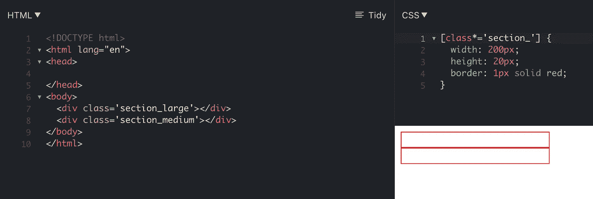*

# *2.类包含(区分大小写)*

*源于我们之前的例子，让我们看看当您在紧张的截止日期下会发生什么&当您像《全能的布鲁斯》中的金凯瑞一样快速键入时，您意外地为 section(HTML 中的第 9 行)插入了一个大写字母`S`:*

**恭喜你，你的 CSS 现在坏了:**

*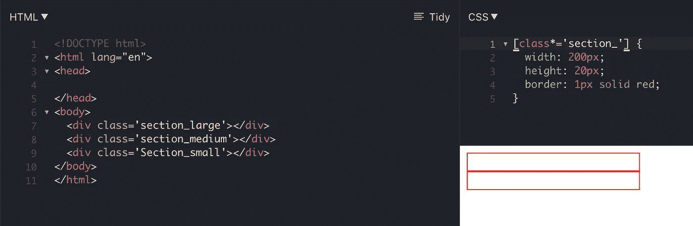*

*快速修复——在右括号前插入尾随的`i`,确保匹配**不**区分大小写，就像这样(CSS 中的第 1 行):*

*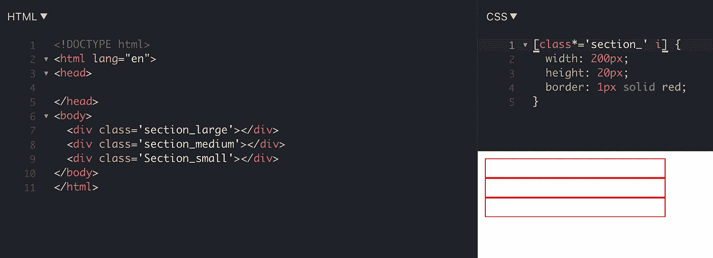*

# *3.检查班级是否存在*

*如果 HTML 元素有 class 属性，我们甚至可以对它们应用样式规则:*

*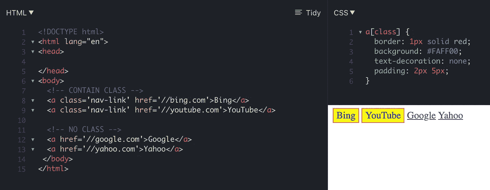*

*请注意，在我们的 HTML 的第 8 行和第 9 行，我们有 2 个 link 元素，它们具有 class 属性，而在我们的 HTML 的第 12 行和第 13 行的另外 2 个`a`元素没有任何 class 属性。*

*在 CSS 的第 1 行，我们看到所有带有`class`属性的`a`元素都将应用这些样式规则。`a`没有 class 属性的元素不会应用这些样式。*

# *4.链接以 HTTPS 开始，结束于。（同 organic）有机*

*我们可以瞄准以特定 HTTP 协议开始并以指定 TLD(顶级域名)如`.com`或`.org`结束的`a`链接。*看看这个:**

*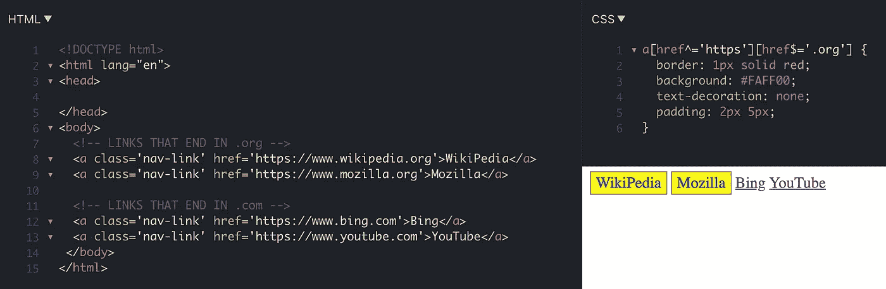*

*同样，您可以根据自己的标记/逻辑随意更改 HTTP 协议和 TLD 名称，但这只是一个常见的例子。*

# *5.具有某种语言属性的元素*

*假设您正在为一个电子商务商店构建一个 FAQ(**F**frequency**A**sked**Q**questions)页面，并且需要针对某些语言。我们可以很容易地为我们想要的 HTML 元素指定语言属性，并通过 CSS 将它们作为目标，如下所示:*

*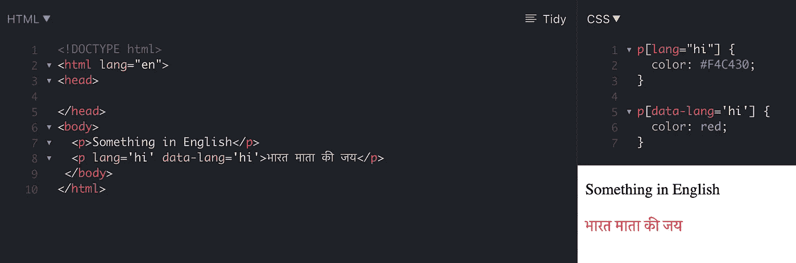*

*请注意，我们的 HTML 属性中有两个属性用于印地语。我们只需要 1 个，但是我把这两个都留在这里是为了演示在元素上声明语言属性的不同方式——通过使用`lang`属性和同样的`data-[name]`属性*(通常称为数据属性)。**

*然后我们在 CSS 中设计它们的样式——你可以看到第 5 行的选择器优先于第 1 行的选择器… *因此有了单词 cascading* 。*

# *6.选择没有 Alt 属性的图像*

*让我猜猜——在 ARIA 可访问性审计中，您因为图像上缺少 ALT 文本而受到批评，现在您需要在中午之前快速修复它们。这个 CSS 选择器将识别每个带有 **NO** ALT 属性的图片。*

*请记住，一个带有空文本值的 ALT 属性，比如
``，仍然被认为有一个`alt`属性——它只需要一个值。*

*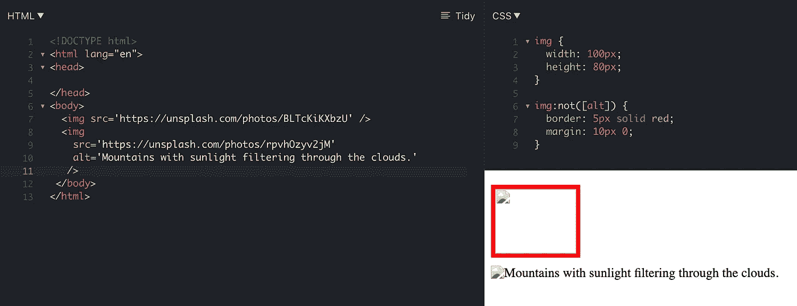*

*注意，HTML 中第 7 行没有呈现`alt`属性的图像被 CSS 中第 6 行的 CSS 选择器`img:not([alt]) {...}`选中。*

*这意味着“*将这些样式规则应用于没有当前 alt 属性*的每个图像”。*

# *7.普通兄弟姐妹*

*现在想象一下，你有一篇包含多张图片的文章，但是你想让第一个副标题`h2`之后的每张图片都有绿色边框。你会怎么做？下面是方法:*

*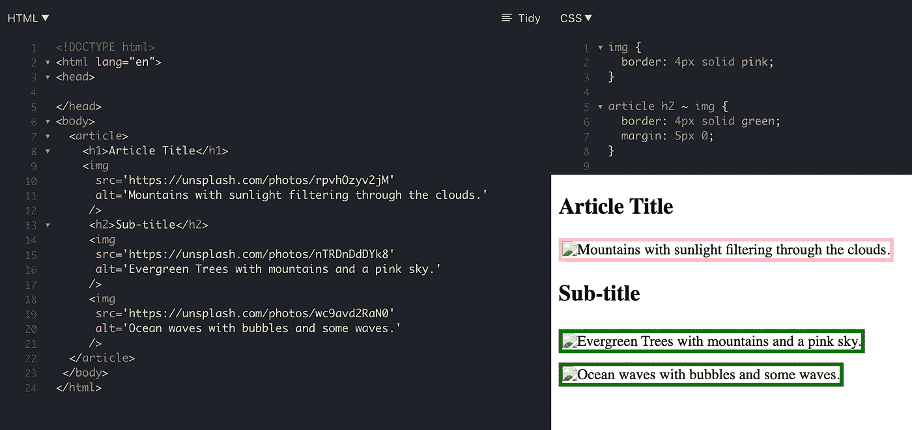*

*在我们的 CSS 的第 5 行，我们说—“*他们给* `article` *元素中的* `h2` *之后的每一个图像—一个宽度为 4px(像素)的绿色边框和 5px 的垂直边距*”。`~`通用兄弟组合器以指定元素的所有指定兄弟为目标。*

# *8.相邻兄弟姐妹*

*现在，如果我们只想选择紧跟在副标题`h2`后面的图像，该怎么办？我们可以这样做:*

*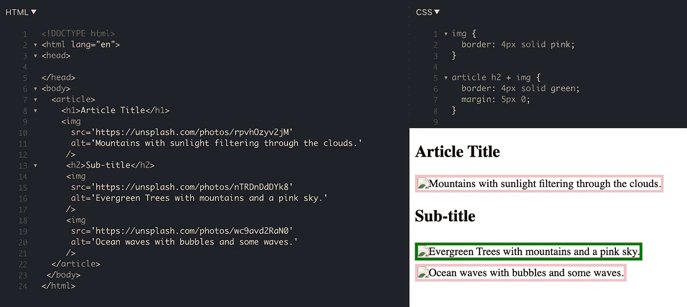*

*注意，在我们的 CSS 的第 5 行，我们用`+`替换了`~`，这意味着我们只将**作为紧跟在`h2`之后的**的目标。*

***注意*** :这个选择器将只针对紧接在`h2`之后的兄弟，所以换句话说，如果我们在`h2`和 image 之间放一个`p`，我们的 CSS 规则在这种情况下就不起作用了:*

*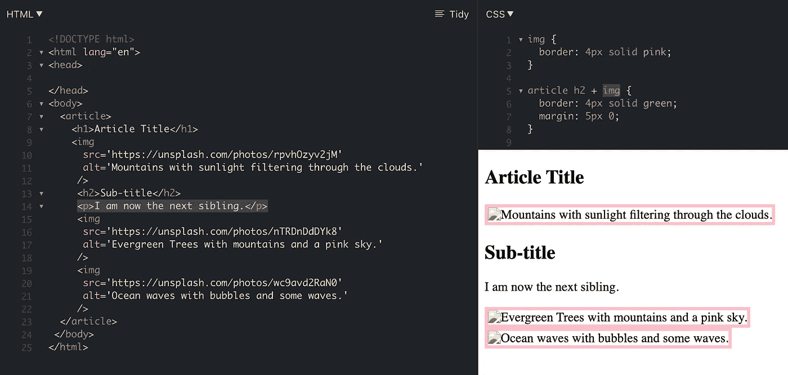*

*注意，在 HTML 的第 14 行，我们添加了一个`p`标签，它现在成为了`h2`的下一个兄弟。我们样式表第 5 行的 CSS 选择器将只把那些规则应用于紧跟在我们的`h2`之后的图像，这就是为什么我们在子标题之后的任何图像上都看不到绿色边框…因为我们在`h2`之后偷偷加了一个`p`。*

*如果我们想让这个选择器动态化，我们可以使用通用选择器告诉 CSS——“*嘿，不管这个 h2 副标题后面是什么 HTML 元素，都要应用下面的样式！*"简单地用 CSS 中的通用选择器`*`替换元素名，如下所示:*

*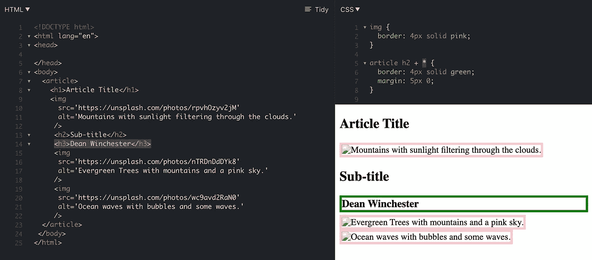*

*请注意，我们在 HTML 的第 14 行用一个`h3`替换了那个`p`，所以我们现在可以在第 14 行添加任何 HTML 元素，CSS 的第 5 行选择器指定的样式规则将总是应用那些规则:)*

***我希望这有所帮助！**请到—[PJcodes.com](https://www.pjcodes.com/)来找我。*

**更多内容看* [***说白了. io***](http://plainenglish.io)*