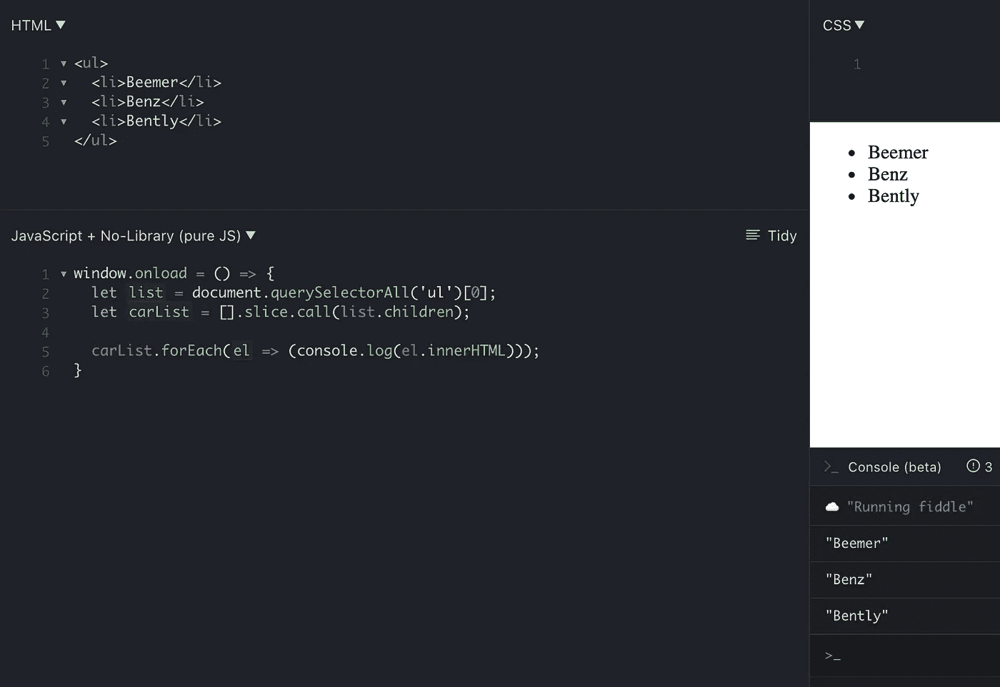

# 你从未用过的 8 大 JavaScript 技巧

> 原文：<https://javascript.plainenglish.io/top-8-javascript-tricks-youve-never-used-before-beb96662e32d?source=collection_archive---------14----------------------->

这些小片段会帮你省去一大堆麻烦！


Photo by [Tobias](https://unsplash.com/@herrzett?utm_source=medium&utm_medium=referral) on [Unsplash](https://unsplash.com?utm_source=medium&utm_medium=referral)

让我们开门见山吧。

# 1-去掉 HTML 标签

去掉 HTML 标签并使用 regex 提取文本值:


Screenshot belongs to PJ Codes.

这个家伙将删除字符串中的所有 HTML 标签——甚至是嵌套标签！很整洁吧？

我们可以看到，在第 1 行，我们有一个带有`p`标签的字符串，它有一些包含一些文本的内部 HTML 和一个子`span`标签——它有自己的内部文本。

第 3 行使用了一些正则表达式，从原始字符串中去掉了所有的 HTML 标签。

***这里是给你复制的代码:***

```
const original = `<p>Itsy bitsy <span>spider</span></p>`;const stripped = original.replace(/(<([^>]+)>)/gi, "");
```

# 2-获取 URL 部分

假设我们有以下 URL，您需要根据 URL 的结构执行一些逻辑:

`https://internalwebsite.com/reports/firstquarter.php?s=netrevenue`

在这个技巧的上下文中，我们的 URL 分为 4 个主要部分:

*   **协议** = `https://`
*   **主持人** = `internalwebsite.com`
*   **路径名** = `/reports/firstquarter.php`
*   **搜索** = `?s=netrevenue`

***如果我们想选择其中的每一个:***

`window.location.protocol`在这种情况下会给我们`https`。

`window.location.host`会给我们`internalwebsite.com`。

`window.location.pathname`给了我们`/reports/firstquarter.php`。

`window.location.search`输出`?s=netrevenue`。

# 3-获取数组中的最后一个项目


***下面是想乱来的代码:***

```
const letters = ['a', 'b', 'c', 'd', 'e', 'f', 'g', 'h'];const last = letters.slice(letters.length - 1);
const lastTwo = letters.slice(letters.length - 2);
const lastThree = letters.slice(letters.length - 3);console.log(last); // h
console.log(lastTwo); // g, h
console.log(lastThree); // f, g, h
```

# 4-随机更改背景颜色


Screenshot belongs to PJ Codes.

当您想要执行一些逻辑来显示随机化的数据(不是特定的颜色)时，这个就很方便了。

在我们的 HTML 的第 1 行，我们声明了一个`aside`元素，在这个元素中我们有一个`h1`，它代表了十六进制编码的颜色的显示值。此外，在我们的 HTML 的第 2 行，我们看到一个按钮，当点击它时会产生一个随机的颜色。

现在来看看我们的 JavaScript。

在第 2 行，我们实例化了允许我们在不同颜色之间循环的按钮，然后在第 3 行，我们存储页面的`body`标签的值——我们将改变谁的颜色。

在第 5 行，我们看到一个名为`randomColor`的变量，它执行一些随机化逻辑。你可能想知道数字`16777215`的意义是什么，为什么我们在第 5 行使用`.toString(16)`。

好吧，我们来分解一下。

由于十六进制代码中的颜色范围从`#000000`到`#ffffff`，RGB 值中存在的颜色数量为 16，777，215。这可以简单地使用这个排列&组合公式来计算:

`[result = m to the power of n => 16 to power of 6 => 16777216]`

因为我们的目标是将数字转换成十六进制格式，我们看到`16777216`转换成`1000000`而`16777215`转换成`ffffff` …这就是为什么我们用`16777215`作为十进制转换的最高数字。

由于我们正在转换成十六进制格式的字符串，我们将数字`16`传递给我们的`toString`方法，因为十六进制数字是以 16 为基数的**。整洁吧？**

最后，我们只是添加一个散列符号，并告诉 JS 使用这个新格式化的十六进制代码来执行一些样式逻辑。

# 5-数值


Screenshot belongs to PJ Codes.

你在上面注意到了什么？您猜对了…我们的`input`元素有一个类型属性值`number`，但是当我们在输入字段中键入数字时，我们的`keyup`事件处理程序执行第 4 行的 JavaScript 代码，在那里我们检查输入值的类型。

我们在控制台中看到，我们键入的输入的类型是`string`。但是等等…我们告诉 HTML 设置类型`number`的输入值！

`event.target.value`默认为`string`类型。现在我们可以使用`parseInt(e.target.value)`或`+e.target.value`——两者都会将我们输入的值解析成数字。

但是，使用`e.target.valueAsNumber`(第 4 行)有更直接的方法:


Screenshot belongs to PJ Codes.

注意，在 JavaScript 的第 4 行，我们使用了`e.target`上名为`valueAsNumber`的属性。在右下角的终端中，我们可以看到，当我们在输入字段中键入数字时，每个输入值都是类型`number`。

***如果你想玩的话，这里有代码:***

```
<form>
  <input type='number' id='numberinput'>
</form>let numInput = document.getElementById('numberinput');numInput.addEventListener('keyup', (e) => {
 console.log(typeof e.target.valueAsNumber);
});
```

# 6-将 HTML 集合转换为数组

有多少次你试图循环一个无序的列表，你得到这个错误…

`Uncaught TypeError: blah.forEach is not a function”` **全红**？

…就像下面的代码一样:

```
<ul>
  <li>Beemer</li>
  <li>Benz</li>
  <li>Bently</li>
</ul>window.onload = () => {
  let carList = document.querySelectorAll('ul')[0];
  carList.forEach(el => (console.log(el.innerHTML)));
}
```

注意我们在这里所做的……在我们的`onLoad`中，我们通过使用`[0]`简单地调用第一个孩子来定位`ul`元素。


*一本正经……*

我们得到这个错误是因为当你使用`getElementsByClassName`或`querySelectorAll`调用元素时，返回的要么是一个 HTML 集合，要么是一个节点列表。这些类似于您习惯使用的数组，但它们略有不同。

为了让你做你的 JS 巫毒术，你需要先把`ul`转换成一个数组… *像这样:*



Screenshot belongs to PJ Codes.

注意，在我们的 JavaScript 的第 3 行，在 HTML 集合上调用`[].slice.call`将它转换成一个可迭代的数组，之后您可以针对它的子元素施展您的魔法。

您甚至可以使用 ES6 扩展运算符`let carList = […list.children]`。

***下面是代码:***

```
<ul>
  <li>Beemer</li>
  <li>Benz</li>
  <li>Bently</li>
</ul>window.onload = () => {
  let list = document.querySelectorAll('ul')[0];
  let carList = [].slice.call(list.children);
  // OR ES6 VERSION - let carList = [...list.children]; carList.forEach(el => (console.log(el.innerHTML)));
}
```

# 7-将浮点数转换为整数

您已经使用了`Math.floor()`等工具将浮点数转换成整数。一些更容易打字的东西怎么样？

引入`|`按位“**或“**运算符:

```
console.log(37.5 | 0); // RETURNS 37
console.log(-37.5 | 0); // RETURNS -37
```

本质上，如果`37.5`是正的，我们向下舍入。同样，如果我们有一个负数，比如`-37.5`，我们就向上取整！为了使事情变得简单，只要知道我们去掉了小数和它后面的所有东西。

该操作器的工作类似于`~~`:

```
console.log(~~37.5); // RETURNS 37
console.log(~~-37.5); // RETURNS -37
```

# 8-使 HTML5 在传统的 Internet Explorer 中工作

完美的优雅退化。这在一个非常高的层次上工作的方式是通过使用 HTML 5 元素的数组，并对它们中的每一个迭代地运行`createElement()`。

看看这个名为 HTML5 Shiv 的 GitHub repo，它解释得很好:)

[](https://github.com/aFarkas/html5shiv) [## GitHub - aFarkas/html5shiv:这个脚本实际上是启用 HTML5 分段的方式…

### 这个脚本实际上是在传统的 Internet Explorer 中启用 HTML5 sectioning 元素的方式。- GitHub …

github.com](https://github.com/aFarkas/html5shiv) 

# 请查看更多的 JavaScript 简写本:

[](/20-javascript-short-hands-you-need-to-know-in-2021-c0ed25a40837) [## 2021 年你需要知道的 20 个 JavaScript 小技巧

### 一个成功项目的一个重要因素是生产力——这正是这些 JavaScript 缩写…

javascript.plainenglish.io](/20-javascript-short-hands-you-need-to-know-in-2021-c0ed25a40837) 

# 此外——如果您正准备接受技术采访，请阅读本文:

[](/how-to-prepare-a-technical-resume-explained-w-examples-for-freshers-experienced-professionals-442d6ab427aa) [## 通过使用这份简历，我获得了亚马逊、苹果和其他公司的技术采访

### 在一页纸上向大人物展示经验和技能是……可能的。

javascript.plainenglish.io](/how-to-prepare-a-technical-resume-explained-w-examples-for-freshers-experienced-professionals-442d6ab427aa) 

感谢阅读:)

**去**—[Pjcodes.com](https://www.pjcodes.com/)

**额外资源:**

[](https://dev.to/akhil_001/generating-random-color-with-single-line-of-js-code-fhj) [## 用一行 js 代码生成随机颜色

### 你是否曾经觉得无聊或厌倦了为了测试某样东西而为不同的草皮或跨度写长长的随机颜色…

开发到](https://dev.to/akhil_001/generating-random-color-with-single-line-of-js-code-fhj) [](https://css-tricks.com/snippets/javascript/) [## Java Script 语言

### JavaScript 中函数的必需参数

css-tricks.com](https://css-tricks.com/snippets/javascript/) 

*更内容于* [***通俗地说就是***](http://plainenglish.io/)