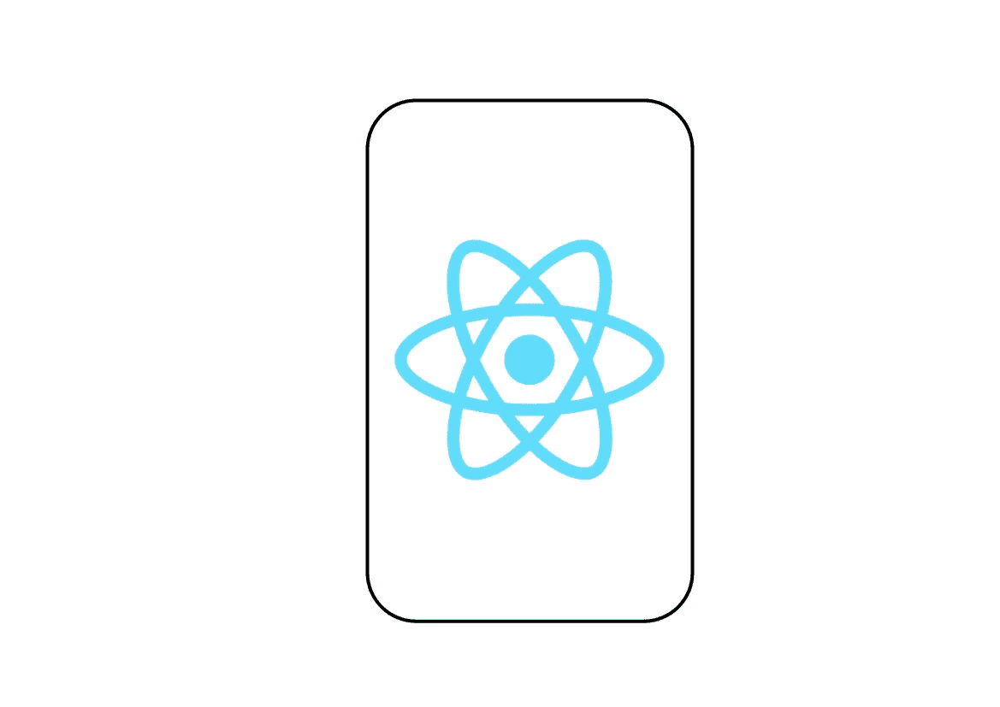
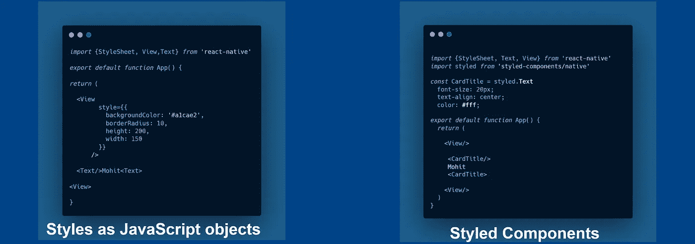
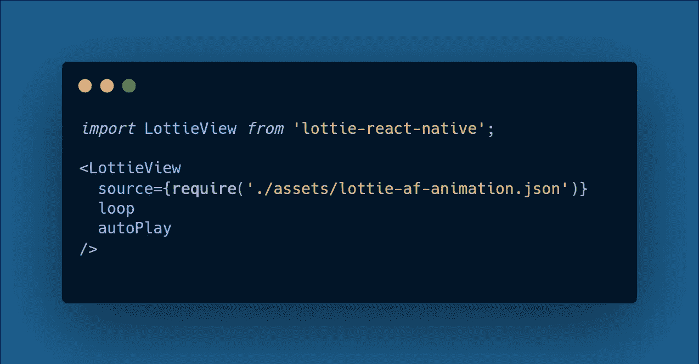

# 2021 年 8 个 React 原生 UI 库

> 原文：<https://javascript.plainenglish.io/top-8-react-native-ui-libraries-in-2021-774c7a26328f?source=collection_archive---------3----------------------->

## React 你应该在 2021 年尝试的原生 UI 库

## 1.样式组件

这个库使您能够将 **CSS** 编写为 React 组件。如果没有样式化的组件，我们通常将样式编写为 ***JavaScript 对象*** *，*，但是将样式编写为组件被认为是一个更好的选择，因为它允许您编写可读的代码并创建可重用的组件。此外，您可以多次使用您的样式，从而减少代码。

***例如:***

## 2.反应本地元素

在 web 开发生态系统中，我们有一些令人惊叹的 UI 库，如 **Bootstrap** 和 **MaterialUI、**，它们将我们从从头开始编写代码的额外工作中解救出来。类似地， *React Native Elements* 是 React Native 最受欢迎的 UI 库之一，因为它有很棒的文档和对 **iOS** & **Android 的出色支持。**

## 3.反应原生纸

类似于 *React Native Elements* ，这个库在你需要更多 UI 组件的时候会帮到你很多， **React Native Paper** 使用*材质设计* UI 作为其 UI 组件的核心。您还可以集成您的自定义设计系统，将其添加到库的设计中。 ***例如*** ，你可以添加你的**配色，字体**等。

## 4.反应本土洛蒂

Lottie 由 ***Airbnb*** 开发，转换支持 iOS、Android & web 的 Adobe After Effects 动画。这个库允许你通过提供组件 ***包装 API、*** 来使用动画，你只需要像任何 React 原生库一样安装它，并将动画文件路径传递给 ***LottieView*** 组件。

## 5.反应原生 Mapview

一个很棒的库，帮助 API 非常容易地控制地图上的特征。它还可以让您选择自定义地图的 ***样式*** *，* ***地图视图的位置*** &您还可以在用户在地图中交互时动画显示位置标记。此外，该模块使用 React 本机 API(称为**地理定位**来获取全球位置。

## 6.戏弄者

本模块帮助您关注应用程序的内容，以便在尽可能短的时间内准备好应用程序。它还提供了一些重要的模块，如**步进器、TabView、**和 **DrawView** 。

## 7.加利欧

作为一名 React 原生开发人员，我可以向您保证，从头开始构建 React 原生应用程序可能会非常令人沮丧。Galio 是我最喜欢的工具之一，它可以在很短的时间内构建出需要准备好的东西。您可以使用专用的设计来创建 React 本机应用程序，因为您已经拥有了开始创建一个成熟的应用程序所需的一切。

> **注意:**仅推荐用于个人项目，因为我还没有用 **Galio** 构建任何生产级 React 原生应用。

## 8.RNUI

如果你是一个初学者或者有 React Native 经验的人，在这两种情况下你都会喜欢这个库。由 **Wix** 开发的 RNUI 提供了令人敬畏的预建组件，你可以轻松地开箱即用。所有的组件都很友好，支持跨平台，文档也很棒，即使你是初学者也能很容易理解。

 [## 每个软件开发人员都应该知道的 9 条编程原则

### 很好地了解干净代码的编程原则

javascript.plainenglish.io](/9-programming-principles-every-software-developer-should-know-9fffe3c5258)  [## React 应用的 6 种优化技术

### 构建快速反应应用程序的有用技术

javascript.plainenglish.io](/6-optimization-techniques-for-react-applications-9585073bc3b7)  [## 2021 年终极网络开发者路线图

### 从基础到部署可伸缩的 Web 应用程序

javascript.plainenglish.io](/ultimate-web-developer-roadmap-for-2021-6758edd0bd3f)