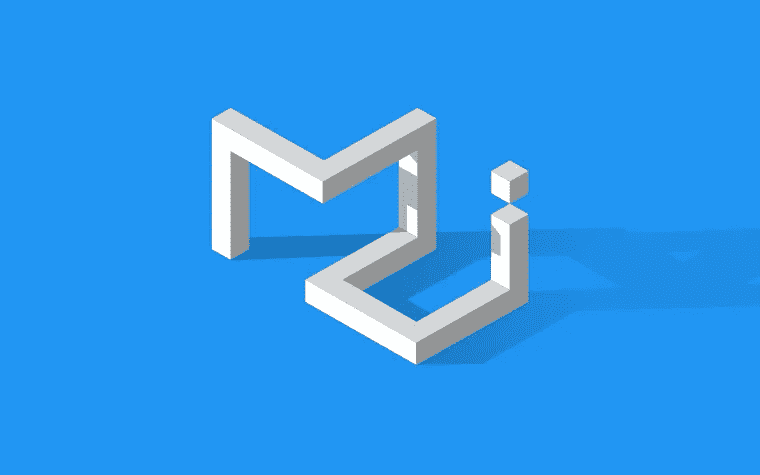

# 为你的下一个项目检查的前 9 个 CSS 框架

> 原文：<https://javascript.plainenglish.io/top-9-css-frameworks-to-check-out-for-your-next-project-ca0a57d69a58?source=collection_archive---------20----------------------->

## 下一个前端项目的 CSS 框架。

Photo by [Nubelson Fernandes](https://unsplash.com/@nublson?utm_source=medium&utm_medium=referral) on [Unsplash](https://unsplash.com?utm_source=medium&utm_medium=referral)

当你想要构建用户交互界面时，层叠样式表(CSS)是非常强大的。CSS 将使你能够改善你的网站的外观。

CSS 可能很难学习所有的属性和相关的细节。这就是各种 CSS 框架使您能够轻松创建交互式用户界面的地方。

在这篇文章中，我们将会看到一些顶级的 CSS 框架，你可以用它们来构建你的下一个项目。

## **1。引导程序**

Image from [TopTotal](https://www.google.com/url?sa=i&url=https%3A%2F%2Fwww.toptal.com%2Ffront-end%2Fwhat-is-bootstrap-a-short-tutorial-on-the-what-why-and-how&psig=AOvVaw0nN6oGaNZz3wzyQfHQFnap&ust=1628599181277000&source=images&cd=vfe&ved=0CAwQjhxqFwoTCPDUtPH6o_ICFQAAAAAdAAAAABAD)

Bootstrap 最初发布于 2011 年，是最受欢迎的 CSS 框架之一，它支持我们今天看到和使用的大多数网站。Bootstrap 是一个免费的开源 CSS 框架，旨在提供响应迅速、移动优先的前端 web 开发。Bootstrap 还包含基于 CSS 和 JavaScript 的设计模板，用于排版、表单、按钮、导航和其他界面组件。

要查看自举访问[T3 这里 ](https://getbootstrap.com/)

## **2。顺风**

Image from [YouTube](https://www.google.com/url?sa=i&url=https%3A%2F%2Fwww.youtube.com%2Fwatch%3Fv%3DE_jc3iwAeAg&psig=AOvVaw3hJr7K2bz2WTgPSoVAMa7Q&ust=1628599265455000&source=images&cd=vfe&ved=0CAwQjhxqFwoTCLCsgpv7o_ICFQAAAAAdAAAAABAS)

Tailwind CSS 是顶级的令人惊叹的框架之一，并且正在获得更广泛的采用。它的主要焦点是实用驱动的，使您能够编写 CSS 类，而无需离开您的 HTML 标记。

Tailwind CSS 实用程序类帮助您在系统的约束下工作，而不是在样式表中添加任意值。

顺风使它很容易与颜色选择、间距、排版、阴影以及构成一个设计良好的设计系统的其他一切保持一致

点击 查看顺风 CSS

## ****3。材料界面****

****

**Image from [Dev.To](https://www.google.com/url?sa=i&url=https%3A%2F%2Fdev.to%2Fkylehunter%2F6-six-reasons-to-use-material-ui-for-react-1anh&psig=AOvVaw1VnZ49mvm0RdmbdnWy7t7b&ust=1628599369608000&source=images&cd=vfe&ved=0CAwQjhxqFwoTCJjltcr7o_ICFQAAAAAdAAAAABAX)**

**Material UI 也是构建交互式用户界面的一个令人惊叹的框架。它使您能够构建 React 组件，以便更快、更容易地进行 web 开发。建立你的设计体系，或者从材料设计开始。**

**根据 Material UI，其组件无需任何额外设置即可工作，不会污染全局范围。**

**大多数流行的组织在他们的开发中已经在用户中采用了 Material UI。值得一试。**

## ****4。布尔玛****

****

**Image from [Matwrites](https://www.google.com/url?sa=i&url=https%3A%2F%2Fmatwrites.com%2Fbulma-css-framework-for-2018%2F&psig=AOvVaw3SUg-gXmp55wqd2Dlt-225&ust=1628599448289000&source=images&cd=vfe&ved=0CAwQjhxqFwoTCKD0y-_7o_ICFQAAAAAdAAAAABAO)**

**布尔玛也是另一个漂亮的 CSS 框架。布尔玛是一个免费的开源框架，它提供了现成的前端组件，您可以轻松地组合这些组件来构建响应迅速的 web 界面。**

**布尔玛还为你提供了一个很好的开发体验，因为你不需要太多的 CSS 知识就可以创建漂亮的用户界面。**

**查看布尔玛 [**这里**](https://bulma.io/documentation/)**

## ****5。基金会****

****

**Screenshot By Author**

**Foundation 非常棒，而且在开发人员体验方面更先进。根据 foundation 文档，它是一个适用于任何设备、媒体和可访问性的框架。**

**基金会也分为两部分，网站基金会和电子邮件基金会。后者在你想处理电子邮件时使用。**

**Foundation 具有语义性、可读性、灵活性和完全可定制性。我们不断添加新的资源和代码片段，包括这些方便的 HTML 模板来帮助您入门！**

**查看基础 [**这里**](https://get.foundation/develop/getting-started.html)**

## ****6。骨架****

****

**Image from [Jintha Ns](https://www.google.com/url?sa=i&url=https%3A%2F%2Fmedium.com%2F%40jithamolns%2Fskeleton-the-light-weight-css-framework-2f5e73aca563&psig=AOvVaw2g0-bDR0zW8fcMPLNcncTZ&ust=1628599759159000&source=images&cd=vfe&ved=0CAwQjhxqFwoTCLihlob9o_ICFQAAAAAdAAAAABAk)**

**根据框架文档，这是一个非常简单、响应迅速的样板文件。骨骼也提升了它的羽毛大小，这极大地提高了它的速度。**

**另一方面，从零编译或安装开始很快。**

**文档建议，如果您正在着手一个较小的项目，或者只是觉得不需要较大框架的所有功能，那么您应该使用 Skeleton。**

**查看骨骼 [**此处**](http://getskeleton.com/)**

## ****7。语义界面****

****

**Image screenshot by Author**

**语义 UI 是另一个非常令人惊奇的框架。根据语义 UI 文档，语义 UI 将单词和类视为可交换的概念。**

**类使用自然语言的语法，如名词/修饰语关系、词序和复数，直观地链接概念**

**在这里查看语义界面**

## ******8。纯 CSS******

********

****Image screenshot by Author****

****纯 CSS 由一组可以在每个 web 项目中使用的小型响应 CSS 模块组成。它在某种程度上与 Bootstrap 非常相似，但几乎没有区别。纯 CSS 也是体积小。****

****根据它的文档，Pure 小得可笑。整套模块的时钟大小为 3.7KB* minified 和 gzipped。****

****考虑到移动设备，保持较小的文件大小对我们来说很重要，CSS 的每一行都经过了仔细的考虑。如果您决定只使用这些模块的子集，您将节省更多的字节。****

****查看纯 CSS [**此处**](https://purecss.io/)****

## ****9。用户界面套件****

********

****Image from UI [Garage](https://www.google.com/url?sa=i&url=https%3A%2F%2Fuigarage.net%2Fblog-post%2F7-best-material-ui-kits-for-2020%2F&psig=AOvVaw1pTBVOQpS-bYZPn3L7sz48&ust=1628600120468000&source=images&cd=vfe&ved=0CAwQjhxqFwoTCLCB4K_-o_ICFQAAAAAdAAAAABAJ)****

****UI kit 在工具和开发体验上极其惊艳。它是一个轻量级的模块化前端框架，用于开发快速而强大的 web 界面。****

****UI kit 非常适合创建强大而快速的前端应用程序。****

****点击 查看 UI 套件****

## ********结论********

******感谢您通读这篇文章，希望对您有所帮助。******

******如果你认为其他人可能会从这篇文章中受益，不要犹豫，分享出来。******

## ********延伸阅读:********

****** [## 让你获得面试机会的 5 个投资技巧

### 建立一个能让你脱颖而出的文件夹。

javascript.plainenglish.io](/5-portfolio-tips-that-will-land-you-an-interview-aef81512328a)  [## 每个程序员必看的 7 部电视节目

### 我会推荐每个程序员观看的电视节目。

javascript.plainenglish.io](/7-must-watch-tv-shows-for-every-programmer-fcda8491f036) 

*更多内容尽在*[***plain English . io***](http://plainenglish.io/)******