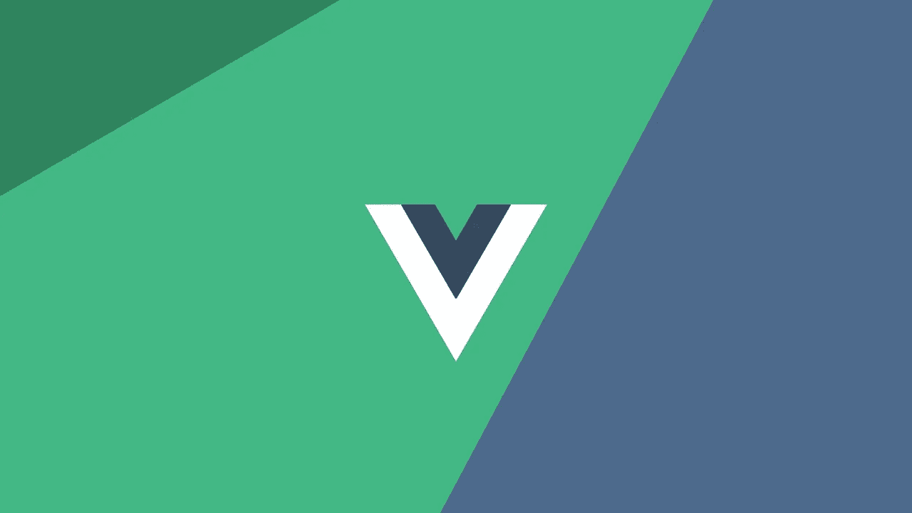

# 2021 年 9 大最著名的 AngularJS 框架

> 原文：<https://javascript.plainenglish.io/top-9-most-famous-angularjs-frameworks-in-2021-ab946a46afa6?source=collection_archive---------21----------------------->

应用程序是开发人员最好的创造，因此他或她总是试图给它们添加新的东西并提高它们的性能。

每个开发人员面临的最大问题是从头开始编写代码，即使他们只需要对代码进行一些小的更改或为他们的应用程序添加一些功能。对于这样的开发人员或程序员，AngularJS 提供了一个优势，如果你对某些框架有所了解，你可以立即删除或添加特性。如果你不知道这个框架，你可能无法使用 AngularJS 应用程序。

**面向开发者的 AngularJS 框架**

看看这些令人惊叹的 AngularJS 框架，它们非常受欢迎，作为开发人员，您会喜欢使用它们:

# | Vue

Vue 是尤雨溪的创意。它于 2014 年上市，此后一直非常受欢迎。它可以证明是前端开发中的一个有用工具，因为它提供了一个改进应用程序用户界面的解决方案。最有帮助的部分是，它是一个精简的框架。它也是轻量级的，可以处理任何规模的项目。此外，web 应用程序开发公司随时可以帮助您构建网页。

# |为前端开发人员做出反应

它是一个非常可移植的框架，这使它成为一个非常好的模板。它的受欢迎程度可以从它归脸书所有这一事实得到证明，它可以给你的用户界面带来新的外观。React 被世界各地的知名公司所使用。它受欢迎的另一个原因是，代码一旦编写，就可以根据需要多次重用。今天就雇佣应用程序开发人员，让你现有的网站焕然一新。

# 安古拉里自举

顾名思义，这个框架是在 Bootstrap 之上设计的。它拥有 Bootstrap 提供的所有基本特性和功能以及 HTML 编码。应该考虑到，与在 jQuery 上工作的 Bootstrap 不同，AngularUI Bootstrap 只与 AngularJS 框架兼容。

# 离子的

如果你正在寻找可以提高代码可伸缩性的东西，Ionic 是开发人员的最佳选择。大多数开发人员更喜欢创建混合移动应用程序。它与 AngularJS 一起工作非常顺利，可以构建优秀的混合应用程序。

它很受人们的欢迎，因为它支持所有的 HTML、CSS 和 JavaScript 代码。这个框架最好的一点是，如果你想转换成移动应用程序，它可以与 web apps 平台一起使用。使用 Angular js 的公司一直很满意。

# |移动角度用户界面

如果你想在 AngularJS 上创建移动应用，这个框架是一个极好的选择，因为它专门研究这一部分。您将能够创建兼容 Android 和 iOS 操作系统的移动应用程序。该框架还支持混合应用程序，这减少了您的时间。你可以雇佣一个 Angular js 开发公司，这样他们可以为你的移动应用构建最好的。制作出来的棱角分明的 app 鹤立鸡群。

# |角形材料—由前端开发人员开发

尽管有各种各样的框架，但是如果您正在寻找一个 UI 框架来帮助构建 web 页面的布局，这可能是一个特定的选择。它会给网站一个非常有吸引力的外观。因为它是布局设计的一个非常好的选择，它也帮助你在网页屏幕上放置元素。Angular Js 公司推荐，特别是出于排版目的。可以聘请前端开发人员进行全程更好的指导。

# |角度前端开发人员的弧度

传统的课文显得陈旧而乏味。所以如果你想通过增加一些图表形式的插图，让你的作品变得赏心悦目，那么 Radian 是个不错的选择。它将允许你使用绘图代码来达到同样的目的。它是一个公共参考，并且非常配合 HTML 文档。您还可以利用 JavaScript 库来生成所需的图形或图表。

# 平均 IO

从事 CSS、JavaScript 和 HTML 开发会非常令人兴奋，这本身就是一个旅程。毫无疑问，开发人员需要付出很多努力来学习代码。但是，尽管他们尽了最大努力，有时这些代码会使您的项目变得非常繁重，这就是 Mean IO 可以帮助您的地方。它将帮助您制作非常简单的页面，同时，它们速度快，表现力强。你也可以雇佣网络应用开发者来彻底改造你的网站。

# 量角器

一旦你完成了这一切。就像放代码，开发一个网站，在放到观众面前之前，你也要测试一下。为了确保您计划运行的应用程序符合标准，您可以利用这个角度测试框架。Protector 工作非常高效，当你的代码准备好了，它就开始测试它。AngularJs 开发公司表示，这是您可以用于开发的最佳产品。后端开发和前端 web 开发一样重要，因此 Protector 可以随时提供帮助。

# 一些最后的话

我们已经在上面的文章中回顾了几个框架。每种结构都有其特点，因为它们能改善你的工作。对于开发人员来说，知道哪个框架最适合您的工作也是非常重要的。AngularJS 框架是通用的，只有当程序员知道如何很好地使用它并理解它的真正潜力时，它的执行才是完美的。有些非常适合测试，有些适合格式化和划线，而有些则非常适合为你的 web 应用或移动应用提供一个结构。

所以，明智地选择你的框架。如果你正在寻找一个开发者，在印度有许多 [Angular developments 公司](https://www.standardfirms.com/top-angular-development-companies/)可以帮助你选择合适的框架。

*更多内容尽在*[***plain English . io***](http://plainenglish.io/)