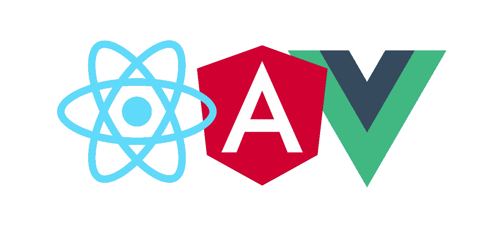
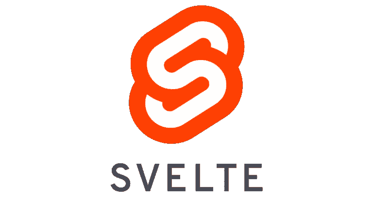
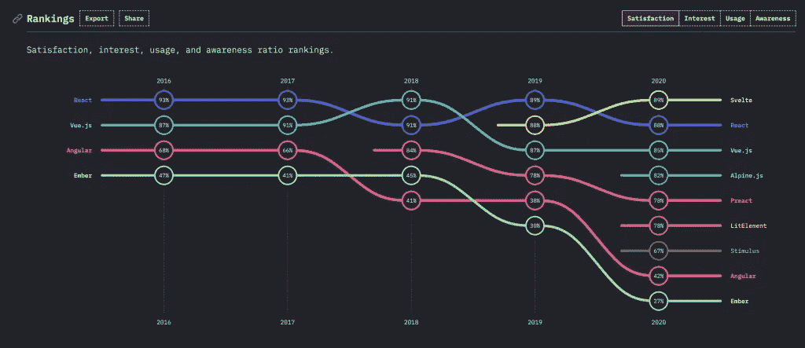
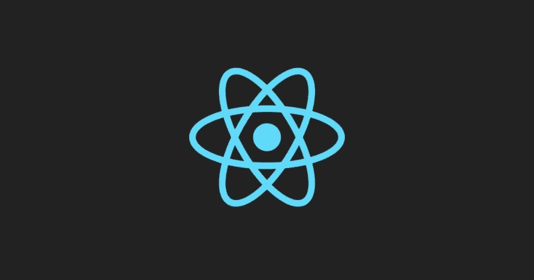
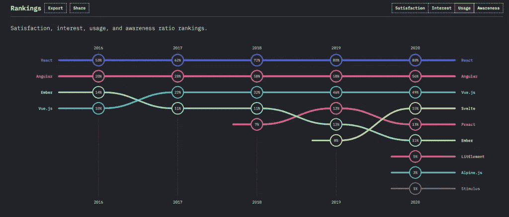
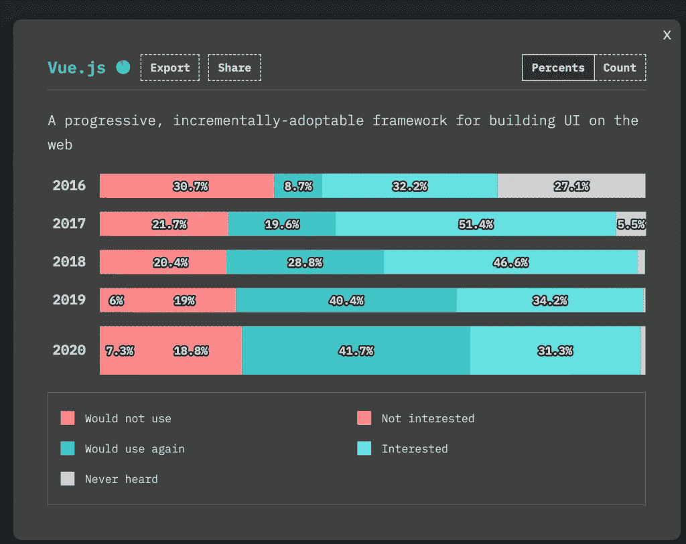
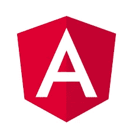
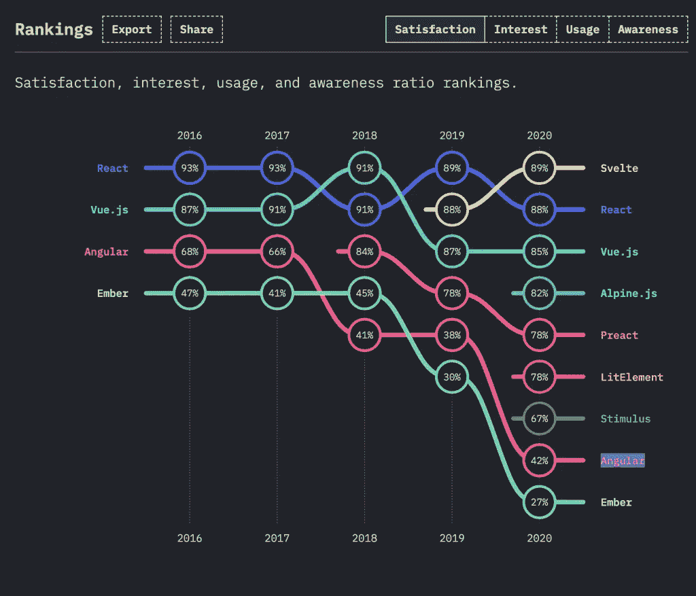
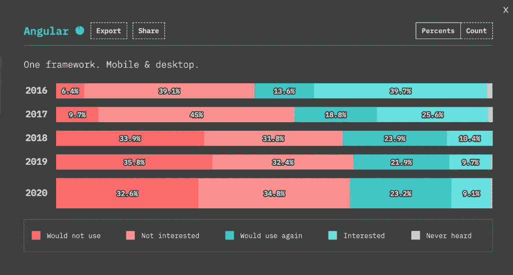

# 2022 年要学习的顶级前端 JavaScript 框架

> 原文：<https://javascript.plainenglish.io/top-frontend-frameworks-to-learn-in-2021-cf4913549e12?source=collection_archive---------1----------------------->

又到了一年中的这个时候——看看 JavaScript 前端框架世界中有哪些新东西。这是一个快节奏的世界，不断有新的框架出现。然而，React(技术上是一个库)、Vue 和 Angular 等框架在最近几年已经被证明是一致的。让我们来看看 JavaScript 前端框架目前的情况以及未来的趋势。

# 苗条——令人惊讶的严肃竞争者

斯维特，这个街区的新生，引起了不小的轰动！JS 2020 的调查结果已经出来了，今年 Svelte 在开发者满意度和学习兴趣方面都排名第一。

> Svelte 以 89%的开发人员名列榜首，React 以 88%的比例紧随其后。

苗条仍然没有被许多企业广泛使用。我们可能要等一年才能见证更大规模收养的后果。不过开发者目前对学习 Svelte 还是挺感兴趣的，用过的人都很满意。

我还没有用过 Svelte，但是我打算今年学。

Svelte 和 React、Vue 一样，都是组件框架。Svelte 不是在运行时评估您的应用程序代码，而是在构建时将其转化为完美的 JavaScript。这是 Svelte 的独特之处。苗条激起了我的兴趣。我很高兴看到 Svelte 在 2021 年的商店里有什么，我希望能和你们一起学习。

# 排名第一的 React —高居榜首

[**React**](https://github.com/facebook/react/) 这些年来越来越受欢迎，它现在是开发前端应用程序最广泛使用和首选的 JavaScript 库。React 连续第五年在 JS 调查中被评为[最受欢迎的开发前端应用的 JavaScript 库](https://2020.stateofjs.com/en-US/technologies/front-end-frameworks/)。

> 超过 80%的被评估者认为 React 是最受欢迎的库。

这证明了 React 采用率的持续增长！

# React 的最新功能和未来发展方向

*   React Hooks——这是 React 去年最重大的更新。钩子现在被用在许多开发团队的代码库中。钩子有助于理解 React 和创建功能性 React 组件，而不需要类。
*   React 开发工具—React 开发工具非常棒，对于开发和调试都非常有用。react 开发工具最近由 React 更新和发布。该版本兼容 Chrome、Firefox 和 Edge。这个新版本提供了相当大的性能改进以及更加用户友好的导航体验。如果你还没有升级，你可以在这里了解这一切:[新的 React 开发工具贴](https://reactjs.org/blog/2019/08/15/new-react-devtools.html)
*   **React 并发模式和悬疑**——这还是一个实验版，我们预计 2021 年会变得稳定。[并发模式](https://reactjs.org/docs/concurrent-mode-intro.html)是 React 应用的一组新功能，有助于它们保持响应，并根据用户的设备功能和网络连接进行适当调整。

在前端开发者市场，你获得 React 开发者工作的机会是最大的。随着 React 越来越受欢迎，许多公司正在 React 框架中重写他们的前端。因此，React 开发人员将会有大量的机会。随着 React Native 的发布，React 在移动领域也在崛起。了解 React 的优势可能适用于在线和移动开发职业。

# 第二名 Vue——紧随其后

自从发布以来， [Vue](https://vuejs.org/) 对前端开发社区产生了重大影响。它结合了 React 和 Angular 的最佳特性，使其成为独一无二的框架。

Vue 的受欢迎程度这些年来一直在持续上升。

> 41.7%的开发者使用过 Vue，他们表示会再次使用它，另有 31.3%的开发者有兴趣学习它。

Vue 作为主流前端框架的受欢迎程度一直在不断增长，开发人员也很喜欢它。

它目前排名 **#2** ，仅次于 React！

此外，Vue 的学习曲线比其他一些框架和库要低得多。如果你已经知道 JavaScript、HTML 和 CSS，那么开始构建 Vue 应用就很简单了。Vue 应用

# 最新的 Vue 功能

2020 年 9 月，Vue 3 核心正式上市。这是一个稳定版本，包括以下更新:

*   **Vue 3 发布:**更容易针对原生，因为它更快，更小，更容易维护。去年，Vue 在这一类别中大获全胜。
*   **像 React hooks 这样的功能组件:** Vue 也受到了 React Hooks 方法的启发，该方法允许他们创建自己的方式将逻辑封装到功能组件中，并在整个项目中重用它们。因此，Vue 应用程序具有更大的灵活性和可扩展性。

# #3 角度-下降趋势

[Angular](https://angular.io/) 仍然是最流行的前端 JavaScript 框架之一，有大量的公司使用它。但是，年复一年，开发商对 Angular 的兴趣和满意度有所下降。看看 2020 年以来 JS 研究状态中的角度满意度参数:

安格尔的客户满意度逐年稳步下降。它仍然在世界各地广泛使用。然而，如果开发人员不满意，他们将来可能会迁移到其他开发人员友好的框架中。

根据下图，32.6%的开发人员表示他们将不再使用 Angular，34.8%的开发人员表示他们对学习 Angular 没有兴趣。

你可能想知道为什么它排名第三。近年来，尽管开发人员对框架的热情在减退，但是 Angular 已经被广泛采用。Angular 是世界上第二大流行的前端框架，对于 Angular 开发者来说仍然有很多机会。

目标是 Angular 框架将继续向更大的灵活性和更好的开发者体验发展，以保持他们在前端框架领域的市场份额。

# 结论

这就是它的全部！我想强调的是，框架、库和工具总是在变化。今天流行的东西可能几年后就会过时。您的开发人员知识不应局限于理解特定的框架。它建立在坚实的基础上。

> 如果你想成为前端开发人员，首先要学习 JavaScript、HTML 和 CSS。

我希望你喜欢这篇文章。更多文章再见。如果您喜欢这篇文章，请不要忘记与您的网络共享。

*更内容于* [***通俗地说就是***](http://plainenglish.io/)