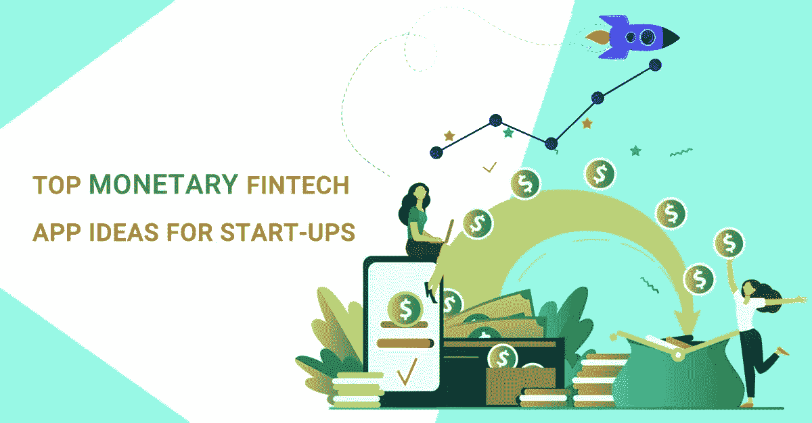

# 初创公司的顶级货币金融科技应用创意

> 原文：<https://javascript.plainenglish.io/top-monetary-fintech-app-ideas-for-start-ups-db49c81b177c?source=collection_archive---------12----------------------->

帮助我们进行货币交易的技术总是成为使用这些技术的个人不可或缺的一部分。一旦一个人尝到了这些应用程序在生活中带来的交易便利和速度，就很难不再使用它们。每一个行业，包括金融行业，都经历了技术的颠覆。技术改变了外行人对金融的看法，将金融转变为一项快速、有利可图且安全的业务。

[在科技巨头谷歌于 2011 年推出 GPay 后，金融科技应用](https://medium.com/nerd-for-tech/roadmap-to-fintech-app-development-for-future-fintech-leaders-c3ef01e6e60f)获得了认可。最终，苹果和三星加入了 Apple Pay 和 Samsung Pay 的电子钱包业务。从那时起，许多电子钱包在全球范围内产生了意想不到的收入，而许多电子钱包因其缺乏吸引力的商业模式而失败。

本博客旨在帮助你了解可以投资的金融科技应用的类型，以及为不同平台分别构建相同应用所需的预算。

# 金融科技应用的类型

当金融科技应用进入市场时，它们被设计成向用户提供银行和 p2p 支付设施。展望未来，每个与金融打交道的行业都发现，找到创新的方法将金融和技术联系起来，可以将繁琐的金融流程转变为方便直观的应用程序。

让我们来看看各种金融科技应用程序，这些应用程序打破了传统的金融实践，并了解了近年来的金融科技革命。由于我们还提供 [***按需应用开发***](https://www.technource.com/on-demand-app-development/) 解决方案，您可以根据自己的需求获得相同类型的应用。

# 手机银行应用

大约 10 年前，第一个银行应用程序进入了市场。银行公司不知道他们将在自己的游戏中面临激烈的竞争。金融科技应用的到来迫使银行与成功的金融科技初创公司合作，并加强他们的技术支持。

最初的银行应用程序不允许用户做太多事情。他们提供账户信息、转账、搜索自动取款机(在极少数情况下)等便利。这是显而易见的，因为使用银行应用程序的人的比例已经从当时的 9%增加到目前的 69%,而且预计还会更高。

在前几年，开立银行账户是一件令人烦恼的事情。有了 fintech apps，用户只需在手机上轻点几下，就可以享受开立银行账户、添加受益人、进行交易、投资和监控资金、冻结卡以及几乎所有其他事情的便利。

想建一个手机银行 app？我们来连线。

# 点对点支付应用

p2p 支付应用将数字货币市场推向了“另一个高度”。P2P 应用程序允许通过一个专用平台向不同用户的电子钱包或银行账户进行支付。疫情帮助人们了解了在线支付的好处，并帮助了 PayPal、Google Pay、Paytm 等电子钱包公司。获得认可。

P2P 支付应用已经在几乎所有提供在线服务的行业中占据了一席之地。这样做的主要原因是，它为大众提供了一个安全、快速支付的额外选择。他们还去除了所有打着“交易费用”标签吃掉你的钱的第三方中介。例如，统一平台接口(UPI)的引入保证了即时支付，没有交易费用。

像 POS 和 NFC 这样的技术正在装备 P2P 支付行业，为利用生物识别技术增强风险管理铺平了道路。

想开发点对点支付 app？我们来连线。

# 保险技术应用

保险公司一直与金融部门有业务关系。现在，随着金融向金融科技转型，保险公司也加入了这一行列。

因为获得保险的传统方式存在许多问题，如过多的文书工作、混乱的费率、保险代理人的侵扰、对客户需求的漠视等。

insurtech 应用程序整合了区块链、机器学习和开放 API 等技术，简化了这一过程。2018 年，保险技术市场的价值为 15 亿美元，预计在 2019 年至 2025 年间将以 43%的 CAGR 增长率增长。

# 财富科技应用

越来越多的人知道如何在网上理财。财富科技应用为个人或投资理财提供了多种选择。他们帮助分类他们每月的开支和收入，帮助他们更有效和更明智地管理他们的钱。

Wealthtech 应用程序提供各种解决方案，如半自动或自动机器人顾问、自学投资平台、顾问或投资者的投资工具。财富科技应用可以服务于以下七个类别的财富科技行业。

*   机器人顾问
*   机器人退休
*   小额投资
*   投资工具
*   数字经纪
*   金融服务软件
*   证券管理

# 交易应用

交易应用程序也通过免佣金的应用程序将自己引入了科技世界，允许你交易股票、股份、外汇基金等等。用户回报了这些平台，因为只需点击几下鼠标，它们就能为用户提供股票、股份、基金和投资策略方面的知识。交易者喜欢访问收集和处理的与不同公司相关的数据，这些数据为他们提供了有洞察力的投资机会。

在投资股票交易应用程序之前，你需要进行适当的预算检查，因为资金短缺可能会限制你提供更少的功能，推迟发布，暂停项目等。为了避免这些问题，您必须有一个健康的备份

# 区块链应用

区块链技术从本质上讲是指存储在公共数据库(“链”)中的数字信息(“区块”)。一种创新的技术，以连续的交易块链存储和传输信息。区块链之所以受到欢迎，是因为它支持去中心化，即没有“主服务器”。选择[最佳移动应用开发框架](https://www.technource.com/blog/top-10-mobile-app-development-frameworks/)是你的应用成功的因素之一。
区块链应用可以被设计成无数的应用。其中一些是:

*   区块链是交换加密货币的骨干。通过区块链交换资金和加密货币很方便。
*   一旦货物到达收货人手中，支付运输费用。
*   它作为一个分散的自治组织(DAO ),可以在世界任何地方找到其成员。Dao 决定如何交换资金、代币或成本，允许他们进行哪些商业活动，以及谁可以成为他们的成员。

# P2P 借贷应用

P2P 贷款应用最终也获得了支持。这些是连接借贷双方的平台。借款人已经验证了可以被贷款人查看的个人资料。贷方可以选择贷款的类型和期限。

这些应用程序最适合那些被银行拒绝的想要即时资金的借款人和想要更高回报和被动收入的贷款人。平台完全去除了“银行”这样的中间商。中国、美国、欧洲和英国等国家是 P2P 贷款市场的主要贡献者。

如果你想投资一个 P2P 贷款应用，你还必须考虑到相关的风险和你创建一个应用所需的权限。

我们在上面了解了不同的金融科技应用程序如何服务于金融业并为您创造收入。许多这样的金融科技应用已经找到了自己的位置，并创造了成功的商业模式。让我们简单讨论其中的几个。

# 应用程序开发成本

构建一个移动应用程序的 [***成本***](https://www.technource.com/blog/mobile-app-development-cost-complete-guide/) 完全取决于你想要添加什么功能以及你选择添加什么技术。开发商可以收取 25-50 美元不等的费用。

如果使用本地技术，一个基本功能的应用程序将花费 2000 美元到 10，000 美元，而使用混合平台相对较少。而一个相对复杂和先进的功能应用程序的价格在 **10，000 美元到**50，000 美元之间。

*更多内容看* [***说白了. io***](http://plainenglish.io/) ***。*** *报名参加我们的**[***免费每周简讯这里***](http://newsletter.plainenglish.io/) ***。****