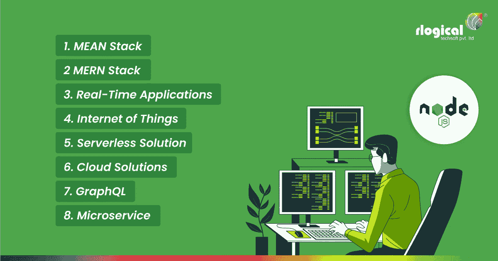

# 2021 年 Top Node.js 发展趋势

> 原文：<https://javascript.plainenglish.io/top-node-js-development-trends-in-2021-807f27fdf1b8?source=collection_archive---------2----------------------->

Top Node.js Development Trends in 2021

世界各地的开发人员对 Node.js 在 2021 年的趋势做出了很多预测。在下面的段落中，我们将解释今年 Node.js 的预期趋势。

# **node . js 因为什么原因如此知名？**

Node.js 由于其高度的灵活性和极其轻量级的特性，近年来变得非常流行。Node.js 提供了一个庞大的 JavaScript 模块库，用于简化开发过程。由于其开源属性，Node.js 因 [**web 和移动应用开发**](https://www.rlogical.com/) 而变得极为知名。

**根据最近的统计数据显示:**

目前，超过 50%的开发人员在他们的项目中使用 Node.js。

在美国，Node.js 技术已经创建了 28000 多个网站。

像全球速卖通和易贝这样的大公司非常依赖 Node.js

流量大的网站，包括 PayPal、网飞和 Groupon，都使用 Node.JS

*   自从 2009 年首次在市场上推出以来，Node.js 已经变得非常流行。 **Node.js 有 75.9k 星，3k 守望者，加上 Github 的 19k 叉。**它拥有**71.8 万名关注者和 8.3 万张堆栈份额投票。**这些数字足以描绘 Node.js 恰巧有多受欢迎。网飞、微软等知名科技巨头都使用 Node.js，Node.js 在 StackOverflow 的 2020 年开发者调查中成功拿下**榜首位置。**在该特定调查中，超过 50%的参与者报告在其项目中使用了 Node JS。

> **也读:** [**NodeJS vs. DenoJS:哪个对你更好？**](https://www.rlogical.com/blog/nodejs-vs-denojs-which-is-better-for-you/)

# **Top node . js 2021 年发展趋势**

## **1。意思是说& MERN 栈**

这两个意思以及 MERN 堆栈是相当强大的。是角度和反应使它如此有力。虽然 **MEAN Stack 组合了 ExpressJS、MongoDB、AngularJS 和 NodeJS** ，但是 MERN Stack 使用 React 而不是 Angular。

AngularJS 可以使用三种不同的组件编写简单而干净的代码:类、模板和元数据。它恰好是一个模型-视图-控制器框架。如果 odeJS 开发公司 的开发人员正在处理一个简单的项目，那么双向数据绑定将是合适的。

这意味着模型中发生的任何修改都会立即影响视图，反之亦然。单向数据绑定对于开发人员来说非常方便，尤其是对于复杂的项目。将有可能利用 Angular 和 Typescript 来构建应用程序。

MERN，一个相对较新的科技公司，已经有了自己的反应。React 获得的用户接受度和人气，对 [**MERN 栈开发**](https://www.rlogical.com/hire-dedicated-developers/hire-mern-stack-developer/) 相当有用。

React 比 Angular 更出色，因为它的虚拟 DOM 在快速执行修改方面非常有效。此外，它采用先进的 JavaScript 快速操作组件。尽管 React 功能强大，但作为一个库，它有一定的局限性。它在某些场合需要借助第三方服务。

## **2。实时应用**

实时应用正在成为趋势，并将继续占据榜首。这些应用程序需要一个强大而健壮的后端。最好的例子是**即时消息、视频通话和在线游戏，以及许多其他类似的应用程序。**

Node.js **使用事件 API 和 Websocket 来获得双向交互**，这在实时应用中是必不可少的。简而言之，可以断言实时应用有着光明的未来。

> **也可阅读:** [**API 开发:构建健壮 API 的完整指南**](https://www.rlogical.com/blog/api-development-complete-guide-to-building-robust-apis/)

## **3。物联网**

Nodejs 恰好是一个功能丰富的运行时环境，使开发人员能够应用面向数据和准时的能力，以及微服务。

世界已经接受了技术变革。如果你想应付它，就必须适应这种当代技术。

实时应用程序必须处理大量的用户请求，因此，node.js 成了帮手。除了提供高质量的应用程序，它同样创造了一个万无一失的解决方案。

因此，你可以相信 node.js 会帮助你为你的客户 [**创建物联网应用**](https://www.rlogical.com/iot-development/) 。

## **4。无服务器解决方案**

每个人都喜欢省钱，并提高开发人员的生产力和效率。就无服务器架构而言，Node.js 恰好是一个极好的解决方案。

维护它的成本几乎为零，而且公司在决定他们的表现时也不需要考虑它。除此之外，它还可以自夸拥有一个全球社区。

几乎每家大公司，如 A **OL、网飞和 Telenor，都利用了无服务器**架构。

**这些优势如下:**

代码质量的提高

降低项目成本

节省大量时间

提高效率

它是最不可思议的节点之一。在接下来的日子里，世界将目睹 JS 的发展趋势。

## **5 .云解决方案**

上面概述的这一点恰好是 d **开发云应用**的解决方案。通过从一开始就采用无服务器结构或者扩展已经开发的应用程序，简化云应用程序的构建将是可能的。

根据信息周的研究，人工智能、云计算加上机器学习模型将统治这个星球。

## **6。GraphQL**

已知 GraphQL 是 RESTful API 的一个成功选择。它使程序员能够精确地阐明它所需要的任何信息。它能有效地从各种来源收集大量信息。

GraphQL，另一个 node.js 趋势，被发现每年都在发展。它已经慢慢引起了全世界程序员的注意。我们可以推测，它将大幅增长。

GraphQL 将能够简化不同平台的工作流程，比如 Windows、Android 或 iOS。因此，这将是开发商最喜欢和最繁荣的特征。

> **亦称:**[**GraphQL 与 REST 之间的差异**](https://www.rlogical.com/blog/differences-between-graphql-and-rest/)

## **7。微服务**

微服务，恰好是无服务器方法的替代品，是一种体系结构技术。代码的维护依赖于微服务，它负责任地处理代码质量。

此外，微服务支持应用程序的无依赖性和自由运行。您可以使用微服务来创建高质量的项目。

微服务体系结构一直在扩展，并且可以证明是一项有效的投资。

# **节点——一个吸引人的运行时环境**

NodeJS 提供了很多优于其他框架的特性，其中一些如下:

事件驱动和异步

全堆栈应用程序开发框架

易于学习且在市场中要求苛刻

内置于 Chrome 发动机之上

单线程

巨大的社区支持

它恰好是一个有前途的应用程序构造器，使 [**web &移动应用程序开发者**](https://www.rlogical.com/hire-dedicated-developers) 能够使用它的库和各种其他工具加技术。

根据最近的统计，您会发现大约有 194K+的站点是利用 Node.js 构建的，这表明了它的受欢迎程度。

*更多内容请看*[*plain English . io*](http://plainenglish.io/)