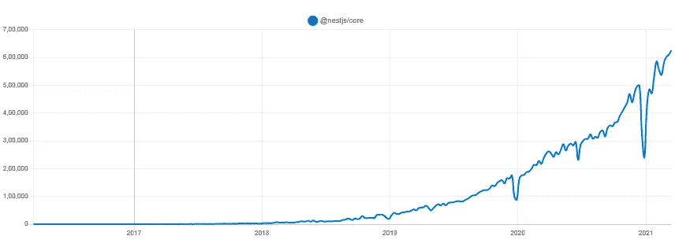
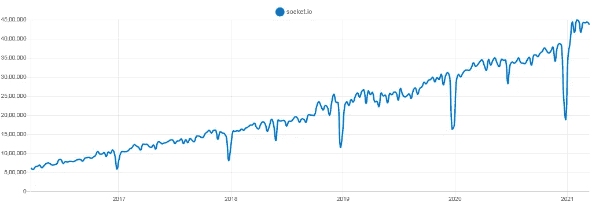
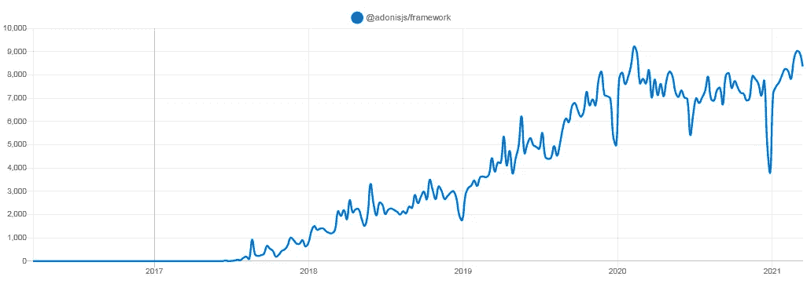

# 2022 年将使用的顶级 Node.js 框架

> 原文：<https://javascript.plainenglish.io/top-node-js-frameworks-to-use-in-2021-4951ee5940b8?source=collection_archive---------0----------------------->

Top Node.js Frameworks

Node.js 是最快的服务器端 web 应用程序平台之一，因为它为应用程序开发公司提供了构建可伸缩的单编程语言 web 应用程序的便利。它是流行的 JavaScript 运行时框架之一，是开源的，具有跨平台的特性，可以在浏览器之外创建代码。

# Node.js 的特别之处在哪里？

1.  它有一个干净简洁的代码库。
2.  它最适合敏捷开发和原型开发。
3.  它有一个提供开源库的庞大生态系统。
4.  它可以用于更快地开发企业级可扩展应用程序。
5.  它基于最常用的编程语言——JavaScript。

# Node.js 的市场反应如何？

NPM Trends

图片来源: [npmtrends](https://www.npmtrends.com/nodejs)

**以下是 Node.js 上更多的事实:**

*   亚马逊、网飞、LinkedIn、易贝、PayPal 和 Reddit 都使用 Node.js 作为他们的后端框架。
*   43%的 Node.js 开发者使用该框架创建企业应用。
*   Paypal 注意到改用 Node.js 后，平均响应时间显著减少了 35%。
*   Node.js 可以将任何现有应用的性能提高 50%。
*   Node.js 降低了 58%的 app 开发成本。
*   Statista 提到，截至 2020 年初，Node 是开发者使用最多的框架，占 51.4%。

# 使用 Node.js 框架的好处

*   易于扩展
*   低学习曲线
*   Fullstack JavaScript 的优势
*   大而活跃的社区
*   使用单一代码库增强整体 web 性能

# **2022 年使用的顶级 Node.js 框架**

既然我们已经介绍了 Node.js，并且如此详细地了解了它的功能，我们可以讨论将在 2022 年使用的[顶级 Node.js 框架](https://aglowiditsolutions.com/blog/best-node-js-frameworks/)。

## 1.哈皮网

**GitHub** - **星星** — 13.1k **|叉子**—1.3k**|版本**—v 20 . 1 . 0**|投稿人** — 208 **|使用人—** 16.5k

**NPM —每周下载—**105065**|许可证**—BSD-3-条款

*图像—*[*NPM trends(hapi*](https://www.npmtrends.com/hapi)*)。js)*

Popularity of Hapi.js framework

Hapi.js 是许多开发人员信任的最简单、安全和可靠的框架之一。您可以使用 Hapi.js 创建具有最小开销和开箱即用功能的可伸缩且健壮的应用程序。它是开发 JSON API 的顶级 Node.js 框架。

**Hapi.js 可用于-**

*   网站
*   HTTP 代理应用程序
*   应用程序编程接口服务器— API

**hapi . js 的主要特性-**

*   输入验证
*   记录
*   错误处理
*   代码可重用性
*   实现缓存
*   没有外部依赖性
*   基于配置的功能
*   集成架构—节点框架中全面的身份验证和授权 API 支持

**何时使用 Hapi.js -**

Hapi.js 非常适合开发安全、实时、可伸缩的社交媒体应用程序。大多数移动应用程序开发人员更喜欢使用 Hapi.js 来创建代理和 api 服务器。

**谁在用 Hapi.js -**

*   商业工具
*   主堆栈
*   光线
*   Taggun
*   艺术

## 2.快递. js

**GitHub — Stars** — 52.3k **|叉子** — 8.8k **|版本** — v4.17.1 **|投稿人** — 262 **|使用人—** 9.2m

**NPM —每周下载量—**17193915 |**许可证—** 麻省理工学院

*图片—* [*npmtrends(快递)*](https://www.npmtrends.com/express)

Express.js popularity

Express.js 是一个灵活的、最小的 Node.js 应用程序框架。这个插件不是围绕特定的组件构建的，因此对你插入什么技术没有意见。这给了开发者试验的自由。他们还获得了闪电般的设置和纯 JavaScript 体验，使 Express.js 成为快速原型和敏捷开发领域的有力竞争者。

**Express.js 可用于-**

*   单页应用程序
*   多页应用程序
*   混合应用

**express . js 的主要特性-**

*   更快的服务器端开发
*   使开发人员能够更快地构建 RESTful APIs
*   Express 通过一些工作支持 MVC 架构
*   支持开箱即用的 NoSQL 数据库

**何时使用 Express.js-**

Express.js 非常适合快速创建 web 应用程序和服务，因为它有现成的 API 生成工具。它是基于 JavaScript 的技术的一部分，称为 MEAN software stack。这意味着你可以使用 Express.js 来制作任何基于企业级浏览器的应用。

**谁使用 express . js—**

*   寻找酒店
*   无所不在的
*   行
*   SiHub
*   TheDoe

## 3.嵌套. js

**Github—Stars**—35.5k**| Forks**—3.4k**|版本**—7 . 5 . 0**|投稿人**—226**|使用人—** 60.4k

**NPM —每周下载量**—508214**|许可证** —麻省理工学院

***图片-***[*NPM trends(nest . js)*](https://www.npmtrends.com/@nestjs/core)

Nest.js popularity

Nest.js 是一个服务器端应用程序框架，旨在支持开发人员的工作效率，让他们的生活更加轻松。开发人员通常使用 Node.js 框架来构建他们的代码，这是一种更好、更有条理的方式。

**Nest.js 可用于-**

*   编写更清晰和可重用的代码。
*   用更高级的结构编写代码，比如拦截器、过滤器、管道。
*   编写可伸缩的、可测试的和松散打包的应用程序。

**nest . js 的主要特点—**

*   易于扩展—可与其他库一起使用。
*   允许开发人员使用纯 JavaScript 完全编码。
*   结合了函数式编程、面向对象编程和函数式反应式编程的特点。
*   公开框架 API，帮助开发人员使用每个平台可用的各种第三方模块。
*   它有一个详细的和维护良好的文件。

**何时使用 nest . js—**

Nest.js 主要用于编写可伸缩、可测试和松散耦合的应用程序。它将 Node.js 的可伸缩性提高到了一个全新的水平。它提供了结构和灵活性的适当平衡，可以有效地管理大型项目的代码，同时仍然有一种结构感可以遵循。

**谁使用 nest . js-**

*   【姓氏】罗奇
*   阿迪达斯
*   十项运动
*   凯捷

## 4.Koa.js

**GitHub—Stars**—30.9k**| Forks**—3k**|版本**—2 . 13 . 1**|投稿人** — 219 **|使用人—** 160k

**NPM —每周下载—** 870，944 **|许可证—** 麻省理工学院

*图像—*[*NPM trends(KOA)*](https://www.npmtrends.com/koa)

Popularity of Koa.js framework

Koa.js 是由 Express.js 的相同创建者创建的开源节点 web 框架。通过 Koa，他们的目标是为 web 应用程序和 API 创建一个更小、更具表现力和更健壮的平台。它提供了多种有效的方法来加快制作服务器的进程。

**Koa.js 可用于-**

*   前端系统
*   后端系统
*   混合系统

**KOA . js 的主要特性-**

*   现代和未来的证明
*   与所有 Node.js 框架相比，占用空间更小
*   有一个内置的错误捕捉器，可以防止网站崩溃
*   使用包含请求和响应对象的上下文对象

**何时使用 Koa.js-**

Koa.js 最适合用于创建服务器、路由、处理响应和处理错误。

**谁使用 KOA . js—**

*   平行
*   LetzChange
*   大脑中枢
*   电灯泡；鳞茎；球状物

## 5.Socket.io

**GitHub—Stars**—52.7k**| Forks**—9.6k**|版本**—4 . 0 . 0**|投稿人** — 189 **|使用人—** 2.2m

**NPM —每周下载量— 3，617，636 |许可—** 麻省理工学院

*图片—*[*NPM trends(socket . io)*](https://www.npmtrends.com/socket.io)

Popularity of socket.io

Socket.io 用于在客户端和服务器之间建立实时双向通信。为此，客户端需要在浏览器中安装 Socket.io，服务器也应该集成 Socket.io 包。这使得数据可以以数百万种形式共享。然而，最受欢迎的方法仍然是 JSON。

**Socket.io 由**组成

1.JavaScript 服务器— Node.js

2.JavaScript 客户端库— Node.js

***注:*** *Socket.io 还兼容很多其他语言像 Java，c++，Swift，Dart，。Net 和 Python。*

**Socket.io 可以用于-**

*   几个名称空间
*   广播
*   事件处理
*   错误处理
*   日志记录和调试
*   内部的
*   聊天应用程序

**socket . io 的主要特性-**

*   将消息编码为命名的 JSON 或二进制事件
*   为应用添加“实时”功能
*   支持自动重新连接
*   出色的速度和可靠性
*   即时消息和聊天

**何时使用 Socket.io -**

Socket.io 是最好的基于事件的实时双向通信工具之一。任何想在应用程序中添加“实时分析”功能的人都应该使用它。Socket.io 对“实时”游戏应用也很有用。使用基本的 HTTP 或 HTTPS 协议进行实时游戏是不可行的，因为这些文件很大，建立通信需要时间。在这里，我们使用更小的套接字包，并几乎“实时”完成工作，以获得更流畅和更好的体验。

**谁在使用 socket . io—**

*   阿里巴巴旅行
*   订阅模式
*   特雷罗
*   Justmop
*   格子图案

## 6.流星. js

**Github—Stars**—42.3k**| Forks**—5.2k**|版本**—4 . 0 . 0**|投稿人**—452**|使用人—** (？)| **许可证—**麻省理工学院

NPM —不可用

Meteor.js 是一个开源的全栈 JavaScript 平台，JavaScript 在不同的地方出于不同的目的运行。JavaScript 在网络浏览器中运行；然后 JavaScript 在 Node.js 容器内的 Meteor 服务器上运行，并支持 HTML 片段、静态资产和 CSS 规则。

**Meteor.js 可用于—**

*   全面生产移动应用
*   网络应用的全面生产

**meteor . js 的主要特性—**

*   纯 JavaScript
*   干净、强大的数据同步
*   互用性
*   智能包装
*   热门代码推送

**何时使用 Meteor.js-**

Meteor.js 具有快速原型制作的能力，并生成跨平台(Android、iOS、Web)的代码。它也是最容易学习的框架之一，因为它不遵循任何严格的结构规则。因此，任何希望以最少的学习曲线为多个平台创建应用程序的初学者或中级开发人员都应该使用 Meteor.js。

**谁用 Meteor.js -**

*   埃森哲
*   NetApp 公司
*   火箭聊天
*   Esri
*   诺德斯特姆

## 7.阿多尼斯

**Github—Stars**—9.7k**| Forks**—498**|版本—**5 . 0 . 13**|投稿人**—47**|使用人—** 754

**NPM —每周下载量—**3808**|许可证—** 麻省理工学院

*图片*[*NPM trends(Adonis . js)*](https://www.npmtrends.com/@adonisjs/framework)

Popularity of adoni.js

Adonis.js 是一个 Node.js MVC 框架，可以在所有操作系统上运行。它为编写服务器端 web 应用程序提供了一个稳定的生态系统，以关注业务需求，如最终确定选择或排除哪个包。它非常适合想要改变口味并尝试 Node.js 框架的 Laravel 开发人员。Adonis.js 为 Node.js 提供了与 Laravel 自然拥有的相同的特性和能力。

**Adonis.js 可用于—**

*   构建 web 应用程序
*   应用编程接口服务器-API

**Adonis . js 的主要特性—**

*   强大的 ORM 有助于进行安全的 SQL 查询
*   API 和基于会话的认证系统
*   验证和净化每个用户的输入
*   高度重视安全性
*   可扩展的应用程序布局

**何时使用 Adonis.js -**

如果你是一个正在寻找 MVC 工具的 Node.js 开发者，Adonis.js 是你的首选 Node.js 框架。但是，如果你是 Laravel 开发人员或者其他任何移动应用框架开发人员，你仍然可以尝试一下 Adonis.js，甚至从 PHP 迁移到 Node.js。

**谁使用 Adonis . js—**

*   点群
*   多姆舍
*   尼娜
*   泽洛
*   发现

## 8.帆. js

**Github—Stars**—21.9k**| Forks**—1.9k**|版本**—1 . 4 . 0**|投稿人**—229**|使用人—** 23.3k

**NPM —每周下载量**—20457**|许可** —麻省理工学院

*图片—* [*npmtrends(船帆)*](https://www.npmtrends.com/sails)

Popularity of sails.js framework

Sails.js 是另一个实时 Node.js MVC 框架。它构建于 Express 之上，其 MVC 架构与 Ruby on Rails 相匹配。它不同于 Ruby on Rails，因为它支持更现代的、以数据为中心的 API 和 web 应用程序开发风格。

**Sails.js 可用于-**

*   构建企业级 Node.js 应用程序
*   构建前端应用程序
*   构建后端应用程序来处理 HTTP 请求

**sails . js 的主要特点—**

*   支持自动生成的 REST APIs
*   具有简单的 WebSocket 集成
*   兼容任何流行的前端——Angular、Android、React、iOS、Windows 或任何定制硬件
*   它还支持实时功能

**何时使用 sails . js—**

任何想要 Node.js 框架来模拟现代应用架构的 Laravel 和 Ruby on Rails 等 MVC 模式框架并构建以数据为中心的 API 和实时应用的开发人员都应该在他们的下一个项目中使用 Sails.js。

**谁用 Sails.js-**

*   导师平台
*   氧化还原发动机
*   大脑中枢
*   创建通知
*   人民树林

**总结一下**

市场上有许多新的 Node.js 框架。不同的 Node.js 框架在不同阶段帮助你的 app 开发项目，带来很多价值和功能。利用这些框架使你的应用程序开发过程变得轻松。

## 进一步阅读

 [## 具有 NodeJS 和 Bit 的组件驱动的微服务

### 大多数人认为组件是前端的一部分。然而，CBSE(基于组件的软件工程)是…

比特云](https://bit.cloud/blog/component-driven-microservices-with-nodejs-and-bit-l64shurc) 

*更多内容请看*[***plain English . io***](https://plainenglish.io/)*。报名参加我们的* [***免费周报***](http://newsletter.plainenglish.io/) *。关注我们关于*[***Twitter***](https://twitter.com/inPlainEngHQ)[***LinkedIn***](https://www.linkedin.com/company/inplainenglish/)*[***YouTube***](https://www.youtube.com/channel/UCtipWUghju290NWcn8jhyAw)*[***不和***](https://discord.gg/GtDtUAvyhW) *。对增长黑客感兴趣？检查* [***电路***](https://circuit.ooo/) *。***