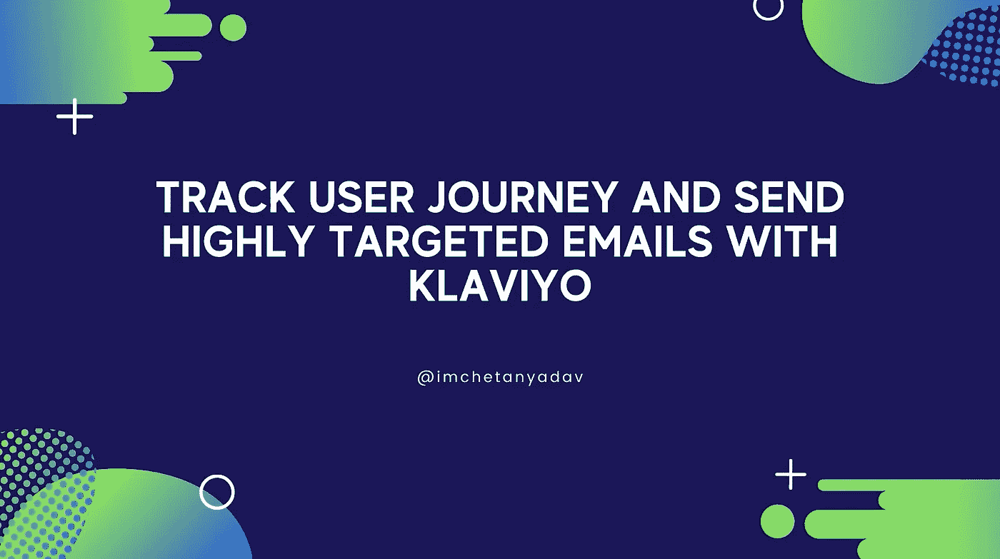
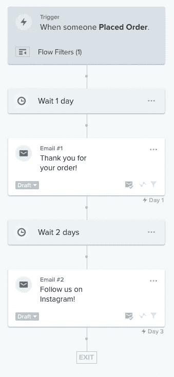
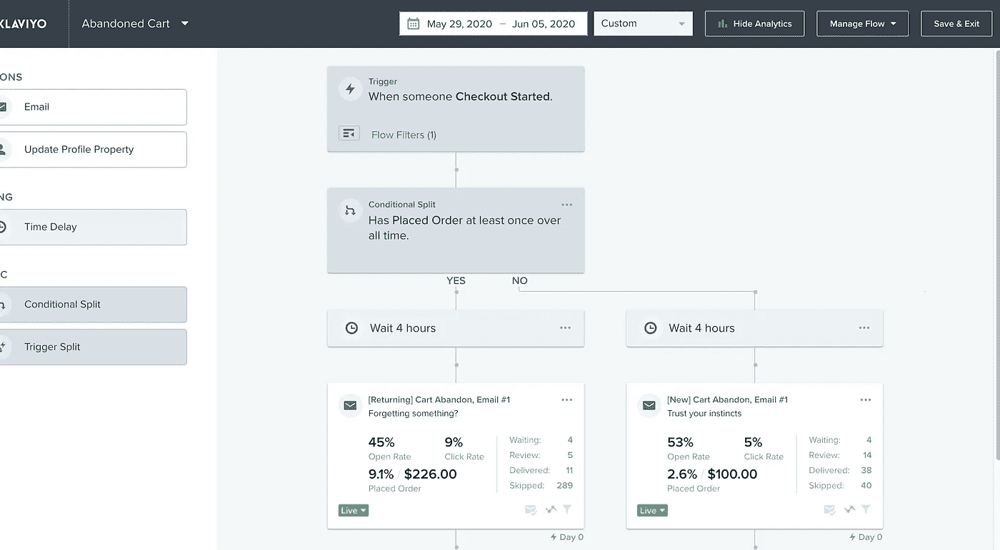

# 用 Klaviyo 追踪网站用户的旅程

> 原文：<https://javascript.plainenglish.io/track-user-journey-and-send-highly-targeted-emails-with-klaviyo-7444746a5d76?source=collection_archive---------10----------------------->



在本教程中，我们将学习如何跟踪用户的旅程，并在此基础上，向用户发送极具针对性的电子邮件。

使用 Klaviyo，您可以设置一个自动序列，该序列可以通过设置特定的触发器来激活。这就是所谓的心流。可以建立 Klaviyo 流，以便及时向接收者发送信息。他们可以应用某些操作，例如当用户将产品添加到购物车，但在一段时间内没有结帐时，向用户发送放弃购物车的电子邮件。

所以，事不宜迟，我们开始吧。

# 设置 Klaviyo

*   从[这里](https://www.klaviyo.com/register)设置一个 Klaviyo 账户。记下`PUBLIC_API_KEY`或公司 id。
*   给页面的`head`添加`script`标签。用你的钥匙替换`PUBLIC_API_KEY`。

```
<script async type="text/javascript" src="//static.klaviyo.com/onsite/js/klaviyo.js?company_id=PUBLIC_API_KEY"></script>
```

# 识别人员

一旦`script`被加载，您可以使用`identify`方法识别个人。此方法接受属性的字典或哈希。当您识别某人时，您必须使用`$email`键输入其电子邮件地址，或者，如果您只有 SMS 联系人，则使用`$phone_number`键输入其电话号码。

*   为了获得最佳结果，请在用户登录/注册时或者在页面加载时(如果他们已经登录)传递所有必要的数据。
*   Klaviyo 有一些预定义的属性，如`email`或`phone_number`，但是您也可以传递自定义属性，这些属性对于跟踪个人信息非常有用。在 Klaviyo 中，您可以根据这些属性创建人群。例如，您可能希望跟踪个人的计划类型或注册日期。Klaviyo 还会理解您使用的不同数据类型，因此可以随意使用数字、布尔值和日期。

```
var _learnq = typeof window !== "undefined" ? window._learnq : [];_learnq.push(["identify", {
  // Klaviyo defined properties, necessary to pass one of email or phone_number, others properties are optional
  $email: email,
  $first_name: firstName,
  $last_name: lastName,
  $phone_number: phoneNumber,
  $title: title,
  $organization: organizationName,
  $image: imageUrl, // Pass custom properties}]);
```

# 跟踪用户旅程

`track`方法允许你记录人们在你的网站上发生的事件和行为。该方法接受一个字符串，即您为该事件指定的名称。此方法还接受与该事件关联的可选字典或属性哈希。

有了这个，您可以跟踪某人何时购买了一个项目，并包括购买价格和他们购买了什么项目的信息。如果您有一个应用程序，其中的人有个人资料，您可以跟踪当有人填写他们的个人资料。

*   **客户端:**要跟踪用户旅程客户端，可以使用下面的代码

```
var _learnq = typeof window !== "undefined" ? window._learnq : [];_learnq.push(["track", "Pass metric name here", {
  // Pass all the necessary data you want to attach to metric as key-value pair or leave it empty
}]);
```

*   **服务器端:**要在服务器端跟踪用户旅程，您可以像这样向 Klaviyo 发出 HTTP 请求:

```
fetch(`https://a.klaviyo.com/api/track?data=${Buffer.from(
  JSON.stringify({
    token: "PUBLIC_API_KEY",
    event: "Pass metric name here",
    customer_properties: {
      // Properties about the person
      $email: email,
    },
    properties: {
      // Pass all the necessary data you want to attach to metric as key-value pair or leave it empty
    },
  })
).toString("base64")}`);
```

所有这些应该可以帮助您将必要的数据和事件传递给 Klaviyo。

现在，我们将设置自定义流程来触发电子邮件。

# 设置自定义流程

Klaviyo 流程旨在让您在整个生命周期中轻松建立和培养与订户和客户的关系。流允许您根据某人何时加入列表、被添加到细分市场或采取任何其他行动(如购买或放弃购物车)来触发一封电子邮件或一系列电子邮件。任何同步到您的 Klaviyo 帐户的数据都可以用来触发和定向自动电子邮件流。

要创建新流程，请执行以下操作:

*   访问 Klaviyo dashboard，点击左侧工具条中的**流程**链接。
*   点击顶部的**创建流**
*   您可以从 Klaviyo 库中选择一个流或**选择从头创建**
*   添加名称，选择标签，并点击**创建流**
*   对于触发器，选择**指标**，并选择一个您使用`track`方法发送的指标。根据您的需要设置触发器或流量过滤器，或者保持原样。所有设置完成后，点击**完成**。
*   现在拖动流程卡下面的**延时**，指定一个延时。
*   现在拖动 **Email** 到延时卡下面，进行配置。将状态更改为**实时。**
*   添加任意数量的电子邮件或延迟操作。
*   完成所有操作后，点击右上角的**保存**按钮。

# 一些自定义流程示例



Order placed email Flow



Abandoned Cart email Flow

有关流量的更多详情，请查看 Klaviyo [流量导轨](https://help.klaviyo.com/hc/en-us/categories/115000312411-Flows)。

本教程到此为止。希望对你有帮助。在 [Instagram](https://www.instagram.com/imchetanyadav/) 和 [Twitter](https://twitter.com/im_chetanyadav/) 上关注我，获取更多信息。