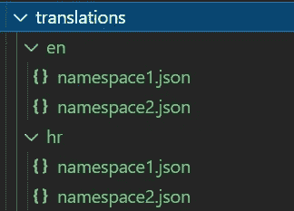

# 使用 i18next 翻译您的 React 应用程序

> 原文：<https://javascript.plainenglish.io/translate-your-react-applications-with-i18next-824d7aaca6a7?source=collection_archive---------9----------------------->

## 希望您的应用程序支持多种语言？使用 i18next 框架为您的应用程序添加国际化。


Photo by [Chris Lawton](https://unsplash.com/@chrislawton?utm_source=medium&utm_medium=referral) on [Unsplash](https://unsplash.com?utm_source=medium&utm_medium=referral)

将你的网站翻译成不同的语言是扩大你的受众的一个很好的方法，让你的内容更容易被人们所理解。使用 i18next，增加对多语言字符串的支持变得非常简单。

需要多长时间？不到一个小时，我就安装好了我的 React 应用程序(用典型的`create-react-app`配置创建的)。

本文将介绍安装必要的依赖项、添加对多种语言的支持、检测客户的默认浏览器语言以及添加一个允许客户手动更改语言的按钮的过程。

# 安装 i18next 和其他依赖项

i18next 是一个 JavaScript 国际化框架，可以与任何 JavaScript 应用程序一起使用。所以本文中的很多东西都可以转移到 React 之外的技术上。

为了让 React/React Native 更容易使用 i18next，还有另一个框架叫做 react-i18next。它提供了一个额外的钩子和一个 React 组件，使得翻译字符串变得非常简单。

除此之外，还有 i18 next-browser-language detector。这将允许您自动检测客户浏览器中设置的语言首选项，并以该语言显示您的应用程序。(字面意思是一行代码。)但是，这是完全可选的，如果您有更好的方法来确定客户选择的语言，您就不需要它。

您可以使用 npm 安装这三个组件:

```
npm install i18next react-i18next i18next-browser-languagedetector
```

# i18n 和 i18n 的区别接下来

你会在下面看到很多 i18n 的导入和提及，你可能会开始奇怪为什么所有的东西都叫 i18n，而你安装的模块叫 i18next。

答案很简单:i18n 是最初的轻量级翻译模块，i18next 就是在它的基础上构建的。因此，i18next 实际上使用了 i18n，但在它的基础上添加了更多功能。

# 配置 i18 下一步

传统的做法是为初始化国际化框架创建一个单独的文件。您可以将其命名为`i18n.js`(或者`i18n.ts`，如果您使用的是 TypeScript)。

这是文件的初始内容。

在这个模块中，我们简单地导入必要的依赖项，然后初始化 i18n 参数。

`.use(LanguageDetector)`将增加自动检测浏览器语言并将其设置为应用程序中当前语言的功能。如果不想要这个功能，可以省略这一行和`LanguageDetector`的 import 语句。

设置`debug: true`将记录将翻译加载到控制台的问题，这对于在本地调试 i18next 设置可能很有用。

如果没有提供其他语言，则`fallbackLng`字段设置要使用的默认语言。在这种情况下，只有在`LanguageDetector`由于某种原因未能检测到浏览器语言时才会使用。

`escapeValue`通常用于安全原因，但是 React 已经默认这样做了，所以您可以通过设置`escapeValue: false`来删除重复的工作。

现在剩下的就是在`resources`字段中传递实际的翻译。可以在这个文件的 resources 参数中直接传递字符串，但是最好将翻译与代码分开。

将翻译转移到它们自己的文件中可以更好地分离关注点。这也使得将来更改翻译的位置变得更加容易，并且有可能合并一个管道或框架来将翻译交付给翻译人员。

下一节将演示如何将翻译存储在单独的 JSON 文件中，并将它们链接到您的 i18n 框架。

# 创建带翻译的 JSON 文件

在这个设置中，您需要为您支持的每种语言创建单独的 JSON 文件。虽然您通常可以将字符串存储在任何文件中，但我建议使用类似下面的文件夹结构。



Suggested file structure for storing translations.

所有翻译都存储在名为`translations`的根文件夹中。(我把它放在我的存储库中的`src`文件夹中，但是把它放在离你的项目的根目录更近的地方也是有意义的。)

每种支持的语言在翻译文件中都有一个单独的文件夹(在本例中是`en`和`hr`)。在每个文件夹中，都有包含该语言翻译的 JSON 文件。注意，一种语言可以有多个名称空间。如果你有很多字符串，想把它们分成更小块，或者不想一次全部加载，这就很方便了。

为了简单起见，我将把重点放在具有一个名为`common`的名称空间的解决方案上。我为每种语言创建了一个`common.json`文件。在 JSON 文件中，您可以将字符串分成多个部分。重要的是，你必须为你的每一种语言有相同的部分和关键。否则框架将无法找到你的字符串的翻译。

下面是一个包含英语字符串的 JSON 文件的例子。

有两个部分，`header`和`user.dropdown`。它们中的每一个都对应于我的 React 应用程序中的一个组件。在每个部分中，每个字符串都有映射到实际值的键。例如，`header`部分中的`title`键映射到字符串`“Home”`。

我为克罗地亚语创建了一个类似的文件。

注意，所有的键都是相同的，区别这两个文件的唯一区别是字符串值。

准备好翻译文件后，您可以将它们作为资源添加。

# 向 i18n 添加翻译文件

要添加 JSON 文件，首先需要将它们导入到您的`i18n.js`或`i18n.ts`文件中。

我使用了以下导入语句。

```
import en from “./translations/en/common.json”;import hr from “./translations/hr/common.json”;
```

然后，我通过以下方式将它们添加到资源中:

将文件添加到资源的一般模式如下:

您还可以设置默认的名称空间。这可以帮助您避免将名称空间传递给翻译挂钩，这将在下一节中使用。您可以通过设置`defaultNS`参数来设置默认名称空间。

下面是 i18n 文件的完整代码:

为了使用它，您需要将其导入到您的应用程序中。在你的`index.js`或者`index.tsx`文件中，简单添加`import ‘./i18n’;`。

# 使用`useTranslation`钩子平移字符串

一旦设置了 i18n，就可以用它来翻译应用程序中的字符串。最简单的方法是使用 react-i18next 提供的`useTranslation`钩子。

导入钩子，通过调用钩子获得翻译函数`t`,然后简单地用字符串的键调用`t`函数。它将以当前语言返回您请求的字符串。

这里有一个简单的例子:

请注意，该键由节名和字符串键组成，由句号连接。

在这个场景中，`useTranslation`钩子将使用默认的名称空间来查找字符串。如果没有设置默认的名称空间，它将不知道在哪里寻找字符串，它将简单地返回您传入的键(在本例中是`header.title`)。

如果您希望`useTranslation`钩子使用不同的名称空间，只需在调用钩子时传递它的名称:

```
const {t} = useTranslation(“namespace”);
```

就是这样！您的应用程序已全部设置为基于客户的默认浏览器语言进行翻译。

# 如果你想给你的字符串添加参数呢

在大多数需要翻译字符串的情况下,`useTranslation`钩子都工作得很好，这可能是你用得最多的。

但是，有时您可能需要插入自定义值(如名称、数字或链接)作为要翻译的字符串的一部分。在这些情况下，您应该使用 react-i18 中的`Trans`组件下一步:[https://react.i18next.com/latest/trans-component](https://react.i18next.com/latest/trans-component)。

当你在字符串中插入参数时，你不应该依赖`useTranslate`钩子。虽然从技术上讲，您可以将字符串分成两个子字符串(一个在参数之前，一个在参数之后)，分别翻译它们，然后将它们连接成一个字符串，但这不太可能奏效。

不同语言的词序会有很大不同，参数值可能需要移到字符串中的不同位置。如果你要连接字符串，那是不可能的。

# 添加语言选择按钮

我们设置了翻译来匹配客户的浏览器语言环境。然而，很可能有些人想要改变默认选择的语言。既然你已经投资在你的应用程序中支持多种语言，为什么不给他们选择最佳选项的能力呢？

您将需要一个支持的区域设置列表，以及它们所需的显示名称。实现语言选择组件时，通常以母语显示语言名称(例如德语的 *Deutsch* )。

以下是我支持的两种语言的列表:

接下来，我们需要获取`i18n`的实例。然后，我们可以向`i18n`实例发送语言更改信号，这将随后触发翻译函数`t`或`Trans`组件中包含的所有字符串的语言全局更改。

我们可以使用`useTranslation`钩子获取它:

```
const { i18n } = useTranslation();
```

并且可以通过调用获取的`i18n`实例的`changeLanguage`方法，使用所需的语言代码来更改语言:

```
 i18n.changeLanguage(languageCode)
```

下面是一个简化的 React 组件的例子，该组件将呈现带有语言名称的按钮列表，并在单击指定按钮时更改语言。

这就是将应用程序翻译成另一种语言所需要的一切！如果你想看这段代码的运行，你可以看看我在 GitHub 上的个人项目中是如何使用它的:[https://github.com/dunja-v/blog-editor-website](https://github.com/dunja-v/blog-editor-website)

# 翻译不同于本地化

值得注意的是，翻译您的应用程序并不等同于针对特定市场进行本地化。本地化包括将字符串翻译成不同的语言，但是针对不同的语言环境调整应用程序还有许多其他方面。

例如，格式化日期、数字和货币。UI 中元素和图像的方向(从左到右或从右到左)。还有一些颜色、符号、手势和名字在一个地方可能是可以接受的，但在另一个地方却有不同的含义，甚至可能是冒犯性的。

我希望这能鼓励你寻找更多的方法来调整你的应用程序以适应全球的用户。

感谢您的阅读！

# 资源

*   官方 i18 下一个文档:【https://react.i18next.com/ 
*   i18n、i18next 和 react-i18next 的区别:[https://npmcompare . com/compare/i18n、i18next、react-i18next、react-intl](https://npmcompare.com/compare/i18n,i18next,react-i18next,react-intl)

使用 i18 的教程接下来:

*   [https://dev . to/adrai/how-to-rightly-international ization-a-react-application-using-i18 next-3 hdb](https://dev.to/adrai/how-to-properly-internationalize-a-react-application-using-i18next-3hdb)
*   [https://www . codeandweb . com/babeledit/tutorials/how-to-translate-your-react-app-with-react-i18 next](https://www.codeandweb.com/babeledit/tutorials/how-to-translate-your-react-app-with-react-i18next)

*更多内容请看*[***plain English . io***](http://plainenglish.io/)