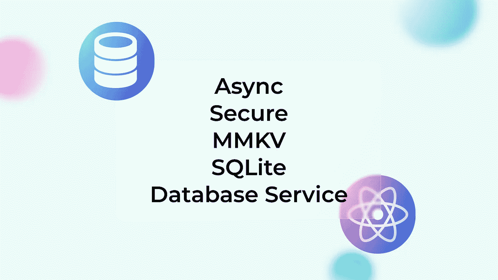
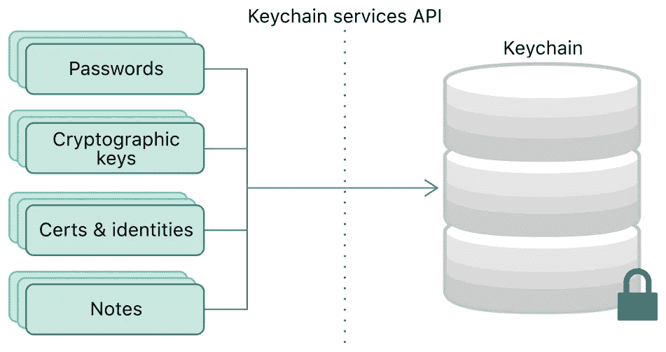

# React 本机应用的存储选项

> 原文：<https://javascript.plainenglish.io/trending-storage-options-for-react-native-developers-8671fbffb686?source=collection_archive---------4----------------------->

## React 本地生态系统中存储数据的不同方式的详细视图

Cover picture designed by the author

数据是任何移动应用的关键部分。它赋予简单的用户界面以意义。但是存储、检索和维护数据是真正的障碍。使用不同方式的存储机制(加密存储、离线存储、面向服务的存储、自动同步存储)对于存储各种类型的数据至关重要，这些数据可以提升移动应用程序开发的整个流程。因为应用程序的每个用户界面和功能都需要不同的数据存储机制来使应用程序自发运行。我已经列出了所有现有的存储数据的方法，这些方法被用来利用应用程序的可用性。

# 异步存储

AsyncStorage 是一个**未加密、异步、持久、键值**的存储系统，可以在应用程序上全局访问。

在 iOS 上，AsyncStorage 由本机代码支持，它将小值存储在序列化的字典中，将较大的值存储在单独的文件中。在 Android 上，AsyncStorage 将根据可用性使用 [RocksDB](http://rocksdb.org/) 或 SQLite。AsyncStorage **在 Android** 上仅支持 6 MB，而在 iOS 上支持无限量的数据。如果你的目标是构建一个跨平台的应用程序，6MB 是极限。

JavaScript 代码充当一个接口，并提供干净的基于承诺的 API 方法、错误对象和非多功能函数。

存储用户、应用程序逻辑和其他公共数据的理想位置。

 [## GitHub-react-native-async-storage/async-storage:一个异步、持久、键值存储…

### React Native 的异步、未加密、持久、键值存储系统。前往文档以…

github.com](https://github.com/react-native-async-storage/async-storage) 

# 安全存储

安全存储有助于存储**加密数据**。React Native 不附带任何存储敏感数据的方式。但是，Android 和 iOS 平台已经有现成的解决方案。

Picture from iOS developer [documentation](https://developer.apple.com/documentation/security/keychain_services)

在 iOS 上， [Keychain Services](https://developer.apple.com/documentation/security/keychain_services) 允许安全地存储应用程序的小块敏感信息。在 Android 上，[共享偏好](https://developer.android.com/reference/android/content/SharedPreferences)相当于用于安全存储的持久键值数据存储。共享首选项中的数据默认不加密，但是[加密共享首选项](https://developer.android.com/topic/security/data)包装了 Android 的共享首选项类，自动加密密钥和值。

但 Android 有另一个比共享偏好更安全的选择，称为 [Android Keystore](https://developer.android.com/training/articles/keystore) 系统，用于在容器中存储密钥，使其更难从设备中提取。然而，[的一个](https://github.com/mCodex/react-native-sensitive-info)[分支](https://github.com/mCodex/react-native-sensitive-info/tree/keystore)使用 Android 密钥库。

存储证书、令牌、密码和任何其他不属于异步存储的敏感信息的理想位置。

 [## GitHub-ob rador/React-Native-Keychain:React Native 的钥匙串访问

### React 本机安装 API setGenericPassword(用户名、密码、[{ accessControl…

github.com](https://github.com/oblador/react-native-keychain)  [## GitHub-mCodex/react-native-sensitive-info:将敏感数据保存到 Android 的共享首选项中…

### react-native-sensitive-info 管理存储在 Android 共享偏好设置、iOS 钥匙串和 Windows 中的所有数据…

github.com](https://github.com/mCodex/react-native-sensitive-info)  [## GitHub-emerald Santo/React-Native-encrypted-storage:React Native wrapper around…

### 对 SharedPreferences 和 Keychain 的本机包装作出反应，以提供异步存储的安全替代方案。异步…

github.com](https://github.com/emeraldsanto/react-native-encrypted-storage)  [## SecureStore - Expo 文档

### expo-secure-store 提供了一种在设备上加密和安全存储密钥-值对的方法。每个世博会项目…

docs.expo.io](https://docs.expo.io/versions/latest/sdk/securestore/) 

# MMKV 存储

[MMKV](https://github.com/Tencent/MMKV) 是一个**高效的小型移动键值**存储框架，由腾讯开发，用于微信。

MMKV 使用 mmap 保持内存与文件同步，使用 *protobuf* 编码/解码值，充分利用 Android 实现最佳效率性能。它支持进程间的并发读写访问，允许多进程并发**。**由于完全同步调用，保持数据很容易。

存储用户、应用程序逻辑等公共数据的理想位置。它是异步存储的**替代方案。**

 [## GitHub-ammar ahm-ed/react-native-mmkv-storage:一种超快速(0.0002 秒读/写)、小型和…

### 一个超快速(0.0002 秒读/写)、小型且加密的移动键值存储框架，适用于 React Native 编写的…

github.com](https://github.com/ammarahm-ed/react-native-mmkv-storage)  [## github-mrousavy/react-native-mmkv:⚡️一个非常快速的键/值存储库，用于 React…

### MMKV 是微信开发的一个高效的小型移动键值存储框架。更多见腾讯/MMKV…

github.com](https://github.com/mrousavy/react-native-mmkv) 

# SQLite 存储

SQLite 是一个 C 语言库，它实现了一个小型、快速、独立、高可靠性、全功能的 SQL 数据库引擎。它是最常用的数据库引擎。它内置于所有手机和大多数电脑中，并捆绑在人们每天使用的无数其他应用程序中。文件格式是稳定的，跨平台的，向后兼容的，开发者保证保持这种格式。

比异步、安全和 MMKV 存储存储更多数据的理想位置，它可以支持离线应用程序开发。

 [## GitHub - Nozbe/WatermelonDB:🍉反应式和异步数据库，用于强大的反应和反应…

### 反应式数据库框架构建强大的 React 和 React 本机应用程序，可从数百个扩展到数万个…

github.com](https://github.com/Nozbe/WatermelonDB)  [## GitHub-and por/React-Native-SQLite-storage:React Native 的全功能 SQLite3 原生插件…

### React Native (Android 和 iOS)-GitHub-and por/React-Native-SQLite-storage 的全功能 SQLite3 原生插件…

github.com](https://github.com/andpor/react-native-sqlite-storage)  [## GitHub-craftzdog/React-Native-SQLite-2:SQLite 3 原生插件，适用于 iOS、Android……

### Android、iOS、Windows 和 macOS 的 React 原生 SQLite3 原生插件。这个插件提供了一个兼容 WebSQL 的…

github.com](https://github.com/craftzdog/react-native-sqlite-2)  [## github-OSP Franco/react-native-quick-sqlite:⚡️最快的 SQLite 实现…

### Quick SQLite 使用 JSI，消除了 JavaScript 代码和 C++代码之间相互通信的所有开销，使得…

github.com](https://github.com/ospfranco/react-native-quick-sqlite)  [## SQLite - Expo 文档

### expo-sqlite 使您的应用程序可以访问数据库，该数据库可以通过类似 WebSQL 的 API 进行查询。数据库是…

docs.expo.dev](https://docs.expo.dev/versions/v42.0.0/sdk/sqlite/) 

# 数据库服务

有不同类型的数据库服务可用于通过不同的方法执行移动应用程序数据层的各种功能。这些都列在这里了。

1.  Firebase Firestore
2.  Firebase 数据库
3.  燃料库
4.  Mongo DB 的领域
5.  邮袋数据库

## **Firebase Firestore**

Cloud Firestore 是一个 **NoSQL 文档数据库**，可以让你轻松**存储、同步和查询谷歌规模的移动和网络应用的数据**。可以使用集合和文档轻松构建数据，并使用层次结构通过表达式查询轻松存储和检索数据。

 [## react-native-firebase/包/主转化酶上的 firestore/react-native-firebase

### 云 Firestore 是一个 NoSQL 文档数据库，让您可以轻松存储、同步和查询手机和网络数据…

github.com](https://github.com/invertase/react-native-firebase/tree/master/packages/firestore) 

## Firebase 数据库

Firebase 实时数据库是云托管的。数据以 JSON 的形式**存储，并实时**同步到每个连接的客户端。当您使用 React Native SDK 构建跨平台应用时，所有客户端共享一个实时数据库实例，并自动接收最新数据的更新。

 [## react-native-firebase/包/主转化酶上的数据库/react-native-firebase

### Firebase 实时数据库是一个云托管的数据库。数据存储为 JSON 并实时同步到每个…

github.com](https://github.com/invertase/react-native-firebase/tree/master/packages/database) 

## 燃料库

Firebase 的云存储是在云中存储图像、音频、视频或其他用户生成内容的理想场所。这是一个为 Google scale 构建的强大、简单且经济高效的对象存储服务。用于云存储的 Firebase SDKs 为应用程序的文件上传和下载增加了谷歌安全性，无论网络质量如何。

 [## react-native-firebase/包/存储在主转化酶/react-native-firebase 上

### Firebase 云存储是一个为 Google scale 构建的强大、简单且经济高效的对象存储服务。的…

github.com](https://github.com/invertase/react-native-firebase/tree/master/packages/storage) 

## Mongo DB 的领域

Realm 是一个移动数据库，**直接在手机**、平板电脑或可穿戴设备中运行。数据直接作为对象公开，可以通过代码查询，不需要 ORM。它支持关系、泛型和向量化。相对来说，它比原始的 SQLite 更快**，是 SQLite &键值存储**的一种**替代。Realm 的本地数据库将数据保存在磁盘上，因此应用程序**也可以离线工作**。**

 [## GitHub - realm/realm-js: Realm 是一个移动数据库:SQLite 和键值存储的替代方案

### Realm 是一个移动数据库:SQLite & key-value stores 的替代品

github.com](https://github.com/realm/realm-js) 

## 邮袋数据库

PouchDB 是一个口袋大小的数据库，使应用程序能够在离线时将数据存储在本地**，然后在应用程序恢复在线时将其与 CouchDB** 和兼容的服务器同步，无论用户下次登录到哪里，都可以保持数据同步。实际上，PouchDB 只是为 web 设计的。但是现在开发者社区已经创建了第三方库来支持 React Native。

 [## GitHub-seigel/pouchdb-react-native:带异步存储的 pouch db

### PouchDB，React 纯本地版。表示在 React Native 中运行的 PouchDB 代码的预设。的…

github.com](https://github.com/seigel/pouchdb-react-native)  [## GitHub-craftzdog/PouchDB-react-native:-PouchDB 是一个袖珍数据库，有一些补丁…

### 考拉:- PouchDB 是一个口袋大小的数据库，有一些运行在 React Native - GitHub 上的补丁…

github.com](https://github.com/craftzdog/pouchdb-react-native) 

# 结论

试用这些数据存储库来增强 React 本机应用程序中的数据存储和检索功能。我相信这些令人兴奋的存储选项将有助于执行不同的面向数据的任务，以创建一个成熟的移动应用程序。

感谢您阅读文章。

**看看这个**👇

 [## 5 个对 React 本地开发人员有用的用户界面库

### 利用用户体验的独特用户界面库

javascript.plainenglish.io](/5-useful-user-interface-libraries-for-react-native-developers-d74e99f67da1) 

*更多内容看* [***说白了. io***](http://plainenglish.io/)