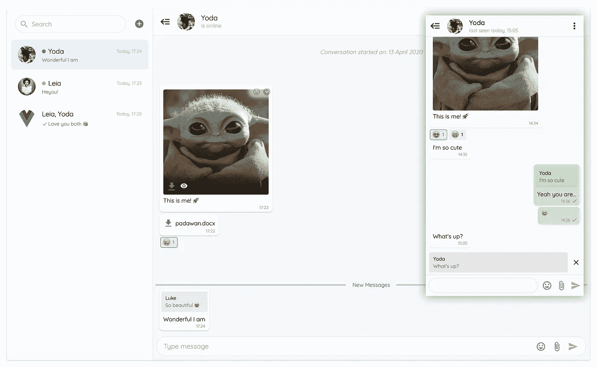
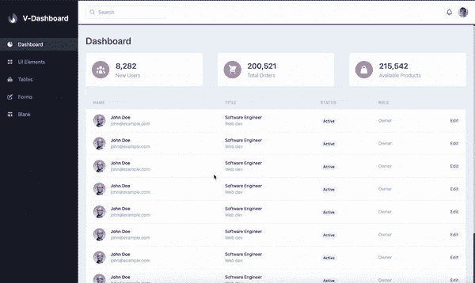
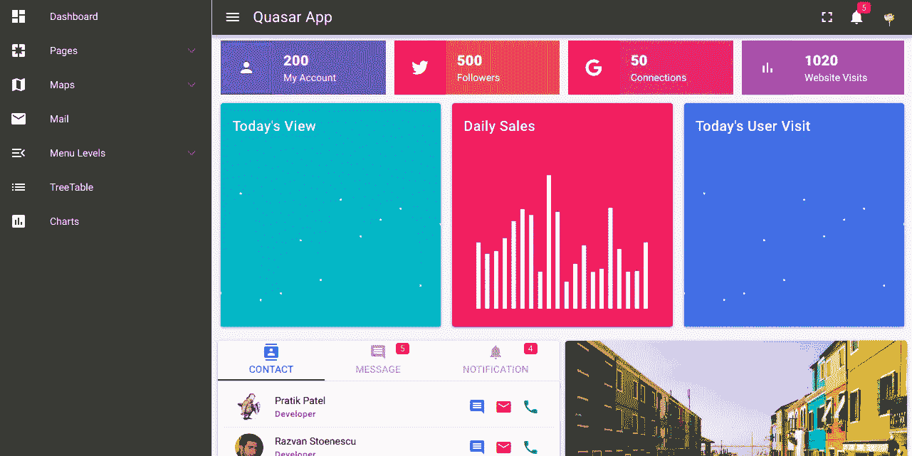
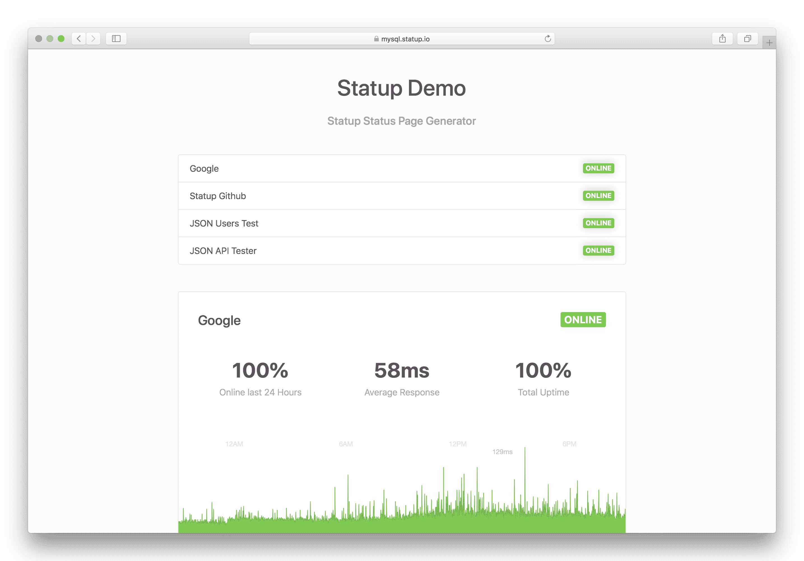

# 2021 年的 4 个趋势 Vue.js 项目

> 原文：<https://javascript.plainenglish.io/trending-vue-projects-in-2021-4da5cf5e03c9?source=collection_archive---------6----------------------->

## Vue.js 月份的趋势项目

[Source](https://auth0.com/blog/vuejs2-authentication-tutorial/)

以下是您应该关注的 2021 年热门 Vue 项目！

# 1.vue-advanced-chat

[vue-advanced-chat](https://github.com/antoine92190/vue-advanced-chat)

**储存库**:[https://github.com/antoine92190/vue-advanced-chat](https://github.com/antoine92190/vue-advanced-chat)

**星星** : 196

**vue-advanced-chat** 是由 GitHub 用户 aintoine92190 用 Vuetify 构建的聊天室组件。这个实时聊天消息组件是高度可定制的，支持图像、文件、表情符号，甚至语音消息。您可以编辑邮件、回复特定邮件，以及查看邮件是否已被查看、新建、传递或删除。还有一种明暗模式，这在今天的聊天平台中非常普遍。它支持电子邮件、脸书和谷歌认证，并支持浏览器通知等多种功能。

# 2.v-仪表板

[V-Dashboard](https://github.com/wobsoriano/v-dashboard)

**储存库**:[https://github.com/wobsoriano/v-dashboard](https://github.com/wobsoriano/v-dashboard)

**星** : 315

**V-Dashboard** 是由 Robert Soriano 开发的模板化仪表盘启动器。基于 Laravel 仪表板，V-Dashboard 是用 Vite、Vue 3、Tailwind CSS 和 TypeScript 构建的。它支持即时登录，并附带一个大的用户界面元素列表。如果您想使用 Vue 3 和 TypeScript，这是一个很好的仪表板，与许多其他管理仪表板不同。

# 3.类星体管理

[Quasar Admin](https://github.com/pratik227/quasar-admin)

**仓库**:[https://github.com/pratik227/quasar-admin](https://github.com/pratik227/quasar-admin)

**星星** : 209

由 Pratik Patel 创建的**类星体管理**是一个仪表板，如果你想使用类星体框架的话。与 V-Dashboard 类似，它带有一系列现成的登录界面元素，但也提供了许多“更大的”元素，如地图、图表、树表、日历、任务板等等。

# 4.Statping

[Statping](https://github.com/statping/statping)

**储存库**:[https://github.com/statping/statping](https://github.com/statping/statping)

**星** : 4.2k

对于专注于工具、监控和开发的程序员来说，Statping 是必不可少的。由 **Statping** 团队开发，Statping 是一个简单易用的网络应用程序，用于监控你的网站和应用程序。数据会自动刷新，而且界面简洁，很容易构建。它简单直观的控制面板使监控新服务和配置通知变得非常容易。你可以很容易地将它与 Slack、Twilio、email 等等集成在一起。甚至还有手机 app！

## 结论

如果你有什么很酷很有趣的项目，请联系！我很想看看它们。