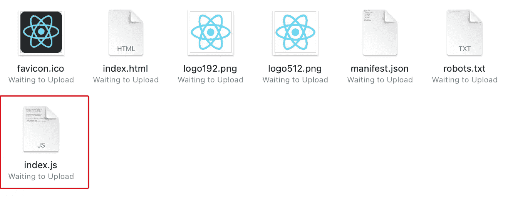
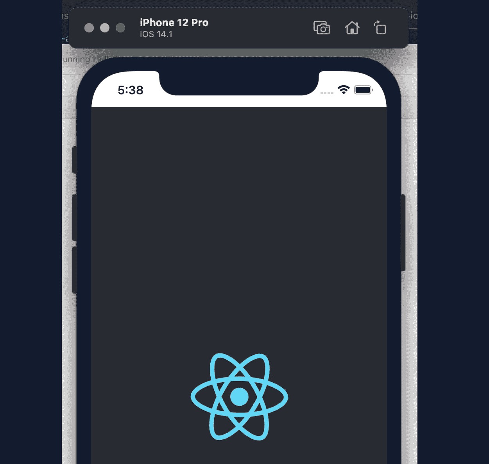

# 将 React 网站转变为本地手机应用

> 原文：<https://javascript.plainenglish.io/turning-your-react-websites-into-native-phone-apps-9cc7ccc4baf?source=collection_archive---------31----------------------->

Photo by [fauxels](https://www.pexels.com/@fauxels?utm_content=attributionCopyText&utm_medium=referral&utm_source=pexels) from [Pexels](https://www.pexels.com/photo/top-view-photo-of-person-holding-earphones-3183198/?utm_content=attributionCopyText&utm_medium=referral&utm_source=pexels)

构建 web 应用程序是整整一代开发人员成长的过程。然而，在 android 和 iOS 中构建手机应用程序通常需要 Swift 或 Kotlin 知识，这可能不是你编程的第一语言。

让你的所有代码在所有设备上工作，在同一个 repo 中，是那些首先建立 web 的人的梦想场景。幸运的是，我们可以用 Apache Cordova 实现这一点。在本文中，我们将了解如何将您的 React 项目转换成原生的 iOS 或 Android 应用程序。让我们开始吧。

***注*** :本教程基于`react-create-app`。如果你以前没有用过这个，你可以用下面的命令创建一个新的应用。这将创建一个标准的 React 文件结构:

# 第一步。科尔多瓦

Cordova 允许我们将 HTML、CSS 和 Javascript 网站变成原生的 iOS 应用程序。首先，让我们在命令行上安装它。`-g`在这里很重要，所以我们可以在命令行上使用 cordova:

接下来，我们需要创建一个 cordova 文件夹。打开 react 项目，在基本目录中运行以下命令:

这一行简单的代码在 React 文件夹结构中创建了一个名为“cordova”的新项目。你可以做`cordova create myApp`来创建一个 myApp 文件夹，但是我发现在已经存在的项目中将这个文件夹标记为 cordova 更容易。

# 第二步。更新您的 Package.json

在您的 React 根目录中，您将拥有一个`package.json`文件。我们需要添加一行，这就是`"homepage" : "./"`。这需要添加，以便我们将来构建的所有 cordova 文件都有正确的路径:

# 第三步。移动您的科尔多瓦脚本

接下来，进入 cordova 文件夹，找到在`./cordova/www/js/index.js`中生成的 index.js 文件。复制这个脚本并将其放在 React `./public`文件夹中，如下所示:

在`./public`中更新您的 index.html 文件，在您的`root` div 之后包含这个新文件:

# 第四步。更新 index.jsx

接下来，我们需要更新 React `./src`文件夹中的 index.jsx 文件，这样，如果 cordova 可用，它将识别 cordova。为此，请将其更新为如下所示:

如果你通过网络访问，上面的代码将运行一个普通的 react 应用程序，或者它将运行我们在 iOS 或 Android 上的 cordova `deviceready`事件。

如果您运行在 typescript 上，您需要将 cordova 对象添加到您的 window 对象中。您可以通过将以下内容添加到您的`index.tsx`文件的顶部，导入语句的下方来实现:

# 第五步。向 package.json 添加一个构建命令

接下来，向 package.json 添加一个构建命令。

*   为 web 使用创建一个普通的 React 构建
*   将构建复制到`./cordova/www`，这样它就可以在 iOS 和 Android 上使用了

更新你的`package.json`脚本，看起来像下面的代码。请注意我们是如何更新构建行的:

接下来，运行您的构建:

如果一切按计划进行，您将在您的`cordova/www`文件夹中有一个构建。现在我们已经完成了，移动到您的 cordova 文件夹，在命令行上显示 cd cordova:

我们现在可以用 cordova 命令行添加我们的设备。我将添加 iOS。您可以通过键入以下命令来完成此操作:

最后，我们需要构建我们的 iOS 应用程序。为此，请在 cordova 文件夹中运行以下命令:

***注意*** :你需要安装 XCode 来做这个位，所以要确保你已经安装了，并且之前至少打开过一次。在 Android 上，你可能会有一些类似的限制。

# 第六步:用 XCode 启动它

接下来，在 XCode 中打开你的`./cordova/platforms/ios`文件夹。当您这样做时，您可以模拟您的新设备，并且您应该有一个基于 React 代码的功能完整的 iOS 应用程序:

# 维护 [#](https://fjolt.com/article/react-apache-cordova-ios-android#maintenance)

为了在添加新特性时保持代码的最新版本，只需运行`npm run build`来构建 React 代码，这将在 cordova 中自动创建一个版本。

接下来用`cd cordova`进入 cordova 目录，用`cordova build ios`创建 XCode 的最新版本。您也可以创建自己的 cordova 构建脚本，或者将所有内容合并到`npm run build`中。

# 结论

我们已经介绍了 iOS，但是您可以使用`cordova platform add android`和`cordova build android`对 android 进行同样的操作。

做完这一切，就只剩下更新你的 app 图标和名称的问题了。我们希望您喜欢这篇文章——下面是一些您可能会觉得有用的链接:

*   [本教程的 Github 代码](https://github.com/smpnjn/react-cordova-native)
*   [创建 React App 网站](https://create-react-app.dev/)
*   [Apache Cordova Docs](https://cordova.apache.org/docs/en/10.x/guide/overview/index.html)

*更多内容尽在*[***plain English . io***](http://plainenglish.io)