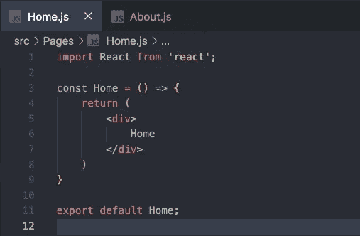
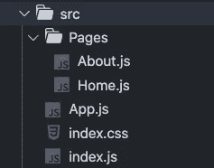
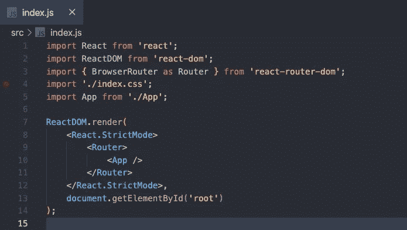
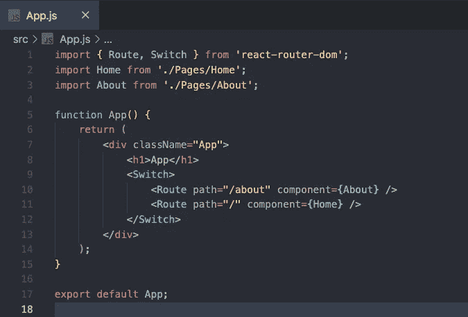
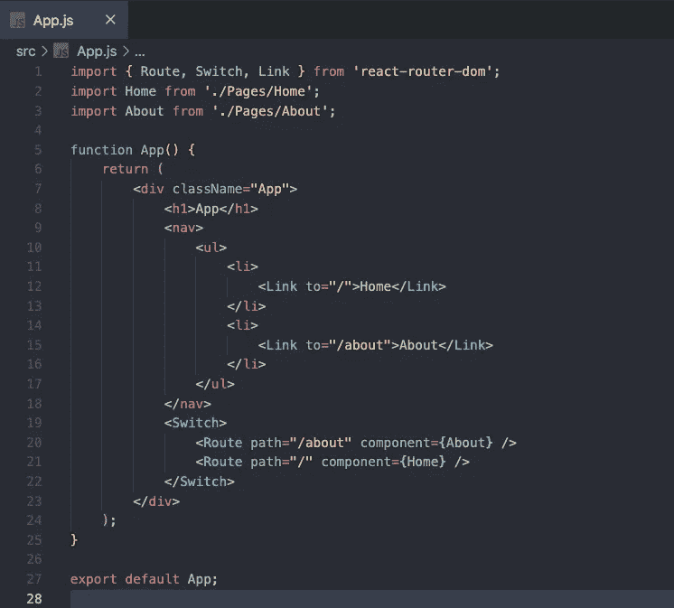
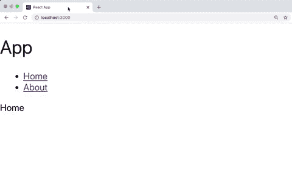

# React 路由器教程和初学者指南

> 原文：<https://javascript.plainenglish.io/tutorial-and-beginners-guide-to-react-router-ee19ca31d7d?source=collection_archive---------11----------------------->

## 如何在 React web 应用程序中使用客户端路由


Photo by [Denys Nevozhai](https://unsplash.com/@dnevozhai?utm_source=medium&utm_medium=referral) on [Unsplash](https://unsplash.com?utm_source=medium&utm_medium=referral)

React 路由器是 React 应用程序中客户端路由的标准。根据他们的[文件](https://reactrouter.com/web/guides/quick-start)，

> " React Router 是一个导航组件的集合，它们以声明的方式与您的应用程序组合在一起."

在本文中，我们将介绍 React 路由器的一些主要组件，并为一个基本的 web 应用程序设置路由。对于新手来说，希望这能帮助你在 app 中使用 React 路由器。对于有经验的用户，我希望这可以是一个很好的复习。

在下面的例子中，我们将使用从 create-react-app 创建的 React 应用程序。在您的应用程序中，您需要安装 react-router-dom 包。

```
npm install react-router-dom
```

在我们的 src 文件夹中，我们将创建一个 Pages 文件夹，其中有两个文件，Home.js 和 About.js。当我们转到相关的路线时，这些将是我们想要显示的组件。在我们的示例中，Home.js 和 About.js 文件将只显示基本文本，如下所示。



Home.js

在清理了一些不用的文件后，我们的 src 文件夹应该如下所示。



# 路由器

为了在您的应用程序中使用 React Router，您需要在元素层次结构中有一个路由器组件。通常，这是包装您的顶级应用程序组件。web 应用中有两个路由器可以选择，<browserrouter>和<hashrouter>。要了解更多的差异，请查看堆栈溢出上的这个[线程](https://stackoverflow.com/questions/51974369/hashrouter-vs-browserrouter)。在我们的例子中，我们将使用<浏览器>，因为这是我通常使用的浏览器。</hashrouter></browserrouter>

要设置这个，从 react-router-dom 导入<browserrouter>,并将您的应用程序组件包装在 index.js 文件中。对于许多示例，我已经看到了将浏览器路由器作为路由器的导入(如我的示例所示)，但这不是必需的。您的 index.js 文件如下所示。</browserrouter>



index.js

# 路线匹配器

我们将使用两个路由匹配器组件，<route>和<switch>。</switch></route>

<route>将接受一个 path 属性，它告诉我们要呈现的路线，以及一个 component 属性，它告诉我们应该在屏幕上显示什么组件。</route>

<switch>将包装我们的<route>组件，并且只允许它显示一条路线。换句话说，一旦匹配了第一条路由，其余的都会被忽略。正因为如此，路线越具体，我们在代码中的位置就应该越高。</route></switch>

```
<Switch>
  <Route path="/about" component={About} />
  <Route path="/" component={Home} />
</Switch>
```

在上面的例子中，我们将`/'路由作为交换机组件中的最后一条路由。这条路线永远是匹配的，这也是我们把它放在最后的原因。例如，如果`/'路线在`/about '路线之上，即使我们去了`/about '路线，它也会显示 Home 组件。这是因为它将首先匹配“/about”路线中的“/”。

对于我们的应用程序，我们将把 Home 和 About 组件导入到 App.js 文件中，并应用我们的开关和路由。



App.js

现在，如果我们转到`/'路线，我们应该看到主页，如果我们转到`/about '路线，我们应该看到 about 页面。

# 航行

为了改变路由，React 路由器有一个<link>组件。如果我们在导航条中使用这个，我们也可以使用<navlink>组件，它允许你在路线上设置一个活动类。在我们的例子中，我们将使用基本的<link>组件。</navlink>

<link>组件有一个 to 属性，它采用我们想去的路线。

```
<Link to="/">Home</Link>
```

上面的例子将显示一个主页链接，当我们点击它时，它将把我们带到`/`路线。

现在让我们完成我们的申请。仍然在 App.js 文件中，我们将添加一个简单的导航。让我们首先从 react-router-dom 导入 Link，并显示两个 Link 组件，一个指向 home 路由，一个指向 about 路由。



App.js

就是这样！现在，您应该已经有了一个带有客户端路由的基本应用程序。请注意，即使我们点击链接，页面也不会刷新。它只是显示一个不同的组件。



要了解更多关于 React 路由器的信息，请看下面他们的文档。你也可以在我的 GitHub 库[这里](https://github.com/chadmuro/medium-react-router)查看完整的源代码。

[](https://reactrouter.com/web/guides/quick-start) [## React 路由器:React 的声明式路由

### 学习一次，路由到任何地方

reactrouter.com](https://reactrouter.com/web/guides/quick-start) 

感谢阅读！如果您想了解如何在 Next.js 应用程序中处理路由，请查看下面的文章。

[](https://levelup.gitconnected.com/how-to-handle-routing-in-your-next-js-app-6ba71280b922) [## 如何在你的 Next.js 应用中处理路由

### 查看页面目录、动态路由、链接组件和用户外部挂钩

levelup.gitconnected.com](https://levelup.gitconnected.com/how-to-handle-routing-in-your-next-js-app-6ba71280b922)