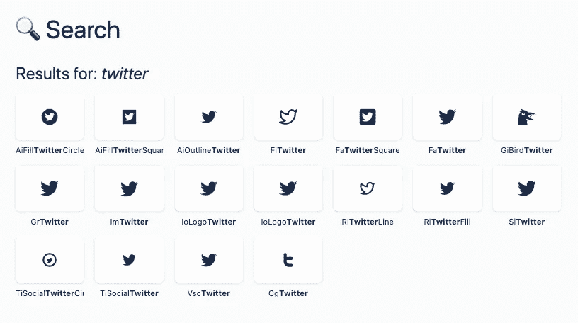
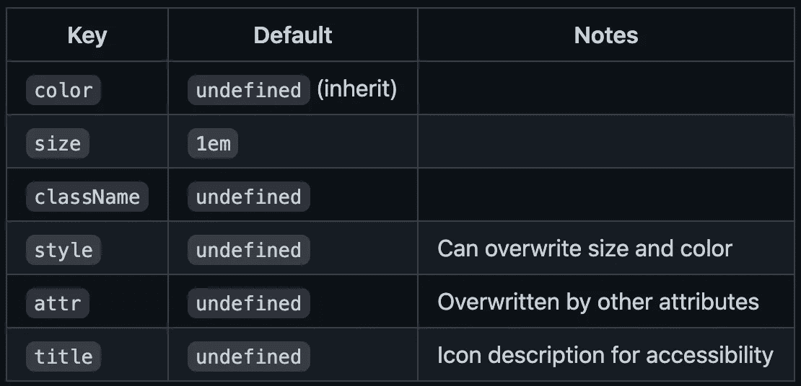

# 使用 React 图标的初学者指南

> 原文：<https://javascript.plainenglish.io/tutorial-and-beginners-guide-to-using-react-icons-77c614696301?source=collection_archive---------7----------------------->

## 在一个地方获得您需要的所有图标


Photo by [Harpal Singh](https://unsplash.com/@aquatium?utm_source=medium&utm_medium=referral) on [Unsplash](https://unsplash.com?utm_source=medium&utm_medium=referral)

大多数应用程序和网站都使用图标。向 React 应用程序添加图标的最佳工具之一是 React 图标库。

这个包把最流行的图标库放在了一起。在撰写本文时，您可以使用 21 个不同图标库中的图标。比较流行的有字体牛逼，材质设计，蚂蚁设计，羽毛等等。

要查看图标和不同库的完整列表，请查看下面的文档。

 [## 反应图标

### 使用 react-icons 可以轻松地在 React 项目中包含流行图标，React-icons 利用 ES6 导入允许您…

react-icons . githum . io](https://react-icons.github.io/react-icons) 

在本文中，我将向您展示如何安装这个库，以及如何在 React 应用程序中使用和设计图标。

# 装置

这一步很容易。一旦你有了一个基本的 react 应用程序，在你的项目中安装 react-icons 包。这将使您能够访问所有不同的图标。

[](https://www.npmjs.com/package/react-icons) [## 反应图标

### SVG 使用 ES6 导入对流行图标包的图标进行反应

www.npmjs.com](https://www.npmjs.com/package/react-icons) 

```
npm install react-icons
```

# 使用图标

首先，访问他们的文档[网站](https://react-icons.github.io/react-icons)，在那里你可以搜索你想使用的图标。

如果我搜索“Twitter”，会有 18 个不同的图标选项供我选择。



每个图标库都有自己的子文件夹。将图标导入应用程序时，请确保从正确的子文件夹导入。

例如，如果您想使用如上所示的 FaTwitter 图标，您的 import 语句将如下所示。

```
import { FaTwitter } from 'react-icons/fa';
```

若要显示图标，请将其作为组件返回。

```
<FaTwitter />
```

在我的例子中，我将使用来自字体库 Awesome 的 Twitter、Medium、GitHub 和 LinkedIn 的图标。导入并显示图标后，它看起来会像这样。目前，它们非常小而且无色。让我们给它们添加一些造型吧！


# 设计图标样式

有几种不同的方法来设计图标的样式。

要设计单个图标的样式，您可以简单地将 props 传递给图标本身。比如你想改变颜色，可以像下面这样通过一个叫颜色的道具。

```
<FaTwitter color="#00acee" />
<FaMedium color="000" />
<FaLinkedin color="#0e76a8" />
<FaGithub color="171515" />
```

如果你正在设计多个图标，有一个`IconContext`可以作为包装器。该包装提供程序中的任何图标都将应用样式。

要使用`IconContext`，首先从`react-icons`库中导入它。

```
import { IconContext } from 'react-icons';
```

然后，用`IconContext`提供者包装你想要的图标。传递带有要应用于图标的样式的值属性。



在我们的例子中，我们将使用`IconContext.Provider`包装图标，并将每个图标的大小设置为 5rem。

```
<IconContext.Provider value={{ size: "5rem" }}>
  <div className="App">
    <FaTwitter color="#00acee" />
    <FaMedium color="000" />
    <FaLinkedin color="#0e76a8" />
    <FaGithub color="171515" />
  </div>
</IconContext.Provider>
```

现在我们的图标更大了，而且有了一些颜色！


如果您喜欢在单独的 CSS 文件中进行样式化，另一种样式化图标的方法是向单个图标或提供者添加一个`className`。然后，您可以在单独的文件中添加样式。

感谢阅读！在 React 应用程序中添加和设计图标很简单。我希望这篇文章对你开始使用 React 图标库有用。

如果您有兴趣了解 React 路由器，请查看下面的文章。

[](https://medium.com/javascript-in-plain-english/tutorial-and-beginners-guide-to-react-router-ee19ca31d7d) [## React 路由器教程和初学者指南

### 如何在 React web 应用程序中使用客户端路由

medium.com](https://medium.com/javascript-in-plain-english/tutorial-and-beginners-guide-to-react-router-ee19ca31d7d)