# 用 JavaScript 制作一个简单的密码切换表单

> 原文：<https://javascript.plainenglish.io/tutorial-make-a-simple-vanilla-js-show-password-toggle-d4fc13d9293?source=collection_archive---------4----------------------->

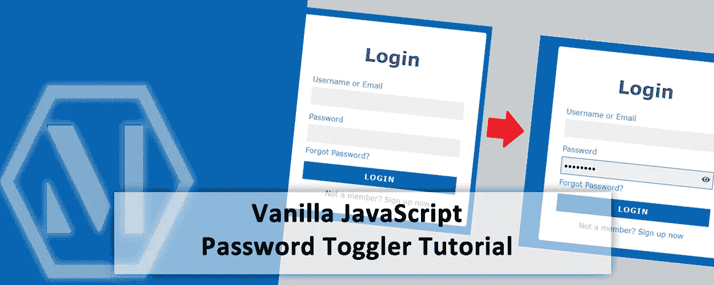

在前端开发中，有时当您创建一个登录或注册表单时，您想让用户选择显示他们的密码，以便他们可以确保他们输入的所有内容都是正确的，而不是隐藏在点或星号后面。对于普通的 JavaScript，这是一个非常容易实现的设计元素，它有助于增加用户界面传达的整体体验。

让我们看看如何使用普通的 JavaScript 和 HTML/CSS，在不使用任何库的情况下实现密码可见性。

## 首先，让我们来处理 HTML & CSS

在我们开始这个项目有趣的部分——JavaScript——之前，我们必须首先创建我们的 HTML 文档，并向其中添加我们需要的元素。如果你知道 HTML 和 CSS，这是非常简单的。你可以继续创建你自己的登录表单，并按照你想要的方式设计，或者——如果你喜欢复制我的登录表单——你可以[从我的 GitHub 账户](https://github.com/pjmcdermott92/javascript-password-toggler)下载。

准备好 HTML 后，表单应该是这样的:

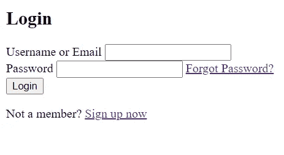

Unstyled, ugly Login Form

HTML 完成后，我们可以继续创建一个 style.css 文件，并将我们的 HTML 文档链接到它，然后我们可以设置表单的样式。下面是我的登录表单的 CSS 外观([从 GitHub 这里得到](https://github.com/pjmcdermott92/javascript-password-toggler)):

```
*, *::before, *::after { box-sizing: border-box; }body {
    margin: 0;
    padding: 0;
    display: flex;
    align-items: center;
    justify-content: center;
    min-height: 100vh;
    background-color: hsl(207, 100%, 40%);
    color: #666;
    font-family: Verdana, Geneva, Tahoma, sans-serif;
}.container {
    width: 100%;
    max-width: 400px;
    min-height: 30vh;
    padding: 1rem 2rem;
    background-color: #FFF;
    border-radius: .3rem;
}h2, p { text-align: center; }
h2 { font-size: 2.5rem; }a {
    color: hsl(207, 100%, 50%);
    text-decoration: none;
}a:hover { color: hsl(207, 100%, 30%); }.form-control {
    width: 100%;
    margin: 1rem 0;
    position: relative;
}.form-control > label { display: block; }.form-control > input {
    display: block;
    width: 100%;
    margin: .5rem 0;
    padding: .5rem .3rem;
    background-color: #EFEFEF;
    border: 2px solid transparent;
    outline: none;
    font-family: inherit;
    font-size: inherit;
}.form-control > input:focus { border-color: #999; }.form-control > input[type="submit"] {
    border: 2px solid transparent;
    background-color: hsl(207, 100%, 35%);
    color: #FFF;
    text-transform: uppercase;
    font-weight: bold;
    letter-spacing: .1rem;
    cursor: pointer;
}.form-control > input[type="submit"]:hover,
.form-control > input[type="submit"]:focus {
    background-color: hsl(207, 100%, 40%);
}.form-control > input[type="submit"]:focus {
    border-color: #999;
}
```

我的表单现在看起来像这样:

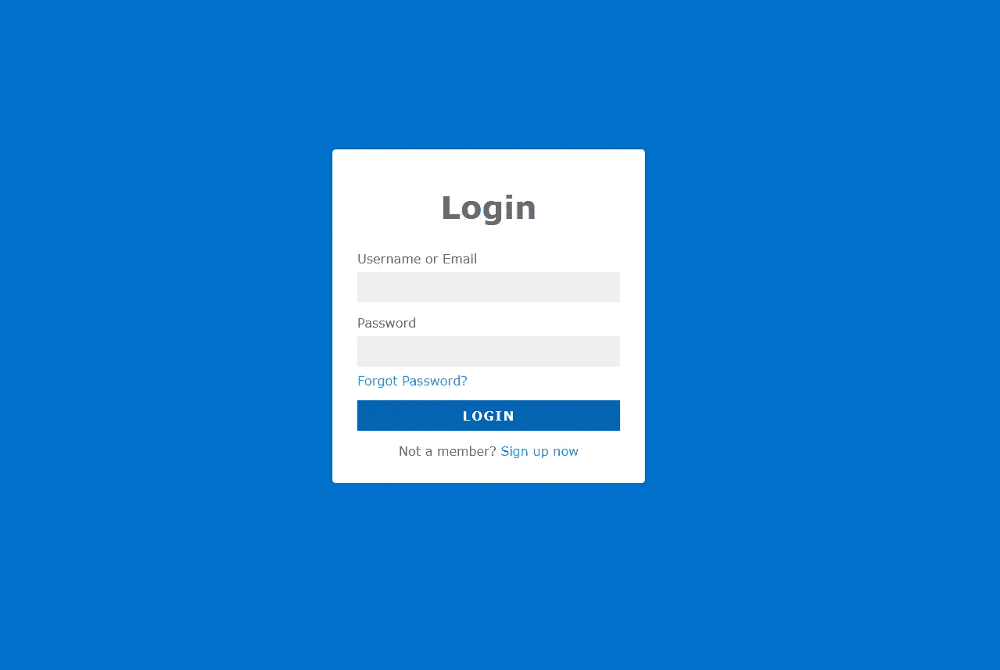

Much better! Now it looks good! (ish)

这是一个非常简单直接的登录表单，没有太多花哨的元素和样式，因为本教程的主要目的是演示如何添加登录表单的功能。

## **让我们添加切换图标**

您可以选择多种方式来允许用户切换其密码的可见性，包括用户可以选中或取消选中的标记为“显示密码”的复选框，以及可以单击来切换密码可见性的图标。出于这个项目的目的，我选择使用一个可以点击的图标来切换密码的可见性。

在本例中，我使用 FontAwesome 通过内容交付网络显示图标，因为这是一个相对简单的解决方案，不需要我在项目中托管图标文件。要获得 FontAwesome CDN，请前往[www.fontawesome.com/start](http://www.fontawesome.com/start)，免费登录或注册创建一个新的 webkit。

然后，简单地复制并粘贴你的 FontAwesome 工具包的 Code 

在我的例子中，我搜索了“眼睛”并选择了这些图标:

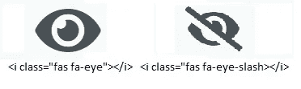

我需要两个不同的图标——一个只有眼睛，另一个有斜线——来指示密码可见性是打开还是关闭。你可以使用我选择的相同图标，或者你可以选择你自己的图标。由你来决定。

为了在右侧正确显示和定位我们的切换按钮，在我们的密码字段内，我们需要用一个带有类名的标记将它包装起来(在本例中，我使用了‘toggle-Password’)并放在我的密码字段 form-control div 内，如下所示:

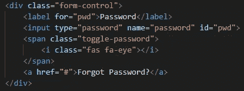

接下来，我们需要进入 CSS 并为切换按钮元素添加一个样式:

```
.toggle-password {
    position: absolute;
    top: 40%;
    right: .5rem;
    cursor: pointer;
    user-select: none;
}
```

通过使用 position: absolute 并设置切换按钮的顶部和右侧位置，我们能够将它放置在我们想要的位置，这样它看起来就像在密码字段内。但是，如果您让代码保持原样，您会注意到图标将从页面上消失。这是因为我们还需要将我们的表单控件元素设置为 position: relative，以便图标相对于它所在的表单控件来定位自己:

```
.form-control {
    width: 100%;
    margin: 1rem 0;
    position: relative;
}
```

你可能需要稍微调整一下图标的顶部和右侧位置，直到它看起来和你想要的一样。对我来说，我指定的值似乎把图标放在了我想要的地方。

## **暂时隐藏切换图标！**

既然图标已经准确地定位到我们想要的位置，我们现在可以继续隐藏它了。这是可选的，但我选择在密码字段为空时隐藏图标，只是因为我觉得这样看起来更好。你不用隐藏你的，但这是我选择做的。

为了隐藏图标，在我们的 CSS 中，我们需要获取“toggle-password”范围内的*元素。我们可以使用 CSS 子组合符符号>来选择直接嵌套在类名为“toggle-password”的元素中的*标记。我们需要做的就是将这个元素的 display 属性设置为 none:**

```
.toggle-password > i { display: none; }
```

## 娱乐时间到了！让我们继续看 JavaScript 吧！

我们现在已经完成了这个项目的 HTML 和 CSS 部分，并最终准备好使用 JavaScript 添加功能！首先，让我们在项目的根目录下创建一个新的 JavaScript 文件，并将其命名为 scripts.js。我们可以通过将

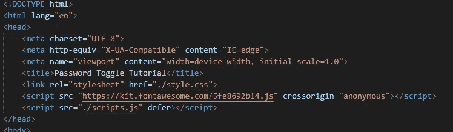

> **重要提示:**将 JavaScript 文件放入 HTML 文档的< head >部分时，包含 defer 属性是非常重要的。通过告诉浏览器推迟脚本标签的加载，浏览器将跳过 JavaScript 文件的加载，直到文档对象模型加载完毕。这是为了确保我们的 JavaScript 代码中引用的所有元素都将被加载到 DOM 中，以便可以找到它们。如果我们不推迟文档的加载，我们的 JavaScript 将无法工作，并且我们会在浏览器的控制台中发现一个错误，因为加载脚本文件时元素并不存在。

除了在脚本标记中包含 defer 属性之外，还有其他选择。第一种方法是简单地将

您还可以在带有 defer 属性的部分中包含

```
window.addEventListener('DOMContentLoaded', (event) => {
    // Your Code Here....
});
```

这是一种确保 DOM 中的所有内容都在脚本执行之前呈现的老方法，虽然它工作得很好，但它使代码看起来更混乱，因为您马上就有了嵌套逻辑。

出于这个项目的目的，我们将坚持使用 defer 属性，并在 head 部分保留

现在我们已经设置好了 JavaScript 文件，我们可以进行测试，以确保所有的东西都链接起来，并按照我们期望的那样运行。要测试脚本文件，请将以下代码行添加到 JavaScript 文件中，保存它，然后在浏览器中重新加载页面:

```
alert('THIS WILL POP UP IF EVERYTHING WORKS!!')
```

您应该会看到一个弹出的警告框，如下所示:

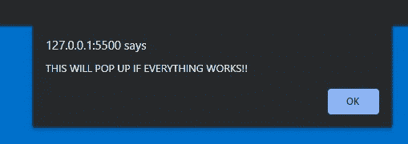

如果弹出警告框，一切正常，你就安全了！如果没有，返回并检查

一旦一切都正确连接起来，我们需要一种方法来选择我们想要在 JavaScript 中添加功能的元素。在我们的例子中，我们需要访问密码输入字段和密码切换图标。使用 JavaScript 方法选择 HTML 元素有几种方式，但是如果您已经阅读了我关于使用自定义数据属性选择 HTML 元素的文章，您将会意识到这是我选择 DOM 元素的首选方式，所以这是我们将使用的方法。

让我们为需要选择的每个元素添加一个自定义数据属性:

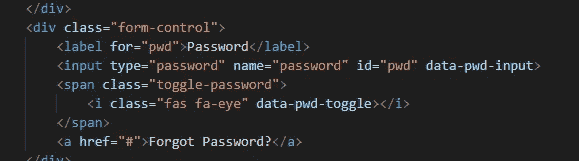

现在，在我们的 JavaScript 文件中，我们可以使用 *querySelector()* 方法从 DOM 中获取这些元素，并将它们存储在一个变量中，供我们的 JavaScript 使用:

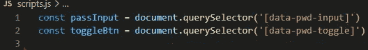

现在，让我们的项目做点什么吧！首先，让我们向密码输入字段添加一个事件侦听器，它“侦听”字段中的输入，并调用一个函数来显示我们的切换按钮:

```
passInput.addEventListener('input', showToggleButton)
```

接下来，我们可以继续创建 *showToggleButton()* 函数，并使用条件 if…else 语句告诉它要做什么:

```
function showToggleButton() {
   if (passInput.value.length > 0) toggleBtn.style.display = 'block'
   else toggleBtn.style.display = ''
}
```

该函数查看密码字段值的长度，如果确实有一个值(大于零个字符)，它将切换按钮图标的显示样式设置为“阻止”，这允许它显示在屏幕上。否则，它将删除显示样式属性，元素将默认回到*显示:无*。

让我们继续向密码输入字段添加一个事件监听器。当密码输入字段被聚焦时(或者当用户选择它来输入时)，这个事件监听器将被调用。此事件侦听器将检查密码是否可见，以及密码的长度是否小于 1。如果是，它将再次调用*togglepasswordsvisible()*函数并隐藏切换图标，因为密码字段为空:

```
passInput.addEventListener('input', showToggleButton)
passInput.addEventListener('focus', () => {
  if (showPassword && passInput.value.length < 1) {
     togglePasswordVisible()
  }
})
```

为了实现这一点，我们需要声明变量‘password visible ’,因为我们在函数中引用了它。我们可以把它放在文件的顶部(就在输入和切换按钮选择器变量的下面)，使它可以全局访问:

```
let showPassword = false
```

该变量使用 let 关键字而不是 const，以便可以重新分配该值。这将在显示和隐藏密码以及确定显示哪个图标方面发挥作用。我们还为变量定义了一个默认值‘false ’,因为我们不希望我们的密码可见，除非用户单击切换按钮来显示它。

**添加一个事件监听器到切换按钮**

接下来，我们需要向切换按钮添加一个事件侦听器，以便当用户单击它时，它将调用一个函数并执行一个操作。在我们的例子中，我们首先要调用一个名为*到*的函数，然后我们要关注密码输入字段:

```
toggleBtn.addEventListener('click', () => {
    togglePasswordVisible()
    passInput.focus()
})
```

让我们创建*toggle passwordpvisible()*函数，该函数将在显示用户键入的密码或隐藏密码与显示“点”之间切换:

```
function togglePasswordVisible() {
    showPassword = !showPassword
    if (showPassword) {
        toggleBtn.classList = 'fas fa-eye-slash'
        passInput.setAttribute('type', 'text')
    } else {
        toggleBtn.classList = 'fas fa-eye'
        passInput.setAttribute('type', 'password')
    }
}
```

这个函数非常简单，它所做的就是获取我们之前定义的 *showPassword* 变量的当前布尔值，并将其设置为当前值的反义词(如果为真，则设置为 false，反之亦然)。

然后，该函数查看 showPassword 的新值，并将图标的类属性设置为 f-eye-斜杠(表示隐藏密码)或 f-eye(表示显示密码)。它还将文本框的类型属性设置为文本(如果密码可见)或密码(如果密码隐藏)。

让我们保存我们的工作，测试我们的项目！首次加载页面时，密码字段应为空，图标应隐藏。一旦在密码输入中键入了一个值，图标应该不带斜线显示，密码应该用点隐藏:

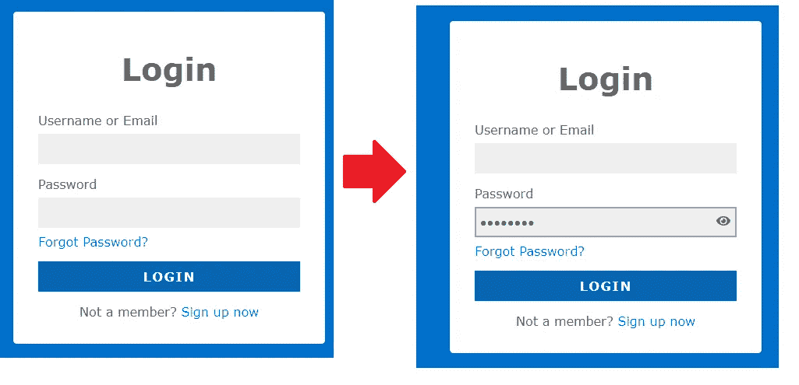

On first load, password field is blank and icon is hidden. Once user inputs a value, the icon is visibile.

如果点击了眼睛图标，它将变成一个带有斜线的图标，密码将显示为文本:

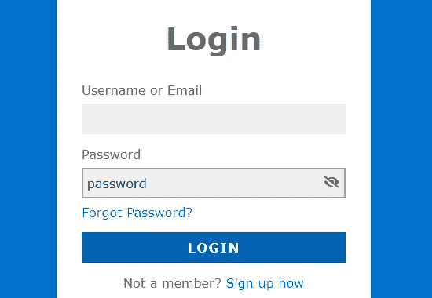

## 结论

你的托格勒管用吗？如果是这样，太棒了！希望你喜欢这个教程，并且能够在现实项目中使用这个概念！

如果你喜欢这个教程，我将创建更多类似的教程，在不久的将来，我将重新启动我的博客和文件夹网站，我计划在那里发布更多的教程。关于该网站发布的信息将很快发布！请随意订阅我的订阅源，以便您会收到此次发布的通知，并且您永远不会错过新文章的发布！

感谢您的阅读和快乐编码！