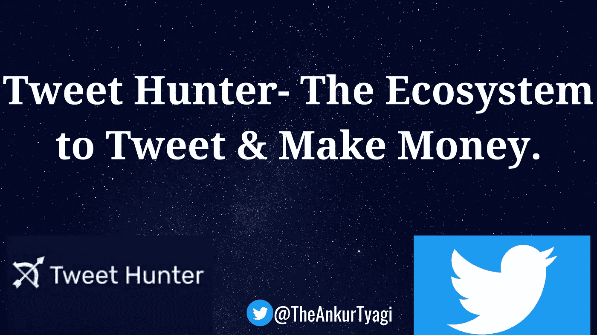
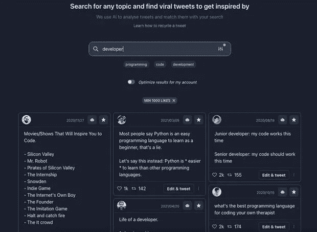
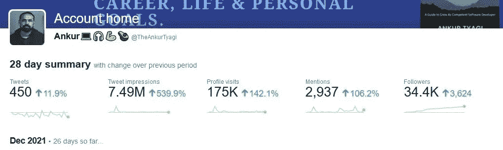
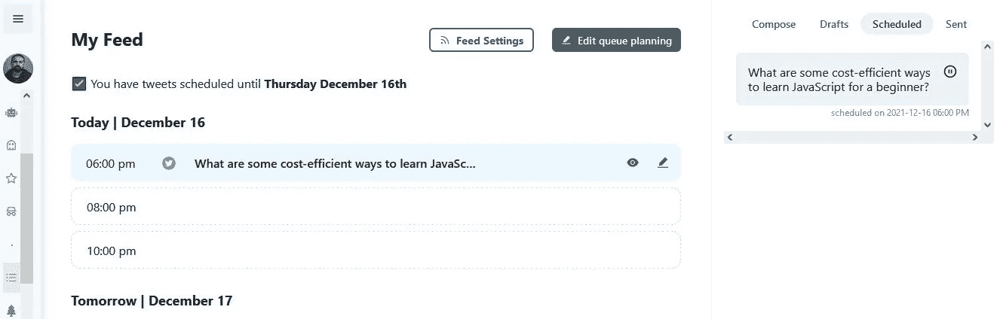
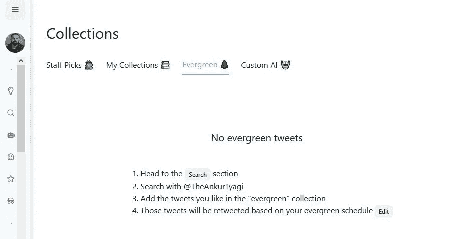
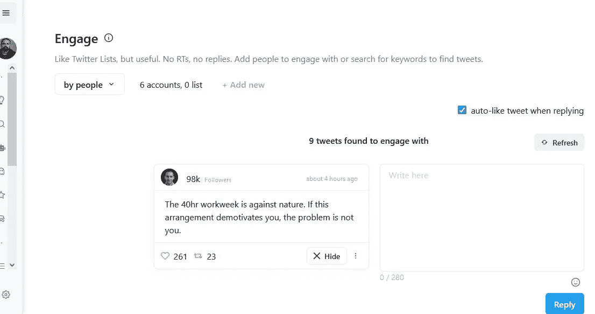
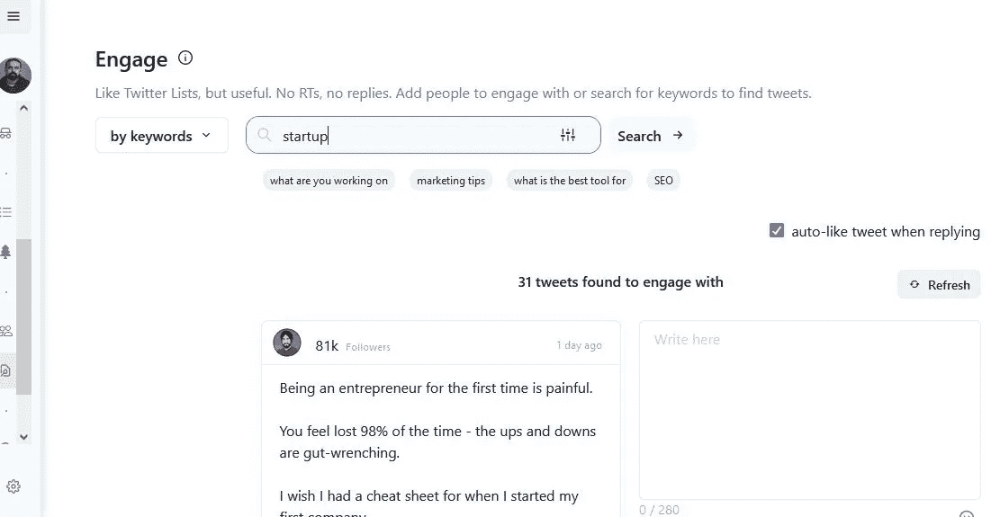
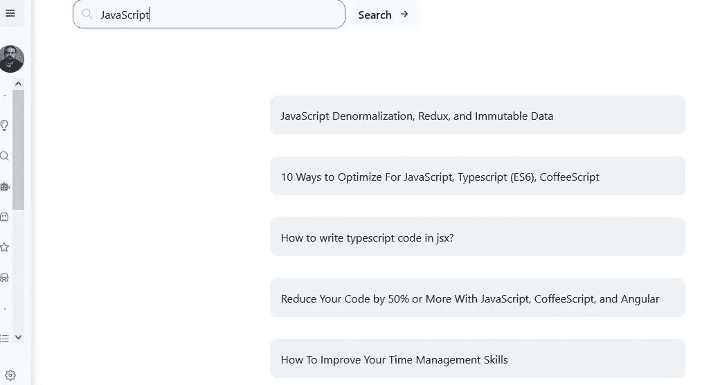
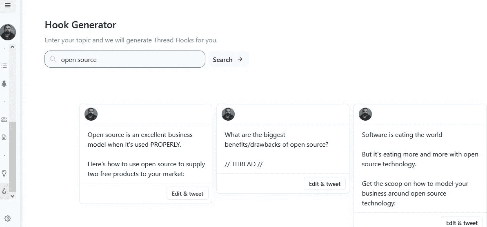

# 推特猎手:推特和赚钱的生态系统。

> 原文：<https://javascript.plainenglish.io/tweet-hunter-the-ecosystem-to-tweet-make-money-5f3bf9c994f6?source=collection_archive---------12----------------------->

Tweet Hunter- The Ecosystem to Tweet & Make Money.

本周，我有机会探索 Tweet Hunter——一个“百万 Tweet 库”。我发现 99%的人试图用错误的方式从 Twitter 上赚钱。

# 这花了他们很多钱？

一台合适的 Twitter 赚钱机器需要两样东西:流量和报价。

流量，以确保人们看到和提供，以确保人们购买。就这么简单。

意思是推特猎人不只是给你眼睛和钱。如果你在一周内没有得到更多，它还会给你一个完全免费的选择。

# 什么是 Tweet Hunter？

> ***你的个人虚拟推特助手。***

更简单地说，有了“推特猎手”,任何人都很容易培养高质量的推特用户。

此外，Tweet Hunter 可以让你建立一个 Twitter 受众群，让你分别获得用户、订户、客户和长期关系。

# 以下是我感兴趣的所有原因:

*   我可以查找任何话题并获得新的想法。

*   它帮助我从在我的领域中被其他人利用的格式中获得灵感。

*   它帮助我每天创建更一致的内容。

*   它帮助我用正确的方式发布正确的内容&节省了我很多时间。

# 让我们看看 Tweet Hunter 能为您生成推文做些什么:

1.  为你发推特灵感(AI 引擎根据你的推特账号为你选择这些。)
2.  搜索任何话题，找到能激发灵感的热门推文。
3.  人工智能为你生成的推文。
4.  您的推文变体
5.  你所有的收藏
6.  工作人员为您收集的精彩推文。

# 推特给你的灵感:

他们的人工智能引擎根据你的 Twitter 账户为你生成最好的推文。
把你的简历&旧提要考虑进去。

# 搜索任何话题&找到能激发灵感的热门推文。

搜索任何主题&查看大客户的旧病毒推文以获取灵感:

*   启动
*   营销
*   Java Script 语言
*   搜索引擎优化
*   开放源码
*   Web 3.0

# 让我们看看如何在使用 Tweet Hunter 时计划您的订阅源:

# 馈送选项卡:

# 常青树标签:

evergreen tweet 选项卡允许您选择一些最佳推文，这些推文将根据您的 evergreen 计划自动转发。

# 让我们看看如何在 Tweet Hunter Dashboard 中与人交流:

> ***这是我个人最喜欢的关于神奇推特猎人的功能。***

# 创建您的人员列表并参与(按人员):

你可以列一个你最喜欢的 Twitter 账户的列表，并且可以在这个 web 应用中参与进来。

> ***无 RTs，无回复。添加联系人或搜索关键词来查找推文。***

回复时，您会得到一个自动喜欢的复选框。

# 按关键词搜索推文并参与(按关键词):

# 让我们看看 Tweet Hunter 如何帮助您创建史诗线程:

# 线程创意生成器

> ***搜索一个话题，它会为你产生思路。***

# 线钩生成器

> ***搜索一个话题，它会为你生成线程钩子。***

> ***卡在一个点子上发什么微博？推特亨特掩护你。***

# 让我们来看看如何获得帮助来增加您的 Twitter 帐户&充分利用可用资源:

*   [订婚](https://www.notion.so/Engagement-51f7cda5f8224175abef24a404dfcaa1)
*   [追随者](https://www.notion.so/Followers-962bb188c50c4dfe9a7566f83b99d584)
*   [销售](https://www.notion.so/Sales-cf64c14f60a348ca9eff1fbc08dbcb49)
*   [电子邮件订阅](https://www.notion.so/Email-Subs-31558a46904a4946a83e62dc6c5a7fa3)
*   [电报通道](https://www.notion.so/Telegram-Channel-082e3260086b454fbc84f6b4c188918f)

# 只是更容易。

如果你想赚更多的钱，给你的页面带来更多的流量…
…或者什么都不付，点击[这里](http://tweethunter.io/?via=ankur)

**这篇博客到此为止。**

我希望你今天学到了新东西。

如果你有，请点赞/分享，这样其他人也能看到。

***跟我连上*** [***推特***](https://twitter.com/TheAnkurTyagi)

如果你喜欢这个。

我鼓励大家注册订阅我的时事通讯。

免费的。你可以通过电子邮件问我你的问题。

点击这里查看旧版本:[Ankur 撰写的 2–1–1 开发者成长简讯](https://www.getrevue.co/profile/AnkurTyagi)

*最初发表于*[*https://theankurtyagi.com*](https://theankurtyagi.com/tweet-hunter-the-ecosystem-to-tweet-make-money/)T43。

*更多内容请看*[*plain English . io*](http://plainenglish.io/)*。报名参加我们的* [*免费周报*](http://newsletter.plainenglish.io/) *。在我们的* [*社区*](https://discord.gg/GtDtUAvyhW) *获得独家写作机会和建议。*