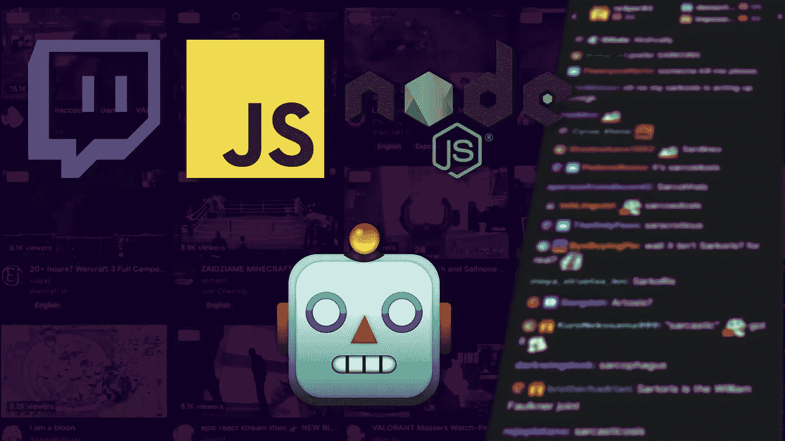
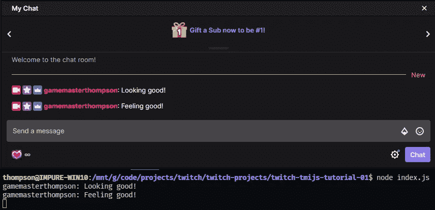
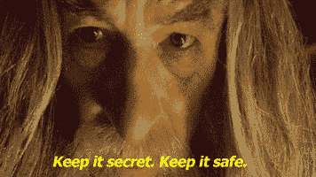
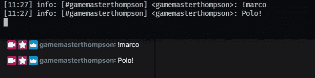
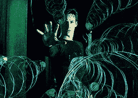

# Twitch 定制级别 OMEGA:用 Node.js 和 tmi.js 编写自己的 Twitch 机器人—第 1 部分

> 原文：<https://javascript.plainenglish.io/twitch-customization-level-omega-part-1-writing-your-own-twitch-bot-with-node-js-and-tmi-js-f5e724737829?source=collection_archive---------5----------------------->

## 推趣

## 用 Node.js 和 tmi.js 写自己的 Twitch Bot



在本文中，我将向您展示如何在 Node.js 服务器上使用 tmi.js 编写一个能够回答“Polo！”每当有人在您的聊天室键入“！马可。”

## **系列介绍**

本文是关于如何利用 JavaScript 定制 Twitch 流的系列文章的一部分。

我的流有很多移动的部分，我一直在添加。

*   我使用 Rails 后端来处理外部 API 请求
*   我用 Socket 运行一个本地 websockets 服务器。IO 处理来自用户和游戏事件的一系列请求——最常见的是调用我的一个流动画。
*   我维护观众的特定流虚拟货币(金币…因为我是一个巨大的 D&D 书呆子)，观众可以用它来参与抽奖。与此相关的一切都存储在 Rails 后端。
*   用户可以花频道点数——他们通过观看 Twitch 流积累的虚拟货币——来播放我制作的动画。
*   用户可以花虚拟货币(金币……因为我是一个超级 D&D 书呆子)参加用我写的代码进行的竞赛。

如果不是互联网上各种各样的编码者提供了有用的文章，我永远也不可能完全按照自己的设计来构建这样一个复杂的系统。也就是说，我的希望是其他编码者/飘带能够复制我的工作，从而提高所有飘带的标准。

## 或者你可以…

正如我上面所说的，在这篇文章中，我将向您展示如何构建一个聊天机器人，它会说“Polo！”每当用户在聊天中键入“！马可。”

如果这种基本的聊天呼叫和回复是你唯一想要的，你可能会直接跳到这些已经可用的优秀、精致的聊天机器人工具来节省时间。

*   [夜行机器人](https://nightbot.tv/)
*   [StreamElements](https://streamelements.com/)
*   [流线实验室](https://streamlabs.com/)

这些受欢迎的服务都提供了聊天机器人，这比我在本文中讨论的任何东西都要容易得多。他们还提供各种其他服务，可能足以满足您的流的需求。

也就是说，如果你正在寻找一种方式来为你的流添加酷的交互式定制，并且你已经遇到了这三种常见服务所提供的限制，那么你几乎肯定要与流经你的 Twitch 聊天室的数据进行交互，这意味着舒适和熟悉 tmi.js 是一个重要的起点。

## 只是 tmi.js

本着充分披露的精神，我不是在这里重新发明轮子。接下来的大部分内容直接来自于 tmi.js 主页上的例子和文档。

## 步骤 0 —依赖关系

我写这篇文章时假设你会使用某种版本控制，比如 Git。如果你不是，你这个不怕死的代码，你可以安全地忽略任何对存储库或`.gitignore` 文件的引用。

导航到您希望 bot 驻留的目录，并在您的终端中运行以下命令:

```
npm init --yes
```

第一部分是您通常如何创建一个节点项目，而`— yes`跳过了关于您的项目的作者详细信息，您可以在以后填充这些信息。

这将创建一个`package.json`文件，该文件出现在目录中表明您可能在 Node.js 项目中。

既然我们已经启动了我们的项目，我们必须安装 tmi.js 库。这个库只是一个与 Twitch IRC 交互的编程方式，Twitch IRC 是支撑 Twitch 聊天的技术。

```
npm install tmi.js@1.5.0
```

这将把 tmi.js 依赖项放在您的 package.json 文件中，我们已经准备好让我们的机器人投入使用了！

## 步骤 1 —听 Twitch 聊天

我们不需要任何类型的授权来建立到 Twitch 聊天室的只读连接，所以我们将从让 tmi.js 监控聊天并报告所有传入消息开始。

首先，在您的项目文件夹中，创建一个名为`index.js`的文件，并添加以下代码。将`channel_name`替换为您要监控的频道:

```
// require the library
const tmi = require('tmi.js'); // establish a tmi.js client as a listener
const client = new tmi.Client({// these are the basic options
  connection: {
    secure: true,
    reconnect: true
  },// the channel we're connecting to
  channels: [ 'channel_name' ]
});

client.connect();// the actual reporting eventclient.on('message', (channel, tags, message, self) => {
  console.log(`${tags['display-name']}: ${message}`);
});
```

现在，在您的终端中运行 node index.js。

如果您做的一切都正确，您将会在 Twitch 聊天中看到聊天消息回显到您的终端，直到您关闭这个 node.js 服务器。



It’s alive!

## 步骤 2 —获取 Oauth 令牌并将其设置为环境变量

虽然我们可以在没有任何授权或认证的情况下读取消息，但是为了让我们的 bot 发送消息，我们需要一个可以授权我们的 bot 的令牌。

我们希望 Oauth 令牌是私有的，所以我们将它存储在一个单独的文件中，这个文件不会包含在我们的提交中。有许多方法可以处理环境变量。我们将使用 [dotenv](https://github.com/motdotla/dotenv) 包库，但是如果这是您第一次使用环境变量，理解这个主题的范围是很重要的。

首先，如果您没有一个`.gitignore`文件，那么在您的项目目录的根目录下创建一个。这个文件告诉 Git 在提交和推送文件时可以跳过哪些内容。

附加

```
.env
```

到这个文件的底部。

(如果你不习惯使用 Node.js 的`.gitignore` 文件，那么[值得看看 Github 的样板](https://github.com/github/gitignore/blob/master/Node.gitignore) `[.gitignore](https://github.com/github/gitignore/blob/master/Node.gitignore)` [模板。](https://github.com/github/gitignore/blob/master/Node.gitignore))

接下来，在项目目录的根目录下创建一个`.env` 文件。这是我们放置 Oauth 令牌的地方。

现在去[https://twitchapps.com/tmi/](https://twitchapps.com/tmi/)用你的 Twitch 账户登录，这样你就可以得到一个 Oauth 令牌用于 tmi.js



将下面一行添加到您的`.env` 文件中:

```
TWITCH_OAUTH_TOKEN='oauth:YOUR_TOKEN_HERE'
```

现在，大部分都已经就绪，但是 Node.js 没有办法处理一个`.env` 文件。让我们解决这个问题。在终端中，从项目的根目录键入

```
npm install dotenv
```

安装 dotenv 库。

接下来，将下面一行添加到您的`index.js`文件的顶部:

```
require(‘dotenv’).config({path: __dirname + ‘/.env’})
```

这会将 dotenv 库配置为使用根目录中的`.env` 文件。

对于我的副本/粘贴者，我们的 index.js 文件应该是这样的:

```
const tmi = require('tmi.js');
require('dotenv').config({path: __dirname + '/.env'})const client = new tmi.Client({
 connection: {
  secure: true,
  reconnect: true},
 channels: [ 'channel_name' ]
});client.connect();client.on('message', (channel, tags, message, self) => {
console.log(`${tags['display-name']}: ${message}`);
});
```

有了这个配置，我们的机器人就可以与我们的 Twitch 频道的聊天进行交互了！

## 第三步——让你的机器人响应聊天

为了让我们的机器人与聊天交互，我们需要给它我们的授权凭证。让我们像这样改变我们的`client` 变量:

```
const client = new tmi.Client({
  options: { debug: true },
  connection: {
    secure: true,
    reconnect: true
  },
  identity: {
    username: 'your_username',
    password: process.env.TWITCH_OAUTH_TOKEN
  },
  channels: ['channel_name']
});
```

现在我们可以改变我们的`client.on(‘message’)` 块:

```
client.on('message', (channel, tags, message, self) => {
  // This will tell the bot to ignore echoed messages.
  if(self) return;

  if(message.toLowerCase() === '!marco') {
    client.say(channel, `Polo!`);
  }
});
```

应该可以了。

让我们启动服务器并检查我们的工作。



Beautiful.

我们现在有一个聊天机器人可以在 Twitch 聊天中播放马可波罗。



Basically us now.

对于我的副本/粘贴者，下面是我们的`index.js`文件的样子:

```
const tmi = require('tmi.js');
require('dotenv').config({path: __dirname + '/.env'})const client = new tmi.Client({
  options: { debug: true },
  connection: {
    secure: true,
    reconnect: true
  },
  identity: {
    username: 'your_username',
    password: process.env.TWITCH_OAUTH_TOKEN
  },
  channels: ['channel_name']
});client.connect();client.on('message', (channel, tags, message, self) => {
 // This will tell the bot to ignore echoed messages.
 if(self) return; if(message.toLowerCase() === '!marco') {
  client.say(channel, `Polo!`);
 }
});
```

# 然后

在下一篇文章中，我们将结合我们对 tmi.js 的新理解和外部 API，向您展示如何使用 Riot Developer API 来返回您的游戏内排名。

*   [Twitch 定制等级 OMEGA，第 2 部分——让你的聊天机器人从 Riot 的 API 报告你的英雄联盟等级](https://medium.com/@thompsonplyler/twitch-customization-level-omega-part-2-d91697bce4c2)

*更多内容请看*[***plain English . io***](http://plainenglish.io/)