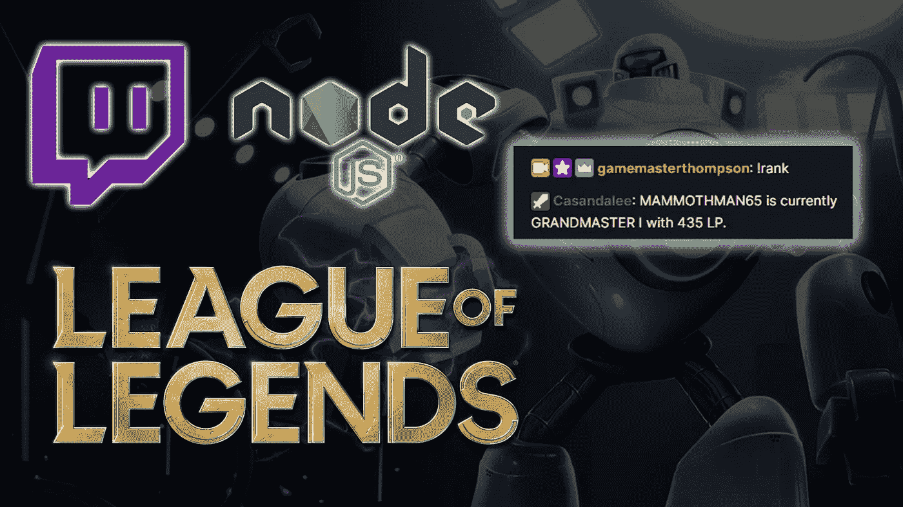
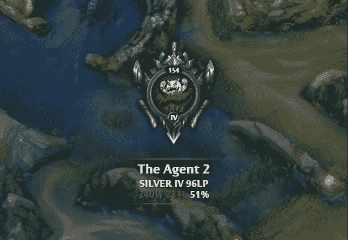
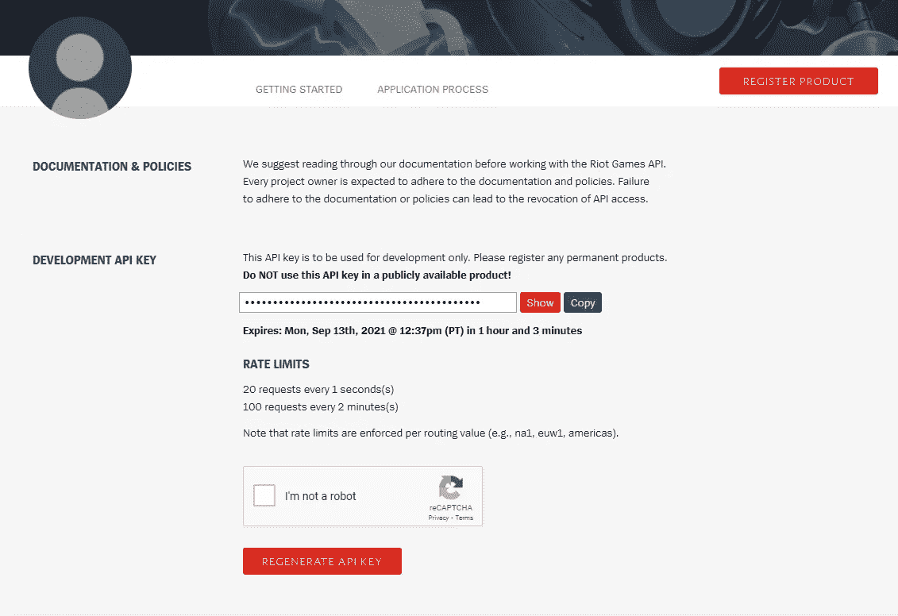
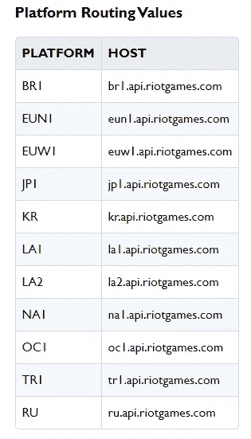
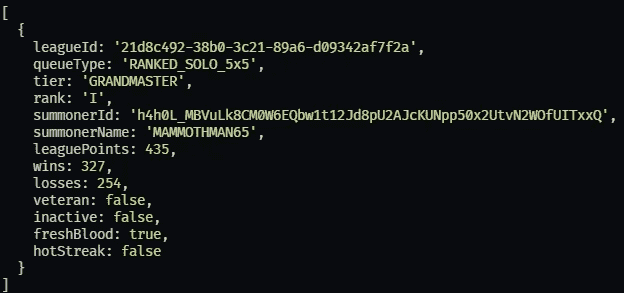
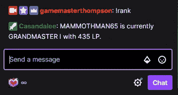

# Twitch 定制等级 OMEGA:让你的聊天机器人报告你的英雄联盟等级——第二部分

> 原文：<https://javascript.plainenglish.io/twitch-customization-level-omega-part-2-d91697bce4c2?source=collection_archive---------5----------------------->

## 推趣

## 让你的聊天机器人报告你的英雄联盟排名从 Riot 的 API 一个现有的 tmi.js | Node.js 聊天机器人



在这篇文章中，我将向你展示如何让一个 [tmi.js](https://tmijs.com/) 机器人(比如我们在上一篇文章中构建的那个)向你的 Twitch 聊天报告你的英雄联盟等级、等级和 LP。

为此，我们将使用异步函数来查询 [Riot 的(免费)开发者 API](https://developer.riotgames.com/) 以获取您的排名信息。

接下来，我们将设置我们的 tmi.js 机器人，用`!rank` 命令将这些查询的结果发送到我们的 Twitch 聊天。

## `Part 2 of x`

这是 Twitch 定制系列的一部分。

在本系列中，我假设您已经阅读了早期的文章。

但是，如果您有一个运行在 Node.js 服务器上的现有 tmi.js 聊天机器人，我们在这里写的应该很容易适合您现有的代码。

*   [Twitch 定制级别 OMEGA —第 1 部分:用 Node.js 和 tmi.js 编写自己的 Twitch 机器人](https://medium.com/@thompsonplyler/twitch-customization-level-omega-part-1-writing-your-own-twitch-bot-with-node-js-and-tmi-js-f5e724737829)

## 或者你可以…

本文的重点是提供一种有趣的方法来处理需要密钥的外部 API 请求，并将该请求的结果打包到 Twitch 聊天室中。

虽然我们为此使用了 Riot 的开发者 API，但如果你想要的只是一个自动工具来显示你的英雄联盟排名，我建议你使用这些预打包的解决方案之一:

1.)可以使用 [Nightbot](https://nightbot.tv/) 上的内置宏。我不会详细说明如何做到这一点，但是简单地说，要获得你的英雄联盟等级，可以使用消息`$(leagueoflegends your_summoner_name your_region).`定制一个 [Nightbot](https://nightbot.tv/) 命令:不需要 Node.js

2.)还有一个非常酷的小工具，你可以添加到 OBS 或 OBS Studio，名为 [Lobo Bot](https://lobobot.com/) ，它可以让你在流视频上显示实时更新的动态图形。



Lobo Bot

3.)最后，有一个非常有用的聊天机器人叫做 [LoLRankBot](https://lolrankbot.com/) ，我从来没有用过，但它似乎以一种基本上是交钥匙的方式提供了我们将要到达这里的所有信息。如果你使用了 LoLRankBot 并且讨厌它，请告诉我，我会把它从这个列表中删除！

我们都是为了更聪明地工作，而不是更努力地工作，所以如果你只是想在你的流或聊天中显示你的英雄联盟排名，我希望上述服务能满足你的需求。

所以我们结束了，对吗？


当然不是！

如果你想解开 Riot 给我们的所有酷数据，比如在 [op.gg](http://op.gg) 、 [u.gg](http://u.gg) 和 [Mobalytics](https://mobalytics.gg/) 的难以置信的分析工具，这是最好的开始。

## 不是我，是你

在第一篇文章中，我提到我使用了一个 [Ruby on Rails](https://guides.rubyonrails.org/) 后端来处理对 Riot 的 API 的请求。这源于我最初开始处理 Riot 的 API 以将游戏信息写入 ReactJS 前端的事实。这意味着我需要通过后端屏蔽对 riot API 的请求，老实说，我使用了 Rails 后端，因为我喜欢使用 Rails，我是❤️·鲁比，我可以非常快速地编写 Rails API。

尽管本系列的既定目标是提供关于我如何制作高度模块化的 Twitch 频道的信息，但说实话:整个 Rails 后端对于这个项目来说是多余的。

我将在本系列的后面回到 Rails，但是现在，由于本教程假设您已经为我们的 tmi.js 聊天机器人运行了 Node.js 服务器，这意味着我们可以使用现有的聊天机器人来请求和提供我们从 Riot 的 API 请求的信息。

## 步骤 0 —依赖关系

如果您是从本系列的第一篇文章开始的，我们要添加到项目中的唯一库是`node-fetch`，让我们在 Node.js 项目中使用 [Fetch API](https://developer.mozilla.org/en-US/docs/Web/API/Fetch_API) 。

`npm install node-fetch --save`

## 步骤 1 —获取您的 Riot 开发人员 API 密钥

从 Riot 获取密钥的过程非常简单。用电子邮件地址注册。

在你注册并登录后，你将能够通过点击开发者主页上的[https://developer.riotgames.com](https://developer.riotgames.com)按钮获得你的开发 API 密匙。



Riot 为第三方开发者提供了很多工具，其中大部分在[他们的文档](https://developer.riotgames.com/docs/portal)中有很好的解释。在这里，您可以探索如何访问客户端 API，它处理英雄联盟客户端前端，或者您可以学习如何使用游戏内 API，它为正在进行的游戏提供实时客户端数据。你还可以访问 Riot 的其他游戏的不同 API，如《T4》、《神秘传说》和《Valorant》。探索不同的选择可能会激发你的创造力，所以一定要四处看看！

需要注意的一点是 **Riot 起初只为想要访问其 API 的人提供开发者密钥。**这些开发者密钥必须每 24 小时手动更新一次。您可以为您项目申请一个永久的生产密钥(它也有一个更高的请求率的阈值)，但是要做好长期等待的准备，而且不是每个项目都可以申请生产密钥。

我们需要两样东西来从 Riot API 端点获取我们的排名。

1.  您的 API 密钥，我们将把它放在。我们根目录下的 env 文件。
2.  我们想要的端点来报告我们的等级。

所有 Riot API 端点都遵循相同的命名系统。端点 URL 的第一部分对应于我们正在查询的帐户所在的地区:



regional prefixes for LoL API endpoints

接下来是 URI 的其他地方，以获取我们需要的信息。

(顺便说一下，该表来自文档。)

由于英雄联盟在世界各地都有服务器，您可以构建一个应用程序，让您的用户查询不同的地区，但对于我们的简单应用程序，我们将查询北美地区的用户。

此外，要请求关于召唤师等级的信息，我们不能只给 Riot API 我们的召唤师名称。相反，我们必须首先找到与他们的帐户相关联的唯一召唤师 ID，并使用*来查询所述召唤师的等级。*

因此，我们需要从英雄联盟开发者 API 返回我们的等级的两个端点是:

`[https://na1.api.riotgames.com](https://na1.api.riotgames.com)[/lol/summoner/v4/summoners/by-name/{summonerName}](https://developer.riotgames.com/apis#summoner-v4/GET_getBySummonerName)`

这将返回我们需要的召唤师 ID，并且

`[https://na1.api.riotgames.com](https://na1.api.riotgames.com)[/lol/league/v4/entries/by-summoner/{encryptedSummonerId}](https://developer.riotgames.com/apis#league-v4/GET_getLeagueEntriesForSummoner)`

这将返回我们需要的关于那个召唤师的信息。

## 步骤 2—在聊天机器人中检索 API 信息

我们在 index.js 文件中编写的 tmi.js bot 的当前代码如下所示:

```
const tmi = require('tmi.js');
require('dotenv').config({path: __dirname + '/.env'})const client = new tmi.Client({
  connection: {
    secure: true,
    reconnect: true
  },
  identity: {
    username: 'literally_anything_without_a_space',
    password: `${process.env.PUBSUBPASSWORD}`
},
  channels: [ 'your_channel_name' ]
});client.connect();client.on('message', (channel, tags, message, self) => {
  if(self) return;if(message.toLowerCase() === '!marco') {
    client.say(channel, `Polo!`);
  }
}
```

为了将 bot 连接到 Riot API，我们将把我们的节点获取库添加到 bot，然后我们将把我们的 Riot API 密钥复制到我们的。环境文件。

所以我们的`index.js`的顶部现在看起来像这样:

```
const tmi = require('tmi.js');
// require the node-fetch library
const fetch = require('node-fetch')
require('dotenv').config({path: __dirname + '/.env'})
```

我们的`.env`文件将如下所示:

```
PUBSUBPASSWORD=oauth:topsecretstuff
API_KEY=RGAPI-more-top-secret-stuff
```

(在上一篇文章中，我们讨论了添加。env 到你的。gitignore 文件，这样您就不会意外地在公共存储库中暴露您的 API 密钥。如果你不清楚如何做到这一点，请参阅我在上一篇文章中的说明。)

接下来，我们将添加 Fetch 请求来查询 Riot API。在早期，下面的代码会有一堆。then()表达式来处理 Fetch 承诺，在*之前，我们必须使用[笨拙的 XHR 语法。](https://developer.mozilla.org/en-US/docs/Web/API/XMLHttpRequest)*

幸运的是，我是在 2021 年末写这篇文章的，我们有幸拥有 async/await 语法来处理异步函数。

对于您的代码，用适当的值替换`YOUR_SUMMONER_NAME` 。

```
// ...require modules
// ...tmi.js "client.on('message', (channel, tags, message, self)" code
// we will pass the channel variable to the rankFetch() functionconst rankFetch = async (channel) => {// first endpoint to acquire summoner id

const accountUrl = `https://na1.api.riotgames.com/lol/summoner/v4/summoners/by-name/INSERT_SUMMONER_NAME?api_key=${process.env.API_KEY}`let result = *await* fetch(accountUrl)// we select the "id" from the numerous possible return values.const id = JSON.parse(*await* result.text()).id// second endpoint where we use the id we just obtained
// note the template literal where we insert the ${id} into
// our request as part of our parametersconst rankUrl = *await* `https://na1.api.riotgames.com/lol/league/v4/entries/by-summoner/${id}?api_key=${process.env.API_KEY}`result = *await* fetch(rankUrl)// the data comes back as text from Riot, so we have to JSON.parse()
// to use it like a JavaScript object.data = JSON.parse(*await* result.text())// pass the information to a function that will report it to the chatbotrankSpeak(channel,data)}// the function that reports to the chatbot, eventually...
const rankSpeak = (channel,data) => {console.log(channel)
console.log(data)}
```

用`node index.js`启动你的聊天机器人。

当您从 fetch 请求中`console.log`数据时，您应该在您的终端中看到类似这样的内容:



Example data from loltyler1’s account

从这里开始，我们将采用`summonerName`、`tier`、`rank`和`leaguePoints` 值，但是您可以看到这里有更多的内容。

*奖金分配:这超出了本文的范围，但是对于您自己的项目，您可以考虑使用* `*wins*` *和* `*losses*` *值来报告您的胜率！*

现在我们知道了我们正在 rankSpeak 函数中处理哪种类型的数据，我们将添加以下代码:

```
const rankSpeak = (channel,data) => {// object destructuring of data
// the data from the Riot endpoint always comes as an array,
// so for something like this, we have to grab the first item.const {summonerName, tier, rank, leaguePoints} = data[0]// make tmi.js talk
client.say(channel, `${summonerName} is currently ${tier} ${rank} with ${leaguePoints} LP.`);}
```

这应该可以了！让我们再来一次`node index.js`，然后…



Eureka!

对于我的副本/粘贴者，我们最终的`index.js` 文件在没有注释的情况下是什么样子:

```
const tmi = require('tmi.js');
const fetch = require('node-fetch')
require('dotenv').config({path: __dirname + '/.env'})const client = new tmi.Client({connection: {
 secure: true,
 reconnect: true
},
identity: {
 username: 'literally_anything',
 password: `${process.env.PUBSUBPASSWORD}`
},channels: [ 'channel_name' ]});client.connect();client.on('message', (channel, tags, message, self) => {*if*(self) *return*;*if*(message.toLowerCase() === '!marco') {
 client.say(channel, `Polo!`);
}*if* (message.toLowerCase() === '!rank') {
 rankFetch(channel)
}});const rankFetch = async (channel) => {
const accountUrl = `https://na1.api.riotgames.com/lol/summoner/v4/summoners/by-name/Mammothman65?api_key=${process.env.API_KEY}`let result = *await* fetch(accountUrl)const id = JSON.parse(*await* result.text()).idconst rankUrl = *await* `https://na1.api.riotgames.com/lol/league/v4/entries/by-summoner/${id}?api_key=${process.env.API_KEY}`result = *await* fetch(rankUrl)data = JSON.parse(*await* result.text())rankSpeak(channel, data)}const rankSpeak = (channel,data) => {const {summonerName, tier, rank, leaguePoints} = data[0]client.say(channel, `${summonerName} is currently ${tier} ${rank} with ${leaguePoints} LP.`);}
```

## 然后

在本系列的下一篇文章中，我将向您展示如何使用本地 Websockets 服务器来连接您的 tmi.js chatbot 和 OBS Studio / Streamlabs OBS，以在您的流上显示动态内容，例如用户提示的电影。

*更多内容看*[***plain English . io***](http://plainenglish.io/)