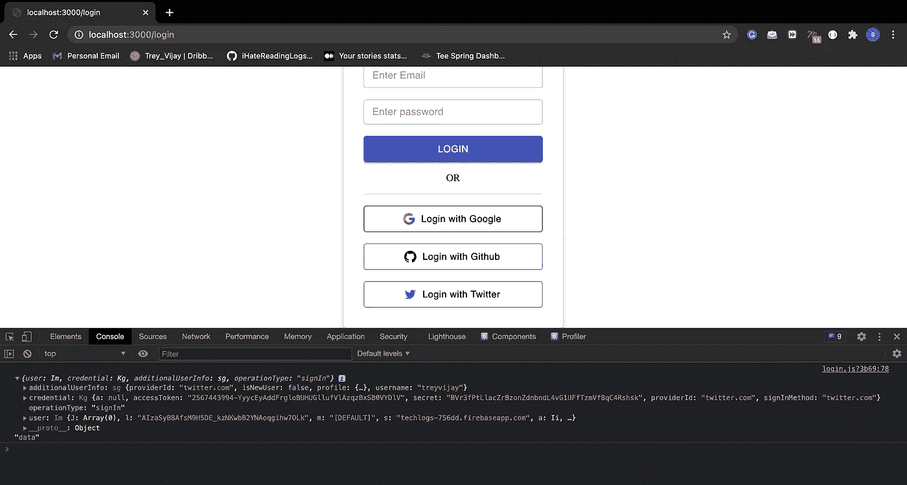

# 如何使用 Twitter 认证来认证用户

> 原文：<https://javascript.plainenglish.io/twitter-authentication-cb87c0d0fd?source=collection_archive---------16----------------------->

## 使用 Twitter 认证您的用户


[Read the more](http://i-hate-reading-logs.vercel.app/)

使用谷歌、脸书、Twitter 和 GitHub 认证用户提供了更好的用户登录体验。我已经写过一篇关于 Google 认证的文章，使用 Firebase 的 GitHub 认证。这是文章的链接

```
Github Authentication using Firebase => [Article](https://shreyvijayvargiya26.medium.com/github-authentication-using-firebase-f08bd9d7e659)
```

# **概述**

1.  在 developer[dor]twitter[dot]com 上创建 Twitter 开发者应用程序
2.  你需要填写整个表格，说明你的申请的目的和用途。对不起，对此我无能为力。
3.  获得仪表板
    ([https://developer.twitter.com/en/portal/dashboard](https://developer.twitter.com/en/portal/dashboard))访问权限后，在**项目和应用**部分创建应用。
4.  保存凭证，如 **API key** 和 **API secret** 。
5.  在 Firebase 控制台上启用 Twitter 登录方法。
6.  使用回调 URL 在 Firebase 控制台项目中添加 API 凭据。
7.  在前端使用 Twitter 方法添加登录，并保存访问令牌以供进一步的 API 调用。

您可以通过此链接创建您的 twitter 开发者应用程序:

```
* [Twitter Developer App Link](https://developer.twitter.com/en/portal/dashboard)
```

之后，从项目和应用程序部分创建一个新的项目，就像我已经创建了。


The left sidebar is where you can create your project app

从特定项目的**密钥和令牌**部分访问您的**令牌和密钥**。如图所示，我的项目应用程序名为 CastTweet，从**密钥和令牌**部分，我可以重新生成我的令牌。

# 启用 Firebase

现在在 **Firebase 项目控制台中，**转到认证- >登录方法，并从方法列表中启用 Twitter 方法**。**


Sign-in-method List

从方法列表中选择 Twitter 方法。并在启用登录方法后添加您的项目应用凭据，最后复制您的回调 URL。


Enable Twitter method and add credentials and save your callback URL

最后一步是将回调 URL 添加到开发人员 Twitter 门户中的项目应用程序。

## **在 Twitter 开发者项目应用中添加回调 URL**


Click the Edit button to add a callback URL

在项目应用程序中，点击**认证设置的编辑按钮**，并添加您从 Firebase 控制台**复制的回调 URL。所有额外的工序现在都完成了。**

# 编写代码

我们将使用与添加 GitHub 认证相同的存储库

```
* [Github Authentication Repository](https://github.com/shreyvijayvargiya/iHateReadingLogs/tree/main/TechLogs/GithubAuthenticationUsingFirebase)
```

首先，我们将创建一个 firebase 提供者，这是 Firebase Twitter Auth 所需要的。Firebase 本身提供了一种方法来创建 Twitter 身份验证的提供者。

```
const provider = new firebase.auth.TwitterAuthProvider();
```


Login with the Twitter method

我们的 handleTwitterLogin 方法只使用我们创建的提供程序。Firebase auth 方法给出 signInWithPopup 方法，该方法接受提供者作为参数，作为响应，它给我们提供访问令牌。**访问令牌**是最重要的令牌，因为我们将来需要这个令牌向 GitHub 应用编程接口发出进一步的应用编程接口请求。此外，如果您的用户使用 GitHub 登录，请保存此**访问令牌**，因为您确实需要一些 GitHub 用户凭据，这些凭据只能使用此**访问令牌**通过 GitHub API 访问。



Our Access Token in console


Final Login page

# 结论

我们也可以使用推特应用编程接口来认证用户，而不是 Firebase，但我个人觉得这很容易。但是，如果你在一家跨国公司工作，我会严格建议只通过推特应用编程接口使用认证。

直到，下一次，有一个美好的一天，人们。

```
You can find code here => [Repository](https://github.com/shreyvijayvargiya/iHateReadingLogs/tree/main/TechLogs/TwitterAuthenticationUsingFirebase)
```

*更内容于* [***通俗地说就是***](https://plainenglish.io/)