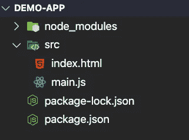

# 创建 React 应用程序的两种简单方法

> 原文：<https://javascript.plainenglish.io/two-dead-simple-ways-to-create-a-react-app-85b628b81c49?source=collection_archive---------15----------------------->

## 这两种不同的解决方案非常适合快速启动和运行一个新的 React 项目


React 很棒。它让我们可以毫不费力地创建丰富的用户界面。这使得编写我们的 UI 代码变得简单而有趣。这非常令人兴奋，那么如何创建一个 React 项目呢？不幸的是，这个答案变得有点复杂。建立一个 React 项目有很多不同的方法(我有点开玩笑，但是有很多)。我在本文中的计划是通过向您展示我认为非常可靠和非常简单的两个解决方案来演示如何创建 React 项目。

# **1。创建-反应-应用**

你们中的许多人可能已经知道这个，但是如果你不知道，这将改变你创建新的 React 应用的游戏。对于那些已经熟悉这个的人，我将提供一些你们可能不熟悉的提示和技巧。

Create-React-App 本质上是一个命令行工具，允许您通过简单地运行一个命令来复制 React 项目。

```
npx create-react-app demo-app
```

这里的这个命令将创建一个名为 demo-app 的新 react 项目。真的就这么简单。你现在有一个工作的反应应用程序。如果您导航到您的项目所在的目录并运行下面的命令，它将自动启动您的项目并在浏览器选项卡中打开它。就这样，你现在有了一个可以使用的全功能 React 应用程序。

```
npm start
```

## 提示和技巧

这里有一些关于创建-反应-应用程序的有用提示和技巧，大家可能不知道。

**技巧 1:** 你可以用 yarn 代替 npx 为你的纱线爱好者创建一个 react 应用程序(我也是一个纱线爱好者)。这是使用 yarn 的等效命令。

```
yarn create react-app demo-app
```

**诀窍 2:** Create-React-App 有大量不同的模板。有一个社区有你可以使用的模板。一些非常酷的模板值得一试，如 redux 模板和 TypeScript 模板。以下命令向您展示了如何创建这些项目。

该命令将创建一个内置 redux 的 react 项目:

```
npx create-react-app demo-app --template redux
```

该命令将创建一个内置了 TypeScript 的 react 项目:

```
npx create-react-app demo-app --template typescript
```

## 创建-反应-应用程序太有趣了

对于那些没有尝试过 React 应用程序的人，我强烈推荐使用它并进行实验。对于那些曾经使用过它的人，我希望我也能为你们提供一些价值。下面是他们文档的链接。你实际上可以用 Create-React-App 做很多事情，所以我鼓励你去看看他们的文档。

[](https://create-react-app.dev/) [## 创建 React 应用

### 您不需要学习和配置许多构建工具。即时重新加载有助于您专注于开发。到时候了…

创建-反应-应用程序.开发](https://create-react-app.dev/) 

# **2。包裹和包裹捆扎机**

就 JavaScript bundlers 而言，打包非常简单。我向那些试图学习 bundler，但有点害怕 Webpack 或 Rollup(顺便说一下，这两个都是非常棒的 bundler)的人强烈推荐它。Parcel 不仅可以用于 React，但是我将向您展示使用 React 有多简单，不管有没有类型脚本。

下面是他们文档的链接。对感兴趣的人来说，这是一本很好的读物。

[](https://parceljs.org/) [## 包裹

### 极快的零配置 web 应用捆绑器

parceljs.org](https://parceljs.org/) 

公平的警告，与 Create-React-App 相比，这个会有更多的设置工作，但不会更多。不过安装工作也有它的好处。当您尝试进行自定义设置时，直接控制模块捆绑器是一个额外的好处。

## 我们开始吧

我假设在命令行中有一点舒适的水平，但不多。如果您运行下面的命令，我将向您展示，那么您应该准备好了。

我们将运行的第一个命令是创建一个文件夹，项目将在其中运行:

```
mkdir demo-app
```

接下来，我们将导航到使用以下命令创建的文件夹

```
cd demo-app
```

*如果你跟随纱线，你可以运行纱线当量命令*

要创建项目，您可以运行下面的命令。

```
npm init --yes
```

现在，随着我们的项目创建，是时候使用包裹。第一步是安装 React 工作所需的依赖项。

```
npm install react react-dom
```

现在我们只需要安装 package-bundler 作为一个开发依赖项，因为这个包不是运行生产包所必需的。

```
npm install --save-dev parcel-bundler
```

现在，所有的依赖项都已安装。继续在您选择的代码编辑器中打开项目。是时候编写 parcel 为我们创建 React 应用程序所需的少量代码了。重要的事情先来。项目结构将看起来像下面的截图。



继续创建一个名为 **src** 的新文件夹，里面有两个新文件(**index.html**和 **main.js** )。下面是这两个文件所需的代码。

这几乎就是在包中启动和运行 React 所需的全部内容。我们在 HTML 文件中所做的就是创建一个带有 div 的空 HTML shell，它是从 React 注入标记的目标。在 div 之后有一个脚本标签，它将 are **main.js** 文件引入 HTML。

我们还有最后一步，非常简单。我们要做的只是稍微修改一下 **package.json** 文件，因为我们需要一个脚本来构建我们的 React 应用程序(这就是 package-bundler 发挥作用的地方)。下面是修改后的 **package.json** 文件。

如果你看一下 package.json 文件的第 8 行,有一个新的脚本用于构建我们的 React 项目。现在真的是这样了。如果我们运行下面的命令，它将构建我们的 React 项目，并默认将其放在端口 1234 上。

```
npm start
```

包裹真的很容易使用。是的，这比使用 Create-React-App 来创建 React 项目更需要手工操作，但正如我上面所说的，与使用 Create-React-App 相比，package 将为我们提供更多对代码的控制。

## 让我们将这个项目转换为使用 TypeScript

在包中设置 TypeScript 和反应也非常简单。我们需要做的第一件事是将 **main.js** 文件重命名为 **main.tsx** ，现在在**index.html**文件中，我们必须将脚本标签改为指向 **main.tsx** 。就代码而言，这就是我们需要改变的一切。下面是我刚才描述的代码，以防你需要参考。

接下来，我们需要安装 React 和 React-DOM 的类型。

```
npm i --save-dev @types/react @types/react-dom
```

一旦安装完毕，还有最后一步。我们需要一个 **tsconfig.json** 文件，为 React 启用适当的设置。下面是我将要使用的一个。这与从`create-react-app typescript`模板生成的相同。我们要把这个文件放在我们项目的根目录下。

一旦我们添加了这个文件，项目就应该准备好了。

*如果您的应用在*之前运行，请确保将其关闭

```
npm start
```

该项目应该启动，它将自动安装 TypeScript，并再次托管在端口 1234 上。就这样，我们成功了！我们现在有了一个带有 TypeScript 的全功能 React 项目。

# 结论

建立 React 项目并不一定是一个复杂的过程，尤其是如果你只是想参与、学习和享受乐趣的话。希望这两个创建 React 项目的解决方案将有助于使您的生活稍微轻松一些，以便您可以专注于 React 中的编码，而不是设置它。