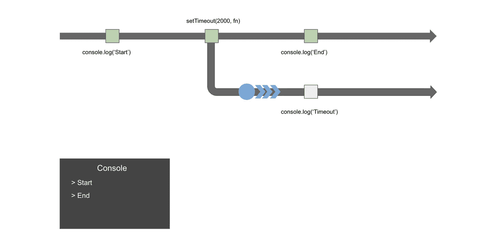
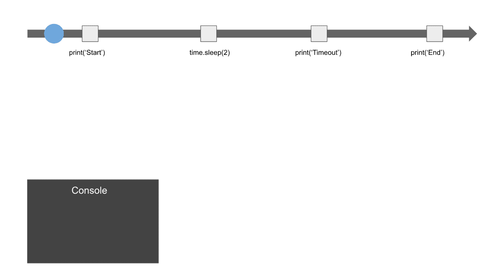
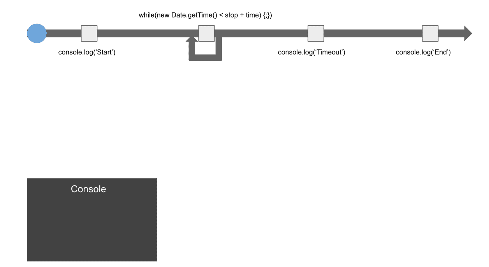
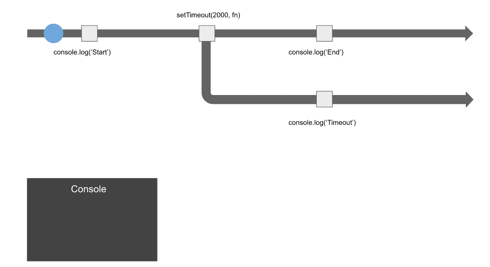
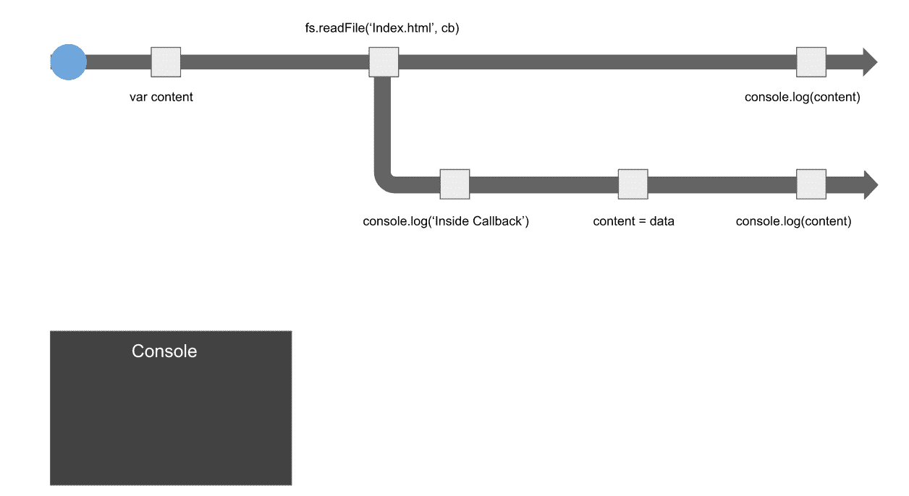
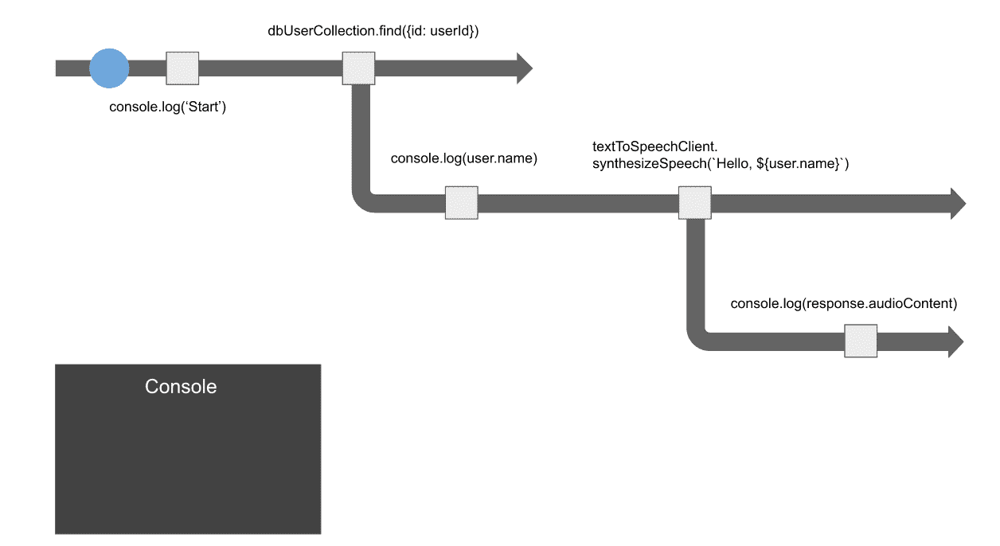
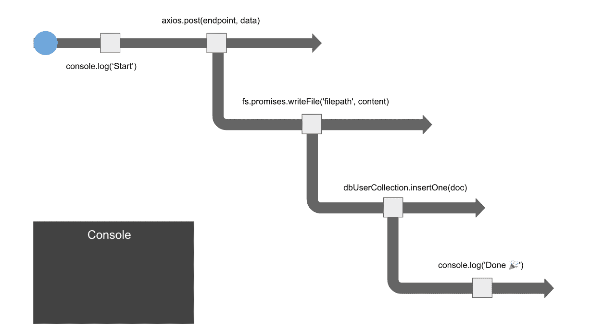
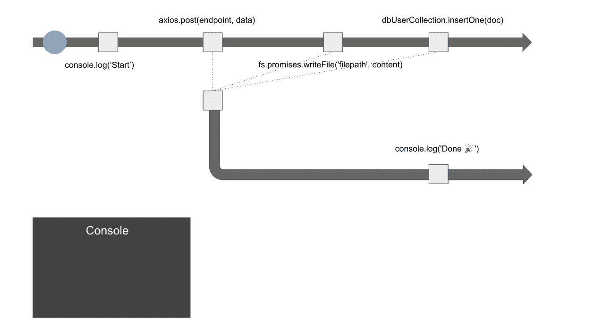

# 二维时间轴——思考异步 JavaScript 的一种方式

> 原文：<https://javascript.plainenglish.io/two-dimensional-timeline-a-way-to-think-about-asynchronous-javascript-bb5e8d4ffd2e?source=collection_archive---------14----------------------->

## 可视化异步操作的执行顺序

我记得当我第一次从事 JavaScript 工作时，我发现很难理解如何正确处理异步操作。我犯了一些常见的错误，比如假设 AJAX 是同步的，这导致我的函数总是返回`undefined`。也很难习惯 setTimeout 的工作方式。它不阻塞代码的事实让我很沮丧。

我花了很长时间才习惯回调、承诺和异步/等待的工作方式。我发现一个有用的方法是在二维时间线中可视化执行的顺序。

## **同步世界**

在 Python 中，我可以使用`time.sleep`来暂停执行。

现在，我想使用函数`setTimeout`在 JavaScript 中暂停执行 2 秒钟。让我把`print`换成`console.log`，把`time.sleep`换成`setTimeout`。

回调里面的所有东西都在 2 秒后执行，太好了。但是等等，为什么`console.log(‘End’)`会在`console.log(‘Timeout’)`之前运行？我假设代码应该逐行执行。第三行不应该在第二行的所有内容执行之前执行，包括回调函数。在 JavaScript 中，我的假设大错特错。

JavaScript 执行非阻塞 I/O 操作，`setTimeout`也是非阻塞的。第二行不阻止执行。设置 2 秒钟计时器后，它继续运行并执行第 3 行。当 2 秒计时器结束时，将执行`console.log(‘Timeout’)`。

这就是`setTimeout`的工作方式。但我想实现的是在等待 2 秒的同时阻塞执行，就像我在 Python 代码中做的那样。应该有另一个简单的 API 来实现。在网上找了半天，也找不到这样的 API。相反，我找到了一些解决办法来实现它。

我运行代码，看看它是否能阻止执行。是的，它可以阻止执行。在“结束”之前，我可以看到控制台中记录了“超时”。它的行为类似于 Python 中的`time.sleep`。但是当我花一点时间思考代码做什么的时候，它不能阻止执行。蓝色的小圆圈没有停止，而是继续在循环中运行。我就是停不下来。

## 异步世界

JavaScript 在浏览器和 NodeJS 中是单线程的。我挡不住。更重要的是，我不应该屏蔽。

在浏览器中阻塞线程会导致用户界面冻结，因为它正在循环中忙碌地运行。当用户单击一个按钮时，click 事件被排队。然而，在满足循环条件之前，线程就是不能从循环中退出。在此之前，它不能处理 click 事件的回调。因为 JavaScript 是单线程的，所以没有其他线程来处理 click 事件。如果 NodeJS 中的线程被阻塞，情况可能会更糟。当线程被阻塞时，服务器将无法处理后续请求。

经过长时间的斗争，我不得不接受非封锁行为。我不得不接受第二行的回调可能发生在第三行执行之后，这对我来说是不直观的。这让我思考我应该如何以一种无阻碍的方式来观想时间。我想出了这个图表。

蓝色圆圈仍然会逐行执行代码。但是故事并没有结束。执行 setTimeout 后，异步操作将被设置为挂起状态。当计时器结束时，回调将在另一个时间线中执行。

如前所述，当我开始用 JavaScript 编码时，我犯的一个错误是从一个函数返回`undefined`,这个函数涉及异步操作，比如从 AJAX 检索数据、从文件系统读取文件和查询数据库。我相信我不是唯一一个在这个问题上挣扎的人，因为还有一些相关的问题，如[这个](https://stackoverflow.com/questions/10058814/get-data-from-fs-readfile)、[这个](https://stackoverflow.com/questions/33657338/json-ajax-returns-undefined)和[这个](https://stackoverflow.com/questions/30428009/mongodb-find-returns-undefined-node-js)贴在堆栈溢出上。我重新思考二维时间线中的这种错误。

当从文件系统中读取文件时，数据不是立即可用的，这导致`undefined`记录在第一个时间线上。当数据可用时，回调中的代码将在第二个时间线上执行，文件数据可以记录在控制台上。

## 按顺序运行异步操作

有时，我需要根据另一个异步操作的结果执行一个异步操作。例如，虚拟辅助应用可能想要以音频格式的语音消息来响应，而不是以文本消息来响应“你好，汤姆”。这就需要从数据库中查询用户名，然后用这个查询结果调用云服务提供的一个文本到语音的 API。

在这种情况下，第二个异步操作需要嵌套在第一个异步操作的回调中。这种深度嵌套的代码降低了代码的可读性。如果异步操作 API 支持 ES6 promise，那么可以用 async-await 格式编写代码，这种格式看起来是同步的，更容易阅读。但是在幕后，它仍然是一个异步操作，所以二维时间线应该与回调风格的代码相同。

## 并发运行异步操作

上面显示的语音消息示例是一个异步操作依赖于另一个操作的回调结果的示例。在将文本消息转换为语音消息之前，我们需要知道用户名。

与语音消息示例不同，有时异步操作是独立的。每个异步操作都不依赖于其他操作的回调结果。例如，我们想调用一个 web 服务，编写一个文件，并向数据库中插入一条记录。一种方法是按顺序一个接一个地执行异步。

如果我们按顺序执行代码，整个执行时间大约是每个操作执行时间的总和。因为本例中的所有操作都是独立的，所以它们可以并发执行，这可以大大减少整个执行时间。

这次操作不是等待每个操作，而是立即一个接一个地运行，并将所有承诺传递给`Promise.all`，它可以一次等待多个承诺。

多亏了我曾经认为不直观的非阻塞 I/O 特性，JavaScript 可以在几行代码中同时运行多个异步操作，而无需处理多线程编程。

感谢你阅读这篇文章。如果你觉得很难理解异步操作的执行顺序，我希望二维时间线可以帮助你。