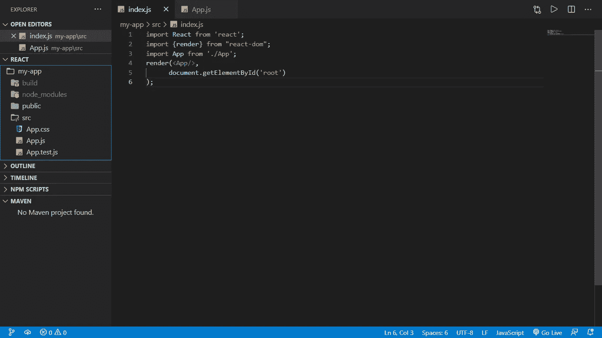
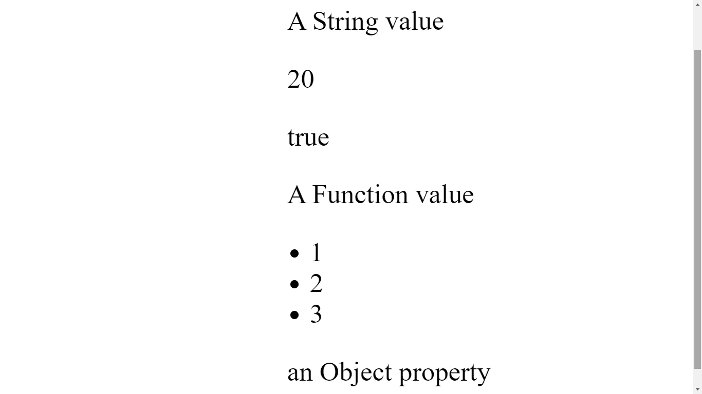
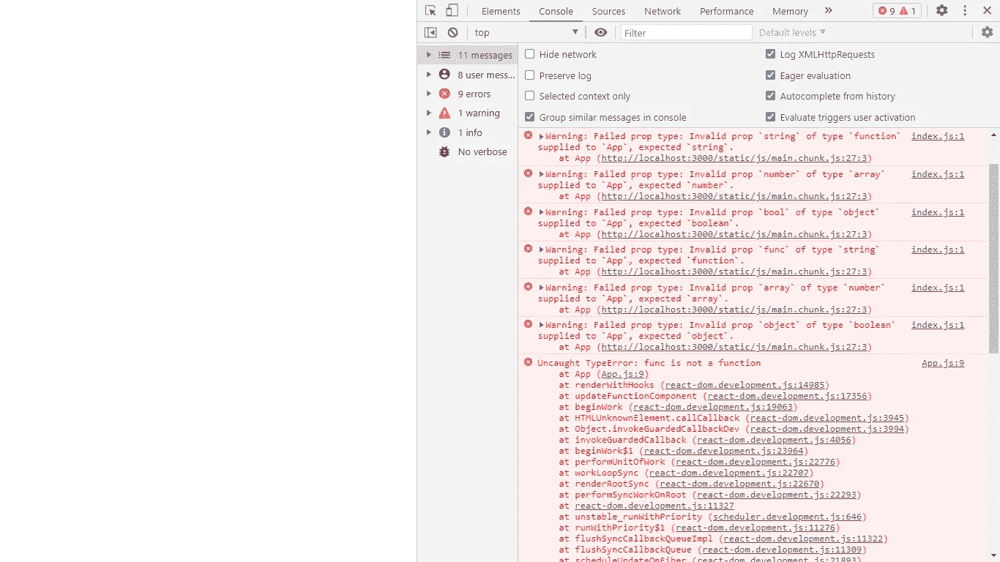

# React 中的类型检查

> 原文：<https://javascript.plainenglish.io/type-checking-in-react-f004d41b2ab6?source=collection_archive---------19----------------------->

## 第 1 部分:用属性类型验证组件属性

Photo by [Kumiko SHIMIZU](https://unsplash.com/@shimikumi32) from: [Unsplash](https://unsplash.com/photos/SjcrpttvjiE).

JavaScript 因其语法中没有类型符号而备受欺凌，如果你刚从 C、Go 或 Pascal 这样的编程语言中走出来，你会立即注意到这一点。因此，你会听到开发人员称 JavaScript 为弱类型语言。

类型符号在编程语言的分类中有着强大的作用，每种语言都规定了它的类型规则应该是怎样的，是强还是弱。因此，我们称这种语言为弱类型或强类型语言，这是一个很长的故事，你可以在下面的链接中找到。

 [## 举例说明类型系统

### "我的语言更好，因为它有一个强大的类型系统！"您的同事开发人员 Dave 尖叫道，他试图推动…

the value . dev](https://thevaluable.dev/type-system-explained/) 

如前所述，JavaScript 是弱类型的，这一点从其声明变量的方式中可以明显看出，为了解决 JavaScript 中没有强类型系统的问题，微软创建了 TypeScript，这是 JavaScript 的一个类型化版本。

因此，我们可以选择从头开始使用 TypeScript 构建我们的项目，或者我们可以选择将 TypeScript 添加到现有的项目中，如果项目是使用 JavaScript 库构建的，这将采取一些进一步的步骤，例如，React。

对于像 React 这样的库，我们可以通过使用另一个解决方案而不是 TypeScript 来克服添加类型标记的这些步骤，这不是一个实用的解决方案，但它将在开发过程中帮助您，这将增强您的开发体验。

因为 React eco-system 完全是关于组件的，所以类型验证将与我们赋予组件属性的值相关，为此，我们将使用 prop-types 包。

那么我们还在等什么呢？让我们启动 react 应用程序。

> **注**:
> 
> *我不会从头开始告诉你如何安装/使用 react，如果你不熟悉 React，这篇文章可能对你没用。*
> 
> *在本文中，我们的 React 项目是使用* create-react-app 工具创建的。

作为 React 开发人员或刚刚开始 React 之旅的人，您应该已经知道如何安装一个包，以及如何在项目中使用它。让我们从安装[道具类型](https://www.npmjs.com/package/prop-types)包开始..

启动 React 项目后，打开机器中的命令行界面或 VsCode 中的终端，然后移动到 React 项目的根目录，并键入下面的命令，命令可能会改变，这取决于您使用的包管理器，在本例中，我使用的是 npm。

`npm install --save prop-types.`

完成安装需要一段时间，然后在编辑器中打开 React 项目，进入。/src "目录，像往常一样，我们将依赖于两个文件，app.js 和 index.js。

Index.js and app.js files

“src”目录中的其他文件无关紧要，我们不打算构建任何 awe UI，我们的重点将只是传递给组件属性的内容，此外，剖析我们的属性具有什么类型的值，这很像处理 HTML 表单中的字段验证。

# **建筑构件**

现在我们将构建一个接受六个属性的简单组件，这些属性的类型将使用 prop-types 包中的属性类型验证器进行验证。

App.js

上面的例子展示了一个接受六个属性的功能组件，每个属性都有一个指定的类型，我们的组件将用一个基本的 HTML 标记来呈现每个属性。您一定注意到了，我们在代码的第二行导入了 prop-types 包。

上面这六个属性代表了 JavaScript 中最基本的类型。在我们代码的最后九行中，您将看到指定组件属性是否应该接受字符串、数字或布尔数据类型所必需的验证器。

# 使用道具类型

乍一看，使用 prop-types 包似乎很奇怪和令人困惑，因此，要理解这个过程，你必须记住两件事:

*   我们有一个`propTypes`属性，它是一个静态的类属性，本质上它是一个指定我们的组件属性应该接受哪种类型的值的对象。
*   我们有来自 prop-types 包的`PropTypes`对象，这个对象中的每个属性充当一个特定类型的验证器。

在 index.js 文件中，我们将通过向组件提供六个不同类型的参数(属性)来测试我们的组件。

向函数传递多个参数的最佳方法是将它们封装为一个对象中的属性，因此我们将使用两个对象，一个具有有效属性，另一个具有无效属性，然后我们将它们传递给我们的组件。下面是 [index.js](/index.js) 文件的样子。

Index.js

让我们看看这里发生了什么，我们像往常一样从 react-dom 导入了 render 方法，然后我们导入了 App 组件，接下来我们创建了一个名为 renderComp 的函数，它接受一个将被传递给 App 组件的参数，然后 render 方法将处理一切。

这里的目标是使用不同的参数多次调用 renderComp，每个参数将作为属性传递给应用程序组件，我们前面谈到的两个对象将重新组合这些参数。

仔细查看 validProps 和 inValidProps 对象的属性，您会发现每个属性名称都代表 JavaScript 中的一个原始值，第一个对象保存正确的值，第二个保存不正确的值，呈现输出将如下所示。

The render out put for the first object.

然而，5 秒钟后，React 将向您显示一个错误，您将在控制台输出中看到类似这样的内容:

The result of passing invalid properties the compoent.

在 index.js 文件的最后一行中，我使用了`setTimeout` 方法，该方法将在 5 秒钟后运行 renderComp 函数，但这次是使用 invalidProps 对象，这将导致一个错误，因为该对象中的属性为每种类型保存了错误的值。

对于最后一个错误，您将看到 React 是如何抱怨传递给 func 属性的无效函数的。

# 最后

prop-type 包是验证组件属性的最直接的方法之一。这种方法的缺点是它不能在生产模式下运行，但是在开发模式下它可以正常工作。

发现已经传递了哪种类型的值并不重要，因为发现值被准确地传递到哪里并不重要，在调试期间，发现错误发生的位置将对您非常有用，所以在将项目交付生产之前，请尝试修复每个错误。

# 下一步是什么？

在下一篇关于 React with[prop-types](https://www.npmjs.com/package/prop-types)包中的类型检查的文章中，您将学习如何处理任何属性值，以及指定该属性是必需的还是可选的。