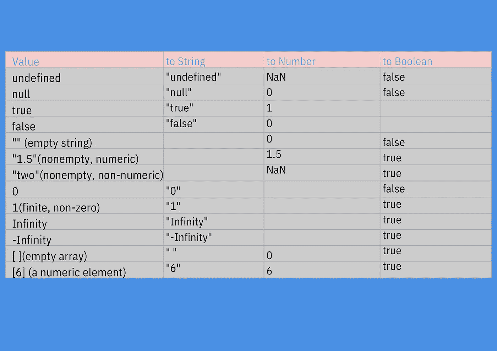

# JavaScript 中的类型转换

> 原文：<https://javascript.plainenglish.io/type-conversions-in-javascript-6c709c782f5f?source=collection_archive---------16----------------------->

## JavaScript 对于它需要的值类型非常灵活。


Photo by [Chris Benson](https://unsplash.com/@lordmaui?utm_source=medium&utm_medium=referral) on [Unsplash](https://unsplash.com?utm_source=medium&utm_medium=referral)

JavaScript 对于它需要工作的值的类型是灵活的。在 boolean 中，当 JavaScript 期望 true 并且您给了一个 true 值时，JavaScript 会自动将 true 值转换为 true。

在其他情况下，当 JavaScript 期望 false 并且您给了 falsy 值时，它会自动将其设为 false。

JavaScript 中的任何值都可以转换为布尔值。以下值在 JavaScript 中被视为 falsy 值，这意味着它们可以转换为 false。所以这些值是假的。

```
null
defined
0
-0
NaN
""  //It represents empty string
```

包括数组和对象的所有其他值都可以转换为 true，并且也可以用作 true。

其他类型也是如此:如果 JavaScript 需要字符串才能工作，它会自动将数字转换为字符串。此外，如果 JavaScript 需要数字才能工作，它会自动将字符串转换为数字。

```
17 + " Cats"  //-> "17 Cats : Number 17 is converted to string"8" * "5"     //-> 40 : Both the strings are converted to numberlet a = 5 - "y" //-> a == NaN: "y" can't be converted to number
```

下面的表格会告诉你 JavaScript 中的值是如何从一种类型转换成另一种类型的。



从一个原语转换到另一个原语非常简单。所有原始值到字符串的转换都有明确的定义。可以被解析为特定数字的字符串被转换为这些数字。

完全允许使用前导空格和尾随空格。然而，如果您尝试使用除空格之外的任何前导和尾随字符，而空格不是数字文字的一部分，则会使字符串到数字的转换给出 NaN(而不是数字)。

所有其他转换，如 true 到 1 和 false 以及空字符串，结果为 0。

```
17 + "cats" //-> "17cats" : 17 gets converted to a string.undefined + "cats" //-> "undefinedcats" : undefined get converted to a stringnull + 7  //-> 7 : null becomes number 0true + 1  //-> 2 : true is converted to number 1Infinity + 1 //->Infinity : infinity added to anything will be infinity
```

## 转换和平等

JavaScript 有两个操作符来测试两个值是否相等。其中一种称为“严格相等运算符”，===，另一种称为“宽松相等运算符”，==。

在严格相等运算符的情况下，必须有相同类型的操作数。在松散相等操作数的情况下，即使操作数没有任何相似的类型，仍然可以检查相等性。

```
null == undefined //->true.  These values are treated as equal."cats" == "dogs"  //->false. As the strings are not the same."5" == 5   //->false. String is converted to a number before comparing.false == 0 //->true. false converts to 0 before comparing1 == true  //->true. true convert to 1 before comparing.
```

请记住，如果两个值可以相互转换，并不意味着两个值相等。这意味着，如果在需要布尔值的地方使用了 undefined，并且 JavaScript 自动将其转换为 false，则不应该假设 undefined 和 false 相等。

## 显式转换

JavaScript 会在必要时执行自动转换。但有时作为开发人员，我们需要手动进行显式转换。

JavaScript 为从一种类型到另一种类型的显式转换提供了三个函数。这三个函数包括 Number()、Boolean()和 String()。

```
Number("7") //-> 7String(true) //->"true"Boolean([]) //-> true
```

隐式和显式类型转换中都涉及到某些 JavaScript 运算符。当+运算符可用并且其中一个操作数是字符串时，它会自动将另一个操作数转换为字符串。

一元运算符+会将操作数转换为数字。如果一元的话！运算符与操作数一起出现，它会将操作数转换为布尔值，并对其求反。

```
y + ""  //-> string(y)+y      //-> Number(y)y-0     //-> Number(y)!y     //-> Boolean(y)!!z    //-> Boolean(z) : It's double !
```

## 使用科学数据

当开发人员处理科学和金融数据时，他们可能希望以某种方式将数字转换为字符串，以便能够控制数据。

他们可能想要控制字符串中有多少个小数点。此外，他们可能希望控制转换后的字符串中有效数字的数量。

他们可能不想在转换后的字符串中使用指数符号。所有这些都是使用 Number 类提供的三种方法来完成的。

这些函数包括 toFixed()、toExponential()、toPrecision()。

*   toFixed():如果使用这个函数，可以将一个数字转换成小数点后有特定位数的字符串。
*   toExponential():如果使用这个函数，可以使用指数表示法将数字转换为字符串。使用此函数时，小数点前的一位数和小数点后的特定位数都可以使用指数表示法。
*   top precision()—使用此函数将帮助您将一个数字转换为具有指定有效位数的字符串。

```
let n = 987654.321console.log(n.toFixed(0)); //->987654console.log(n.toFixed(1)); //->987654.3console.log(n.toFixed(2)); //->987654.32console.log(n.toExponential(1)); //->9.9e+5console.log(n.toPrecision(4)); //->9.877e+5
```

您可以将字符串分配给 Number()转换函数。当您给定任何 Number()函数时，它会尝试将该字符串解析为整数或浮点文字。

有两个函数可用，包括 parseInt()和 parseFloat()函数。记住这两个函数不是任何类的方法，因此它们更灵活。

使用 parseInt()只能解析整数。使用 parseFloat()，整数和浮点数都被解析。这两个函数都忽略任何类型的前导空格。您可以解析任意数量的数字字符。

如果第一个非空格字母不是有效的数字文字，两个函数都将返回 NaN。

```
parseInt(" 4 car stolen") //-> 4parseInt(" -598.8") //-> -598parseFloat(" 67.89 inch") //-> 67.89parseFloat(".78") //-> 0.78parseInt(" .7") //-> NaN: as integers can't start with "."parseFloat(" $89.89") //->NaN: as numbers can't start with "$".
```

# 想联系作者？

加入一个人人社区，欣赏与科技相关的文章。我们讨论最新的技术和独特的见解。

*更多内容尽在*[***plain English . io***](http://plainenglish.io/)