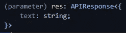

# 使用 Nextkit 的类型安全 Next.js API 路由

> 原文：<https://javascript.plainenglish.io/type-safe-next-js-api-routes-with-nextkit-b95d78e53c7d?source=collection_archive---------1----------------------->

Next.js 的 API routes 是一个非常强大的特性，可以让你在一个 Next.js 应用中编写整个应用，整个堆栈。

作为一个 TypeScript 用户，它们缺少一个对我来说至关重要的特性，那就是类型安全。

让我们一起用 [Nextkit](https://www.npmjs.com/package/nextkit) 来解决这个问题吧！


# 问题是

假设我们的 API 文件夹中有这个路径。

An example of a basic Next.js API route

虽然这是一个很好的起点。我希望能够推断出我的 API 在我的 React 组件中返回的类型。如果我做不到这一点，我为什么还要使用 TypeScript 呢？

# 解决问题！

我们将一起创建我们的第一个类型安全的 API 路由！

第一步是生成一个利用 Typescript 的新 Next.js 应用程序。您可以使用以下命令轻松做到这一点:

```
npx create-next-app --ts
// or with yarn
yarn create next-app --ts
```

运行完成后，导航到新创建的文件夹并添加 [Nextkit](https://www.npmjs.com/package/nextkit) ！

```
npm i nextkit
// or with yarn
yarn add nextkit
```

如果一切顺利，您现在有了一个新的 Next.js 应用程序，它已经在`/pages/api/hello.ts`文件中包含了一个 API 路由。

The API route generated by Next.js

由于我们指定要使用 TypeScript，Next.js 已经使用了 NextApiResponse 泛型。
我们将继续努力，让我们开始添加 Nextkit 吧！

删除这个`hello.ts`文件中的所有内容，并用下面的设置替换它。

我们刚刚改变的是:

*   使用 Nextkit API 代替常规处理程序
*   创建一个简单的 GET 路径，返回`Hello World!`

这意味着我们现在有了一个完全类型安全的 API 路由，剩下要做的就是调用它。

为此，我们需要导航到`/pages/index.tsx`，就像我们的 API 路由一样，您可以删除其中的所有内容，并用以下内容替换。

Our new and improved index

**重要！** 看看我们是怎么从`./api/hello`进口 API 的，别忘了在前面加`type`。不然不行！

我想既然你在寻找 API 路由中的类型安全，你已经很清楚 React 是如何工作的了，但是让我们一起回顾一下我们刚刚做的事情吧！

我们的第一步是使用 Nextkit 的`InferAPIResponseType`创建一个新类型。通过将`typeof api`添加到通用部件，我们创建了一个新的类型，它将包含我们的 API 的返回类型。

之后，我们创建一个名为 data 的新的空状态变量，并使用一个泛型将类型设置为`null | Res`。
`Res`是我们刚刚使用 Nextkit 的`InferAPIReponseType`创建的类型。

然后我们添加一个新的`useEffect`，在其中我们使用一个简单的获取来调用我们的 API 路由。

当解析我们的数据时，我们做了一些有点特别的事情！`fetch`异步工作，我们首先添加一个`.then`处理程序，在其中我们将来自 API 的响应解析为 JSON。我们还使用了`as`关键字，让 TypeScript 知道`res.json()`将返回一个类型为`ApiReponse<Res>`的新承诺。
之后`.then`我们当然需要再放一个，因为我们的第一个`.then`做了一个异步动作。

第二个是真正神奇的地方。如果我们看一下`res`的类型，我们可以看到它现在具有我们在 API route 中指定的类型！



The type of our returned data

我们现在需要做的就是将我们的状态变量设置为`res.data`，我们已经准备好渲染结果了！

如果你正在寻找一个完整的例子，你应该访问 [Nextkit 仓库](https://github.com/alii/nextkit)。这个库包含一个带有 fetch 的普通例子和一个使用来自 Vercel 的 [SWR 的例子。](https://swr.vercel.app/)

# Nextkit 主要特性

我知道这需要理解很多东西，所以这里有您需要记住的 Nextkit 的所有关键组件！

## 美国石油学会(American Petroleum Institute)

API 是用于创建新路线的功能。因为它是一个 TypeScript 库，您将总是得到您需要的自动完成！
Nextkit 支持所有的 HTTP 方法，所以你不仅仅局限于获取数据，你还可以用它来创建 POST 和 PUT 路径。

## InferApiReponseType

这个泛型类型用于推断 API 路由返回的内容。对于您创建的每一个处理程序，您都需要导出一个新的类型来推断您的处理程序的类型。大概是这样的`type HandlerResponse = InferApiReponseType<typeof handler>;`。这样，我们可以在前端导入类型，并在那里使用它！

## APIResponse

APIReponse 是我们在前端使用的通用类型。您需要像这样指定您试图调用的特定处理程序响应`APIReponse<HandlerResponse>`。

## http 异常

Nextkit 的创造者 Alistair 知道，并不是所有的路线都遵循一条平坦的道路。这就是为什么 Nextkit 有内置的 HttpException 类，您可以使用它轻松地抛出异常。
工作原理是这样的`throw new HttpException(404, 'Not found!');`。第一个参数是状态号，第二个参数是要传递的消息。

祝你有乐观的一天！💙

*更多内容看* [***说白了。***](https://plainenglish.io/)

*报名参加我们的* [***免费每周简讯***](http://newsletter.plainenglish.io/) *。关注我们关于* [***推特***](https://twitter.com/inPlainEngHQ) ，[***LinkedIn***](https://www.linkedin.com/company/inplainenglish/)*，*[***YouTube***](https://www.youtube.com/channel/UCtipWUghju290NWcn8jhyAw)*，以及* [***不和***](https://discord.gg/GtDtUAvyhW) ***。***

***对缩放您的软件启动感兴趣*** *？检查出* [***电路***](https://circuit.ooo?utm=publication-post-cta) *。*

# 进一步阅读

[](/typescript-made-easy-a-guide-to-your-first-type-safe-app-with-next-js-wundergraph-and-prisma-e197a59e2b30) [## 轻松编写类型脚本:使用 Next.js、WunderGraph 和 Prisma 编写第一个类型安全应用程序的指南

### 是时候抛开恐惧，学习 TypeScript 了。让我们给你第一次“发现！”瞬间通过建立一个完整的…

javascript.plainenglish.io](/typescript-made-easy-a-guide-to-your-first-type-safe-app-with-next-js-wundergraph-and-prisma-e197a59e2b30)