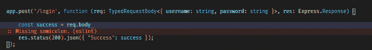
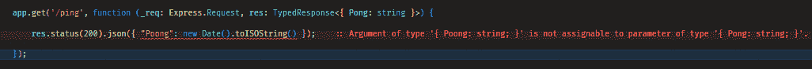

# 用 TypeScript 键入的快速请求和响应

> 原文：<https://javascript.plainenglish.io/typed-express-request-and-response-with-typescript-7277aea028c?source=collection_archive---------1----------------------->


Photo by [Jefferson Santos](https://unsplash.com/@jefflssantos?utm_source=medium&utm_medium=referral) on [Unsplash](https://unsplash.com?utm_source=medium&utm_medium=referral)

用 TypeScript 编写代码是很棒的，但是在代码中有一些地方让 TypeScript 发光是很棘手的。其中之一是在 Express 中定义路线时。

本文介绍了一些向`Express.Request`和`Express.Response`对象添加 TypeScript 的方法。

# 设置 Express

让我们先做基本的东西。

```
import Express from 'express';
import http from 'http';let app: Express.Application | undefined = undefined;export function InitializeExpress(port = 3001): void { app = Express();
    app.use(Express.urlencoded({ extended: true })); app.get('/', function (_req: Express.Request, res: Express.Response) {
        res.status(200).json(**{
            "Foo": "Bar",
             "Time": new Date().toISOString()
        }**);
    }); // Add 404 handler
   app.use(function (_req: Express.Request, res: Express.Response) {
      res.status(404).send("Not found");
   }); // Start server (app.listen can also be used)    
   http.createServer(app).listen(port, () =>  
    console.log(`Running at [http://localhost:${port}/`](http://localhost:${port}/`)));}
```

在访问 [http://localhost:3001/](http://localhost:3001/) 时，该服务器将返回如下内容:

```
{"Foo":"Bar","Time":"2021-09-21T19:32:15.091Z"}
```

# **快递。Request.body**

特快列车。请求对象定义为:

```
interface e.Request<P = ParamsDictionary, **ResBody = any**, ReqBody = any, ReqQuery = QueryString.ParsedQs, Locals extends Record<string, any> = Record<string, any>>
```

这种类型使用起来很复杂。为了简化这一点，新类型被定义为:

```
export interface TypedRequestBody<T> extends Express.Request {
    body: T
}
```

有了这个新接口，就可以使用泛型对主体进行类型化:

```
app.post('/login', function (req: **TypedRequestBody<{ username: string, password: string }>**, res: Express.Response) { const success = req.body.username === "foo"
                    && req.body.password === "bar"; res.status(200).json({ "Success": success });
});
```

> 这将提供类型脚本检查和智能感知:



# 快递。请求。询问

修改 Express 中的`query`。Request 有点复杂，因为 Express 使用了来自`express-serve-static-core`的类型，而 Express 并不公开这些类型。因此，获得合适类型的唯一途径是`import { Query } from 'express-static-serve-core';`。解决方案是:

```
import { Query } from 'express-serve-static-core';export interface TypedRequestQuery<T extends Query> extends Express.Request { query: T}
```

要使用它，它看起来会像这样:

```
app.get('/article/:id', function (req: **TypedRequestQuery<{ id: string }**>, res: Express.Response) { const id = req.query.id; // Fetch from database here and return article    res.status(200).json({ ID: id });});
```

# 快递。请求。正文和查询

让我们做另一个类型，其中*`body`和`query`都可以被键入:*

```
*export interface TypedRequest<T extends Query, U> extends Express.Request {
    body: U,
    query: T
}*
```

*这种用法可能类似于:*

```
*app.put('/article/:id', function (req: **TypedRequest<{ id: string }, { name: string }>**, res: Express.Response) { console.log(`Updating article **${req.query.id}**`);
        console.log(`setting name to **${req.body.name}**`);
        res.status(200).json({ Success: true });});*
```

# *关于传入请求的小安全说明*

*TypeScript 在运行时不存在，因此即使代码被设置为期望有效负载:*

```
*{ username: string, password: string }*
```

*...像这样的错误负载:*

```
*{ username: undefined, password: ["Hello", "World"] }*
```

*..可以提交以便“搞乱”路线。因此，**始终确保*始终*验证输入的有效载荷**。*

## *PS:*

*如果你想从 TypeScript 接口/类型中自动生成验证器函数，那么阅读这篇文章:[https://JavaScript . plain English . io/how-to-automatically-convert-TypeScript-Types-to-runtime-validators-5b 06 ee 269 b 13](/how-to-automatically-convert-typescript-types-to-runtime-validators-5b06ee269b13)*

# *快递。反应*

*Express 再次使用来自`express-serve-static-core`的类型:*

```
*import { Send } from 'express-serve-static-core';*
```

*接口被定义为:*

```
*export interface TypedResponse<ResBody> extends Express.Response { json: Send<ResBody, this>;}*
```

*用法可能类似于:*

```
*app.get('/ping', function (_req: Express.Request, res: **TypedResponse<{ Pong: string }>**) { res.status(200).json(**{ "Pong": new Date().toISOString() }**);});*
```

*同样，如果响应的格式与预期的结果不匹配，TypeScript/VSCode (ErrorLens)将通知一个错误:*

**

# *演示源代码？*

*[https://github.com/tomnil/typedexpress](https://github.com/tomnil/typedexpress)*

# *享受:)*

## *进一步阅读*

*[](https://bit.cloud/blog/sharing-types-between-your-frontend-and-backend-applications-l5qih48g) [## 在前端和后端应用程序之间共享类型

### 您的后端 API 已经更新，可以返回新类型的数据。必须通知前端团队进行更新…

比特云](https://bit.cloud/blog/sharing-types-between-your-frontend-and-backend-applications-l5qih48g)* 

**更多内容请看*[***plain English . io***](https://plainenglish.io/)*。报名参加我们的* [***免费周报***](http://newsletter.plainenglish.io/) *。关注我们关于*[***Twitter***](https://twitter.com/inPlainEngHQ)[***LinkedIn***](https://www.linkedin.com/company/inplainenglish/)*[***YouTube***](https://www.youtube.com/channel/UCtipWUghju290NWcn8jhyAw)*[***不和***](https://discord.gg/GtDtUAvyhW) *。对增长黑客感兴趣？检查* [***电路***](https://circuit.ooo/) *。****