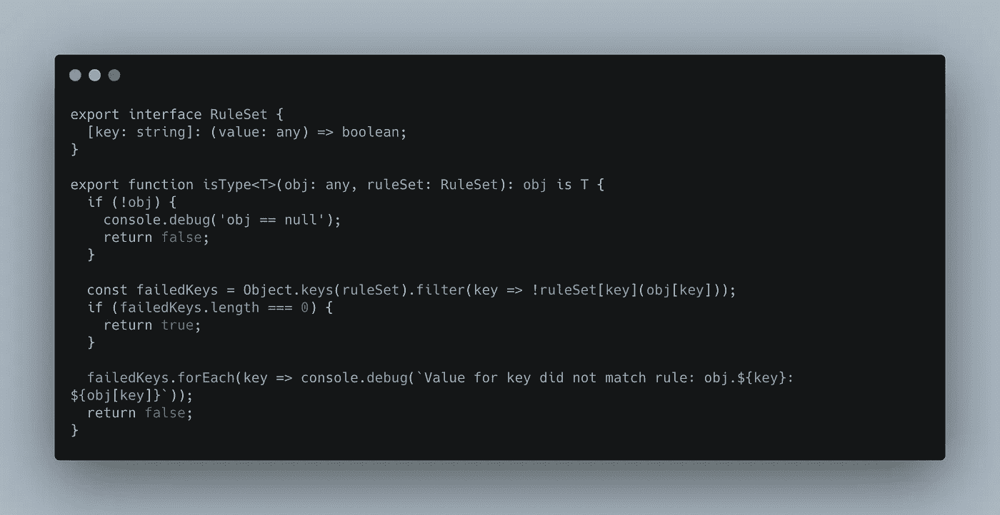

# TypeScript Typeguard 透明度

> 原文：<https://javascript.plainenglish.io/typeguard-transparency-fe33061c1744?source=collection_archive---------15----------------------->

对于那些熟悉 TypeScript 的人来说，您可能已经知道了 typeguards 以及它们有多有用。如果你不熟悉 typeguards，我建议你去看看。关于这一主题有大量的指南和资源:

*   [https://basarat.gitbook.io/typescript/type-system/typeguard](https://basarat.gitbook.io/typescript/type-system/typeguard)
*   [https://rangle.io/blog/how-to-use-typescript-type-guards/](https://rangle.io/blog/how-to-use-typescript-type-guards/)
*   [https://2 ality . com/2020/06/type-guards-assertion-functions-typescript . html](https://2ality.com/2020/06/type-guards-assertion-functions-typescript.html)

虽然已经有许多很好的资源可用，但是给出的大多数例子都处理非常小的数据结构，或者只处理一个字段的有效性。

在我目前工作的地方，我们大量使用 typeguards 来验证 API 响应是我们期望的，并且在将对象保存到我们的数据库之前，对象具有正确的形状和有效的数据。

然而，在这种规模下，typeguards 对我来说变得太不透明了……尤其是在处理更大的数据模型和嵌套结构时。

让我们看一个类型`Car`及其子类型`Engine`和`Wheel`的例子:

现在，如果我们正在检查的 obj 在 wheel 对象中嵌套了不正确的类型，该怎么办呢？或者引擎对象的`fuelType`是`deisel`，而不是`diesel`，这是因为代码库中某处的一些小错误。虽然 typeguard 会完成它的工作，声明对象不是 Car 类型，但是试图调试这种情况很快就会变成一场噩梦。如果您对失败的类型检查抛出错误，您可能会看到类似“Object x 与 Car 的模式不匹配”的内容。在这一点上，你可能会对自己说:“嗯……是的，这是怎么回事?”？?"

这里真正的陷阱是，如果一个字段无效，整个检查就会失败，而且没有任何原因。这将不可避免地迫使您注销整个对象，这样您就可以尝试查看无效字段在哪里……这可不好玩。

因此，在我们的系统中遇到了许多这样的错误之后，我对我们的类型守卫在失败的类型检查背后的推理中所给予的透明度如此之少感到非常沮丧。以下是我想到的解决方案。

首先，我们有两个通用助手，RuleSet 和 isType。

RuleSet 是一个通用接口，它定义了一个键和一个用于检查该键是否有效的函数。规则集中的密钥应该与接口中的密钥完全匹配。

isType 是一个通用类型检查函数，它接受要检查的对象和要检查的规则集。这里的好处是 isType 将记录任何未通过检查的键和值。

给定我们的`Car`类型示例，我们可以将所有的 typeguard 函数(`isCar`、`isEngine`、`isWheel`)更改为规则集。

如您所见，我们的规则集看起来几乎和我们的 typeguard 函数一模一样，实际上更容易阅读和定义(至少在我看来是这样)。

现在，如果我们有一个小的输入错误，比如我们的引擎模型将`fuelType`作为`deisel`而不是`diesel`，我们会得到一条消息，指出对象无效的确切原因:

## 结论

我希望你觉得这篇文章很有价值，并希望它能节省你将来调试的时间！

源代码和测试可以在这里找到:[https://gist . github . com/armueller/AC 31 bfe 290 f 256 EDA 830 ea 495d 3426 DD](https://gist.github.com/armueller/ac31bfe290f256eda830ea495d3426dd)