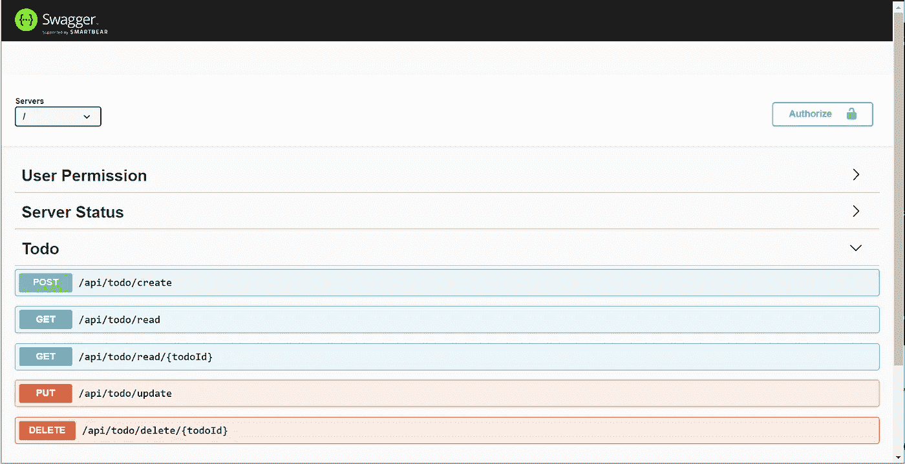

# 面向初学者的 TypeORM 教程:Express.js 中的 CRUD(typerscript)

> 原文：<https://javascript.plainenglish.io/typeorm-tutorial-for-beginner-crud-in-express-js-typescript-b447f1fd7622?source=collection_archive---------2----------------------->

TypeORM 是一款备受关注的 [ORM](https://en.wikipedia.org/wiki/Object-relational_mapping) 。与 TypeScript 的本机集成使开发人员能够将 TypeORM 有效地集成到他们的 TypeScript 项目中。在本教程中，我将介绍 Express.js (Node.js)中的 CRUD 函数/API。在本教程中不需要前端，因为我们将使用 swag 来测试我们的 API。


# 介绍

在本教程中，您将学习在 Node.js 中设置 Express + TypeScript 应用程序，主要用于后端目的。最常见的后端服务之一是 CRUD(创建、读取、更新、删除)服务。这些服务需要数据持久性，因此，Express 应用程序必须能够有效和高效地执行这些功能。在体验和比较了 Sequelize、Prisma 和 LoopBack 等不同的 ORM 库之后，我决定安定下来使用 TypeORM。我喜欢 TypeORM 的一个主要原因是它与 typerscript 和 TSOA(typerscript Open API)库的无缝集成，因为它使用的是装饰器设计。

# 入门指南

首先，我们将使用 create-express-type script-application 库来生成结构良好的 express 应用程序。

## 先决条件

在运行 create-express-type script-application 命令之前，请确保在本地计算机上安装了以下软件包。它们是 npm、节点和 git。

## 创建快速类型脚本应用程序

准备就绪后，将终端目录更改为要创建项目的目录。然后，运行以下命令。

```
$ npx create-express-typescript-application my-app -t typeorm
```

一旦你看到成功的消息“应用程序已创建与类型表单模板！”，你准备走了。转到“我的应用程序”目录，然后使用您最喜欢的代码编辑器(在我的示例中为 Visual Studio Code)打开该文件夹。

```
$ cd my-app
$ code .
```

您应该看到以下项目结构。


Project Structure of CETA (with TypeORM Template)

要开始，可以运行以下命令。

```
$ npm run dev
```

这将在`http://localhost:8080`开始应用。由于在初始项目创建过程中集成了 swag 文档，因此您可以在浏览器中打开一个新选项卡并转到`[http://localhost:8080/docs](http://localhost:8080/docs)`。你会看到下面的画面。


请注意，这些是 create-express-type script-应用程序创建的默认路由，供您在开发下一条路由时参考。在本教程中，我将带您完成创建新路线的过程。

## 数据库的选择

有许多可用的数据库，无论是关系数据库还是非关系数据库。在本教程中，我们将使用 sqlite(一个轻量级本地关系数据库)。不过，您始终可以在`src/database/index.ts`文件中更改数据库类型和连接详细信息。

## 创建数据库实体和 CRUD 服务

在本节中，您将创建待办事项列表的 CRUD 服务。要创建数据库实体(表)，您需要在`src/database/entity/todo.ts`中创建一个实体文件。在 TypeORM 中，我们可以通过 [DataMapper](https://typeorm.io/index.html#/active-record-data-mapper/what-is-the-data-mapper-pattern) 和 [ActiveRecord](https://typeorm.io/index.html#/active-record-data-mapper/what-is-the-active-record-pattern) 来定义一个对象。在本教程中，我们将坚持使用 ActiveRecord 设计，因为它允许通过实体而不是连接管理器直接访问数据库。

一旦创建了任务实体，我们就可以创建与数据库交互的服务了。创建`src/app/todo/todo.service.ts`并编写以下函数。

## 创建控制器文件

接下来，我们将把所有这些函数封装在一个控制器中，以注册到 express app routes 并生成 swagger 文档。创建`src/app/todo/todo.router.ts`并编写下面的类。

此时，您的项目应该是这样的…


请注意，三个绿色文件是新创建的文件。确保`npm run dev`运行无误后，您就可以在`[http://localhost:8080/docs](http://localhost:8080/docs)`刷新 swagger 文档了。一旦你刷新，你会看到所有的待办事项路线出现在你的招摇文件。



## 测试路线

您可以使用 swagger 文件来测试您新创建的 API。例如，你可以点击创建 todo 上的立即尝试并编辑主体 JSON。


单击 execute 后，应该会显示 curl 命令以及响应细节。


有了这个，你就可以开发你自己的 API，开始下一个十亿美元的公司了！

# 结论

在本教程中，我已经介绍了 TypeORM 非常基本的 CRUD 服务。如果你有兴趣学习更多关于创建关系的知识(例如，一对多关系，多对一关系)，你可以看看`src/database/entity/role.ts`和`src/database/entity/user.ts`中的代码。我还在`src/app/user`下包含了这些关系实体的 CRUDs。我希望你从本教程中学到了很多，并花时间去理解代码，而不只是复制和粘贴。除此之外，您还应该理解 create-express-typescript-application 的整个文件夹结构！

如果你有任何分享的想法，或者如果你有想要建立的项目但不知道如何开始，请联系我！万事如意！

*代表* [***团队，感谢阅读。***](https://plainenglish.io/)