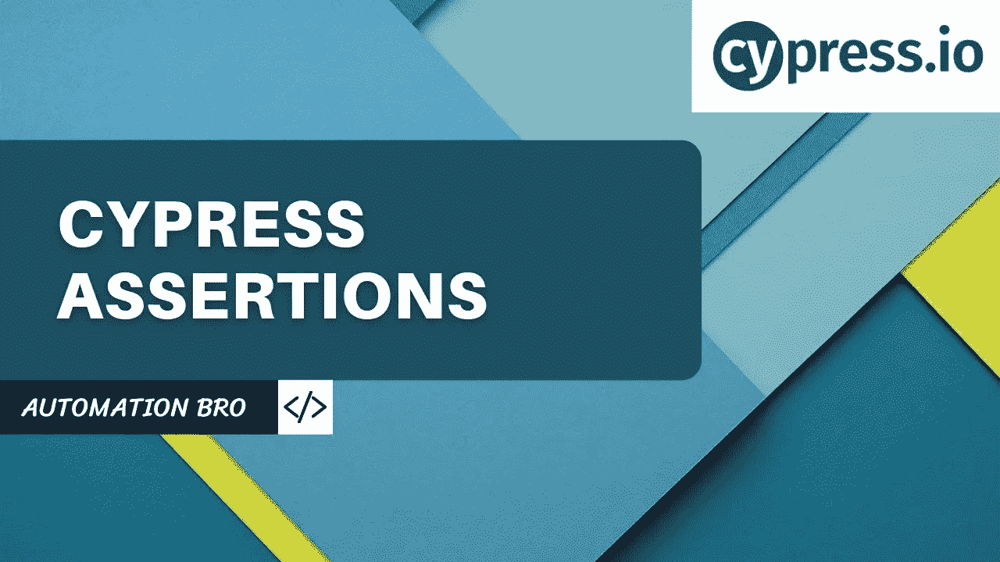
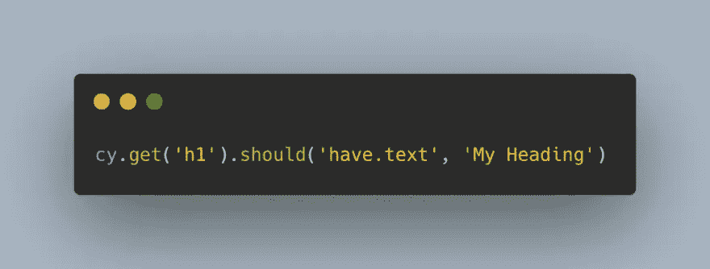
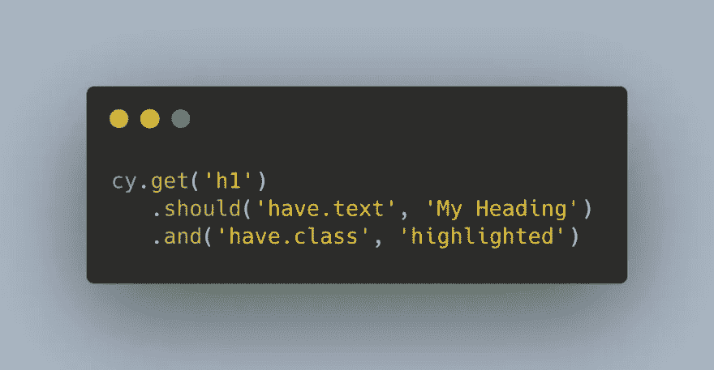
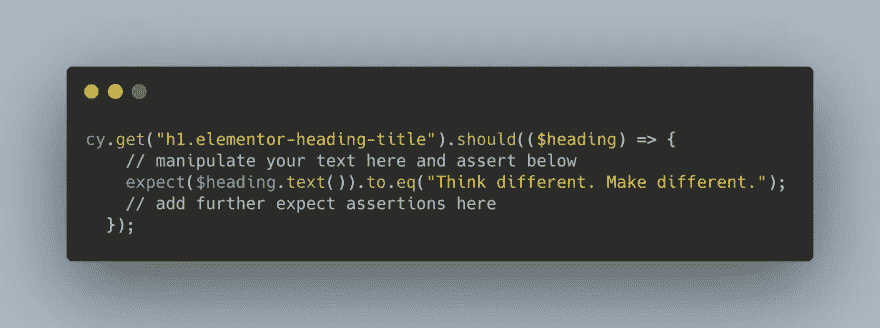

# 柏树断言的类型

> 原文：<https://javascript.plainenglish.io/types-of-cypress-assertions-405844a5c8cf?source=collection_archive---------8----------------------->

[https://youtu.be/naTXinVm58Y](https://youtu.be/naTXinVm58Y)

在本教程中，我们将介绍不同类型的 Cypress 断言，如默认、隐式和显式断言，并讨论 should 和 expect 断言之间的区别。

Cypress 使用 Chai 断言库以及 Sinon & jQuery 的扩展免费为您提供几十个强大的断言。

# 默认断言

Cypress 附带了许多默认的断言，无需显式定义就可以使用，比如——

*   **cy.visit():** 每次你访问一个页面，Cypress 都希望这个页面返回一个 200 状态码
*   **cy . get():**get 命令希望元素在试图访问它之前先存在于 DOM 中

# 隐式断言

隐式断言在做出断言时使用了`should()`或`and()`命令。这是在 Cypress 中进行断言的更好的方式。

您甚至可以将多个断言链接在一起

# 明确的断言

当您想要为同一个主题做出多个断言，或者想要在做出断言之前操作您的主题时，您应该使用显式断言。对于显式断言，您将使用`expect`命令。

## 查看下面的视频，了解更多关于 Cypress 断言的信息——

感谢阅读！

*更多内容请看*[***plain English . io***](http://plainenglish.io/)