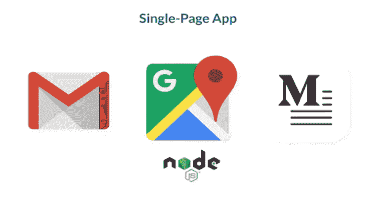

# 可以用 Node.js 技术构建的实时 Web 应用程序的类型

> 原文：<https://javascript.plainenglish.io/types-of-real-time-web-applications-you-can-build-with-node-js-technology-ba2af2af888a?source=collection_archive---------1----------------------->

Node.js 已经成为最稳定的技术，因为大多数应用程序的后端都是用它构建的。这是 It 行业中的一个流行名称，因为它可以满足现在和未来的业务和用户需求。这就是为什么 Node.js 被世界上一些最知名的公司所使用。

你知道吗？根据各种[研究](https://hostingtribunal.com/blog/node-js-stats/#gref)，Node Js 被全球 1%到 2.2%的网站使用。当应用于整个互联网时，这表明**至少有 2000 万网站使用 node JS。**

多亏了 Node.js 这样的技术，即使人们继续大量地同时使用实时 web 应用程序，也有可能创建出几乎可以即时响应请求的应用程序。

这些类型的实时 web 应用程序看起来像什么？让我们看看可以用 Node.js 技术构建的七个不同选项，以及它们可能解决的问题。

开始了…

# Node.js 到底是什么？

Node.js 在现代网络上无处不在，很难忽视。Node.js 是一个免费的开源平台，运行在 javascript 上，允许你快速创建网络应用。

这里有一些信息可以帮助您了解为什么应该使用 Node.js，以及可以用它创建什么样的应用程序。

# 为什么是 Node.js？

*   它使用非阻塞 I/O 和事件驱动的设计，这使它变得轻量级和高效。
*   它基于 Chrome 的 V8 JavaScript 引擎，这是一个开源引擎，可以快速地将 JavaScript 代码转换为机器代码。
*   它利用了 npm 包管理(最大的开源库生态系统)。它包括模块所需的所有文件。

# 使用 Node.js 的优势:

以下是一些好处:

*   强健的框架
*   快速 web 应用程序开发
*   增强响应能力
*   丰富的生态系统
*   微服务架构的高可扩展性
*   流畅的 JSON 支持

# 使用 Node.js 技术可以构建 7 种类型的实时 Web 应用程序

Node.js 对各种应用程序都有很多好处。您可以使用 Node.js 创建的前 9 种应用程序如下:

## 头号实时聊天应用

实时聊天现在在社交网络、商业网站和互联网上的几乎所有地方都很常见。任何允许从发送者到接收者的文本、视频或音频通信的实时传输的在线通信技术被称为实时聊天。

**即时消息(IM)或互联网中继聊天(IRC)技术**可以实时创建一对一或一对多的小组讨论。

此外，就功能和代码库而言，实时聊天应用程序往往相对简单，这使得它们非常适合于原型开发和各种技术的试验(如 WebSockets)。

**Node.js 包括创建任何复杂程度的实时聊天的所有基本功能**。尤其是 Node，它提供了一个复杂的事件 API，使得创建特定类型的对象(“发射器”)变得很容易，这些对象会发出命名事件，事件处理程序会定期“监听”这些事件。

实时聊天应用是你可以用 Node.js 构建的最常见的类型，无论是社交网络应用还是交互式商业网站。

## 排名第二的单页应用程序(spa)

单页应用程序(SPA)是只需要一个浏览器页面就可以运行的 web 应用程序。应用程序动态重写现有页面，而不是加载新页面。用户将享受类似的体验，就像他们在使用桌面应用程序一样。

**spa 现在通常被用来构建社交网络应用**、项目管理解决方案以及各种其他应用。SPA 最实际的例子是 Gmail。它使用 AJAX 实时跟踪最近的通信。

Node.js 是一个复杂的运行时环境，能够轻松处理**异步调用和巨大的 I/O 工作负载**。这使它成为复杂水疗的理想选择。

Node.js 的事件循环功能允许它同时推迟几个客户端请求。因此，它确保了完美的数据更新以及渐进和一致的过渡。

## #3 物联网(IoT)

物联网是一个涉及使用互联网连接物理事物的概念。这些设备内置传感器、执行器和信标，允许它们广播和接收数据。

从商业和家庭安全到教育和汽车、医疗保健和工业设备、农业和交通、旅游、保险和娱乐，物联网在各个行业领域迅速发展。

随着物联网的兴起，Node.js 已经成为开发公共和私有物联网设备的最受欢迎的平台之一。

## #4 微服务架构

Utilitium 和 ServiceDoc 就是两个 Node.js 微服务的例子。这些应用程序由各种模块组成，每个模块在应用程序的整体功能中扮演一个特定的角色。

模块定期构建和测试，以实现全面的应用。这种架构有助于大型公司的建立。

在 Node.js 微服务架构项目中使用了 Express 和 Koa 框架。这些应用程序的开发团队分散在各地。你可以 [**雇佣 node.js 开发者**](https://www.pixelcrayons.com/hire-node-Js-developers) 如果你想开发这种类型的 web 应用。

## #5 远程协作工具

Trello 是实时 Node.js 应用程序的一个很好的例子。因为大多数公司都是远程运营，所以开发远程协作应用是一个迫切的需求。

这些应用程序**帮助员工在办公室外工作时提高工作效率**。因为这些应用程序配备了独特的工具，所以在远程工作时代，很容易克服障碍并向前迈进。

**Node.js 实时应用的一个例子就是远程协助**。这款应用使用 React Native 构建，可以在 Android 和 iOS 设备上使用。是技术人员和用户沟通的一种方式。在这个软件的帮助下，你可以有效地进行远程维修。

## 排名第六的流媒体应用

与远程服务器应用不同，应用流在最终用户的本地机器上执行程序。应用程序流允许按需下载部分应用程序，而不会导致服务器或本地机器过载。

首先只下载引导所需的应用程序组件，如果需要，其余组件在后台下载。当应用程序完全下载后，无需网络连接即可运行。

由于其本地流 API， **Node.js 是创建这种流应用的理想选择。** Node.js 特别包含了一个可读可写的流接口，可以快速处理和监控。

流实例是 Unix 管道，允许应用程序的可执行代码元素传输到本地系统，同时保持连接开放，以便按需下载新组件。

用户可以使用流通过管道相互发送请求，数据可以直接传输到最终目的地。

## #7 在线支付服务

每个在线支付系统必须是可扩展的，并且能够同时处理多个金融交易。因此，开发人员应该采用适当的技术来实现这一目标。此外，Node.js 似乎是创建高端在线支付解决方案的合适选择。

PayPal 是首批在应用开发中使用 Node.js 的金融机构之一。这通常被认为是世界上使用最频繁的在线支付机制。 **PayPal 的全球用户群在 2019 年增长到 3.05 亿，**并且逐年增加。

# 底线

总而言之，Node.js 非常适合创建需要大量客户端渲染、多个并发请求以及客户端和服务器之间频繁数据交换的应用程序。

当谈到创建数据驱动和重量级 I/O 应用程序时，Node.js 应该是您的首选。如果你愿意，你可以联系印度一家顶级的 [**Node.js 开发公司**](https://www.pixelcrayons.com/javascript-development/nodejs-development) 来开发你健壮的实时 web 应用。

祝你好运！

*更多内容看*[***plain English . io***](http://plainenglish.io/)