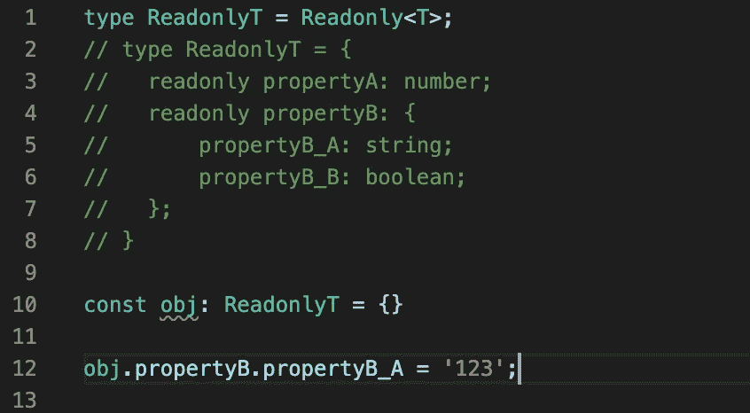
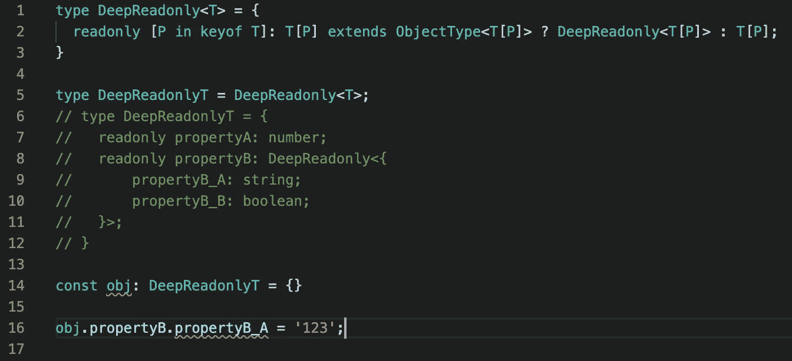

# TypeScript 高级:映射类型和条件类型

> 原文：<https://javascript.plainenglish.io/typescript-advanced-mapped-and-conditional-types-2d10c96042fe?source=collection_archive---------0----------------------->

这是我修订 TypeScript 高级文档后的发现的延续。在本文中，我们将关注更强大的东西，它允许我们创建更复杂的类型，如将旧类型映射到新类型(**映射类型)**，向我们的类型(**条件类型)**添加额外的约束，并最终通过将**映射类型**和**条件类型**组合在一起来创建真正有用的类型。别说了，我们开始吧！

## **映射类型**

一般来说，映射类型是基于“旧的”、已经存在的类型创建的类型。一个典型的例子是，当我们有一些接口，并希望拥有完全相同的属性，但却是可选的

我们应该映射类型，而不是重新定义所有接口。为此，我们可以在这里使用已经定义的实用程序类型`Parital<T>`，`T`是我们的接口(`Car`)

除了这种方法更快、更干燥(我们不需要两次定义完全相同的接口)的事实之外，它还防止了我们在每次更新`Car`接口时出现诸如打字错误或忘记更新`CarPartial`接口之类的错误。

除了`Partial<T>`之外，我们通常用于映射类型的其他接口有

*   `Readonly<T>`使所有`T`类型属性不可更改

*   `Required<T>`与`Partial<T>`相反，使所有`T`类型属性成为必需

*   `NonNullabel<T>`使所有属性不可为空

我们也可以创建自己的实用程序类型，例如与`NonNullabel<T>`相反的`Nullable<T>`,使所有属性都可以为空

在`line 8`中，我们从类型`T`中取出每个属性`P`，并赋予完全相同的类型`T[P]`，但也考虑到了`null`的值。

**用给定的键列表创建一个类型**

下一个有用的例子是创建一个具有几个属性的类型`T1`,我们从另一个类型`Keys`获取这些属性，后者保存一个键列表

我们也可以使用已经定义的实用程序类型`Record<K, T>`

## 条件类型

在条件类型的一般语法中，三元运算符非常相似

因此，如果类型`T`扩展了类型`U`，那么该类型将是`X`，否则，它将是`Y`，基于此，我们可以编写一个类型，将泛型类型`T`与其中一个 JavaScript 类型进行比较，如果是相同的类型，则返回。

我们还可以使用`extends`关键字作为泛型类型的约束，例如，假设我们想要创建一个返回数组长度的泛型类型`Length<T>`，那么类型`T`必须是一个数组。

## 分配条件类型

> 被检查类型为裸类型参数的条件类型称为**分配条件** *类型*。
> 
> —打字稿文档

例如:

它是如何解析类型的？`TypeName<T>`其中`T extends U ? X : Y`并且如果`T`有`string | () => void`，那么它将被解析为`(string extends U ? X : Y) | (() => void extends U ? X : Y)`

另一个使用条件类型和分布条件类型的例子可以是泛型类型`Get<T>`，其中`T`可以是`object`或`array`，这取决于我们使用的是`GetProperty<T>`还是`GetProperties<T>`类型

请注意`line 19`即使我们将`string[]`作为第二个参数传递，它也解析为`GetProperties<string>`，这是因为我们在`line 3`中使用了`T[number]`。我们利用了这样一个事实:在这一步，我们知道类型`T`是一个`array`类型(`T extends any[]`返回`true`)，我们可以使用`array`的一些特定属性。

## **结合在一起**

正如我在开始时提到的，我们可以通过使用**映射类型**和**条件类型**来创建真正有用的类型，所以现在我想更多地关注这一点。

让我们以`Readonly<T>`实用程序类型为例，但是我们的类型`T`将是一个比我们描述映射类型时更复杂的类型

那么，我们怎样才能使`T`类型的所有属性都是只读的呢？如果我们试图将我们的`T`作为`Readonly<T>`的参数传递，那么只有`propertyA`和`propertyB`将被标记为只读

正如你所看到的，我们仍然能够给`propertyB_A`赋值，所以我们的 readonly 对有`depth > 1`的属性不起作用

为了解决这个问题，我们必须创建`DeepReadonly<T>` a 类型。首先，每当我们的属性是一个`object`时，我们必须识别，为此我们创建一个`ObjectType<T>`

首先，我们检查`T`是否扩展了对象，如果是，那么我们必须创建另一个`extends`来过滤掉`Function`类型(函数扩展了对象)

现在，无论类型`T`是否是对象，我们都可以创建`DeepReadonly<T>`

基本上，我们实现了常规的`Readonly<T>`(从类型`T`遍历所有属性`P`)但是在`T`是`object`的情况下，我们递归地调用`DeepReadonly<T>`并将当前属性作为参数，因此在我们的情况下`T[P]`将是`propertyA`、`propertyB`、`propertyB_A`、`propertyB_B`。

结果，我们不能给`propertyB_A`赋值，所以我们的`DeepReadonly<T>`有效！

自己尝试一下，尤其是尝试将**映射类型**与**条件类型**结合起来，并创建一些有用的类型，如`DeepReadonly<T>`。

**推特**:[*k _ wdowik*](https://twitter.com/k_wdowik)

*更多内容请看*[***plain English . io***](http://plainenglish.io/)