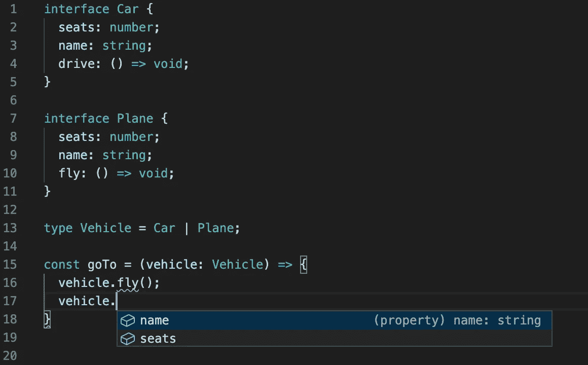
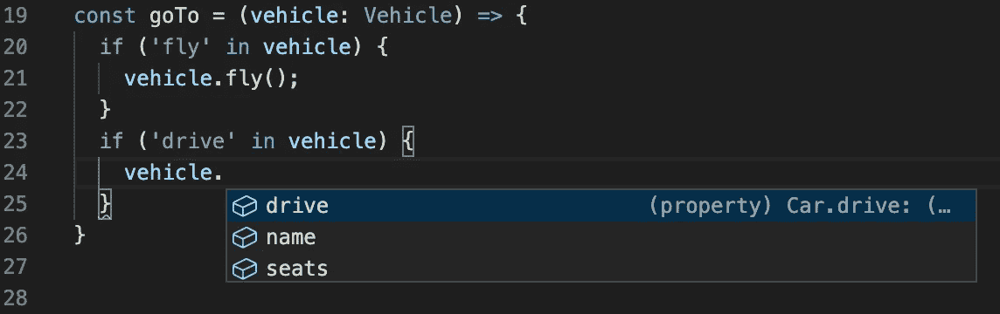
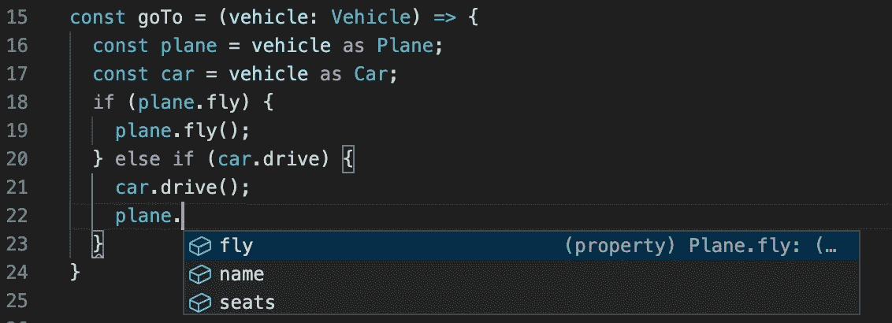
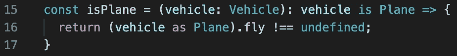
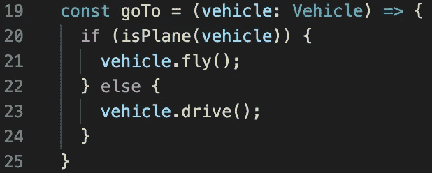
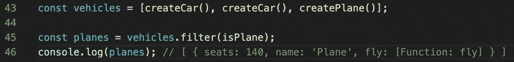
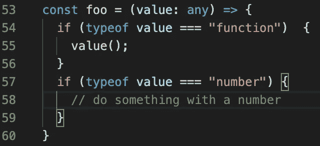
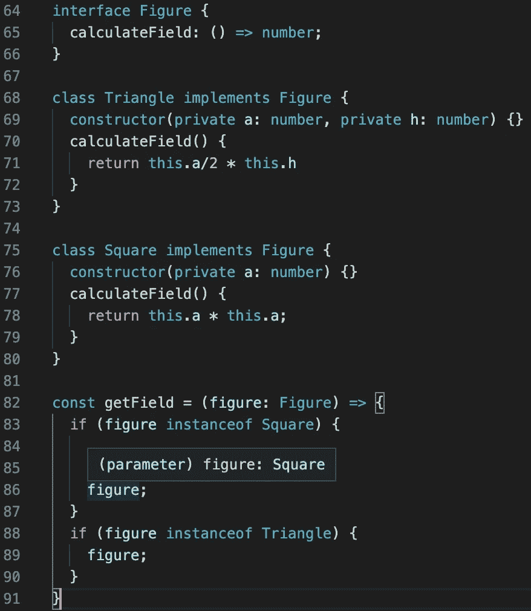

# 高级打字稿类型保护

> 原文：<https://javascript.plainenglish.io/typescript-advanced-type-guards-7a2b7354b819?source=collection_archive---------7----------------------->

## 如何确定车辆是汽车？

我重温了 TypeScript 文档，以刷新我对已知内容的记忆，并检查我不知道的内容。我想在我做完那件事之后，分享我的发现会很好。

我从 Type Guards 开始，但是我想创作更多与高级 TypeScript 相关的文章(或者至少是文档中所说的高级水平)。今天我将集中讨论区分类型的方法。所以，事不宜迟，让我们开始吧。

## **区分类型**

我们将试图解决的问题是一个常见的情况。该方法接收某个泛型类型作为参数，在我们的例子中是`Vehicle`，然后尝试使用更具体类型的属性，`fly`用于`Plane`，而`drive`用于`Car`。

那么如何才能从题目中回答问题呢？*如何确定车辆是汽车？如何缩小一个类型的范围？我们来看看两个接口`Car`和`Plane`，类型`Vehicle`和方法`goTo`。*

`goTo`是当我们的车辆是`Car`或`Plane`时我们想要使用的方法，以便调用适当的行驶方法。

然而，方法`goTo`无法区分`vehcicle`是`Car`还是`Plane`，我们只能对两个接口使用相同的属性。回到我们的问题:我们如何区分它们？我们如何检查接口中成员的存在？我们必须保证一个成员的存在，我们可以使用类型保护来实现。

*类型保护是一个执行运行时检查的表达式，它保证类型在某个范围内。*

让我们看看如何使用不同的类型:

**使用操作器**中的

**

***属性访问器***

**

*在我看来，这不是最好的方法，因为在你说(cast)运载工具是飞机或汽车(第 15-16 行)之后，你可能会失去验证，并且可以毫无意义地调用使用对象的属性(第 22 行)。*

## ***自定义类型防护***

*首先，我们必须定义一个函数，它的返回类型谓词:*

**

*请注意我们所说的返回类型，即我们期望的确切类型(`parameterName is Type`)*

*然后我们可以这样使用它:*

**

*这保证了更具体的类型。这种方式增加了可读性，并允许我们再次使用`isPlane`函数进行过滤:*

**

## ***其他类型的防护装置***

*除了我上面描述的方法，我们还有另外两种区分类型的方法:*

***类型的***

*让我们试着检查一个变量是不是某种原始类型(`number`、`string`等等)。要做到这一点，你不必写一个特殊的函数，你只需使用关键字`typeof`。*

**

***实例 of***

*instanceof type guard 用于使用构造函数缩小类型，类似于它在 JavaScript 中的工作方式。*

**

*如你所见，`instanceof`的右边是一个构造函数。然后，在条件(第 86 行)中，我们知道图形属于`Square`类型，因此我们可以为该类型使用任何特定的属性。*

## ***收尾思路***

*我更喜欢使用一个用户定义的类型保护，带有一个定义的函数，它的返回类型是谓词，用于基本类型`typeof`。为什么？在我看来，这种方式增加了可读性。*

*玩一会儿。自己尝试不同的东西！*

***推特**:[*k _ wdowik*](https://twitter.com/k_wdowik)*

**更多内容请看*[*plain English . io*](http://plainenglish.io/)*