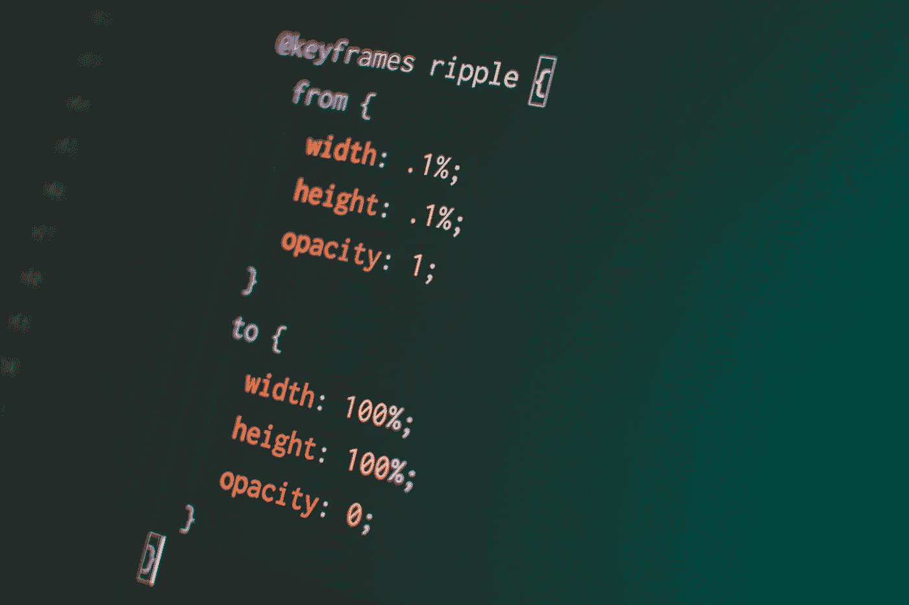

# TypeScript 高级类型

> 原文：<https://javascript.plainenglish.io/typescript-advanced-types-b6d0f19bcbf5?source=collection_archive---------9----------------------->

## 提高开发技能的打字技巧



Photo by [Pankaj Patel](https://unsplash.com/@pankajpatel?utm_source=unsplash&utm_medium=referral&utm_content=creditCopyText) on [Unsplash](https://unsplash.com/s/photos/advanced-types-code?utm_source=unsplash&utm_medium=referral&utm_content=creditCopyText)

TypeScript 具有一些高级语言功能，可以在处理基本类型和对象时使用。在本文中，我们将快速了解这些高级类型特性，包括:

*   工会类型
*   防护类型
*   键入别名
*   空且未定义
*   物体静止和伸展

## 工会类型

TypeScript 允许我们将一个类型表示为两个或更多其他类型的组合。这种技术称为联合类型，使用管道符号(|)。考虑以下类型脚本代码:

```
var union : string | number;union = 7;
console.log(`union : ${union}`); // Output: union: 7union = "article"; 
console.log(`union : ${union}`); // Output: union: article
```

变量`union`使用联合类型语法来表示它可以保存一个`string`或一个`number`。

函数参数也可以是联合类型:

```
function checkType(patientId: (string | number))
{
    if(typeof(patientId) === "number")
        console.log('PatientId is a number.')
    else if(typeof(patientId) === "string")
        console.log('PatientId is a string.')
}

checkType(9876); // Output: PatientId is a number.
checkType("PI-1234-AZ"); // Output: PatientId is a string.
cheyType(true); //Compiler Error: Argument of type 'true' is not assignable to a parameter of type string | number
```

## 防护类型

当使用联合类型时，编译器仍然会应用它的强类型规则来确保我们不会混合和匹配我们的类型。例如，考虑以下代码:

```
function add(
union1 : string | number,
union2 : string | number
){
 return union1 + union2;
}
```

`add`函数接受两个参数并返回它们的和。`union1`和`union2`参数是联合类型，因此可以是`string`或`number`。但是，编译此代码会生成以下错误:

```
**error TS2365: Operator '+' cannot be applied to types 'string | number' and 'string | number'.**
```

这里编译器告诉我们的是，在函数体中，它无法确定`union1`的类型是什么。

这就是型警卫的用武之地。Type guards 是一个表达式，它检查我们的类型，然后确保该类型在其范围内。考虑以下代码:

```
function typeGuardAdd(
union1 : string | number,
union2 : string | number
) : string | number {
 if( typeof union1 ==="string") {
  console.log('first argument is a string'); 
  return union1 + union2;
}
 if (typeof union1 === "number" && typeof union2 === "number") {
  console.log('both arguments are numbers');
  return union1 + union2;
}
console.log('default return');
return union1.toString() + union2.toString();
}
```

在代码的主体中，我们有两个 if 语句。第一条 if 语句检查`union1`的类型是否为`string`。如果是一个`string`，那么`union1`的类型将被视为`if`语句体中的`string`。第二个`if`语句检查`union1`和`union2`是否都是数字类型。在第二个`if`语句的主体中，`union1`和`union2`都被视为数字。这两个 if 语句是我们的类型守卫。

注意，我们最后的返回语句是在`union1`和`union2`上调用`toString`函数。默认情况下，所有基本的 JavaScript 类型都有一个`toString`函数，所以实际上，我们将两个参数都视为字符串并返回结果。

## 键入别名

有时，当使用联合类型时，可能很难记住允许哪些类型。出于这个原因，TypeScript 引入了类型别名的概念，在这里我们可以为类型联合创建特殊的命名类型。因此，类型别名是联合类型的一种方便的命名约定。

类型别名可以在任何使用通用类型的地方使用，并由 Type 关键字表示。因此，我们可以将代码简化如下:

```
type StringOrNumber = string | number;function aliasesAdd(
union1 : StringOrNumber,
union2 : StringOrNumber
){
 return union1.toString() + union2.toString();
}
```

类型别名也可以用于函数签名，如下所示:

```
type CallbackWithString = (string) => void;function usingCallbackWithString(
callback: CallbackWithString) {
  callback("this is a string");
}
```

## 空且未定义

在 JavaScript 中，如果已经声明了一个变量，但没有赋值，那么对其值的查询将返回`undefined`。JavaScript 还包括关键字`null`来区分变量已知但没有值的情况(空)和变量未在当前范围内定义的情况(未定义)。考虑以下 JavaScript 代码:

```
function testUndefined(test) {
  console.log('test parameter :' + test);
}
testUndefined(); // test parameter :undefinedtestUndefined(null); // test parameter :null
```

第一次不带任何参数调用`testUndefined`函数。实际上，这是在不知道或不关心函数需要什么参数的情况下调用函数。JavaScript 允许这种函数调用语法。

TypeScript 为这些案例提供了两个关键字，分别名为`null`和`undefined`。让我们用 TypeScript 重写这个函数，如下所示:

```
function testUndefined(test : null | number) { 
  console.log('test parameter :' + test);
}
```

这里，我们定义了`testUndefined`函数，允许用数字或空值调用该函数。如果我们试图在 TypeScript 中不带任何参数(`testUndefined();`)调用这个函数，就像我们在 JavaScript 中所做的那样，TypeScript 将生成一个错误:

```
**error TS2346: Supplied parameters do not match any signature of call target.**
```

这种指定可以用`null`值调用函数的能力允许我们确保在编译时知道函数的正确用法。

## 物体静止和伸展

在使用基本的 JavaScript 对象时，我们经常需要将一个对象的属性复制到另一个对象中，或者混合匹配各种对象的属性。为了满足这些需求，TypeScript 采用了 ES7 的提议和语言语法，称为 Object Rest 和 Spread。考虑以下类型脚本代码:

```
let firstPerson = { id: 1, name : "Rachel"};
let secondPerson = { …firstPerson };console.log(`secondPerson.id : ${secondPerson.id}`); // secondPerson.id : 1
console.log(`secondPerson.name : ${secondPerson.name}`); // secondPerson.name : Rachel
```

这里，我们首先定义一个名为`firstPerson`的简单 JavaScript 对象，它有`id`和`name`属性。然后，通过指定{… firstPerson}，使用新的 ES7 语法将`firstPerson`的所有属性复制到另一个名为`secondPerson`的对象。为了测试它是否真的复制了所有属性，我们将`secondPerson.id`和`secondPerson.name`的值记录到控制台。

我们也可以使用这个语法将多个对象组合在一起，如下所示:

```
let name = { name : "Rachel"};
let id = { id : 2};let compose = { ...name, ...id };console.log(`compose.id : ${compose.id}`);
console.log(`compose.name : ${compose.name}`);
```

复制属性的 rest 和 spread 语法将递增地应用这些属性。换句话说，如果两个对象都有相同名称的属性，则最后指定的对象属性优先。

## **结论**

在本文中，我们回顾了一些高级的类型脚本类型和技术。一些要点如下:

*   当我们需要在代码中经常使用联合类型时，类型别名提供了一种更简单、更直观的方式来声明命名的联合类型。
*   当您需要组合两个对象时，Rest 和 spread 语法会很有用
*   TypeScript 编译器通常会保护我们的代码不被以非预期的方式使用。例如，调用带有未定义值的函数。在 JS 中可以做的事情。
*   类型保护允许您检查代码中变量的类型，并保证代码块中的变量是您期望的类型。

*更多内容尽在*[***plain English . io***](https://plainenglish.io/)