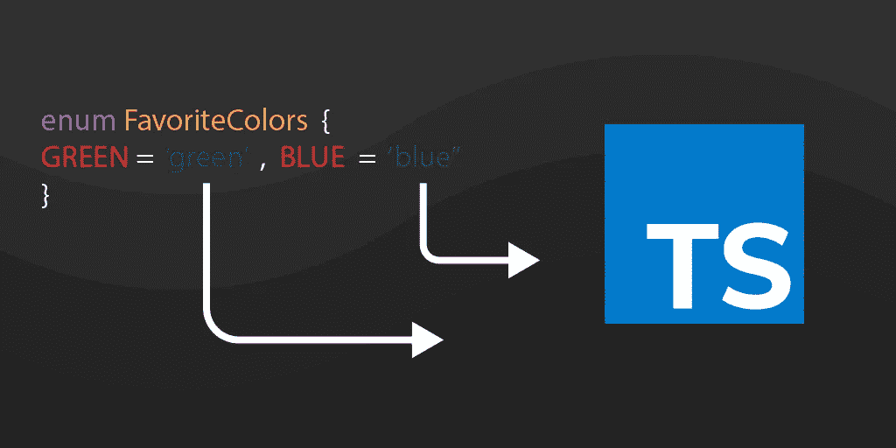

# TypeScript 枚举指南:5 分钟后开始

> 原文：<https://javascript.plainenglish.io/typescript-enum-guide-get-started-in-5-minutes-a4a21b06bd32?source=collection_archive---------6----------------------->



枚举(或枚举)是 TypeScript 中支持的数据类型。枚举在大多数面向对象的编程语言中使用，如 Java 和 C#，现在在 TypeScript 中也可以使用。它们是 TypeScript 的少数几个特性之一，而 TypeScript 不是 JavaScript 的类型级扩展。枚举允许您定义一组命名的常量。使用它们可以更容易地记录意图或创建一组不同的案例。今天，我们将探索 TypeScript 枚举的基础知识，以及用例、各种枚举类型和后续学习步骤。

**我们将报道**:

*   TypeScript 中的 enum 是什么？
*   为什么在 TypeScript 中使用枚举？
*   枚举与替代
*   数字枚举
*   字符串枚举
*   异质枚举
*   使用枚举进行反向映射
*   常数枚举
*   计算枚举
*   接下来学什么

# Typescript 中的 enum 是什么？

TypeScript 枚举**允许您定义一组命名的常量**。使用它们可以更容易地记录意图或创建一组不同的案例。许多编程语言，像 C、C#和 Java，都有一个`enum`数据类型，但是 JavaScript 没有。但是，TypeScript 有。 **TypeScript 既有数字枚举，也有基于字符串的枚举**。

枚举的语法如下:

```
enum States {
    Oregon,
    Washington,
    Idaho,
    Montana,
    Wyoming
}

// usage 
var region = States.Washington;
```

在我们更仔细地研究一些不同的枚举类型之前，让我们讨论一下枚举在 TypeScript 中的好处。

# 为什么在 TypeScript 中使用枚举？

枚举是在 TypeScript 中组织代码的好方法。让我们来看看一些优点:

*   提供灵活性，使表达和记录意图和用例变得更加容易
*   用 JavaScript 中的内联代码保存编译时和运行时
*   允许在 JavaScript 中创建节省内存的自定义常量
*   等等。

# 枚举与替代

虽然使用类型脚本枚举有很多好处，但是有些时候你*不应该*使用它们，比如:

*   **重新分配或更改枚举成员值**:枚举是类型安全的，在重新分配时会返回编译错误
*   **记录动态值**:枚举适用于有限项目，有助于创建用户定义的常量系统
*   **使用变量**:枚举不能用作变量，这样做会返回错误

现在，让我们更深入地研究一些枚举类型。

# 数字枚举

数字枚举**将字符串值存储为数字**。可以使用`enum`关键字来定义它们。假设您想要存储一组不同类型的汽车。下面的示例显示了 TypeScript 中的数值枚举:

```
enum CarType {
    Honda,
    Toyota,
    Subaru,
    Hyundai
}
```

枚举值`CarType`有四个值:本田、丰田、斯巴鲁和现代。枚举值从零开始，每个成员递增 1，如下所示:

```
Honda = 0
Toyota = 1
Subaru = 2
Hyundai = 3
```

如果需要，您可以自己初始化第一个数值，如下所示:

```
enum CarType {
    Honda = 1,
    Toyota,
    Subaru,
    Hyundai
}
```

在上面的例子中，我们用数值 1 初始化了第一个成员`Honda`。剩余的数字将增加 1。

> ***注意*** *:没有必要给你的枚举成员赋值。您可以为它们指定任何想要的值。*

# 字符串枚举

字符串枚举类似于数值枚举，但是它们的**枚举值是用字符串值而不是数值**初始化的。字符串枚举比数字枚举有更好的可读性，使你的程序更容易调试。

下面的示例使用与数值枚举示例相同的信息，但表示为字符串枚举:

```
enum CarType {
    Honda = "HONDA",
    Toyota = "TOYOTA",
    Subaru = "SUBARU",
    Hyundai = "HYUNDAI"
}
// Access String Enum
CarType.Toyota; //returns TOYOTA
CarType['Honda']; //returns HONDA
```

在示例中，我们用与数字枚举相同的值定义了字符串枚举`CarType`，除了枚举值被初始化为字符串文字。

> ***注意*** *:字符串枚举值需要单独初始化。*

# 异质枚举

异构枚举**包含数值和字符串值**。这里有一个例子:

```
enum BooleanHeterogeneousEnum {
    Yes = 0,
    No = "NO",
}
```

# 使用枚举进行反向映射

您知道 num 值可以使用它们对应的枚举成员值来检索。使用反向映射，您可以从成员的值中**访问成员的值和成员名称。让我们看一个例子:**

```
enum CarType {
    Honda = 1,
    Toyota,
    Subaru,
    Hyundai
}

CarType.Subaru; // returns 3
CarType["Subaru"]; // returns 3
CarType[3]; // returns Subaru
```

`CarType[3]`由于反向映射，返回其成员名称“斯巴鲁”。让我们看另一个例子:

```
enum CarType {
    Honda = 1,
    Toyota,
    Subaru,
    Hyundai
}
console.log(CarType)
```

您将在浏览器控制台中看到以下输出:

```
{
    '1': 'Honda',
    '2': 'Toyota',
    '3': 'Subaru',
    '4': 'Hyundai',
    Honda: 1,
    Toyota: 2,
    Subaru: 3,
    Hyundai: 4
}
```

枚举的每个值在内部存储的枚举对象中出现两次。

# 常数枚举

您可以使用常量枚举来提高数值枚举的性能。它们是使用`const`修饰符定义的:

```
const enum Enum {
    X = 1
    Y = X * 2,
}
```

与常规枚举不同，常量枚举在编译期间被完全移除。它们只能使用常量枚举表达式，并在使用站点内联。

# 计算枚举

枚举成员的值可以是*常量值*或*计算值*。以下示例包括计算值:

```
enum CarType {
    Honda = 1,
    Toyota = getCarTypeCode('toyota'),
    Subaru = Toyota * 3,
    Hyundai = 10
}

function getCarTypeCode(carName: string): number {
    if (carName === 'toyota') {
        return 5;
    }
}

CarType.Toyota; // returns 5
CarType.Subaru; // returns 15
```

如果枚举同时包含计算成员和常数成员，则未初始化的枚举成员会出现在其他具有数字常数的初始化成员之前或之后。下一个示例将显示一个错误:

```
enum CarType {
    Toyota = getCarTypeCode('toyota'),
    Honda, // Error: Enum member must have initializer
    Subaru,
    Hyundai = Toyota * 3,
}
```

您可以像这样声明上面的枚举:

```
enum CarType {
    Honda,
    Hyundai,
    Toyota = getCarTypeCode('toyota'),
    Subaru = Toyota * 3
```

# 接下来学什么

TypeScript 为客户端开发人员提供了许多优势。它比其他一些替代方法更容易掌握，因为您可以使用 JavaScript 背景。TypeScript 枚举使记录意图或创建一组独特的事例变得更加容易。

既然您对不同的类型脚本枚举及其优点有了更多的了解，那么您就准备好学习更多的高级类型脚本概念了。接下来推荐的主题包括:

*   严格类型
*   通用函数
*   映射类型
*   还有更多

*快乐学习！*

*更多内容尽在*[plain English . io](http://plainenglish.io/)