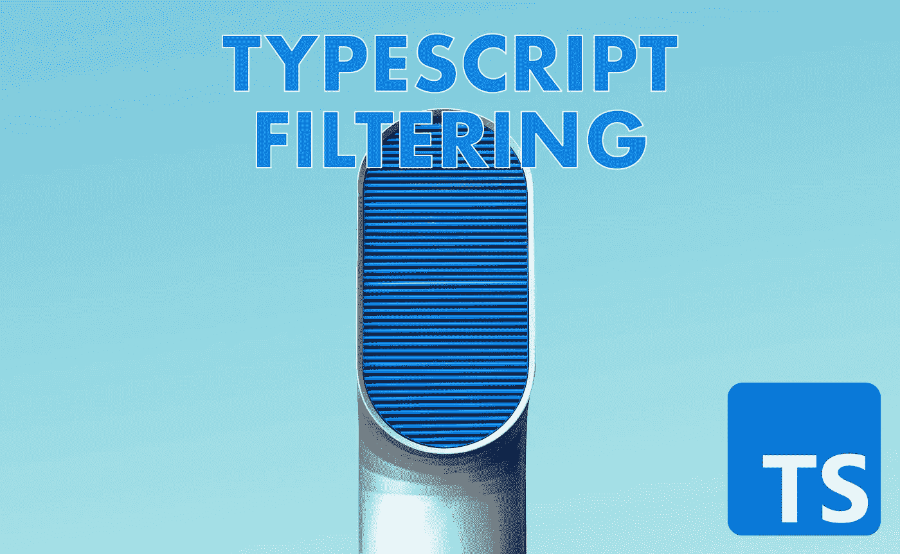

# TypeScript 要点:有条件地筛选类型

> 原文：<https://javascript.plainenglish.io/typescript-essentials-conditionally-filter-types-488705bfbf56?source=collection_archive---------1----------------------->



了解如何在 TypeScript 中有条件地筛选类型，并揭开常用模式的神秘面纱。

> 🚧这篇文章要求中级理解类型脚本、[接口](https://www.typescriptlang.org/docs/handbook/2/objects.html) & [泛型](https://www.typescriptlang.org/docs/handbook/2/generics.html)。请查看 [TypeScript 文档](https://www.typescriptlang.org/docs)以了解理解这篇博文所需的更多基础知识。

使用 TypeScript 库时，您经常会遇到一种类型/模式，乍一看会让您感到害怕。

您会在 React 或 NestJs 等流行的库中遇到这种类型。

这种类型的目的是有条件地筛选基于对象的类型。

今天，我将为你揭开这种类型的神秘面纱，到这篇博文结束时，你将已经学会了一些关键的类型脚本概念。

让我们先看看最终结果(我们将在本文中创建的类型):

```
type FilterConditionally<Source, Condition> = Pick<Source, {[K in keyof Source]: Source[K] extends Condition ? K : never}[keyof Source]>;
```

接下来，让我们看看这个类型实际上是做什么的。

这里有一个例子，我们过滤掉每一个不是`string`的接口属性。

```
interface Sample {
    property1: string; // ✅  NOT filtered out
    property2: string; // ✅  NOT filtered out
    property3: number; // ❌ filtered out
    property4: boolean; // ❌ filtered out
}type NewType = **FilterConditionally**<Sample, string>
```

结果是一个新类型，如下所示:

```
type NewType = {
    property1: string;
    property2: string;
}
```

让我们来分析一下这是如何工作的。

# 三个转变

为了做到这一点，我们对我们的类型应用了三个转换:

**1。**转换我们不想转换的属性`never`

**2。**创建我们想要的联合类型的键(在我们的例子中是`"property1" | "property2"`)

**3。**通过从原始类型中挑选我们想要的属性来构造一个新的基于对象的类型(在步骤 2 中我们的联合类型的帮助下)。

# 1.我们不想“永远”改变的属性

这是最难的部分，所以我们会慢慢来。Typescript 有一个[映射类型](https://www.typescriptlang.org/docs/handbook/2/mapped-types.html)的概念。我们可以使用映射类型在旧类型的基础上创建新类型。您可以将它想象成逐个遍历所有属性，并对每个条目应用一些逻辑。

听起来很抽象。让我们孤立地来看这个问题。

> 下面的“MarkUnwantedTypesAsNever”类型是上面的“FilterConditionally”类型的一部分。我们刚刚分离出一个部分，并将其重命名。

```
type MarkUnwantedTypesAsNever<Source, Condition> =
   {[K in keyof Source]: Source[K] extends Condition ? K : never}
```

我们可以使用这个类型将一个基于对象类型的每个属性标记为`never`不符合我们的过滤条件。

**🚧重要提示:**如果一处房产符合我们的条件，我们不会听之任之。我们获取属性的名称，并将其设置为该属性的基于字符串的类型。这是一个在步骤 2 中有用的技巧。

```
interface Sample {
   property1: string; // string extends string ? ✅  set "property1"
   property2: string; // string extends string ? ✅ set "property2"
   property3: number; // number extends string ? ❌ set never
   property4: boolean; // boolean extends string ? ❌ set never
}
```

结果类型为:

```
type Result = {
    property1: **"property1"**;
    property2: **"property2"**;
    property3: **never**;
    property4: **never**;
}
```

如果你需要复习一下条件类型(`A extends B ? <something> : <else>`)，可以查看[类型脚本文档](https://www.typescriptlang.org/docs/handbook/2/conditional-types.html)。

# 2.创建我们想要的联合类型的键

既然我们已经对我们的类型应用了第一个转换，那么现在是第二个转换的时候了。我们的目标是为所有匹配我们条件的键创建一个联合类型。

我们正在寻找一种方法将`Result`转化为`Type ResultAfterSecondTransformation = "property1" | "property2"`。

我们可以通过添加一个[索引访问类型](https://www.typescriptlang.org/docs/handbook/2/indexed-access-types.html)来做到这一点。

```
type MarkUnwantedTypesAsNever<Source, Condition> =
   {[K in keyof Source]: Source[K] extends Condition ? K : never}**[keyof Source]**
```

让我们看看如果我们把我们的`Sample`类型传递给它:`MarkUnwantedTypesAsNever<Sample, string>`，这个类型会做什么。

```
type Result = {
   property1: "property1";
   property2: "property2";
   property3: never; // ❌ we want this gone
   property4: never; // ❌ we want this gone
}["property1" | "property2" | "property3" | "property4"]
```

记住！当我们通过一个索引访问一个接口的属性时，我们接收那个属性的类型:

```
type Access = {property1: "foo"}["property1"] // -> "foo";
```

如果我们对两个属性进行同样的操作，我们将构建一个联合类型:

```
type Access = {property1: "foo"; property2: "bar"}["property1" | "property2"]// Result: **type Deepdive = "foo" | "bar"**
```

如果我们试图访问带有`never`类型的属性的类型，那么`never`类型将不会包含在结果并集中。

```
type Access = {property1: "foo"; property2: never}["property1" | "property2"]// Result: **type Deepdive = "foo"**
```

理解为什么`never`类型会被过滤掉通常很难，因为这需要一些集合知识。如果您有兴趣了解更多信息，请阅读下面的免责声明。

> 🚧免责声明:从来没有类型被过滤掉，因为它们在 TypeScript(集合论)中定义了一个空集。当用空集和任何其他值构建并集时，可以省略空集。和写 2 + 0 = 2 或者 2 = 2 是一样的。可以省略空的东西。同样的事情。真的。

快速回顾:

在本节的最后，我们现在将原始类型转换为以下形状:

```
interface Sample {
   property1: string;
   property2: string;
   property3: number;
   property4: boolean;
}
```

…形成一个具有以下形状的联合:

```
"property1" | "property2"
```

为了实现这一点，我们使用了两个转换。

我们为应用这两种变换而创建的类型具有以下形状:

```
type CreateUnionOfWantedPropertyKeys<Source, Condition> =
   {[K in keyof Source]: Source[K] extends Condition ? K : never}[keyof Source]
```

# 3.挑选我们想要的类型

我们的最后一步简单明了。现在我们有了一个通过过滤条件的键的联合，我们可以使用内置的`Pick`类型。

```
type FinalType<Source, Condition> = **Pick**<Source, CreateUnionOfWantedPropertyKeys<Source, Condition>>;
```

这就是了。我们完了。这是我们的最终类型！如果我们用它的定义替换`CreateUnionOfWantedPropertyKeys`(为了精简我们的代码)，我们从这篇文章的最开始就得到`FilterConditionally`类型:

```
type FilterConditionally<Source, Condition> = Pick<Source, {[K in keyof Source]: Source[K] extends Condition ? K : never}[keyof Source]>;
```

# 我们在“野外”哪里看到这种类型？

理解这种类型可以让您在使用 ReactJS 类型时更加得心应手，因为 React 中一个非常基础的类型依赖于这种模式:

```
type ElementType<P = any> = {[K in keyof JSX.IntrinsicElements]: P extends JSX.IntrinsicElements[K] ? K : never}[keyof JSX.IntrinsicElements] | ComponentType<P>;
```

在流行的前端和后端应用程序库中可以找到更多的例子。

# 结论

恭喜你走到这一步。我希望您已经学到了一些重要的 TypeScript 概念。考虑为这篇文章鼓掌(或关注我)，因为它会帮助其他人找到它。

祝你有愉快的一天。继续编码。

> 🚧快速了解一下术语:在本文中，我指的是接口和属性。谈论接口条件就好像它们是 JavaScript 对象的属性一样会阻碍你形成正确的心智模型。类型定义了一组值，而接口不像对象那样具有属性。然而，调用接口条件“属性”简化了我们用来解释类型脚本概念的语言。

*如果你有兴趣增加你在所有社交渠道的有机接触，请查看*[***https://gosquad . cc***](https://gosquad.cc)