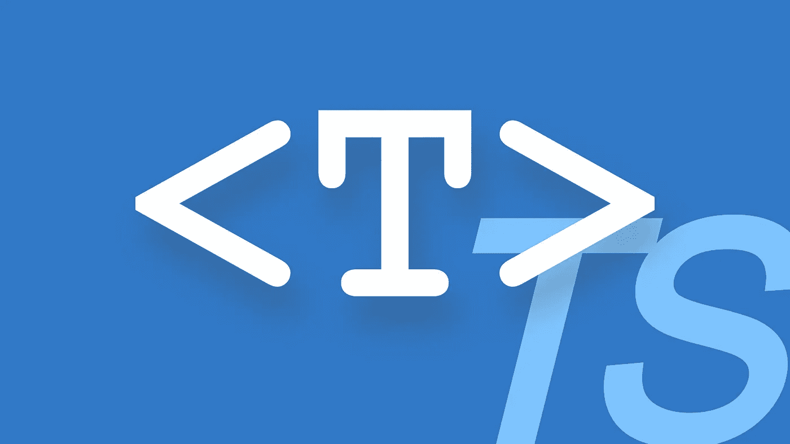
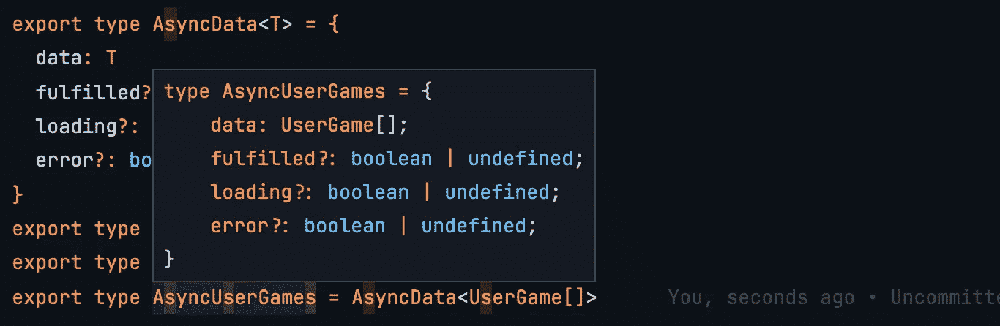

# TypeScript 泛型:尖括号<>是什么？

> 原文：<https://javascript.plainenglish.io/typescript-generics-whats-with-the-angle-brackets-4e242c567269?source=collection_archive---------0----------------------->

一个好的可重用组件在软件工程中有很高的声望。好的抽象很难提出来。他们甚至更难通过满足不断上升的边缘情况来维持生存。但是经过充分测试的设计模式可以提供帮助。泛型就是其中之一。

> 泛型编程是计算机编程的一种形式，其中算法是根据稍后指定的**类型****编写的，然后在需要时为作为参数提供的特定类型进行实例化。—维基百科。**

**JavaScript 社区慢慢接受了 TypeScript，因为它在大型项目中提供了[的好处。](https://karthickragavendran.medium.com/typescript-why-866281eaebf8)**

****

**TypeScript generics**

## **句法**

```
const func = <T>(arg: T) => arg
```

**申报时`func`的类型为`<T>(arg: T) => T`**

**这不是一个非常有用的函数，它只是返回我们发送的任何内容。但是让我们从这里开始，看看如何使用泛型。**

**我们可以像下面这样执行`func`。**

```
func<number>(12)
```

**注意我们在上面的函数调用**中传递了**两个不同的参数**。**一个在括号内`()`另一个在尖括号内`< >`**

**我们知道在函数调用`func(12)`中，圆括号内的参数`12`代表`arg`参数。**

**类似地，在`func<number>(12)`中，尖括号内的参数`number`表示泛型类型参数`T`。**

## **让我们推理一下语法**

**如果你要为 TypeScript 中的泛型设计一个语法，你会怎么做？**

```
Requirement: Find a way to pass **type arguments** along with the normal arguments.
```

**如果我们在 JavaScript 中执行 `func(number)(12)`，就会执行`func`函数两次。所以我们必须有别的东西，这样我们可以让我们的 TypeScript 编译器将`number`理解为一个类型参数，它不会干扰现有的 JavaScript 语法。**

**你会读到其他语言中的泛型设计模式，比如 Java 和 C#。他们使用`< >`来传递类型参数。所以你决定用同样的。**

**我们最终会得到，**

```
func<number>(12)
```

> **不要让`< >`吓倒你。这只是一种将类型作为参数传递的方式。**

## **泛型的实际应用**

**假设您的项目中有以下类型。**

```
export type AsyncGame = {
  item: Game
  fulfilled?: boolean
  loading?: boolean
  error?: boolean
}export type AsyncGames = {
  items: Game[]
  fulfilled?: boolean
  loading?: boolean
  error?: boolean
}export type AsyncUserGame = {
  item: UserGame
  fulfilled?: boolean
  loading?: boolean
  error?: boolean
}export type AsyncUserGames = {
  items: UserGame[]
  fulfilled?: boolean
  loading?: boolean
  error?: boolean
}// Game and UserGame are types we expect from different API 
// responses.
```

**这是非常多余的。他们在行为上有许多共同之处。**

*   ****易错:**查看网络状态`fulfilled`、`loading`、`error`在所有类型中都是可选的。如果我们决定改变某些行为，我们必须更新上面的每个类型。我们可能会错过更新的东西。**
*   ****可伸缩性:**如果我们想引入一种新的类型`AsyncBrowseGames`，将`BrowseGames`类型与网络状态包装在一起，我们将不得不在代码库中创建更多冗余代码。这将导致更多容易出错的地方。**

## **拯救仿制药**

**让我们创建一个通用类型，如下所示:**

```
type AsyncData<**T**> = {
  data: **T**
  fulfilled?: boolean
  loading?: boolean
  error?: boolean
}
```

**它接收一个泛型类型参数`T`，并将其分配给它的一个属性，名为`data`。**

**现在，我们可以创建许多类型来包装其他类型以及网络状态。**

```
type AsyncGames = AsyncData<**Game[]**>
type AsyncGame = AsyncData<**Game | null**>
type AsyncUser = AsyncData<**User | null**>
type AsyncUserGames = AsyncData<**UserGame[]**>
type AsyncBrowseGames = AsyncData<**BrowseGame[]**>
```

**看看当我们将鼠标悬停在其中一种类型上时，VSCode 向我们显示了什么？**

****

**多酷啊。**

**我们用很少的代码生成了很多派生类型。我们还确保了这些派生类型之间行为的一致性。**

**这就是 TypeScript 中泛型的全部内容。谢谢你。下次见。**

***更多内容请看*[***plain English . io***](http://plainenglish.io/)**