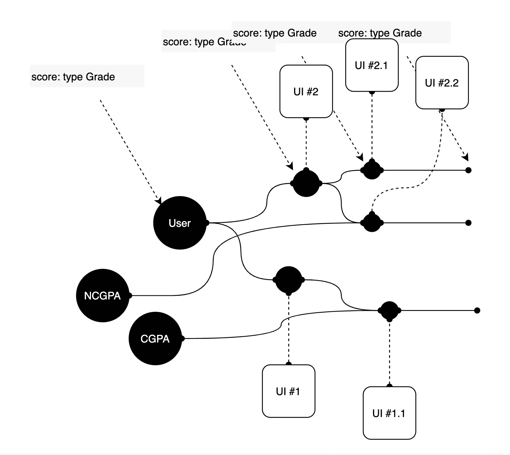
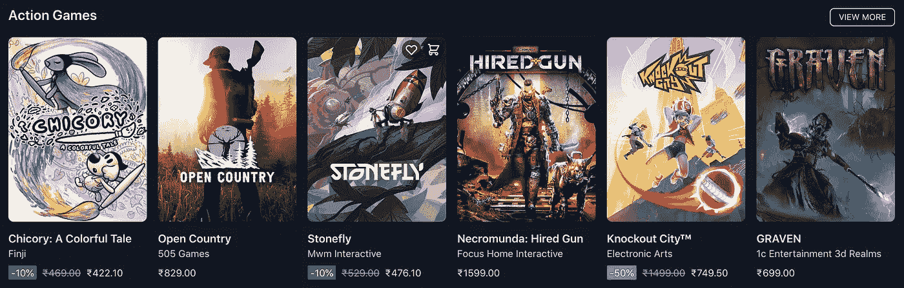

# TypeScript:如何创建同步的派生类型

> 原文：<https://javascript.plainenglish.io/typescript-how-to-create-synchronized-derived-types-4bf2371a9eab?source=collection_archive---------4----------------------->

我们的应用程序的任何部分消耗的数据都不会与应用程序接收的源数据有太大的不同。


Photo by [Martino Pietropoli](https://unsplash.com/@martino_pietropoli?utm_source=medium&utm_medium=referral) on [Unsplash](https://unsplash.com?utm_source=medium&utm_medium=referral)

## 数据无论在哪里都是相关的

贯穿我们应用程序的数据不能如此互不相关。我们来看一个小例子。

```
// types.tstype User = {
  name: string, // "John Doe"
  age: number, // 22
  score: number, // 6.3
}
```

现在，在我们的应用程序中有一个名为 **UserScore** 的组件，它获取以下属性。

```
// UserScore.tsxtype UserScore = {
  name: string,
  age: number,
  score: number,
  goals: number,
}
```

目标数据从何而来？它可能来自另一个 API 响应。但是现在，我们只是选择使用 ***原始类型*** 来创建这个组件的道具类型。

事情进展得很顺利，直到有一天公司选择修改 score 属性。他们不想存储确切的数字，而是其中的一个。

```
score: 'S' | 'A+' | 'A' | 'B' | 'C' | 'D' | 'U'
```

所以我们修改用户类型如下。为什么是用户类型？因为这是数据进入我们应用程序的地方，自然也是我们首先更新的地方。

```
type User = {
  name: string, // "John Doe"
  age: number, // 22
  score: Grade, // B
}type **Grade** = 'S' | 'A+' | 'A' | 'B' | 'C' | 'D' | 'U'
```

我们引入了一个名为 Grade 的新类型，并将其与我们的用户类型挂钩。

现在，由于我们已经在项目中使用了 typescript，当我们试图将分数从 User type 传递到组件 UserScore 时，将会出现一个错误。

如果我们不小心，为了修复错误，我们可能最终会编写一个 ***适配器*** 来连接 UserScore 和用户类型，但是从那一点开始会变得更糟糕。

> UI/消费者可以插入到流中，并将类型转换成任何东西。但是流会在整个应用程序中保留这些类型。



## 拾取、延伸和组合

我们可以如下更新用户分数。

```
type **User** = {
  name: string, // "John Doe"
  age: number, // 22
  score: Grade, // B
}type **Grade** = 'S' | 'A+' | 'A' | 'B' | 'C' | 'D' | 'U'type **Sport** = {
  name: string,
  goals: number
}type **UserScore** = 
  **Pick**<User, 'name' | 'age' | 'score'> 
  & 
  **Pick**<Sport, 'goals'>
```

Pick 让我们从一个类型中挑选一组属性。因此用户分数保持其与用户和运动的关系。

```
const userScore: **UserScore** = {
  name: 'Karthick',
  age: 33,
  score: 'A+',
  goals: 32,
}
```

使用这种类型的 UI 可以做任何它需要满足的事情。但是表示数据流中节点的类型将始终保持与根类型的关系。

这种严格的类型操作将为开发人员提供良好的体验。在数据流中的任何一点，我们都知道分数是什么类型。

当发生变化时，这种设置足以改变源类型，并且每个与源类型挂钩的**派生类型都将得到更新。现在，适应就成了用户界面/消费者的工作。**

让我们为史诗克隆项目设计我们的类型。

## 来源类型

我们在数据库中存储了**游戏**、**发行商**和**用户游戏**类型。我们从前端代码中那些资源的模式开始。

```
// Clone start branch:
git clone **-b 03-create-types-start** github.com/karthickthankyou/epic-clone// Clone final branch:
git clone **-b 03-create-types-final** github.com/karthickthankyou/epic-clone
```

我们知道标签、特性、注释、平台和状态有一组预定义的值可供选择。我们将它们保持为联合类型，如下所示。

工会类型像枚举一样工作，但是它有它的好处。当企业决定在上述联合类型中引入更新的**元素**时，我们只需更新上述文件，这将相应地塑造依赖类型。

一旦我们对源类型满意了，我们就必须专注于创建派生类型。

## 派生类型

请看游戏类型中的一个示例项目。它非常精致

在我们的主页上，我们列出了大约 40-60 款游戏。下面的卡片展示了一个常见的场景，我们只需要游戏中的一些属性。



a section showing games with limited data

## 挑选

因此，我们创建了一个游戏灯类型。我们可以用[偏](https://www.typescriptlang.org/docs/handbook/utility-types.html)。但是它太宽泛了，我们这样做就失去了所有的必要条件。 [**选择**](https://www.typescriptlang.org/docs/handbook/utility-types.html#picktype-keys) 允许我们将必需的和可选的特性保留为原始类型。

```
Pick<Type, Keys>
```

我们选择显示游戏所需的必要功能，而不是详细的产品页面。类型如下所示。

## 我们可以在联合类型的选项中进行选择吗？

在我们的项目中有一个场景，我们必须只使用 GameGenre 联合类型的一部分。它有很多可能的值，但在我们的主屏幕上，我们选择了只包含“动作' | '冒险' | '谜题' | '叙述”的部分。

列表会随着时间而改变，我们需要一种类型来保护它。首先，我使用泛型创建了一个适用于联合类型的实用程序类型。

```
// Create a subset of union types
export type PickUnion<T, U extends T> = U
```

上面的实用程序类型获得了两个泛型类型，其中一个是父类型。第二个是父对象的子集。我们使用上面的实用程序类型如下。

```
type selectedGenre = PickUnion<GameGenre, 'Action' | 'Adventure' | 'Puzzle' | 'Narration'>// Translates to **type selectedGenre = "Action" | "Adventure" | "Puzzle" | "Narration"**
```

TypeScript 提供了一些[实用程序类型](https://www.typescriptlang.org/docs/handbook/utility-types.html),让我们可以自由地派生出我们想要的类型。

将会有许多组件需要不同的属性，但是使用上述技术，我们可以精确地满足组件的需求！

下一节见。

*更多内容看* [***说白了. io***](http://plainenglish.io)