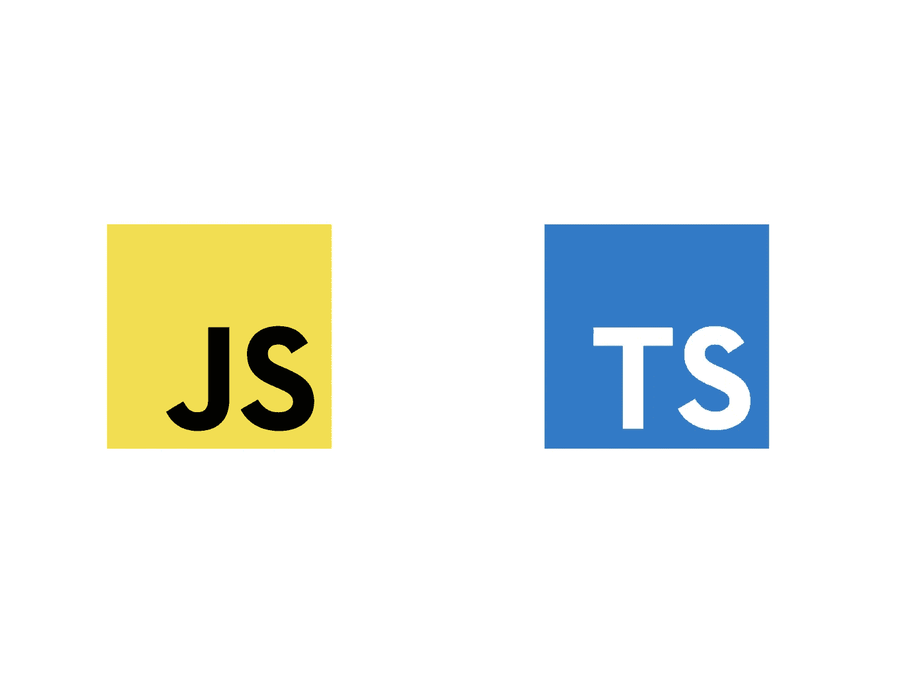

# TypeScript 如何解决 JavaScript 的不变性问题

> 原文：<https://javascript.plainenglish.io/typescript-immutability-b52bece7b9ea?source=collection_archive---------6----------------------->

## TypeScript 中的不可变对象、数组、元组和集



Source: the author

不久前我写了关于 JavaScript 中的 [Immutable.js。](/immutable-js-efe6b42e122f)

为什么？因为 JavaScript 在不变性上有点小问题。
简单回顾一下，以防你不确定*不变性*是什么意思:

> […]一个**不可变对象**是一个对象，它的状态在被创建后不能被修改。
> — Goetz 等人*实践中的 Java 并发*。艾迪森·韦斯利专业版，2006 年

当我们想到不可变数据结构时，我们通常会想到 JavaScript 中的 *const* 关键字。但是剧透:不，`const`通常不会使我们的变量不可变。

常量变量的不变性仅适用于原始数据类型。这里有一个例子。例如，布尔值和数字都是 JavaScript 中的原始数据类型。

```
const value = 1 
value = 2// error - we cannot modify the variable 
```

当我们使用一个布尔值，例如，`true`或其他 50%时，也会出现同样的错误。玩笑归玩笑，我们刚刚看到的，是一个不可变的变量。
然而，当涉及到对象时，比如数组或普通对象，在 JavaScript 中通过 const-keyword 没有不变性。

```
const obj = {
  name: "Max"
}obj.name = "Tom"
```

这实际上会改变对象的 name 属性—它是可变的，而不是不可变的。在我关于这个问题的文章中，我提供了一个不可变的. js 库作为解决方案。然而，TypeScript 也有一个——不会增加我们的生产代码。

让我们来看看如何在 TypeScript 中实现不变性。

# TypeScript 中不可变的普通对象

TypeScript 覆盖了一个叫做接口的特性——你可以把它想象成一个对象的蓝图。属性及其定义方式必须适用于实现的对象。在 TS 中定义属性的方法之一是将其设为只读:

```
interface Person {
 readonly name: string 
}const max: Person = {
 name: "Max"
}
```

现在，我们不能改变值`max.name`，因为我们把它定义为只读。

除了接口，我们还可以使用类。只读设置也适用于此。

```
class Person {  constructor(name: string) {
   this.name = name 
 } readonly name: string 
}const max = new Person("Max")
```

# 使数组不可变

因为数组也是对象，所以它们在 JavaScript 中也是可变的。为了避免这种情况，我们可以对阵列应用只读设置:

```
const names: ReadonlyArray<string> = ["max", "carl"]names[0] = "tom" // error! 
```

# 使元组不可变

元组的工作方式类似于数组——但相比之下，它们精确地定义了元素的数量和类型。

```
const fullName: readonly [string, string] = ["John", "Doe"];
```

# 使集合不可变

最后，让我们讨论一下 TypeScript 中的集合，以及如何使它们不可变。该集合的特点是每个值只出现一次——尽管您可以声明一个具有几个相同值的集合，例如，如果您记录该集合，则只有`1, 2, 3, 3`会在终端中打印出来。

不可变集合可以用下面一行创建:

```
let numberSet: ReadonlySet<number> = new Set([1, 2, 3])
```

这会导致 add 函数不再对它起作用。

感谢您的阅读！

*更多内容看*[***plain English . io***](http://plainenglish.io)