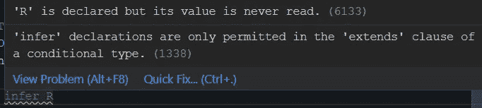

# TypeScript 推断关键字解释

> 原文：<https://javascript.plainenglish.io/typescript-infer-keyword-explained-76f4a7208cb0?source=collection_archive---------3----------------------->

## 什么是推断关键词？有哪些用例？


Photo by [Jeremy Bishop](https://unsplash.com/photos/KFIjzXYg1RM) on [Unsplash](https://unsplash.com/)

关键词`Infer` 可能令人困惑，难以理解。本文旨在对这一概念提供一个清晰明了的解释。

在官方文档中，推断是在[条件类型](https://www.typescriptlang.org/docs/handbook/release-notes/typescript-2-8.html) s 部分中提到的:

> 在条件类型的`extends`子句中，现在可以使用`infer`声明来引入要被推断的类型变量。这种推断的类型变量可以在条件类型的 true 分支中引用。同一类型变量可能有多个`infer`位置。

如果上面的定义对你来说一清二楚，不要担心，你并不孤单。

## 什么是推断关键词？

infer 关键字允许您从条件类型中的另一个类型推导出一个类型。这里有一个例子:

```
*type* UnpackArrayType<T> = T *extends* (infer R)[] ? R: T;*type* t1 = UnpackArrayType<number[]>; // t1 is number
```

`UnpackArrayType`是有条件的类型。读作“*如果 T 是* `*(infer R)[]*` *的子类型，返回* `*R*` *。否则，返回* `*T*`”。

对于类型别名`t1`，因为`number[]`与`(infer R)[]`匹配，所以`UnpackArrayType`中的条件为真。作为推断过程的结果，类型变量`R`被推断为`number`类型，并从真分支返回。 **Infer 是告诉编译器在** `**UnpackArrayType.**`范围内声明了一个新的类型变量 R

```
*type* t2 = UnpackArrayType<string>; //t2 is string
```

对于`t2`，`UnpackArrayType`中的条件为假，因为字符串类型与`(infer R)[]`不匹配，所以返回为`string`。

## 范围

`Infer` 关键字只在条件类型中起作用。如果试图在条件类型之外使用它，将会出现错误。



这里有几个`infer` 关键字用例的例子。

## 案例 1:从承诺中提取类型

```
type unboxFromPromise<T> = T extends Promise<infer R>? R : T;
type t1 = Promise<string[]>;
let promiseType : unboxFromPromise<t1>; // **string[]**
```

在这个例子中，我们可以从等式`*Promise<string[]> = Promise<infer R>*`推导出`promiseType`的结果

因此`promiseType`是字符串[]。

## 案例 2:提取函数返回类型

```
type functionReturn<T> = T extends (…args: string[]) => infer R? R: T;
type f1 = (a:string) => number;
type returnType = functionReturn<f1>; // **number**
```

如果传入的类型与函数签名匹配，`functionReturn`将返回函数返回类型作为`R`类型变量。如果条件为假，则返回`T`。

## 案例 3:提取多个候选人

在 TypeScript 文档中，它说

> 在[共变](https://en.wikipedia.org/wiki/Covariance_and_contravariance_(computer_science))位置中，同一类型变量的多个候选导致联合类型被推断

```
type unboxFromObject<T> = T extends {a: infer R; b: infer R} ? R: never;
type r1 = unboxFromObject<{a: string; b: number}>; // string | number
```

换句话说，当一个类型被推断为几个值时，结果是一个联合类型。在上面的例子中，结果是“`string | number`”。

> 在[反向变量](https://en.wikipedia.org/wiki/Covariance_and_contravariance_(computer_science))位置中，同一类型变量的多个候选导致一个交集类型被推断。

```
type unboxFromObjectFunctions<T> = T extends { a: (x: infer U) => void; b: (x: infer U) => void }? U: never;type r2= unboxFromObjectFunctions<{ a: (x: string) => void; b: (x: number) => void }>; // string & number
```

## 在递归条件类型中使用推断

下面的示例是一个更高级的示例，说明如何对递归条件类型使用 infer 来展平嵌套数组。请注意，只有从 TypeScript 版本 4.1.0 开始，才支持递归类型。

```
type Flatten<T extends readonly unknown[]> = T extends unknown[] ? _Flatten<T>[] : readonly _Flatten<T>[];
type _Flatten<T> = T extends readonly (infer U)[] ? _Flatten<U> : T;declare function flatRecurisve<T extends readonly unknown[]>(xs: T): Flatten<T>;const t1 = flatRecurisve([‘apple’, [‘orange’, ‘pear’, 100],[[4, [true]]]] as const);
// readonly (true | ‘apple’| ‘orange’, ‘pear’, 100, 4)[]
```

我喜欢上面的例子，因为它展示了如何使用 TypeScript 类型来编写简洁明了的代码。

## 摘要

Infer 关键字不是您每天都需要使用的东西，但是在高级实用程序类型中被广泛使用。理解它将有助于您正确使用实用程序类型。

这是我的“类型脚本”系列的第三篇文章，你可以在下面找到另外两篇文章。

[](https://betterprogramming.pub/typescripts-record-type-explained-691372b1a449) [## 解释了 TypeScript 的记录类型

### 您想知道的关于记录实用程序类型的所有信息

better 编程. pub](https://betterprogramming.pub/typescripts-record-type-explained-691372b1a449) [](/case-study-a-practical-usage-of-typescript-discriminated-union-type-and-generics-87e75a2717f8) [## TypeScript 区分联合类型和泛型的用例

### 我非常喜欢 Typescript 的一个原因是它的类型系统，它实用且功能丰富。应用右边的类型…

javascript.plainenglish.io](/case-study-a-practical-usage-of-typescript-discriminated-union-type-and-generics-87e75a2717f8) 

我希望你已经发现这是有用的。编程快乐！

*如果您还不是 Medium 的付费会员，* [***您可以访问此链接***](https://sunnysun-5694.medium.com/membership) *。你可以无限制地阅读媒体上的所有报道。我会收你一部分会员费作为介绍费。*