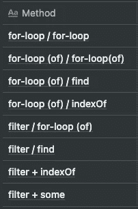

# TypeScript 交集最佳实践

> 原文：<https://javascript.plainenglish.io/typescript-intersection-best-practice-6a7de85bb2f1?source=collection_archive---------11----------------------->

## 用 TypeScript 找到交集的 8 种方法

```
Table of Contents* What's Intersection
* Step-by-Step to the best practice
    * First step: using for-loop
    * How to reduce space complexity - Array.filter()
    * Stops when we find the value — Array.find()
* Performance
* TL; DR
* References
```

# **什么是交集？**

假设我们有两个阵列:

```
let arr1: number[] = [1, 2, 3, 4, 5];
let arr2: number[] = [3, 4, 5, 6, 7];
```

如果我们想找出这两个数组的交集是什么，也就是:

```
[3, 4, 5] # which is both in arr1 and arr2
```

我们通常对 2 个数组进行 for 循环并比较值，这需要 O(n)的时间复杂度，但 Array 中有很多内置函数，如 Array.includes()、Array.indexOf()，那么找到交集的最好方法是什么呢？让我们为此做些实验……

# 最佳实践

## 第一步:使用 for 循环

一种直观的方法是使用 for-loop，迭代一个数组并与另一个进行比较:

```
function func(arr1: number[], arr2: number[]): number[] {
  let res: number[] = [];
  for (let i = 0; i < arr1.length; ++i) {
    for (let j = 0; j < arr2.length; ++j) {
      if (arr1[i] === arr2[j]) {
        res.push(arr1[i]);
      }
    }
  }
  return Array.from(new Set(res));
}
```

## 如何降低空间复杂度— Array.filter()

虽然 for-loop 很容易编写，但我们需要一个额外的数组来存储值，在本例中是 O(n + m ),因此，我们可以使用一个过滤器来修改一个数组:

```
function func(arr1: number[], arr2: number[]): number[] {
  return arr1.filter((val1) => {
    for (let val2 of arr2) {
      if (val1 === val2) {
        return true;
      }
    }
    return false;
  });
}
```

> 注意:Array.filter()的时间复杂度是 O(n)，因为它将循环数组中的所有元素。

## 当我们找到值— Array.find()时停止

考虑上面的代码:

```
if (val1 === val2) {
    return true;
}
```

一旦我们找到了两个数组中都存在的值，我们就可以跳出 for 循环，在这种情况下，我们使用 Array.find()来缩短代码:)

```
function func(arr1: number[], arr2: number[]): number[] {
  return arr1.filter((val1) => {
    return arr2.find((val2) => val1 === val2);
  });
}
```

> 注意:Array.find()也是一个 O(n)函数，但是优点是一旦它找到一个元素匹配请求的值，它就会跳出循环。

# 表演

因此，在用 3 种方法实现了检索交集的函数之后，您可能会注意到 for-loop 的最小值是 2，因此您有很多方法可以做到这一点，例如:

*   for 循环+ for 循环
*   for-loop(使用“of”)+for-loop(使用“of”)
*   for-loop + Array.indexOf()
*   Array.filter() + for 循环
*   Array.filter() + Array.find()
*   ……

求交集的方法太多了，我们来对比一下执行时间，看看性能。



所以在这个测试中，我们有 8 个组合:

主要有两种:

*   for 循环:需要额外的空间
*   过滤器:没有额外空间

这是在两种情况下执行 100 次的平均时间:

*   分类或不存储
*   大小— 100 或 10000


桌子的洞察力:

*   如果数组很大(例如~10000 个元素)，使用`Array.filter()`和`Array.find()`。
*   如果数组很小(例如~100 个元素)，使用`Array.filter()`和`Array.indexOf()`。
*   `sorted`阵列比未排序的要好。

如果你想自己玩，这里有**[**打字游戏场**](https://www.typescriptlang.org/play?#code/GYVwdgxgLglg9mABFApgZygYQIZpQQQCdDsBPAcRTBRKjkIAo0YAvFALkTBAFsAjGgBpEaelE584cADYpsSALyJg2aXmEkwAEzg8JU2fMRKValMLTYeKAPydu-GgEpOAbQcDCrgLrCPNH29EAG8AKFDESMRZKERsYgBGe15PH2NEIhJSJlYUJwBuCKiYuOIAJmTHLyClTLIctgKiyOblekQGEph0gAZ8xG6AHhFc-oBqMZgnENao0sIE1xgaxE0dHkQbRABZbCgACwA6QjhwLQZdg+P5dYZpgCoRxsROGEK5ufjCMqWVtd1Njs9kcTmcLsDrtpdHdEI9mM9XogxkCrqDtA0UIgAPSIMpNOYAX3CcxgwA6-w2ADJKYgAIS0yzWaZhD5RYDtTooWLdJR9AaIYbwlD9bpjJSMvIzVmsr4-ZbpL6LZbvaVEwnEqKK9J1UiHYAnHgMagAd0QAGUuQxFU58ZrytriGQ9QajShTRaoFbyjbCq1SR1RIQoMzZnaFgrEodA56rcI+NMFAA+OKIAC0iHjKpl9qUsqjYgYsYzCeT2DTxaziCJrUIXJAhCQrkVwll3kK1dAkFgCAGYFQhDw0HgYEo1Fo9AA+gkvQtKqlfPMKlwUgFvC5l1U0izilzVug56v0j5K+zCB0ur0RQL5glDrIwABzA7jSYh6VtM+c2IAK0viF-wx5veT77C+35vu+UT+jOSo1AoublK435rlKkGsrWaCHAADiAaD7DBvy2mhaqqq0JGRLWUD1kgOrOtCJrmpaGE+qEHbgEOPYwH2NCDt2I5UDQeyTmUMEHtULblGJPjrv41SoZEJQYVJKzHq0p7nruABuqgJIgcBkta8kfOpX6INp0hlHpBnekZ77QeZunwUo5l4rZaF7phOF4QwDlEZB5EfAFAWUdRGSOrq+r0W6jGesxTRsV2w69v2vHDqOgl0IQE4AMyiRu84Sd8ykySucnbgpu5Kflh5KKpakche+k3hBrLQXmwBcecLnGMm3VOQMNpueh6DYbh+FTJW6pTVEIUNh57bhJ2HFIFxKUoMt6XjllAAseWyT4hVLvta7KUZin7tVcm1W2GqRCZjXWQsLUfG15SHJ1KAAB4APLAAwUx0vBaYJM974YaN3kTaGkRBTWdZzRhC2hEtfHJTx618ZtQlZQArHtpUHYuxWneVe5UXNip6jA0j9j5Ok9UNH4abE3VNbKoPSvZ9P9S5HNobNSBQIQIDCtDgViwFcwC8oqh4JWBLxYt7Go6t6MbQJW0TgAbPjm4LrKxOXVucPk0glMdTTNB09IjnJqTUvw2bb0deifW9dzQO8-LivI8rSWqwOGNpRr2MTgA7LrBVE0bJ0x0Z0vm9TtMOQz9szY7i7vdoX2-dbIOA0oqYJN7SMo-73GB+rY6hwAHJHq6HYbx3xxnieW4wKdJozCdvaI1jW5ZXed57qh4iXrFK4lPZYTQp48PIEAoAAKugnqwNYaBicIS2cAAYn7CCFUkMeNzHz0lHQUCqNsaCXvVn4XryV7DOv6AvgDacVbEsRKDPhBzwvFAhwwBwGNHcSaO5YgTnSEtGCh0-JzEvtfW+YpEB-wAZAIBICwHTHTFAeWrQIAIFELIO8cAHwMAAAYABJghLWAVYFABJOC0IYEg6QN9sTIBgBvJwhw6C7xgJ9FA5wa5OAJIgHgaBKE+zLj2VAGB8APgfLWB8exhwMDRFoTel0j7KVPsdZ66D6Dz0wSvDAmjTjaDQMIAOqUEBY0ylOI+8DKzGMIKYxe5jYpWO0bYiu9j+LVycWUFxi4-LuM8cvVelizg2LRpXTGIcnHZTCezNxs8TGAO8bE6x-i1pVwypObaaTvQZP-lksxMStHxLsUHBxyTJw41Kd8CJmSPHZOqb42pAT6lBKKVlLWLSx6tEiZ0ixNT8lqyScEycYdhltIqR0qpEzulTMScHWZWUa4LKRkQsAJCgHSHIVQ8AoghYiMQAkHoPQZGFBKE2RIh0VgKKwLgAg4VHH0AYNcno29ZbmGQMLQF20ehNFeUolRKA1F8R+Tc3Z4R9mHLIRQyhZy4AXK0Fcm5Ny7mhEeQsZ56RXk4DwDqL5jBfnwplmYYQQsRbCBrjc8Fq9IWqPUQgOFfybyuNCEAA) **的链接。****

# **TL；速度三角形定位法(dead reckoning)**

**如果您想找到两个`number`数组之间的交集:**

*   **如果数组很大(例如~10000 个元素)，使用`Array.filter()`和`Array.find()`。**
*   **如果数组很小(例如~100 个元素)，使用`Array.filter()`和`Array.indexOf()`。**
*   **`sorted`数组比未排序的要好。**

**这里的例子:**

```
function func(arr1: number[], arr2: number[]): number[] {
  return arr1.filter((val1) => {
    return arr2.find((val2) => val1 === val2);
  });
}
```

# **参考**

**[1][JavaScript 中最简单的数组交集代码](https://stackoverflow.com/questions/1885557/simplest-code-for-array-intersection-in-javascript)**

**[[2]打字稿文档](https://www.typescriptlang.org/docs/handbook/2/objects.html#the-array-type)**