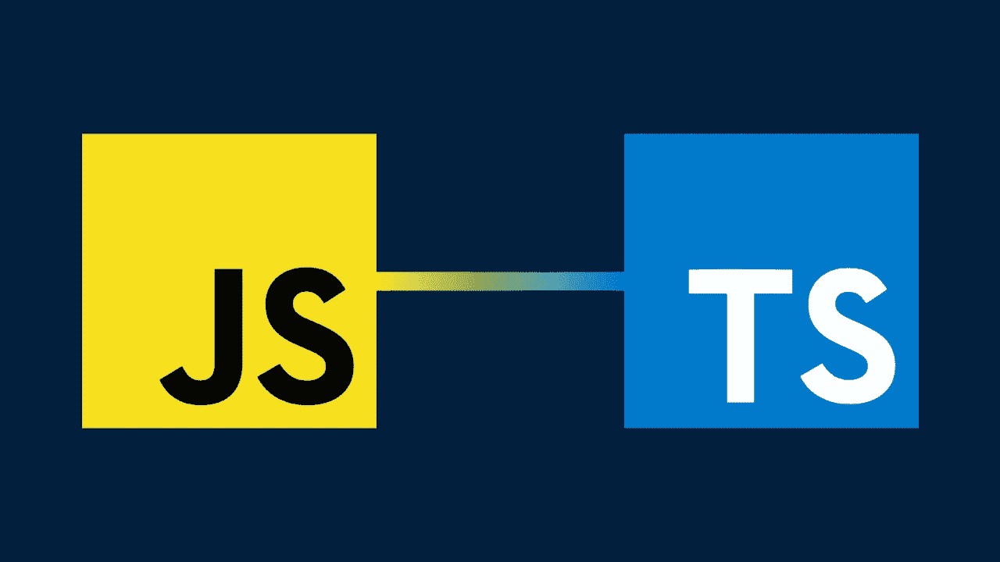

# TypeScript——毫无意外的 JavaScript

> 原文：<https://javascript.plainenglish.io/typescript-javascript-with-no-surprises-bbc4cf5c23a6?source=collection_archive---------11----------------------->



是的， **TypeScript 类似于 JavaScript，但没有什么特别之处。**这就是我对微软 2012 年推出的开源编程语言的描述。去年，Github 将其列为十大最受欢迎的编程语言之一。但是为什么开发者更喜欢微软的创造而不是 JavaScript 呢？让我们来了解一下！

# 为什么不是 JavaScript？

多年来，JavaScript 一直是第一语言。它彻底改变了网络发展，赋予了以前死气沉沉的网站以生命。感谢围绕它的许多框架，它也被用于后端和移动应用程序开发。

但是 JavaScript 是用来创建企业级应用的吗？我不这么认为。这就是 TypeScript 介入的地方。 **TypeScript 是静态类型化的 JavaScript】。最棒的是它仍然是可选的。将静态类型添加到 JavaScript 有很多好处。你将再也看不到`undefined`在你的应用程序中弹出。重构代码将不再是一场噩梦。还有很多。一项研究表明，15%的 JavaScript 错误可以通过 TypeScript 检测出来。**

# 类型—JS 和 TS 之间的区别

编程语言分为两类:静态类型或动态类型。

考虑下面的 JavaScript 代码片段——一种类似 Python 的动态类型语言:

```
function add(num){
   console.log(num + 5);
}
```

这里，变量`num`的类型是未知的。如果我用，`add(“I love TS”)`调用它，它将打印`I love TS5`。这在 JavaScript 中被称为类型强制。它会将数字 5 转换成它的等效字符串，并将两者连接起来。问题是，即使它没有按预期工作，它也不会抛出错误。

现在考虑 TypeScript 中的相同函数——像 Java 这样的静态类型语言:

```
function add(num: number){
   console.log(num + 5);
}
```

我们只是添加了变量`num`的类型作为`number`。如果我现在调用`add(“I love TS”)`，它将抛出一个编译错误——类型 `**string**` **的**参数不可赋给类型** `**number**`的参数。**

## 静态类型的好处

*   它让我们节省时间，并检查为什么我们的输入不是我们认为的那种类型，而不是以后再花时间。
*   一切都保持原来的样子。如果一个变量被声明为一个字符串，它将一直保持这个字符串。
*   添加严格类型使代码更具可读性。不言自明的代码可以弥补团队成员之间缺乏直接沟通的不足。
*   关于类型的信息让 ide 帮助我们进行代码导航、自动完成和准确的建议。我们在打字的时候也会得到反馈。所有这些都有助于我们编写可维护的代码，并显著提高生产率。

# 打字稿—工作 BTS

每个运行 JavaScript 的设备、浏览器或平台也可以运行 TypeScript。这是因为 TypeScript 代码在由 **tsc — TypeScriptCompiler** 执行之前被编译成 vanilla JS。支持 TypeScript 的 ide 通常内置了这一功能，可以从命令行调用。它允许通过将`tsconfig.json`添加到根目录来转换代码库或其一部分。

TypeScript 不是作为`.ts`文件交付的，而是作为`.js`和`.d.ts`文件交付的。给定一个类型脚本文件，`main.ts` tsc 可以将它转换成几个工件。最常见的有:

*   JavaScript 文件:`main.js`(它包含由我们的 ts 代码生成的普通 js 代码)
*   申报文件:`main.d.ts`(该文件有类型信息)
*   源映射文件:`main.js.map`(它为`main.js`中输出代码的每一部分指定了`main.ts`中输入代码的哪一部分产生了它)

# 浅谈 TypeScript 编译器

TypeScript 编译器也可以通过使用选项`allowsJs`来处理普通的 JavaScript 代码。因此，当从 JavaScript 迁移到 TypeScript 时，我们可以从两者的混合开始，慢慢地将更多的 JavaScript 代码转换为 TypeScript。

它允许我们通过使用`checkJs`来检查 JavaScript 文件的类型，或者将`@ts-check`作为特定文件的注释。

它使用 JSDoc 注释提供的静态类型信息。事实上，我们可以完全静态地键入 JavaScript 代码，甚至可以从中派生出声明文件。一个简单的 JSDoc 注释示例可以是:

```
/**
 * @param {number} x - A number param.
 * @returns {number} This is the result.
 */
function add(num){
   return num + 5;
}
```

# 打字稿的缺点

老实说，我注意到的很少。但是这里有一些我认为可能对你有帮助的:

*   **非真正的静态类型**—TypeScript 中的静态类型不同于 Java、C++或 C#。我们的代码最终被转换成 JavaScript，所以在运行时总是有奇怪的类型转换的风险。
*   臃肿的代码 —我们将不得不编写更多的代码作为类型，这会减慢开发过程。此外，由于额外的代码行，它使 TS 文件比 JS 文件更大。但这一切在被传输后都消失了。最终，浏览器将执行普通的 JavaScript。
*   **额外的编译步骤** —我们需要在运行之前将 TypeScript 代码转换成 JavaScript。然而，这个过程是高度自动化的，不需要很多额外的时间。简而言之，这一步骤的负面影响远不如其好处显著。

# 谁在打字？

TypeScript 是一种开源编程语言，其社区在不断扩大。它由微软创建，现在由 Asana、Slack、Lyft、所有 Angular 2+开发者、多个 React 和 Vue 开发者以及数千家其他公司使用。毫无疑问，它是目前最流行的 JavaScript 超集，而且不会很快消失。

随着新的更新在 TypeScript 中出现，**背后的主要思想是给混乱的 JavaScript 世界带来生产力、可靠性和可预测性**。老实说，我很想听听现在不使用 TypeScript 的理由。

让我们开始打字编码吧！

*更多内容尽在*[*plain English . io*](http://plainenglish.io/)