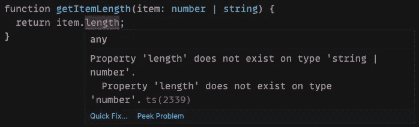
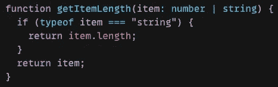
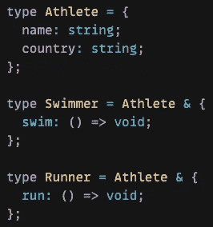
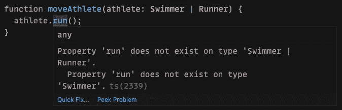
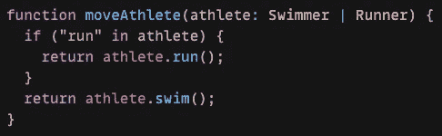
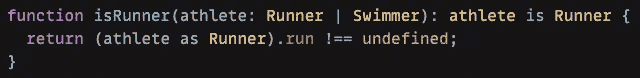
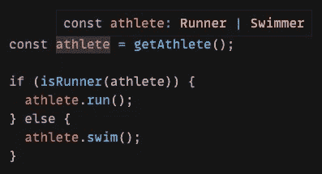
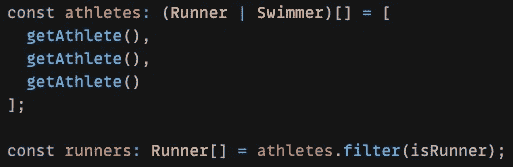

# 使用类型保护在类型脚本中缩小范围

> 原文：<https://javascript.plainenglish.io/typescript-narrowing-using-type-guards-268e4c6edc0?source=collection_archive---------5----------------------->

## 帮助 TypeScript 通过收缩获得正确的类型

Photo by [Lorena Kelly](https://unsplash.com/@lkelly1313?utm_source=medium&utm_medium=referral) on [Unsplash](https://unsplash.com?utm_source=medium&utm_medium=referral)

在过去的 6 个月里，我一直在全职使用 TypeScript 作为前端开发人员。我觉得我把基本的都记下来了。我知道如何创建类型和接口，以及如何在代码中添加类型。

但是，我感觉我的 TypeScript 整体知识还是偏低。我认为还有很多我没有利用的东西。

为了让我的打字技能更上一层楼，我决定花些时间学习一些更中级到高级的概念。

在这一系列文章中，我将介绍我通过阅读 TypeScript 文档所学到的一些东西。

如果您不熟悉 TypeScript，请先阅读下面的文章，了解一些基本概念。

 [## TypeScript 中的类型注释与类型推理

### 如何在 TypeScript 中向变量添加类型

levelup.gitconnected.com](https://levelup.gitconnected.com/type-annotation-vs-type-inference-in-typescript-85ba2194ebe1) 

在本文中，我们将研究使用类型保护在 TypeScript 中缩小。

## 缩小和类型保护

缩小是采用不太精确的类型并使其更精确的过程。这可以通过使用类型保护来完成。字体保护是一种特殊的检查，可以帮助您缩小字体范围。

根据官方的 TypeScript 文档，我们可以使用许多不同的类型保护来缩小类型。

让我们看看如何使用三种常见的方法来缩小类型:

*   防护类型
*   in 运算符缩小
*   使用类型谓词

# 防护类型

`typeof`类型保护将用于检查原始类型，因为它将返回以下类型之一:

*   `"string"`
*   `"number"`
*   `"bigint"`
*   `"boolean"`
*   `"symbol"`
*   `"undefined"`
*   `"object"`
*   `"function"`

在这个例子中，我有一个接受字符串或数字作为参数的函数。我想返回该项目的长度属性。但是，TypeScript 会报错，因为 item 参数可以是数字，也可以是字符串。如果项目是数字，则没有长度属性。

我们可以使用 JavaScript 中的`typeof`操作符和一个`if`语句来解决这个问题。

现在 TypeScript 错误已经消失了。如果参数是一个字符串，我将返回字符串的长度。如果项目是一个数字，我将返回数字。

# in 运算符缩小

在这个例子中，我创建了三个不同的类型别名。一个是有名字和国家财产的基本运动员。然后我扩展运动员类型，用游泳方法创建游泳者类型，用跑步方法创建跑步者类型。

接下来，我将创建一个名为`moveAthelete`的函数，它接受游泳者或跑步者作为参数。在这个函数中，我想调用参数中的一个方法。

可以想象，TypeScript 会抱怨，因为游泳者类型上不存在`**run()**`方法。这类似于我们在第一个例子中收到的错误。不幸的是，我们不能使用`typeof`类型的守卫，因为它们不是原始类型。

相反，我们可以使用 JavaScript 中的`in`操作符。如果指定的属性在指定的对象中，`in`操作符返回`true`。

因此，我们可以检查运动员参数上是否存在 run 属性。如果是，它将是一个 Runner 类型，我们可以调用`**run()**`方法。如果 run 属性不存在，那一定是游泳者类型，我们可以调用`**swim()**`方法。

# 使用类型谓词

类型谓词是一种特殊的返回类型，它通知 TypeScript 编译器特定值是什么类型。我们可以定义一个返回类型为类型谓词的函数。

在上面的例子中，我创建了一个名为`isRunner`的新函数。该函数获取运动员的一个参数，运动员可以是跑步者或游泳者。这个函数的返回类型是`athlete is Runner`的类型谓词，它将返回 true 或 false。

在这个函数中，我们检查运动员参数上是否存在`**run()**`方法。如果是，那么这个函数将返回 true，运动员参数必须是一个跑步者。如果不存在，该函数将返回 false，运动员参数必须是游泳运动员。

然后，我们将创建一个新的运动员变量，它可以是跑步者，也可以是游泳者。然后我们可以使用`isRunner`函数来检查是否对这个变量调用`**run()**`或`**swim()**`方法。

如果我们有一组运动员，或者是游泳运动员或者是跑步运动员，并且我们只想要一组跑步运动员，这也会很方便。

我们可以使用`**filter()**`方法并传入我们创建的`isRunner`函数作为参数。

这将过滤掉所有游泳者类型，并返回一个仅包含跑步者类型的数组。如果你想了解更多关于`**filter()**`方法的工作原理，请查看下面的文章。

 [## JavaScript 提示:使用 Filter 方法从数组中移除一个项

### 探究 JavaScript 中过滤方法和拼接方法的区别。

javascript.plainenglish.io](/javascript-tip-remove-an-item-from-an-array-using-the-filter-method-249b2c720e02) 

# 结论

感谢阅读！我希望这篇文章有助于您了解更多关于 TypeScript 中的缩小。缩小和类型保护是编写良好的 TypeScript 代码和减少 TypeScript 向您抱怨的次数的重要部分。

如果你想了解更多关于在 TypeScript 中缩小范围的知识，一定要查看他们的文档[这里](https://www.typescriptlang.org/docs/handbook/2/narrowing.html)。

在以后的文章中，我将深入探讨更多中级到高级的 TypeScript 概念，所以请继续关注即将到来的更多内容！

**更多阅读**

 [## TypeScript 和 React 函数组件入门

### 何时应该使用 React。定义一个函数组件？

javascript.plainenglish.io](/getting-started-with-typescript-and-react-function-components-558a6f11dc6d)  [## Redux 工具包:设置 Redux 的一种更简单的方法

### 如何在 React 应用程序中使用 Redux Toolkit 建立 Redux 存储

levelup.gitconnected.com](https://levelup.gitconnected.com/redux-toolkit-an-easier-way-to-set-up-redux-6782b4857f8) 

**资源**

*   [https://www . typescriptlang . org/docs/handbook/2/narrowing . html](https://www.typescriptlang.org/docs/handbook/2/narrowing.html)

*更多内容请看*[***plain English . io***](http://plainenglish.io)