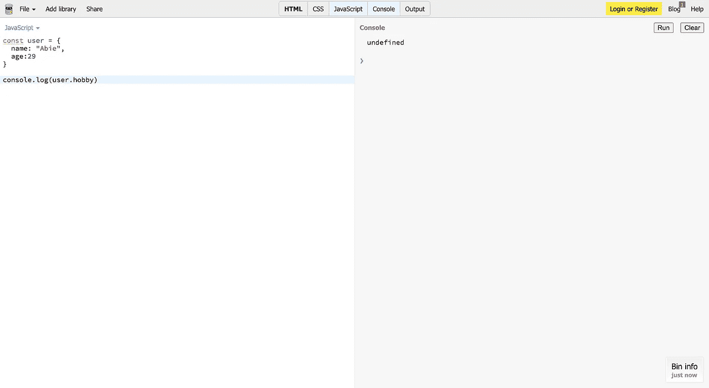
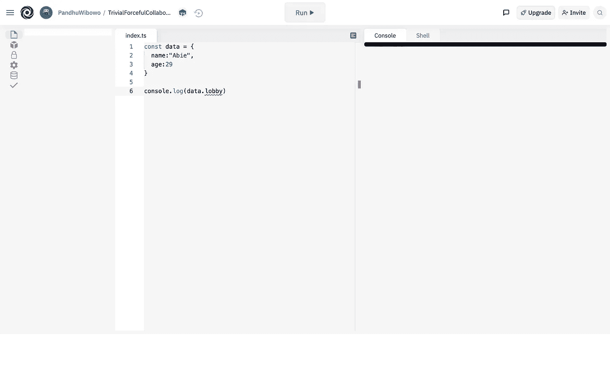
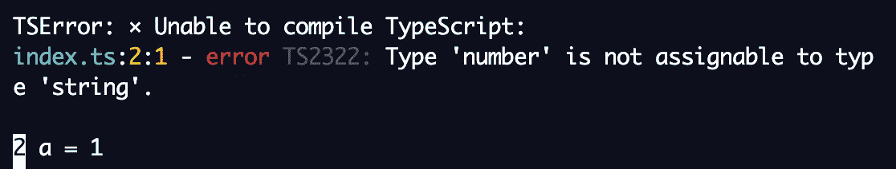
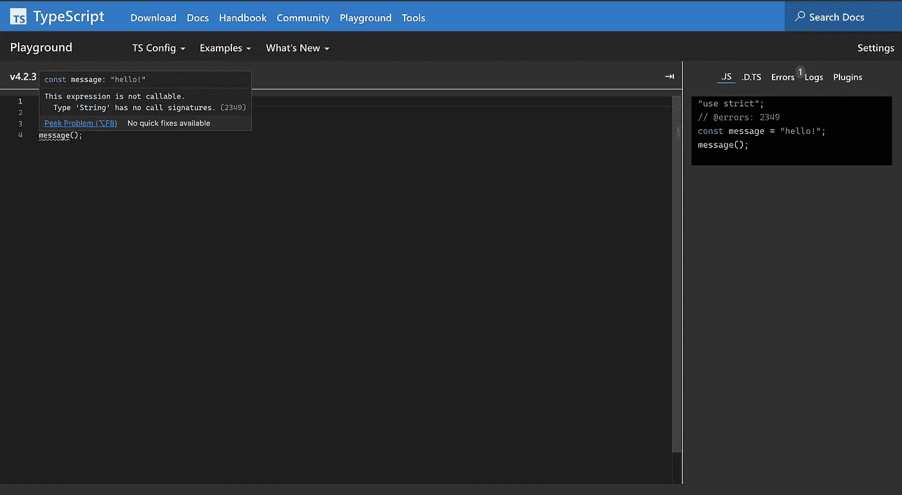
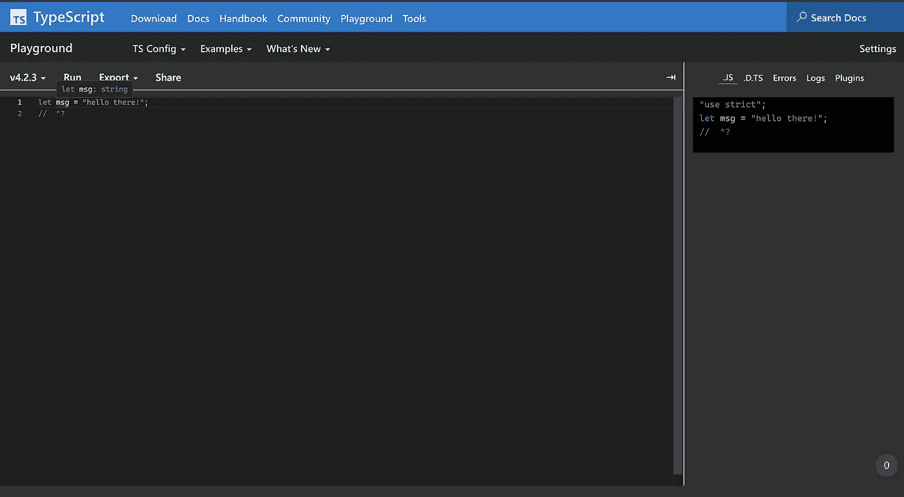

# TypeScript:基础

> 原文：<https://javascript.plainenglish.io/typescript-the-basics-part-2-8c933c140990?source=collection_archive---------18----------------------->


Photo by [Stanley Dai](https://unsplash.com/@stanleydai?utm_source=medium&utm_medium=referral) on [Unsplash](https://unsplash.com?utm_source=medium&utm_medium=referral)

大家好！欢迎来到我的博客。我们将学习 TypeScript 的基础知识。看看吧！

当我们与仍然使用 Javascript 的团队合作时，有时，我们需要某个功能，而这个功能是我们朋友的工作。JavaScript 是一种动态编程语言。你可以写一个变量，然后随意修改。您可以将原本是字符串的变量更改为数字，或者从字符串更改为布尔值。确定实际类型是什么真的很危险，除了运行程序，没有其他方法可以确定变量的结果。

这种情况发生在基本类型上。函数呢？在我看来，函数可能更危险。而且如果函数包含了需要的对象参数，而你又不知道需要哪些属性，那就很麻烦了。你该怎么办？你需要等待才能和你的朋友交流。这真的需要时间。

举个例子，



它会显示结果:`undefined`。在 JavaScript 中，代码运行良好。现在，您应该在 TypeScript 中比较这段代码。**结果如何？**

```
[typescript] Property 'lobby' does not exist on type '{ name: string; age: number; }'.
```



您可以在提到的属性顶部找到一条错误消息。

另一个例子，在 JavaScript 中，

我们会得到 4 的结果。但是如果你在 TypeScript 上写这个代码块，我们会得到一个错误。查看下面屏幕中的详细信息，



这是因为 TypeScript 像 C#或 Java 一样是纯静态类型的。

# 静态类型检查



在 JavaScript 中，也许你必须测试程序，检查你的程序是否会成功。我们可以在编译过程的最后看到结果。正如 TypeScript 官方文档中提到的，

> 理想情况下，我们可以有一个工具来帮助我们在代码运行之前*找到这些错误。这就是像 TypeScript 这样的静态类型检查器所做的。静态类型系统描述了当我们运行我们的程序时，我们的价值观的形状和行为。像 TypeScript 这样的类型检查器使用这些信息，并告诉我们什么时候事情可能会出错。*

就上图中的代码而言，在我们首先运行代码之前，用 TypeScript 运行会给我们一个错误消息。

# 显式类型

您还可以声明您需要的每个变量的类型。有时，您需要锁定变量中的类型，以便使它不可更改为另一种类型。举个例子，

```
const message: string = "Hello world"
message = 1// return 
let message: string 
Type 'number' is not assignable to type 'string'
```

同样，官方文件解释说，

> 请记住，我们不必总是编写显式类型注释。在许多情况下，即使我们省略了类型，TypeScript 甚至可以为我们推断出类型。



他们给了我们一些建议，

> 即使我们没有告诉 TypeScript】有类型`string`,它也能判断出来。这是一个特性，当类型系统最终推断出相同的类型时，最好不要添加注释。

# 结论

好吧，我希望这个解释能帮助你了解为什么我们应该在开发中使用 TypeScript 来获得额外的特性。谢谢你能来。问候！

## 参考

 [## 文档-基础

### JavaScript 中的每个值都有一组行为，您可以通过运行不同的操作来观察这些行为。那个…

www.typescriptlang.org](https://www.typescriptlang.org/docs/handbook/2/basic-types.html) 

**【呼唤好友】**

*朋友们你们好，支持我，让我还能写出其他有趣的文章。你可以通过购买原创、自制的产品来支持我，当然也可以只在*[*@ beneteen*](http://twitter.com/beneteen)*或 beneteen.com*购买本地品牌

*更多内容请看*[***plain English . io***](http://plainenglish.io/)