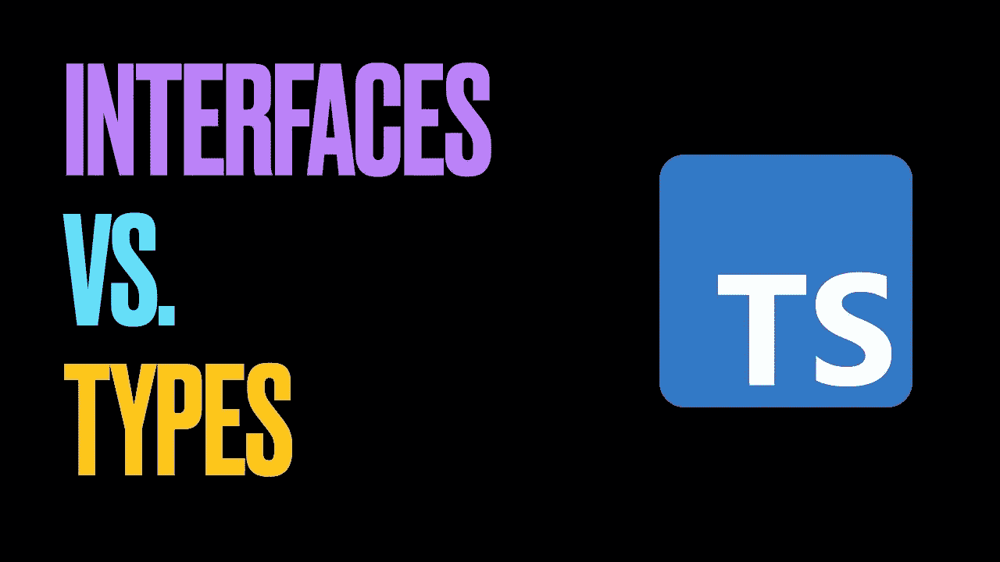

# TypeScript:接口和类型的区别

> 原文：<https://javascript.plainenglish.io/typescript-the-difference-between-interface-and-type-160fc318bb5c?source=collection_archive---------12----------------------->



一旦我们开始探索 TypeScript，我们就开始使用接口和类型，而没有真正理解它们之间的区别。我也有做那件事的罪过。开始使用它们并一直使用它们是很简单的。但是，在某些时候，了解接口和类型之间的区别变得很重要。

毕竟，我们可以使用其中任何一个:

```
interface Point {
  x: number;
  y: number;
}
```

或者

```
type Point = {
  x: number;
  y: number;
}
```

接口和类型之间的区别不仅仅是次要的语法声明。让我们深入了解一下。

# 类型和类型别名

TypeScript 有 boolean、number、string 等基本类型。如果我们想要声明高级类型，我们使用所谓的类型别名。

类型别名是指为类型创建新名称的过程。需要注意的是，我们并没有定义一个新的类型。我们使用的“type”关键字可能会让我们认为我们正在创建一个新的类型，但我们只是给了一个新的类型名称。

因此，每当有人提到类型时，这种引用都是针对类型别名的。

# 接口

与类型相反，接口仅限于对象类型。它们是描述对象及其属性的一种方式。类型别名声明可用于任何基元类型、联合或交集。在这方面，接口仅限于对象类型。

# 接口和类型的相似性

在讨论差异之前，让我们先来看看接口和类型的相似之处。

# 两者都可以扩展

接口和类型都可以扩展。语法是唯一的区别。值得一提的另一点是，接口和类型别名并不相互排斥。类型别名可以扩展接口，反之亦然。

对于一个接口，扩展另一个接口:

```
interface PartialPointX { x: number; }
interface Point extends PartialPointX { y: number; }
```

或者，扩展一个类型:

```
type PartialPointX = { x: number; };
interface Point extends PartialPointX { y: number; }
```

对于扩展另一个类型的类型:

```
type PartialPointX = { x: number; };
type Point = PartialPointX & { y: number; };
```

或者扩展接口:

```
interface PartialPointX { x: number; }
type Point = PartialPointX & { y: number; };
```

# 工具

一个类既可以实现接口，也可以实现类型(TS 2.7+)。

但是，类不能实现联合类型。

```
interface Point {
  x: number;
  y: number;
}class SomePoint implements Point {
  x = 1;
  y = 2;
}type AnotherPoint = {
  x: number;
  y: number;
};class SomePoint2 implements AnotherPoint {
  x = 1;
  y = 2;
}type PartialPoint = { x: number; } | { y: number; };// Following will throw an error
class SomePartialPoint implements PartialPoint {
  x = 1;
  y = 2;
}
```

# 并集和交集类型

虽然接口可以扩展和合并(下一点)，但它们不能以联合和交集的形式组合在一起。类型可以利用并集和交集运算符来构成新的类型。

```
// object
type PartialPointX = { x: number; };
type PartialPointY = { y: number; };// union
type PartialPoint = PartialPointX | PartialPointY;// intersection
type PartialPoint = PartialPointX & PartialPointY;
```

# 声明合并

TypeScript 编译器将两个或多个同名的接口合并到一个声明中。这对类型无效。如果我们尝试创建两个名称相同但属性不同的类型，TypeScript 编译器将会抛出一个错误。

```
// These two declarations become:
// interface Point { x: number; y: number; }
interface Point { x: number; }
interface Point { y: number; }const point: Point = { x: 1, y: 2 };
```

# 元组类型

元组(键-值对)只能通过 type 关键字进行类型化。

```
type Point = [x: number, y: number];
```

没有办法使用接口来声明元组。

不过，我们可以在接口中使用元组:

```
interface Point { coordinates: [number, number] }
```

# 我应该使用哪一个？

一般来说，接口和类型都和前面提到的非常相似。

对于库中的公共 API 定义或第三方类型定义，应该使用接口来提供声明合并功能。

除此之外，我们可以使用任何我们想要的，但应该有跨代码库的一致性。

这就是关于 TypeScript 中的接口与类型的所有知识。希望这有助于你了解每一个，如果你有，请与你的朋友分享！

*原载于 2021 年 5 月 13 日 https://www.wisdomgeek.com*[](https://www.wisdomgeek.com/development/web-development/typescript/typescript-the-difference-between-interface-and-type/)**。**

**更多内容请看*[*plain English . io*](http://plainenglish.io/)*