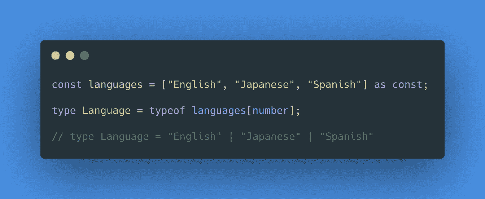
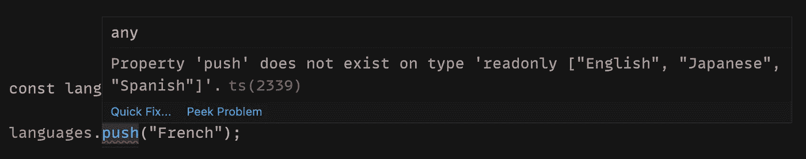
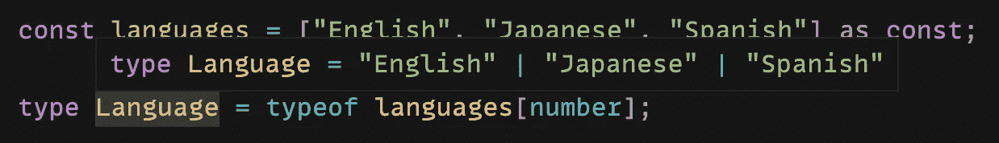
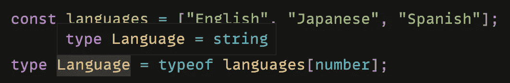

# TypeScript 提示:将字符串数组转换为字符串联合类型

> 原文：<https://javascript.plainenglish.io/typescript-tip-convert-an-array-of-strings-into-a-string-literal-union-type-ee46c2c6e337?source=collection_archive---------6----------------------->

## 使用“const”断言和索引访问类型


Photo by [MAYANK D](https://unsplash.com/@mayank_dimri?utm_source=medium&utm_medium=referral) on [Unsplash](https://unsplash.com?utm_source=medium&utm_medium=referral)

前几天编写代码时，我遇到了一个打字难题。我想把一个字符串数组转换成一个字符串联合类型。

换句话说，我想拍这个:

```
const languages = ["English", "Japanese", "Spanish"];
```

把它变成这样:

```
type Language = "English" | "Japanese" | "Spanish";
```

当然，我可以直接硬编码一个新的类型，但是我知道必须有一个更好的方法来实现这一点。

经过几分钟的谷歌搜索，我找到了答案，并取得了我想要的结果。然而，我并不真正理解它是如何或为什么工作的。我后来回到这个问题，并对这个解决方案做了一些调查。

在本文中，我们将了解如何将字符串数组转换为字符串联合类型。

# TL；灾难恢复解决方案



这可能一开始看起来很混乱，所以让我们一行一行地分解它。

## “常量”断言

在 TypeScript 3.4 中，他们引入了`const`断言。当断言一个类型时，它与任何其他类型名称一样使用。

当使用`const`断言时，您告诉 TypeScript 以下内容:

*   该表达式中的任何文字类型都不应被加宽
*   对象文字得到`readonly`属性
*   数组文字获取`readonly`属性

在我们的例子中，我们采用了一个字符串数组，并添加了`const`断言。

```
const languages = ["English", "Japanese", "Spanish"] as const;
```

因此，数组将具有`readonly`属性，我们不能修改它。例如，如果我试图向数组中添加一个新元素或者重新分配任何元素，我们将会得到一个错误。



因为这个数组有`readonly`属性，TypeScript 知道它不会改变。这将导致编译器推断值的最窄类型。因此，不是每个元素都有一个类型`string`，类型将缩小到元素的值。

例如，第一个元素的类型将是`"English"`，第二个元素的类型将是`"Japanese"`，第三个元素的类型将是`"Spanish"`。

## 索引访问类型

接下来，我们将使用`typeof`类型操作符和索引访问类型将数组转换为字符串联合类型。

索引访问类型可用于查找另一种类型的特定属性。您可以使用`number`来获取数组元素的类型。将此与`typeof`操作符结合使用，可以捕获数组文字上的元素类型。

```
type Language = typeof languages[number];
```

因为数组中的每个元素都有一个数字索引签名，所以您可以获得数组中每个元素的类型。因为我们将数组断言为`const`，所以数组中每个元素的类型都等于字符串文字而不是`string`的类型。

因此，我们现在可以看到，`Language`型等于`"English" | "Japanese" | "Spanish"`。



如果我们在第一步中没有将数组断言为`const`，我们可以看到`Language`类型现在等于`string`，因为每个元素都有一个类型`string`。



# 结论

感谢阅读！我希望本文对您在 TypeScript 中将字符串数组转换为字符串联合类型有所帮助。

我对 TypeScript 了解得越多，就越对您能做的事情感到惊讶。敬请关注即将发布的更多文章！

如果您想继续学习 TypeScript，请查看下面的文章。

[](/typescript-narrowing-using-type-guards-268e4c6edc0) [## 使用类型保护缩小类型脚本

### 帮助 TypeScript 通过收缩获得正确的类型

javascript.plainenglish.io](/typescript-narrowing-using-type-guards-268e4c6edc0) 

*更多内容请看*[***plain English . io***](http://plainenglish.io/)