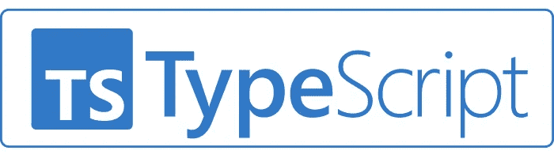

# 打字稿:什么？为什么？怎么会？

> 原文：<https://javascript.plainenglish.io/typescript-what-why-how-3c2301e6ea40?source=collection_archive---------6----------------------->



# 介绍

TypeScript 已经存在了几年，而且它的应用越来越广泛，所以即使您还没有使用过它，或者没有亲自使用过它，如果您在过去几年中使用过 web 浏览器，您肯定听说过它。

本文将是我打算撰写的系列文章的第一篇，总结我在旅程中发现的所有有价值的资源，在我个人看来，这是编写大型 web 应用程序最有用的工具之一。

我从 2016 年底 2.0 版发布以来就一直在使用 TypeScript，并且在此后我参与的几乎所有项目中都使用了它，唯一没有 100%包括它的原因只是遗留系统的需求问题。

所以，让我们开始吧。

# 什么

> 可伸缩的 JavaScript

在它的官方网站上有很长一段时间的介绍，这可能是你能找到的最短的解释。

本质上，TypeScript 是 JavaScript 的超集，提供了一个**可选的**类型系统。即使你决定使用它，你也没有义务 100%坚持它。即使您的整个代码库都通过 TypeScript 编译器，编写普通的 JS 也没问题。

因为是超集，所以 JavaScript 代码的每一行也是有效的 TypeScript 代码。

此外，它还为已经存在的 JavaScript 引擎的未来 [ECMA](https://www.ecma-international.org/publications-and-standards/standards/ecma-262/) 规范提供了计划的特性。

它可以在客户端和服务器端使用，但必须先编译成 JavaScript，因为浏览器和 node.js 不理解 TypeScript 语法。然而，像 [webpack](https://webpack.js.org/) 、 [rollup](https://rollupjs.org/guide/en/) 或 [vite](https://vitejs.dev/) 这样的现代捆绑器提供了源代码映射的插件，可以帮助调试，使用您编写的实际代码，而不是编译的、几乎不可读的 JavaScript。

TypeScript 由微软开发和维护，与他们的 Visual Studio 代码惊人地同步。

# 为什么

我和很多人谈过这个话题，他们最初都很怀疑地接受这个想法:

> 为什么我要在我的代码上引入另一个框架，这基本上会让我在添加额外的语法上浪费时间，而不是仅仅编写动态的、松散类型的 JavaScript。

我同意这听起来可能违反直觉，但从长远来看，以上也是在您的代码库中采用 TypeScript 的最大原因之一。

看一下下面的例子:

**JavaScript 的动态风格允许在运行时修改类型。**所以上面的例子绝对成立。变量`num`被定义为数字，但后来被转换为字符串。非常安静，如果不是故意的，可能会很危险。

TypeScript 中的同一个块将输出:

```
Type 'string' is not assignable to type 'number'.
```

现在，由于这是完全有效的 JavaScript 代码，编译器将显示这个错误，但仍然会发出编译后的代码，因为它只会通知您潜在的错误。

此外，将 TypeScript 集成到您的 IDE 中，这是 VSC 自带的，这一行将在您进行编译之前突出显示，因此如果这是一个错误，**编辑器将提前向您显示潜在的类型错误**，这是类型安全的另一个巨大优势。

**TypeScript 将尝试推断尽可能多的类型**，即使您最初没有设置所需的类型输出。从长远来看，在您自己编译代码之前，编译器会注意到大量的常见错误。

另一个很大的优势是支持定义文件，其中包含现有库的类型信息，即使它们完全是用 JavaScript 编写的。甚至有一个惊人的、不断增长的开源库，其中包含社区生成的类型，用于现有的、很大程度上并不那么流行的库:[绝对类型化](https://github.com/DefinitelyTyped/DefinitelyTyped)。

此外，已经有相当多的案例研究来自大公司，逐渐采用打字稿，像[彭博](https://www.infoq.com/news/2020/11/bloomberg-typescript-adoption/)。看起来整个世界都在向打字稿发展，所以至少你应该试一试。

# 怎么做

如前所述，你不需要重新开始。任何项目都可以采用 TypeScript，无论规模大小。即使您切换您的分机。js 文件到。ts，它们将通过编译器运行，因为代码仍然有效，即使没有正确键入。

你唯一需要的是编译器。这里你有很多选择。最简单的方法是全局安装编译器:

```
npm install -g typescript
```

这将允许您在终端中访问`tsc`命令，并且您将被允许在任何 ts 文件上运行编译器，比如:

```
tsc myfile.ts
```

当然，随着新框架和捆绑器的不断引入，这不是最有效的方法，但它是官方的、最简单的方法。

我将在下一篇文章中更详细地讨论可能的样板文件和编译器选项。

# **结论**

正如开头提到的，这个故事是我每周发表的整个系列的第一个。

我已经发表了几篇比这篇文章更好的文章:

*   [开发环境](https://medium.com/@dzhurovivan/typescript-intro-to-development-environments-d632a85c5e4d)
*   [网络包启动器+ HMR](https://medium.com/@dzhurovivan/typescript-environment-with-webpack-compilation-and-automatic-reload-b4d6d5a60f6f)

我收到的任何反馈都将被考虑在内，并为该语言提供全面的评论和教程。

*更多内容请看*[*plain English . io*](http://plainenglish.io/)*。在这里注册我们的* [*免费周报*](http://newsletter.plainenglish.io/) *。*