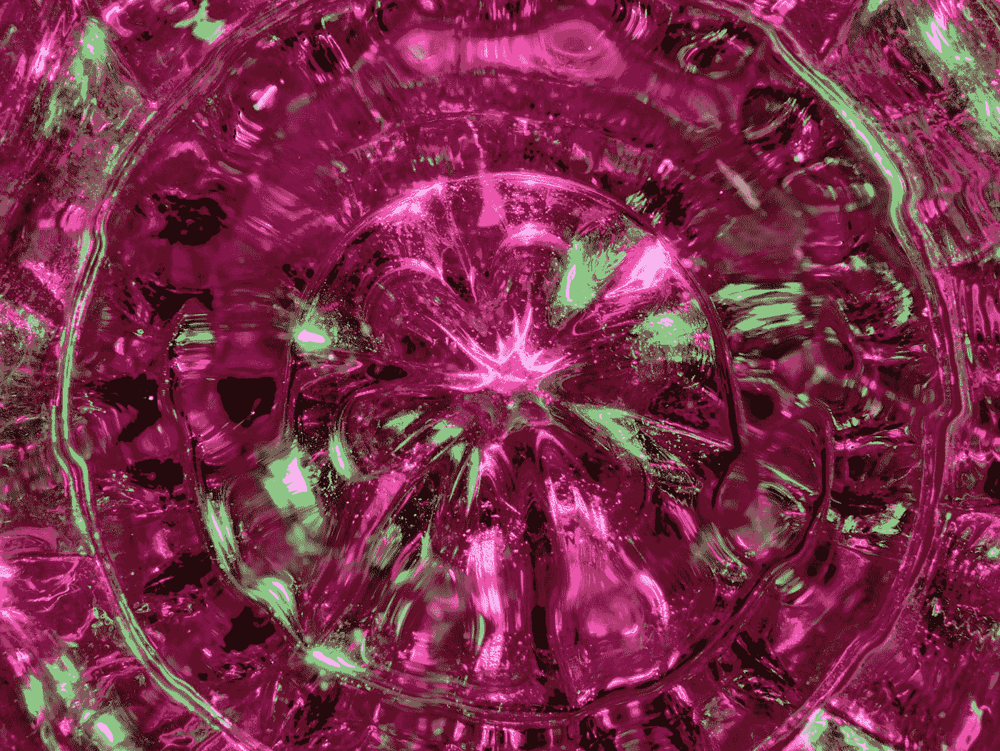

# 使用 Chakra UI Vue 的 UI 开发—按钮

> 原文：<https://javascript.plainenglish.io/ui-development-with-chakra-ui-vue-buttons-aee9199536b6?source=collection_archive---------20----------------------->



Photo by [Michael Dziedzic](https://unsplash.com/@lazycreekimages?utm_source=medium&utm_medium=referral) on [Unsplash](https://unsplash.com?utm_source=medium&utm_medium=referral)

Chakra UI Vue 是一个为 Vue.js 制作的 UI 框架，让我们可以将好看的 UI 组件添加到我们的 Vue 应用程序中。

本文将介绍如何开始使用 Chakra UI Vue 进行 UI 开发。

# 纽扣

Chakra UI Vue 带有一个按钮组件。

为了添加它，我们添加了`CButton`组件。

例如，我们可以写:

```
<template>
  <c-box>
    <c-button variant-color="green">Button</c-button>
  </c-box>
</template><script>
import { CBox, CButton } from "@chakra-ui/vue";
export default {
  components: {
    CBox,
    CButton,
  },
};
</script>
```

我们设置`variant-color`道具来设置它的背景颜色。

要设置按钮的大小，我们可以设置`size`道具:

```
<template>
  <c-box>
    <c-button variant-color="green" size="lg">Button</c-button>
  </c-box>
</template><script>
import { CBox, CButton } from "@chakra-ui/vue";
export default {
  components: {
    CBox,
    CButton,
  },
};
</script>
```

`lg`代表大。

我们也可以将它设置为`xs`代表特小号，`sm`代表小号，或者`md`代表中号。

要改变按钮的外观，我们可以设置`variant`属性:

```
<template>
  <c-box>
    <c-button variant-color="green" variant="outline">Button</c-button>
  </c-box>
</template><script>
import { CBox, CButton } from "@chakra-ui/vue";
export default {
  components: {
    CBox,
    CButton,
  },
};
</script>
```

我们将`variant`设置为`outline`以使按钮具有轮廓样式。

我们也可以将其设置为`solid`、`ghost`或`link`。

`ghost`只有当鼠标悬停在按钮上时，才给按钮添加背景色。

此外，我们可以在按钮中添加一个图标:

```
<template>
  <c-box>
    <c-button left-icon="email" variant-color="blue" variant="solid">
      Email
    </c-button>
  </c-box>
</template><script>
import { CBox, CButton } from "@chakra-ui/vue";
export default {
  components: {
    CBox,
    CButton,
  },
};
</script>
```

`left-icon`设置要添加的图标的名称。

我们可以用`isLoading`道具让按钮显示加载状态。

`loading-text`当按钮处于加载状态时，有按钮文本显示:

```
<template>
  <c-box>
    <c-button
      isLoading
      loading-text="Submitting"
      variant-color="blue"
      variant="solid"
    >
      Email
    </c-button>
  </c-box>
</template><script>
import { CBox, CButton } from "@chakra-ui/vue";
export default {
  components: {
    CBox,
    CButton,
  },
};
</script>
```

我们可以设置其他道具来设计按钮。

为此，我们写道:

```
<template>
  <c-box>
    <c-button height="50px" width="250px" border="2px" border-color="green.500">
      Email
    </c-button>
  </c-box>
</template><script>
import { CBox, CButton } from "@chakra-ui/vue";
export default {
  components: {
    CBox,
    CButton,
  },
};
</script>
```

我们设置`height`、`width`、`border`、`border-color`道具来设置相应的 CSS 属性。

# 结论

我们可以通过 Chakra UI Vue 轻松地将按钮添加到 Vue 应用程序中。

*更多内容请看*[***plain English . io***](https://plainenglish.io/)*。报名参加我们的* [***免费周报***](http://newsletter.plainenglish.io/) *。关注我们关于*[***Twitter***](https://twitter.com/inPlainEngHQ)*和*[***LinkedIn***](https://www.linkedin.com/company/inplainenglish/)*。加入我们的* [***社区不和谐***](https://discord.gg/GtDtUAvyhW) *。*