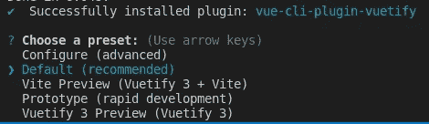

# 哪些 UI 框架支持 Vue 3？

> 原文：<https://javascript.plainenglish.io/ui-frameworks-for-vue-3-cef371317071?source=collection_archive---------1----------------------->

## 关于 Vue 3 支持的状态


Photo by [Brett Jordan](https://unsplash.com/@brett_jordan?utm_source=unsplash&utm_medium=referral&utm_content=creditCopyText) on [Unsplash](https://unsplash.com/s/photos/missing-pieces?utm_source=unsplash&utm_medium=referral&utm_content=creditCopyText).

> 最后更新:2022 年 1 月 21 日

# TL；博士；医生

在撰写本文时，支持 Vue 3 的 UI 框架有:

*   [不可知论](https://www.agnosticui.com/)([GitHub](https://github.com/AgnosticUI/agnosticui)上的 26 颗星星)
*   [放大 UI](https://ui.docs.amplify.aws)(GitHub[上的 139 颗星星](https://github.com/aws-amplify/amplify-ui))
*   [Vue](https://antdv.com/docs/vue/introduce/)的 Ant 设计 [GitHub](https://github.com/vueComponent/ant-design-vue/) 上的 15.7k 星
*   [元素加](https://element-plus.org)(GitHub[上的 10.2k 星星](https://github.com/element-plus/element-plus))
*   [等于](https://quatrochan.github.io/Equal/)(GitHub[上的 667 颗星星](https://github.com/quatrochan/Equal))
*   [原生 UI](https://www.naiveui.com/en-US/light)(GitHub[上的 7k 星星](https://github.com/TuSimple/naive-ui))
*   [or uga UI](https://oruga.io/)(GitHub 上的 549 颗星星)
*   [PrimeVue](https://www.primefaces.org/primevue/) (1.3k 星星在 [GitHub](https://github.com/primefaces/primevue) 上)
*   [superb vue](https://superbvue.netlify.app/)(GitHub[上的 11 颗星](https://github.com/superbvue/SuperBVue))
*   [顺风 UI](https://tailwindui.com/) (基于[GitHub](https://headlessui.dev/)上带 12k 的无头 UI )
*   [vue stic](https://vuestic.dev/)(GitHub[上的 1k 星星](https://github.com/epicmaxco/vuestic-ui))
*   [类星体框架](https://next.quasar.dev/)([GitHub](https://github.com/quasarframework/quasar)上的 18.7k 恒星)

# 不可知性

AgnosticUI 拥有对 Vue3 的[支持，并提供 20 个组件。](https://www.agnosticui.com/docs/setup.html#vue-3)

# 放大用户界面

[Amplify UI](https://ui.docs.amplify.aws) 是一个组件库(38 个组件)，具有对 Vue 3 的[支持，并专注于亚马逊 AWS 兼容性。这使得高级组件](https://ui.docs.amplify.aws/?platform=vue)[如聊天机器人或认证器](https://ui.docs.amplify.aws/components?platform=vue)成为可能。

# 面向 Vue 的蚂蚁设计

[Ant Design for Vue](https://antdv.com/docs/vue/introduce/)(15.7k stars on[GitHub](https://github.com/vueComponent/ant-design-vue/))是知名 React 库[Ant Design](https://ant.design/)(“[全球第二大流行 React UI 库](https://www.google.com/url?sa=t&rct=j&q=&esrc=s&source=web&cd=&cad=rja&uact=8&ved=2ahUKEwjOurjtg9L0AhWJQ_EDHX9MBRwQFnoECA0QAQ&url=https%3A%2F%2Fant.design%2F&usg=AOvVaw0ZVsm68NQb-209VM_ByqxJ)”)的一个端口，提供 60+组件。

# BootstrapVue

[BootstrapVue](https://bootstrap-vue.org/)(13.2k stars on[GitHub](https://github.com/bootstrap-vue/bootstrap-vue))支持在 Vue 2 项目中使用[Bootstrap](https://getbootstrap.com/)(151k stars on[GitHub](https://github.com/twbs/bootstrap))组件。BootstrapVue [**还不支持 Vue 3**](https://github.com/bootstrap-vue/bootstrap-vue/issues/5196)。

# 布埃菲

[Buefy](https://buefy.org/)([GitHub](https://github.com/buefy/buefy)上的 8.7k 星星)将 CSS 框架[布尔玛](https://bulma.io/)([GitHub](https://github.com/jgthms/bulma)上的 43.7k 星星)整合到 Vue.js 2 项目中。**然而** [**Buefy 还不支持 vue . js 3**](https://github.com/buefy/vue-cli-plugin-buefy/issues/15)。

# 核心用户界面

[核心 UI 组件](https://coreui.io/vue/ui-components/)(GitHub[上的 346 颗星](https://github.com/coreui/coreui-vue))支持在 Vue.js 2 projecs 中使用以仪表盘为焦点的引导组件。[核心 UI 管理模板](https://coreui.io/vue/)(GitHub 上的 2.8k 星星)提供了一个基于 Bootstrap 的管理模板。**有**[**vue . js3 还没有稳定发布**](https://github.com/coreui/coreui-vue/issues/126) 。

# 元素加

[Element Plus](https://element-plus.org)(10.2k stars on[GitHub](https://github.com/element-plus/element-plus))是 Vue.js 3 的 UI 库。

# 平等的

[Equal](https://quatrochan.github.io/Equal/) 是一个 Vue 3 组件库，拥有 30+个组件，基于 TypeScript 和个人设计系统。

# 墨水线

[Inkline](https://inkline.io/)(GitHub[上的 811 颗星星](https://github.com/inkline/inkline))提供 50+组件。Vue.js 3 还没有稳定版本支持，但是 [**测试版应该支持 Vue.js 3**](https://github.com/inkline/inkline#join-the-beta) 。

# 本机用户界面

[原生 UI](https://www.naiveui.com/en-US/light)(GitHub[上的 7k 星](https://github.com/TuSimple/naive-ui))是一个 Vue 3 组件库，提供了大约。80 个组件。

# 奥鲁加 UI

[Oruga UI](https://oruga.io/) (在 [GitHub](https://github.com/oruga-ui/oruga) 上 549 颗星)是一个 25+ UI 组件的轻量级库，没有 CSS 框架依赖，兼容 vue . js 3[。](https://oruga.io/documentation/#setup)

# iView

[iView](http://iview.talkingdata.com/#/)(GitHub[上的 23.8k 星](https://github.com/iview/iview))不**不支持 Vue.js 3** 。

# Keen UI

[Keen UI](https://josephuspaye.github.io/Keen-UI/) (星上 [GitHub](https://github.com/JosephusPaye/Keen-UI) ) [难道**还不支持 Vue.js 3** 吗](https://github.com/JosephusPaye/Keen-UI/issues/517)。

# 薄荷 UI

[Mint UI](http://mint-ui.github.io)(GitHub 上的 16.4k 星星)**不支持 Vue.js 3** 。

# PrimeVue

[PrimeVue](https://www.primefaces.org/primevue/) (1.3k 星星上 [GitHub](https://github.com/primefaces/primevue) )提供 90+组件，支持 Vue.js 3。要将 PrimeVue 添加到 Vue3 项目，执行`yarn add primevue@next`，选择版本，例如`3.9.1`，并添加对带有`yarn add primeicons`的图标的可选支持。[此外，您需要添加一些样板文件来包含组件(模块加载器设置变量)或直接导入组件(单个文件组件设置变量)](https://primefaces.org/primevue/showcase/#/setup)。例如，为了使对话框组件`<Dialog></Dialog>`可用，必须向`main.js`添加以下代码:

```
...import PrimeVue from 'primevue/config';
//import Dialog from 'primevue/dialog';  // module loader variant
import Dialog from 'primevue/dialog/sfc';  // SFC variant...app.use(PrimeVue);
app.component('Dialog', Dialog);...
```

# SuperBVue

[superb Vue](https://superbvue.netlify.app/)(GitHub 上的 11 颗星)支持 Vue 3 和 Bootstrap 5，并提供大约 10 个组件。

# 类星体框架

[Quasar Framework(下)](https://next.quasar.dev/) (18.7k stars on [GitHub](https://github.com/quasarframework/quasar) )是 Vue.js 3 的一个 UI 框架。

# 顺风 UI

[Tailwind UI](https://tailwindui.com/) 是一个 UI 组件库，[与 Vue.js 3](https://tailwindui.com/documentation#vue-installing-dependencies) 协同工作。它使用了引擎盖下的[无头 UI](https://headlessui.dev/) (12k on [GitHub](https://github.com/tailwindlabs/headlessui) )。

# 使虚弱

[vue tify](https://vuetifyjs.com)([GitHub](https://github.com/vuetifyjs/vuetify)上的 31.1k 星)将符合[材质设计规范](https://material.io/design/)的[材质 UI](https://material.io/) 组件使用到 Vue.js 项目中。作为 v3 (Titan)版本的一部分，对复合 API 的全面支持将于 2022 年 2 月提供。

v3 alpha 发布包可通过`yarn add vuetify@next`或`npm i vuetify@next`在下一个标签下获得。应该可以通过执行`vue add vuetify`将`vuetify`添加到 Vue3 项目中。



然而，预设选择

*   默认(推荐)，
*   Vite 预览(Vuetify 3 + Vite)，
*   原型(快速开发)
*   虚拟化 3 预览(虚拟化 3)

执行`yarn serve`时导致错误`Error: Cannot find module `fst/promises``或`Error: You cannot call "get" on a collection with no paths. Instead, check the "length" property first to verify at least 1 path exists.`。到目前为止，我还没有让阿尔法工作。

# 真空材料

[VueMaterial](https://vuematerial.io/) (9.4k 从 [GitHub](https://github.com/vuematerial/vue-material) 开始)是 Bootstrap 到 Vue.js 项目的又一次集成。VueMaterial [**尚不支持 vue . js 3**](https://github.com/vuematerial/vue-material/issues/2277)。

# Vue 材料套件

[Vue 材料套件](https://demos.creative-tim.com/vue-material-kit/#/) (239 颗星在 [GitHub](https://github.com/creativetimofficial/vue-material-kit) ) **还不支持 Vue . js 3**。

# VueTailwind

[VueTailwinds](https://www.vue-tailwind.com/) (1.4k 星在 [GitHub](https://github.com/alfonsobries/vue-tailwind) )将 CSS fram work[tail wind CSS](https://tailwindcss.com/)(42.8k 星在 [GitHub](https://github.com/tailwindlabs/tailwindcss) )集成到 Vue.js 项目中。我不确定它是否支持使用 [Tailwind UI](https://tailwindui.com/) (专有，无限制使用从 129 欧元开始)组件。VueTailwind [**尚不支持 vue . js 3**](https://github.com/alfonsobries/vue-tailwind/issues/127)。

# Vuesax

[vue sax](https://vuesax.com/)(git hub 上的 918 颗星)处于 alpha 状态 [**还不支持 vue . js 3**](https://github.com/lusaxweb/vuesax/issues/961)。

# vu esse

[Vuest](https://vuestic.dev/)(在 [GitHub](https://github.com/epicmaxco/vuestic-ui) 上用 1k 颗星表示)是一个包含 50 多个组件的 Vue.js 3.0 用户界面框架。

# 波形用户界面

[Wave UI](https://antoniandre.github.io/wave-ui/) (310 星在 [GitHub](https://github.com/antoniandre/wave-ui) )是一个包含 40 多个组件的 UI 组件库。

# 使用的资源

我在媒体和 YouTube 上使用了以下资源:

*   [Vue 3 前端框架](https://medium.com/@mgav/vue-3-front-end-frameworks-ebc361e77ae5)

## 进一步阅读

[](https://bit.cloud/blog/extendable-uis-how-to-build-better-uis-for-developers-l1jkl1pc) [## 可扩展的 UI 组件

### 我最近受命为 bit.cloud 平台构建一个用户卡组件。我还负责建造…

比特云](https://bit.cloud/blog/extendable-uis-how-to-build-better-uis-for-developers-l1jkl1pc) 

*更多内容看* [***说白了。报名参加我们的***](https://plainenglish.io/) **[***免费周报***](http://newsletter.plainenglish.io/) *。关注我们关于*[***Twitter***](https://twitter.com/inPlainEngHQ)[***LinkedIn***](https://www.linkedin.com/company/inplainenglish/)*[***YouTube***](https://www.youtube.com/channel/UCtipWUghju290NWcn8jhyAw)***，以及****[***不和***](https://discord.gg/GtDtUAvyhW)**** ***对成长黑客感兴趣？检查出* [***电路***](https://circuit.ooo/) ***。*****