# 关于 JavaScript 闭包的终极面试问题

> 原文：<https://javascript.plainenglish.io/ultimate-interview-questions-on-javascript-closures-8dd12a210677?source=collection_archive---------5----------------------->

## Ace 每个关于 JavaScript 闭包的问题

Photo by [Quino Al](https://unsplash.com/@quinoal?utm_source=medium&utm_medium=referral) on [Unsplash](https://unsplash.com?utm_source=medium&utm_medium=referral)

*本文是这个系列的最后一部分，在这里我们将探索闭包的起源、幕后工作、现实生活中的用法以及与闭包相关的面试问题。如果你还没有跟随系列，那么强烈推荐你* [*请过一遍。*](https://medium.com/@polymathsomnath/most-important-feature-ever-put-in-a-programming-language-5b139e1e170f)

# 面试开始

采访者:你能给我们讲讲 JavaScript 中的作用域吗？

**你**:耶！当然，作用域是代码中变量可用的区域。

采访者:你能说得详细一点吗？

**你:**在 JavaScript 中，作用域指的是你代码的当前上下文。范围可以是全局定义的*或局部定义的*或*。在 ES6 中，我们现在也有了数据块范围。*

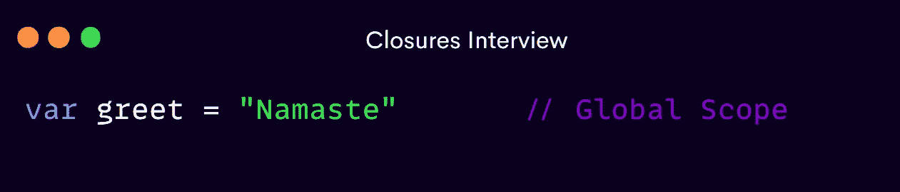

一个 ***局部作用域*** 是指定义在 ***全局作用域*** 之外的任何作用域。典型的 ***有一个全局作用域*** ，每个定义的函数都有自己的(嵌套的) ***局部作用域。***

任何在另一个函数中定义的函数都有一个链接到外部函数的局部作用域。如果我定义了一个函数并在其中创建了变量，这些变量就变成了局部变量。举个例子:

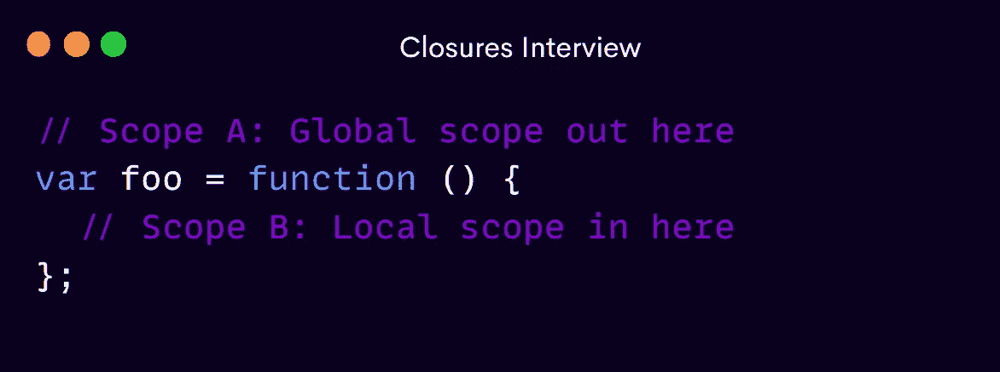

任何局部作用域的项在*全局作用域***—**—*中都是不可见的，除非*** ***暴露*** ，这意味着如果我在一个新的作用域内定义函数或变量，在当前作用域的之外*是不可访问的。下面是一个简单的例子:***

**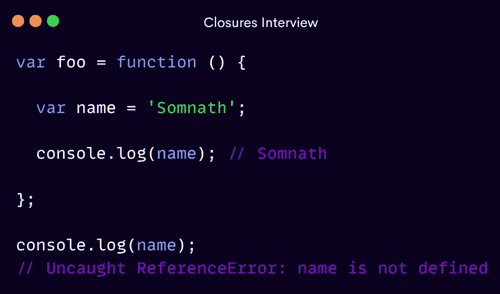**

**变量`name`的作用域是局部的，它没有暴露给父作用域，因此是未定义的。**

**面试官:很好，你能说说功能范围吗？**

****你**:当然！JavaScript 中的所有作用域都是用`Function Scope` *创建的，只有*，**

**每个新函数都创建自己的作用域。我想用一个简单的例子来演示这个范围的创建**

**面试官:说吧！**

**你:这意味着在函数中定义的参数和变量在函数外是不可见的，而在函数内任何地方定义的变量在函数内任何地方都是可见的。**

**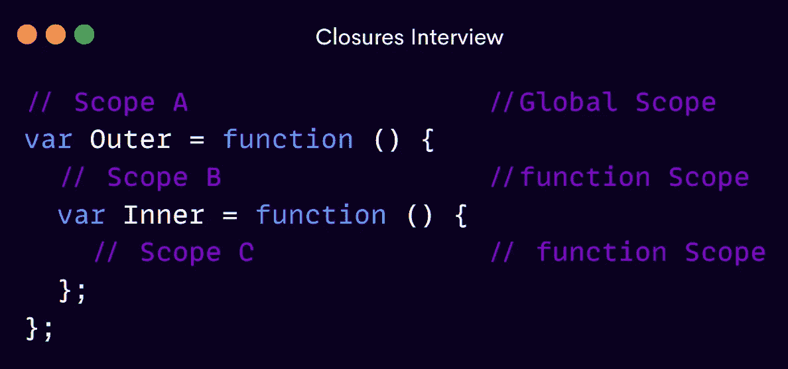**

****面试官**:好的！你能告诉我下面哪些函数访问外部作用域变量吗？**

**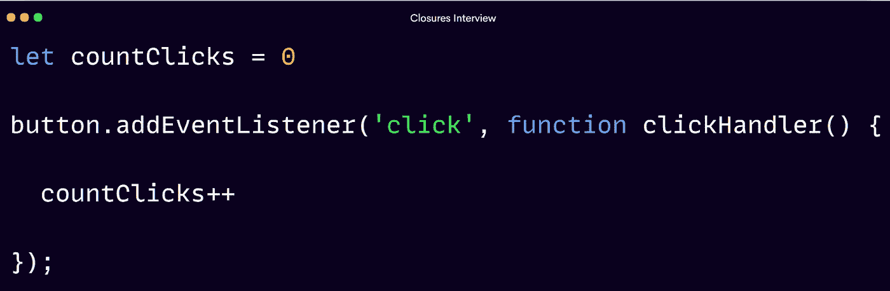**

**1**

**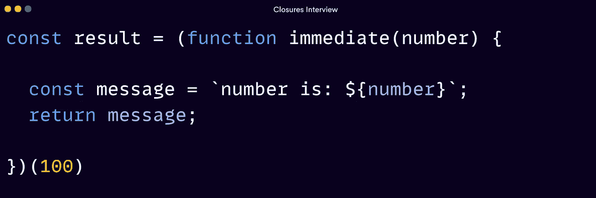**

**`2`**

**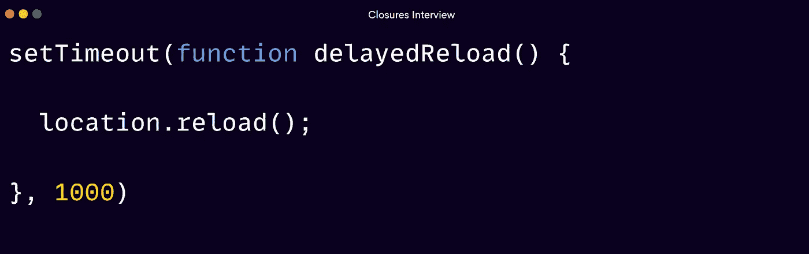**

**3**

****你:*****第一*** 一个和第 ***第三*** 一个！**

****面试官**:怎么样？**

**你:嗯，**

1.  **`clickHandler()`有 ***从外部范围访问*****变量`countClicks`。✅****
2.  ****`immediate()` *不从外部作用域访问*任何变量。❌****
3.  ****`delayedReload()`有 ***访问*** 从全局作用域(又名最外层作用域)到全局变量`location`。✅****

****采访者:你对词法范围或闭包有所了解吗？
*(读者注意:两者是一回事)*****

******你**:是的！([如果你不](https://medium.com/p/5b139e1e170f/edit?source=your_stories_page-------------------------------------)，那么[去这里](https://medium.com/p/7e8194924398/edit?source=your_stories_page-------------------------------------))****

****面试官:什么是封闭？****

******你**:****

****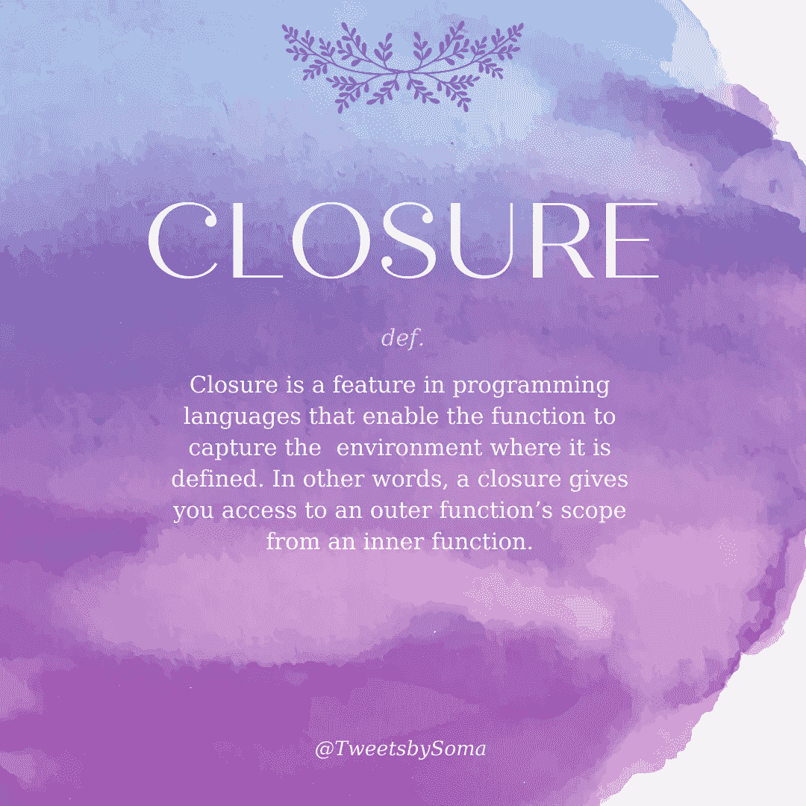****

****面试官:太好了！这个回答不错。能不能用 JavaScript 做个闭包给我看看？****

******你**:当然！****

****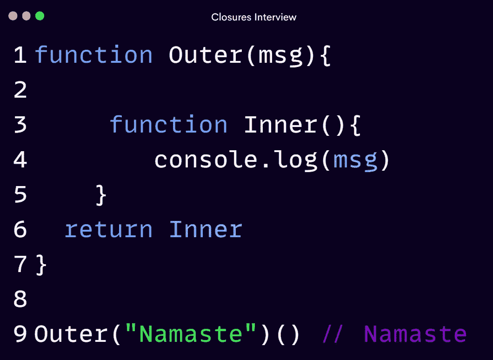****

****我们也可以用匿名函数写同样的代码****

****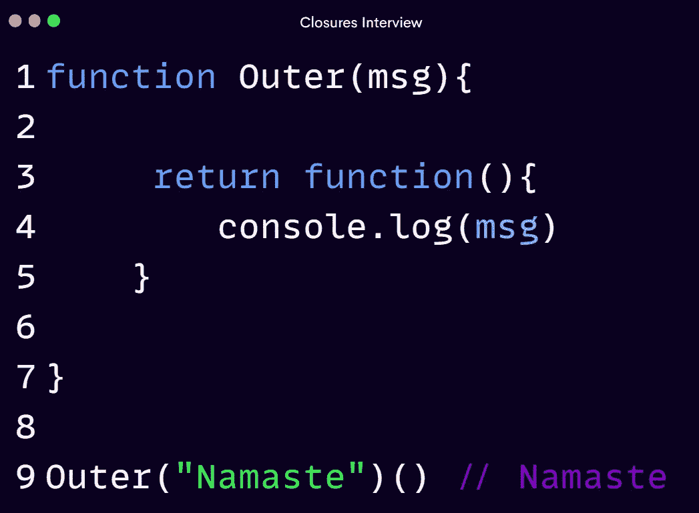****

******面试官**:好的！你能说说 9 号线吗？你为什么用了多余的`()`****

****你:是啊，当然！正如我们所知，JavaScript 中有**一级函数**，JavaScript 中的**函数也是对象**。当我们编写 `Outer()` 时，它被调用并给我们`Inner()`作为返回值，所以为了调用它，我们又使用了一个`()`。****

******面试官**:好看！你能告诉我下面程序的输出吗？****

****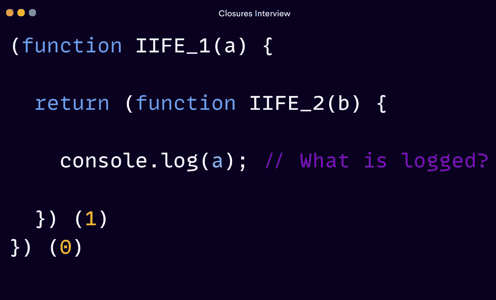****

******你** : **0******

******面试官**:怎么样？****

******You** : `0`，是作为实参`IIFE_1`传递的，因此`a`形参是`0`。****

****`IIFE_2`函数嵌套在`IIFE_1`函数中，是一个从外部`IIFE_2`范围捕获`a`变量的闭包，其中`a`是`0`。从而`console.log(a)`记录`0`。****

****面试官:嗯...很好！这个怎么样？第一条和第二条 `console.log()`语句中会记录什么****

****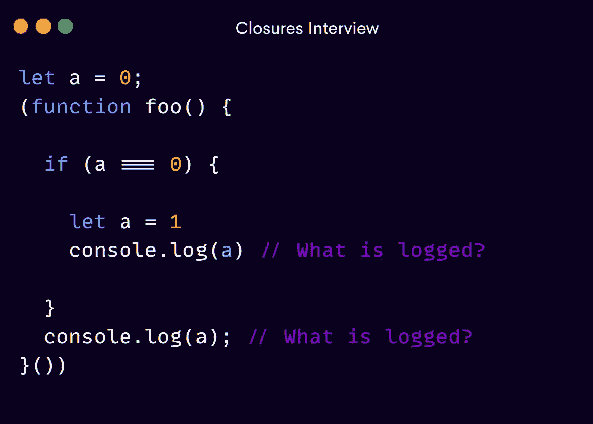****

******你:** `1`和`0`被登录到控制台。****

******采访者**:你能详细说明一下吗？****

******你:**确定！****

****第一条语句`let a = 0`声明了一个变量`a`。****

****`foo()`是一个闭包，它从外部范围捕获`a`变量。`foo()`功能范围内`a`为`0`。****

****然而，在条件内部，另一个`let a = 1`声明了一个局部变量`a`，它从作用域外部覆盖了`a`。第一篇`console.log(a)`日志`1`。****

****第二个`console.log(a)`记录`0`，因为这里的`a`变量是从外部作用域访问的。****

******面试官**:精彩！好的，我有一个循环，里面有`setTimeout()`，你能告诉我我应该期待什么样的输出吗？****

****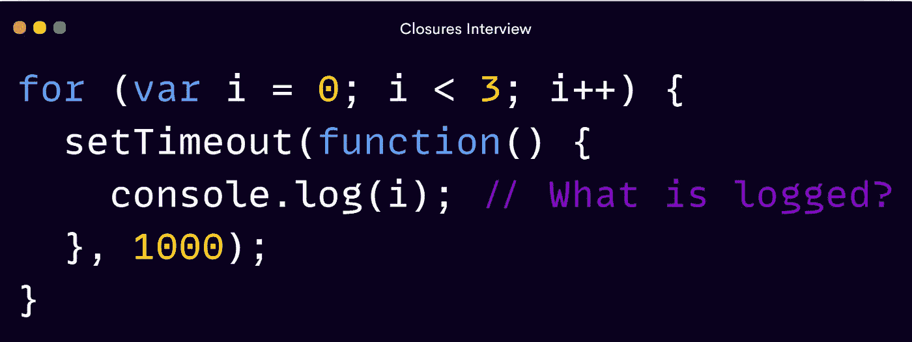****

****(Note to the readers : This is a classic closure question which is asked every other time in Interviews.)****

******:`3`，`3`，`3`登录控制台。******

********面试官**:请详细一点！******

******你:上面的代码分两个阶段执行。******

********第一阶段********

1.  ******`for()`循环迭代 3 次。在每次迭代期间，创建一个新函数`log()`，它捕获变量`i`。`setTimout()`调度`log()`在 1000 毫秒或 1 秒后执行。******
2.  ******当`for()`循环完成后，`i`变量的值为`3`。******

********第二阶段********

******第二阶段发生在 1000 毫秒之后:******

1.  ******`setTimeout()`执行预定的`log()`功能。`log()`读取变量`i`的*当前值*，即`3`，并记录到控制台`3`。******

******这就是`3`、`3`、`3`被记录到控制台的原因。******

********面试官**:我想让它*记录*`*0*`*`*1*`*`*2*`*的数值，可能吗？*********

******你:当然！******

******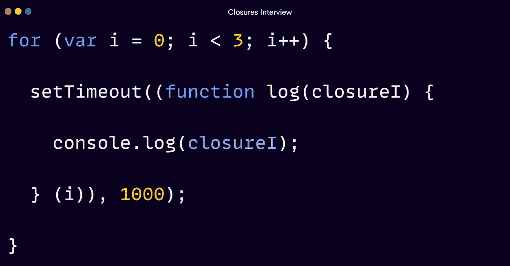******

******面试官:太好了！好吧，告诉我，在 JavaScript 中没有所谓的`public`和`private`范围！我们可以使用闭包来模拟私有范围和公共范围吗？******

********你**:对！事实上，只有在闭包的帮助下，我们才能做这些事情！******

********面试官**:好的！下面的函数`createStack()`创建堆栈数据结构的实例:******

******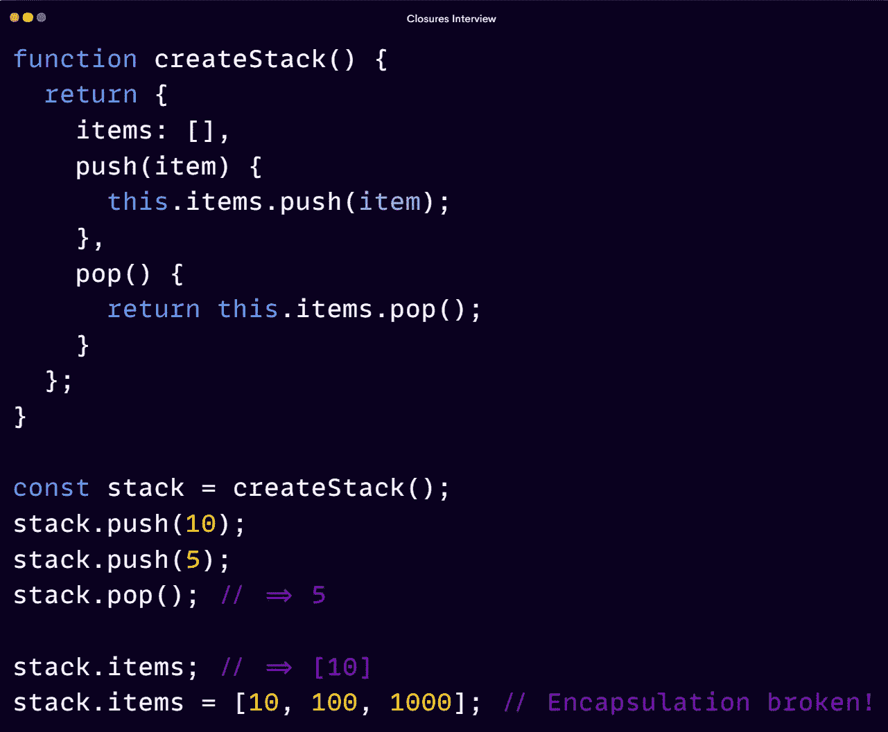******

******该堆栈工作正常，但有一个小问题。任何人都可以直接修改 items 数组，因为`stack.items`属性是公开的。******

******这是一个问题，因为它打破了堆栈的封装:只有`push()`和`pop()`方法应该是公共的，但是`stack.items`或任何其他细节都不应该是可访问的。******

******使用闭包的概念重构上面的堆栈实现，这样就没有办法在`createStack()`函数范围之外访问`items`数组。******

********你**:好的，这段代码需要一点点重构，`items`数组需要在作用域中上移。******

******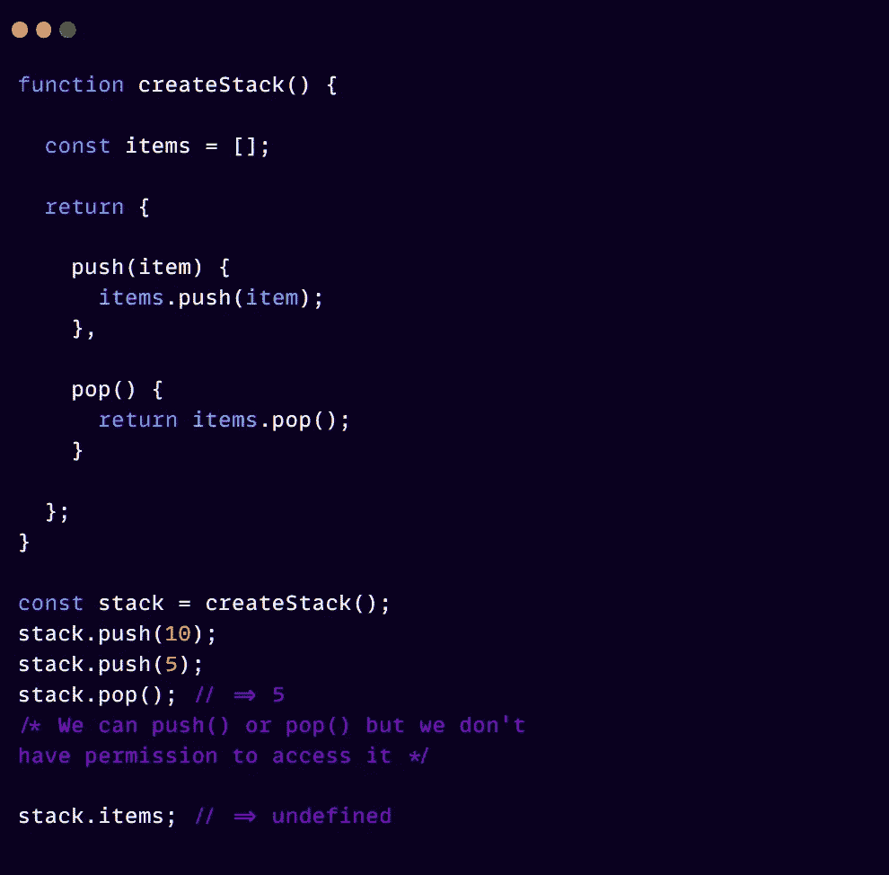******

******更改后，无法从`createStack()`范围之外访问或修改`items`数组。******

******`items`现在是私有变量，堆栈被封装:只有`push()`和`pop()`方法是公共的。******

******`push()`和`pop()`方法是闭包，从`createStack()`函数范围捕获`items`变量。******

******面试官:很好！我还有最后一个问题要问你！******

********你**:当然！******

********面试官:**写一个函数`multiply()`，它是 2 的倍数:******

******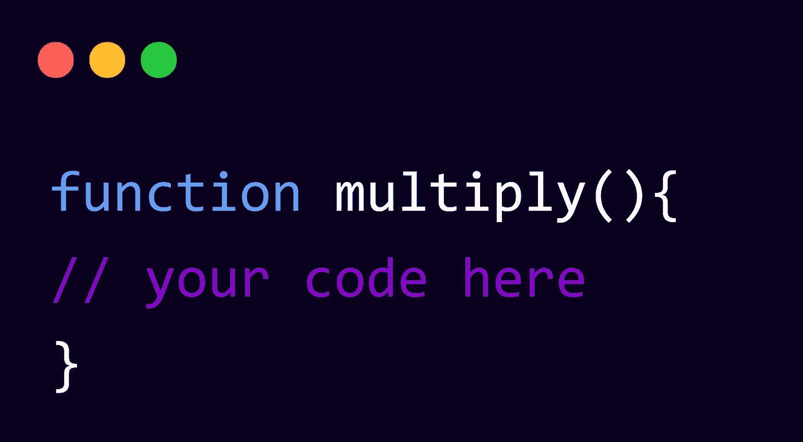******

******如果用两个参数调用`multiply(num1, numb2)`，它应该返回两个参数的乘积。******

******但是如果用 1 个参数`const anotherFunc = multiply(num1)`调用，这个函数应该返回另一个函数。调用`anotherFunc(num2)`时返回的函数执行乘法`num1 * num2`。******

******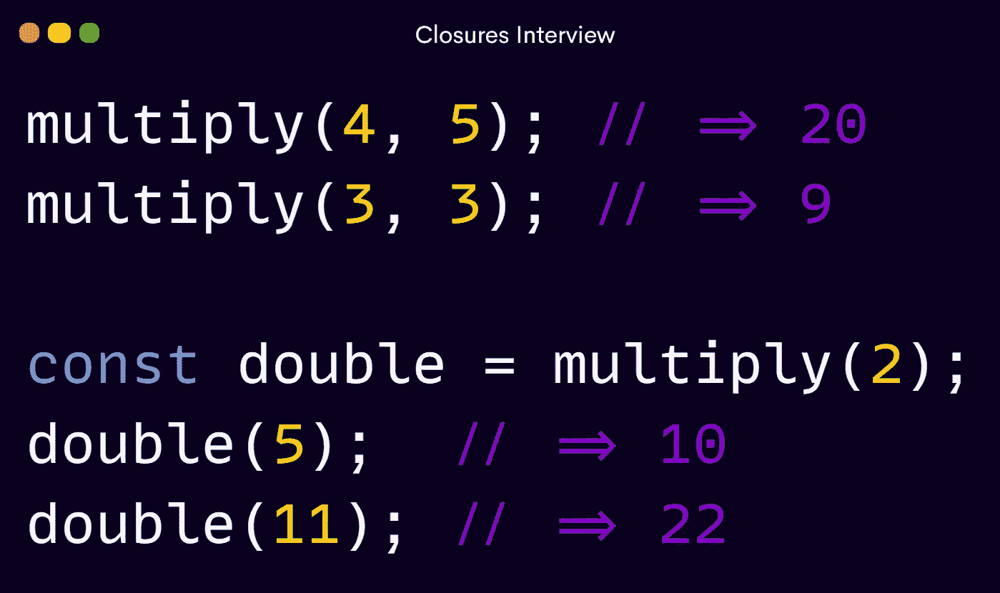******

******Something like this******

******你:当然可以！******

******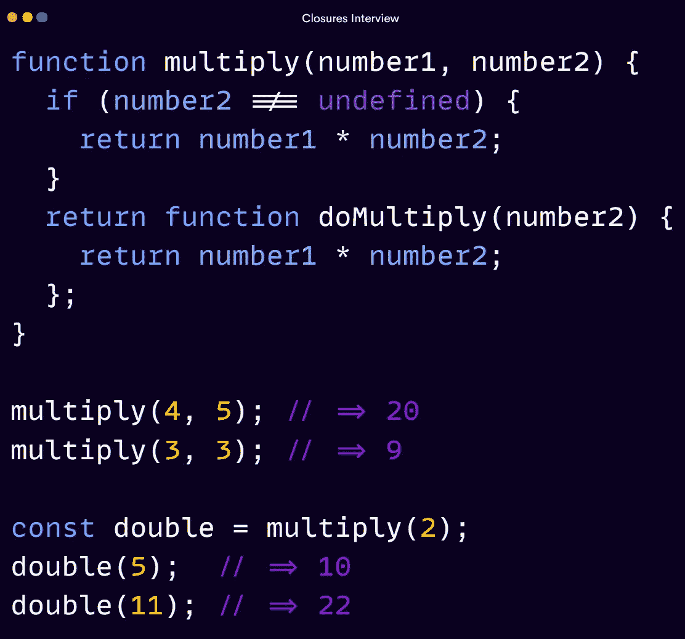******

******面试官:你能详细说说吗？******

********你**:当然！正如我们在代码中看到的，如果`number2`参数不是`undefined`，那么函数只是返回`number1 * number2`。******

******但如果`number2`是`undefined`，则说明`multiply()`函数已经被一个参数调用了。在这种情况下，我们返回一个函数`doMultiply()`,当稍后被调用时，它执行实际的乘法。******

******`doMultiply()`是一个闭包，因为它从`multiply()`范围捕获了`number1`变量。******

********面试**:你能告诉我使用闭包有什么缺点吗？******

********你**:闭包是编程语言的一个特性，和每一个特性一样，它是好是坏取决于实现它的人。******

******正如我们所知，闭包不是垃圾收集的，它们会保留到程序的最后。在这种情况下，如果我们不必要地继续使用闭包，尤其是在不需要闭包的代码中，可能会导致内存泄漏！******

******然而， [JavaScript 引擎](https://v8.dev/blog)一天比一天聪明。我们现在拥有的引擎可以区分什么是必要的，什么是不必要的！******

******面试官:你回答了所有的问题，真是太棒了！期待下一轮再见！******

# ******一封感谢信！******

******我想利用这最后的机会说声谢谢🙏******

******感谢您关注这个系列！******

******我希望我没有过分打扰你！******

******我希望你在 T2 玩得开心。希望你**学到了很多！********

******再次感谢你的到来。如果没有像你这样的人跟随并带着信念阅读我的帖子，我就不会有今天的成就。******

******我希望你能加入我的 [**未来博客文章**](https://polymathsomnath.medium.com/) 并留下来，因为我认为我们这里有一些很棒的东西，我希望我能在你未来的职业生涯中帮助你！******

******下次见。再见！👋******

# ******如果你错过了这个系列，这里有链接。😊******

## ******[1。编程语言中最重要的特性](/most-important-feature-ever-put-in-a-programming-language-5b139e1e170f?sk=baff3bd18de9be10a66bb27eb2d265d4)******

## ******[2。在 JavaScript 中寻找闭包](/grokking-closure-in-javascript-7e8194924398?sk=0f6e01511d6400590608f10f0ea85017)******

## ******[3。闭包的实际用法](/practical-usage-of-closures-in-javascript-b3203770ba2?sk=dc404a83106d791c943d16b6b389e26c)******

## ******[4。终极 JavaScript 面试问题—结束](/ultimate-interview-questions-on-javascript-closures-8dd12a210677?sk=4d15f7e3756b76a9e2886b97515975b1)******